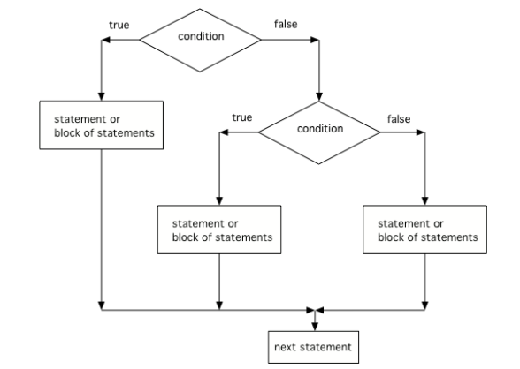

.. include:: ../common.rst

.. qnum::
   :prefix: 3-4-
   :start: 1

|Time90|

Multi-Selection: else-if Statements
===================================

Using if/else statements, you can even pick between 3 or more possibilites. Just add **else if** for each possibility after the first **if**, and **else** before the last possibility.

.. code-block:: java

    // 3 way choice with else if
    if (boolean expression)
    {
       statement1;
    }
    else if (boolean expression)
    {
       statement2;
    }
    else
    {
       statement3;
    }

|CodingEx| **Coding Exercise**

.. activecode:: lccbElseIf
   :language: java
   :autograde: unittest

   Run the code below and try changing the value of x to get each of the three possible lines in the conditional to print.
   ~~~~
   public class TestElseIf
   {
       public static void main(String[] args)
       {
           int x = 2;
           if (x < 0)
           {
               System.out.println("x is negative");
           }
           else if (x == 0)
           {
               System.out.println("x is 0");
           }
           else
           {
               System.out.println("x is positive");
           }
           System.out.println("after conditional");
       }
   }

   ====
   import static org.junit.Assert.*;

   import org.junit.*;

   import java.io.*;

   public class RunestoneTests extends CodeTestHelper
   {
       @Test
       public void testChangedCode()
       {
           String origCode =
                   "public class TestElseIf { public static void main(String[] args) { int x = 2; if"
                       + " (x < 0) { System.out.println(\"x is negative\");  } else if (x == 0) { "
                       + " System.out.println(\"x is 0\"); } else { System.out.println(\"x is"
                       + " positive\"); } System.out.println(\"after conditional\"); } }";
           boolean changed = codeChanged(origCode);
           assertTrue(changed);
       }
   }

Here is a flowchart for a conditional with 3 options like in the code above.

    Figure 1: The order that statements execute in a conditional with 3 options: if, else if, and else

.. note::

    Another way to handle 3 or more conditional cases is to use the ``switch`` and ``break`` keywords, but these will not be on the exam.  For a tutorial on using switch see https://docs.oracle.com/javase/tutorial/java/nutsandbolts/switch.html.

|Exercise| **Check your understanding**

.. mchoice:: qcb3_4_1
   :practice: T
   :answer_a: x is negative
   :answer_b: x is zero
   :answer_c: x is positive
   :correct: a
   :feedback_a: When x is equal to -5 the condition of x < 0 is true.
   :feedback_b: This will only print if x has been set to 0.  Has it?
   :feedback_c: This will only print if x is greater than zero.  Is it?

   What does the following code print when x has been set to -5?

   .. code-block:: java

     if (x < 0)
     {
        System.out.println("x is negative");
     }
     else if (x == 0)
     {
        System.out.println("x is zero");
     }
     else
     {
        System.out.println("x is positive");
     }

.. mchoice:: qcb3_4_2
   :practice: T
   :answer_a: x is negative
   :answer_b: x is zero
   :answer_c: x is positive
   :correct: c
   :feedback_a: This will only print if x has been set to a number less than zero. Has it?
   :feedback_b: This will only print if x has been set to 0.  Has it?
   :feedback_c: The first condition is false and x is not equal to zero so the else will execute.

   What does the following code print when x has been set to 2000?

   .. code-block:: java

     if (x < 0)
     {
        System.out.println("x is negative");
     }
     else if (x == 0)
     {
        System.out.println("x is zero");
     }
     else
     {
        System.out.println("x is positive");
     }

.. mchoice:: qcb3_4_3
   :practice: T
   :answer_a: first quartile
   :answer_b: second quartile
   :answer_c: third quartile
   :answer_d: fourth quartile
   :correct: d
   :feedback_a: This will only print if x is less than 0.25.
   :feedback_b: This will only print if x is greater than or equal to 0.25 and less than 0.5.
   :feedback_c: The first only print if x is greater than or equal to 0.5 and less than 0.75.
   :feedback_d: This will print whenever x is greater than or equal to 0.75.

   What does the following code print when x has been set to .8?

   .. code-block:: java

     if (x < .25)
     {
         System.out.println("first quartile");
     }
     else if (x < .5)
     {
         System.out.println("second quartile");
     }
     else if (x < .75)
     {
         System.out.println("third quartile");
     }
     else
     {
         System.out.println("fourth quartile");
     }

|CodingEx| **Coding Exercise**

.. activecode:: lccbIfDebug
   :language: java
   :autograde: unittest
   :practice: T

   The else-if connection is necessary if you want to hook up conditionals together. In the following code, there are 4 separate if statements instead of the if-else-if pattern. Will this code print out the correct grade? First, trace through the code to see why it prints out the incorrect grade. Use the Code Lens button. Then, fix the code by adding in 3 else's to connect the if statements and see if it works.
   ~~~~
   public class IfDebug
   {
       public static void main(String[] args)
       {
           int score = 93;
           String grade = "";

           if (score >= 90)
           {
               grade = "A";
           }
           if (score >= 80)
           {
               grade = "B";
           }
           if (score >= 70)
           {
               grade = "C";
           }
           if (score >= 60)
           {
               grade = "D";
           }
           else
           {
               grade = "F";
           }

           System.out.println(grade);
       }
   }

   ====
   // Test Code for Lesson 3.4 - lccbIfDebug
   import static org.junit.Assert.*;
   import org.junit.After;
   import org.junit.Before;
   import org.junit.Test;
   
   import java.io.*;
   
   public class RunestoneTests extends CodeTestHelper {
       public RunestoneTests() {
           super("IfDebug");
       }
   
       @Test
       public void testCodeContainsFourElses() {
           String code = getCode();
           int expectedElseCount = 4;
           int actualElseCount = countOccurences(code, "else");
   
           boolean passed = getResults("" + expectedElseCount, "" + actualElseCount, "Expected number of else's");
           assertTrue(passed);
   
       }
   
       private int[] grades = { 100, 95, 83, 79, 65, 50 };
       String[] outs = { "A", "A", "B", "C", "D", "F" };
   
       @Test
       public void testGrades0() throws Exception {
           changeAndTestCode(0);
       }
       
       @Test
       public void testGrades1() throws Exception {
           changeAndTestCode(1);
       }
   
       @Test
       public void testGrades2() throws Exception {
           changeAndTestCode(2);
       }
   
       @Test
       public void testGrades3() throws Exception {
           changeAndTestCode(3);
       }
   
       @Test
       public void testGrades4() throws Exception {
           changeAndTestCode(4);
       }
   
       @Test
       public void testGrades5() throws Exception {
           changeAndTestCode(5);        
       }
   
       public void changeAndTestCode(int i) throws Exception {
           String output = getOutputChangedCode(grades[i]);
   
           String expected = outs[i];
           boolean passed = output.contains(expected);
           getResults(expected, output, "Checking output for grade = " + grades[i], passed);
           assertTrue(passed);
       }
   
       public String getOutputChangedCode(int newVal) throws Exception {
           String className = "Test" + newVal;
   
           String program = getCode();
           program = program.replace("IfDebug", className).replace("public class", "class");
           program = program.replaceAll("int score\\s*=\\s*\\d+", "int score = " + newVal);
   
           return getMethodOutputChangedCode(program, className, "main");
       }
   }

.. activecode::  ifelseifBattery
  :language: java
  :autograde: unittest
  :practice: T

  Finish the following code so that it prints "Plug in your phone!" if the battery is below 50, "Unplug your phone!" if it is above 100, and "All okay!" otherwise. Change the battery value to test all 3 conditions.
  ~~~~
  public class BatteryTest
  {
      public static void main(String[] args)
      {
          int battery = 60;

          System.out.println("All okay!");
      }
  }

  ====
  import static org.junit.Assert.*;

  import org.junit.*;

  import java.io.*;

  public class RunestoneTests extends CodeTestHelper
  {
      @Test
      public void testChangedCode()
      {
          String origCode =
                  "public class BatteryTest {  public static void main(String[] args)  {  int battery"
                      + " = 60;  System.out.println(\"All okay!\");  }  }";

          boolean changed = codeChanged(origCode);
          assertTrue(changed);
      }

      @Test
      public void testCodeContains3()
      {
          boolean ifCheck1 =
                  checkCodeContains("if statement for battery above 100", "if (battery > 100)");
          assertTrue(ifCheck1);
      }

      @Test
      public void testCodeContains5()
      {
          boolean ifCheck1 =
                  checkCodeContains("if statement for battery less than 50", "if (battery < 50)");
          assertTrue(ifCheck1);
      }

      @Test
      public void testCodeContains4()
      {
          boolean ifCheck2 = checkCodeContains("else", "else");
          assertTrue(ifCheck2);
      }
  }

|Groupwork| Programming Challenge : Adventure
---------------------------------------------

.. |Colossal Cave Adventure| raw:: html

   <a href="https://en.wikipedia.org/wiki/Colossal_Cave_Adventure" target="_blank" style="text-decoration:underline">Colossal Cave Adventure</a>

.. |playing Adventure| raw:: html

   <a href="http://www.web-adventures.org/cgi-bin/webfrotz?s=Adventure" target="_blank" style="text-decoration:underline">playing Adventure</a>

.. |walkthrough| raw:: html

   <a href="https://adventuregamers.com/walkthrough/full/colossal-cave" target="_blank" style="text-decoration:underline">walkthrough</a>

.. |repl link| raw:: html

   <a href="https://firewalledreplit.com/@BerylHoffman/Adventure#Main.java" target="_blank" style="text-decoration:underline">repl link</a>

We encourage you to work in pairs for this challenge which is on repl.it (you will need an account there if you want to save your version).

One of the first games coded for early computers in the 1970s was called |Colossal Cave Adventure|. It was a text-based interactive fiction game where you had to make your way through an elaborate cave. The program only understood one word or phrase commands like north, south, enter, take, etc. You can try |playing adventure| recreated online following some of the commands in this |walkthrough|. Part of the challenge is finding the commands that the code will understand.

In a game like Adventure, else if statements can be used to respond to commands from the user like n, s, e, w.

1. Try the program below or with this |repl link|. This is a very simple adventure game that lets the user move in 4 different directions. Right now, it only lets the user move north.

2. Add in **else if** statements to go in the directions of "s" for south, "e" for east, "w" for west, and an else statement that says "You can't go in that direction". Be creative and come up with different situations in each direction.

2. How many test-cases are needed to test all branches of your code?

3. If your class has time, your teacher may ask you to expand this game further or to come up with a different adventure location.

.. raw:: html

    <iframe height="650px" width="100%" style="max-width:90%; margin-left:5%" src="https://firewalledreplit.com/@BerylHoffman/Adventure?lite=true#Main.java" scrolling="no" frameborder="no" allowtransparency="true" allowfullscreen="true" sandbox="allow-forms allow-pointer-lock allow-popups allow-same-origin allow-scripts allow-modals"></iframe>

.. activecode:: challenge3-4-ElseIf-Adventure-autograde
  :language: java
  :autograde: unittest

  Copy and paste your all of your code from repl.it and run to see if it passes the autograder tests. Include the link to your repl.it code in comments. Note that this code will only run with the autograder's input and will not ask the user for input.
  ~~~~
    // Copy in your link to your code on repl.it here:
    // Copy in all of your code from repl.it below (include import and public class
    // Main)

  ====
  import static org.junit.Assert.*;

  import org.junit.*;

  import java.io.*;

  public class RunestoneTests extends CodeTestHelper
  {
      public RunestoneTests()
      {
          super("Main", input1.replaceAll(" ", "\n")); // For Book
      }

      private static int goal = 5;
      private static String input1 = "n s e w y y y y y y y y y y y y y y";
      private static String input2 = "s e w y n y y y y y y y y y y y y y";
      private static String input3 = "e w y n s y y y y y y y y y y y y y";
      private static String input4 = "w y n s e y y y y y y y y y y y y y";
      private static String input5 = "y n s e w y y y y y y y y y y y y y";
      private String output1, output2, output3, output4, output5;

      @Test
      public void test1()
      {
          String input = input1.replaceAll(" ", "\n");
          String output = getMethodOutputWithInput("main", input);
          output1 = output;

          String[] lines = output.split("\n");

          boolean passed = lines.length >= goal;

          passed =
                  getResults(
                          goal + "+ lines",
                          "" + lines.length + " lines",
                          "Outputs at least " + goal + " lines",
                          passed);
          assertTrue(passed);
      }

      @Test
      public void test2()
      {
          String input = input2.replaceAll(" ", "\n");
          String output = getMethodOutputWithInput("main", input);
          output2 = output;

          input = input3.replaceAll(" ", "\n");
          output = getMethodOutputWithInput("main", input);
          output3 = output;

          input = input4.replaceAll(" ", "\n");
          output = getMethodOutputWithInput("main", input);
          output4 = output;

          input = input5.replaceAll(" ", "\n");
          output = getMethodOutputWithInput("main", input);
          output5 = output;

          if (output1 == null)
          {
              input = input1.replaceAll(" ", "\n");
              output1 = getMethodOutputWithInput("main", input);
          }

          boolean passed =
                  !output1.equals(output2)
                          && !output1.equals(output3)
                          && !output1.equals(output4)
                          && !output1.equals(output5);

          passed =
                  getResults(
                          "true",
                          "" + passed,
                          "Outputs different results for different inputs",
                          passed);
          assertTrue(passed);
      }

      @Test
      public void test3()
      {
          String code = getCode();
          int num = countOccurences(code, "if");
          boolean passed = num >= 4;

          getResults("4", "" + num, "Number of if statements", passed);
          assertTrue(passed);
      }

      @Test
      public void test4()
      {
          String code = getCode();
          int elseif = countOccurences(code, "else if");
          boolean passed = elseif >= 3;

          getResults("" + 3, "" + elseif, "Number of else if statements", passed);
          assertTrue(passed);
      }

      @Test
      public void test5()
      {
          String code = getCode();
          int num = countOccurences(code, "else {");
          boolean passed = num >= 1;

          getResults("1", "" + num, "Number of else statements", passed);
          assertTrue(passed);
      }
  }

Summary
--------

- A multi-way selection is written when there are a series of conditions with different statements for each condition.

- Multi-way selection is performed using if-else-if statements such that exactly one section of code is executed based on the first condition that evaluates to true.

.. code-block:: java

    // 3 way choice with else if
    if (boolean expression)
    {
       statement1;
    }
    else if (boolean expression)
    {
       statement2;
    }
    else
    {
        statement3;
    }

AP Practice
------------

.. mchoice:: AP3-4-1
    :practice: T

    Assume an int variable x has been properly declared and initialized.
    Which of the following code segments will print out "High" if *x* is 66 and above,
    "Medium" is *x* is between 33-65, and "Low" if *x* is below 33.

    .. code-block:: java

       I.   if (x > 66)
            {
              System.out.println("High");
            }
            else if (x > 33)
            {
              System.out.println("Medium");
            }
            else {
              System.out.println("Low");
            }

       II.  if (x < 33)
            {
              System.out.println("Low");
            }
            else if (x < 66)
            {
              System.out.println("Medium");
            }
            else {
              System.out.println("High");
            }

       III. if (x >= 66)
            {
              System.out.println("High");
            }
            if (x >= 33)
            {
              System.out.println("Medium");
            }
            if (x < 33)
            {
              System.out.println("Low");
            }

    - I only

      - If x = 66, it should print out "High".

    - II only

      + Correct!

    - III only

      - If x is 66, the code in III. will print out more than one thing.

    - I and II only

      - If x = 66, it should print out "High".

    - II and III only

      - If x is 66, the code in III. will print out more than one thing.

