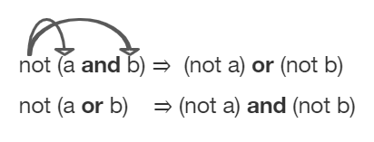
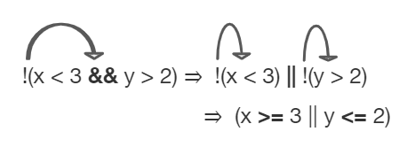

.. include:: ../common.rst

.. qnum::
   :prefix: 3-6-
   :start: 1

.. raw:: html

    

|Time90|

Equivalent Boolean Expressions (De Morgan's Laws)
=================================================

.. index::
   single: De Morgan's Laws
   single: negation

What if you heard a rumor about a senior at your high school? And then you heard that the rumor wasn't true - it wasn't a senior at your high school. Which part of "a senior at your high school" wasn't true? Maybe they weren't a senior? Or maybe they didn't go to your high school? You could write this as a logic statement like below using negation (``!``) and the **and** (``&&``) operator since both parts have to be true for the whole statement to be true. (Thank you to Kevin Saxton from Kent School, CT for this example.)

.. code-block:: java

        !(a && b)

        a = "senior"
        b = "at our high school"

        // This means it is not true that (a) it is a senior
        // and (b) someone at our high school.

In this lesson, you will learn about De Morgan's Laws which simplify statements like this. We know that !(a senior at our high school) could mean !(a senior) or !(at our high school). Let's learn more about De Morgan's Laws.

De Morgan's Laws
----------------

De Morgan's Laws were developed by Augustus De Morgan in the 1800s.  They show how to simplify the negation of a complex boolean expression, which is when there are multiple expressions joined by an **and** (``&&``) or **or** (``||``), such as ``(x < 3) && (y > 2)``. When you negate one of these complex expressions, you can simplify it by flipping the operators and end up with an equivalent expression. De Morgan's Laws state the following equivalencies. Here's an easy way to remember De Morgan's Laws: **move the NOT inside, AND becomes OR** and **move the NOT inside, OR becomes AND**.

    Figure 1: De Morgan's Laws to simplify complex expressions

In Java, De Morgan's Laws are written with the following operators:

    -  ``!(a && b)`` is equivalent to ``!a || !b``

    -  ``!(a || b)`` is equivalent to ``!a && !b``

Going back to our example above, !(a senior && at our high school) is equivalent to !(a senior) or !(at our high school) using De Morgan's Laws:

.. code-block:: java

        !(a && b) is equivalent to !a || !b

        a = "senior"
        b = "at our high school"

You can also simplify negated boolean expressions that have relational operators like ``<``, ``>``, ``==``. You can move the negation inside the parentheses by flipping the relational operator to its opposite sign. For example, not (c equals d) is the same as saying c does not equal d.  An easy way to remember this is **To move the NOT, flip the sign**. Notice that ``==`` becomes ``!=``, but ``<`` becomes ``>=``,  ``>`` becomes ``<=``, ``<=`` becomes ``>``, and ``>=`` becomes ``<`` where the sign is flipped and an equal sign may also be added or removed.

  - ``!(c == d)`` is equivalent to ``c != d``
  - ``!(c != d)`` is equivalent to ``c == d``
  - ``!(c < d)`` is equivalent to ``c >= d``
  - ``!(c > d)`` is equivalent to ``c <= d``
  - ``!(c <= d)`` is equivalent to ``c > d``
  - ``!(c >= d)`` is equivalent to ``c < d``

Truth Tables
------------

Although you do not have to memorize De Morgan's Laws for the CSA Exam, you should be able to show that two boolean expressions are equivalent. One way to do this is by using truth tables. For example, we can show that ``!(a && b)`` is equivalent to ``!a || !b`` by constructing the truth table below and seeing that they give identical results for the 2 expressions (the last 2 columns in the table below are identical!).

+-------+-------+-----------+----------+
| a     | b     | !(a && b) | !a || !b |
+=======+=======+===========+==========+
| true  | true  | false     | false    |
+-------+-------+-----------+----------+
| false | true  | true      | true     |
+-------+-------+-----------+----------+
| true  | false | true      | true     |
+-------+-------+-----------+----------+
| false | false | true      | true     |
+-------+-------+-----------+----------+

Simplifying Boolean Expressions
----------------------------------

Often, you can simplify boolean expressions to create equivalent expressions. For example, applying De Morgan's Laws to ``!(x < 3 && y > 2)`` yields ``!(x < 3) || !(y > 2)`` as seen in the figure below. This can then be simplified further by flipping the relational operators to remove the not.  So, ``!(x < 3) || !(y > 2)`` is simplified to ``(x >= 3 || y <= 2)`` where the relational operators are flipped and the negation is removed. These two simplification steps are seen below.

    Figure 2: An example boolean expression simplified

|CodingEx| **Coding Exercise**

.. activecode:: lcdmtest
   :language: java
   :autograde: unittest

   For what values of x and y will the code below print true?  Try out different values of x and y to check your answer.
   ~~~~
   public class Test1
   {
       public static void main(String[] args)
       {
           int x = 2;
           int y = 3;
           System.out.println(!(x < 3 && y > 2));
       }
   }

   ====
   import static org.junit.Assert.*;

   import org.junit.*;

   import java.io.*;

   public class RunestoneTests extends CodeTestHelper
   {
       @Test
       public void testChangedCode()
       {
           String origCode =
                   "public class Test1 {public static void main(String[] args) { int x = 2; int y = 3;"
                       + " System.out.println(!(x < 3 && y > 2)); } }";

           boolean changed = codeChanged(origCode);
           assertTrue(changed);
       }
   }

|Exercise| **Check your understanding**

.. mchoice:: qcbdm1_8
   :practice: T
   :answer_a: first case
   :answer_b: second case
   :correct: b
   :feedback_a: This will be printed if x is greater or equal to 3 and y is less than or equal to 2.  The first part is true but the second is false.  Since the statements are joined by an and the complex expression is false.
   :feedback_b: This will be printed if x is less than 3 or y is greater than 2.  In this case the first will be false, but the second true so since the statements are joined with an or the complex expression is true.

   What is printed when the following code executes and x equals 4 and y equals 3?

   .. code-block:: java

     int x = 4, y = 3;
     if (!(x < 3 || y > 2))
     {
        System.out.println("first case");
     }
     else
     {
        System.out.println("second case");
     }

.. mchoice:: qcbdm2_9
   :practice: T
   :answer_a: first case
   :answer_b: second case
   :correct: a
   :feedback_a: This will be printed if x is greater than or equal to 3 or y is less than or equal to 2.  In this case x is greater than 3 so the first condition is true.
   :feedback_b: This will be printed if x is less than 3 and y is greater than 2.

   What is printed when the following code executes and x equals 4 and y equals 3?

   .. code-block:: java

     int x = 4, y = 3;
     if (!(x < 3 && y > 2))
     {
        System.out.println("first case");
     }
     else
     {
        System.out.println("second case");
     }

|Groupwork| Programming Challenge : Truth Tables POGIL
------------------------------------------------------

.. |pogil| raw:: html

   <a href="https://pogil.org/about-pogil/what-is-pogil" target="_blank" style="text-decoration:underline">POGIL</a>

.. |pogil role| raw:: html

   <a href="https://docs.google.com/document/d/1_NfNLWJxaG4qZ2Jd2x8UctDS05twn1h6p-o3XaAcRv0/edit?usp=sharing" target="_blank" style="text-decoration:underline">POGIL role</a>

.. |this worksheet| raw:: html

   <a href="https://docs.google.com/document/d/1Oa_hlzjunYMoRRiMX0A0nFjk7JiTh7EGfIVM9bQ_BIo/edit?usp=sharing" target="_blank" style="text-decoration:underline">this worksheet</a>

We encourage you to do this activity as a |POGIL| (Process Oriented Guided Inquiry Learning) group activity. POGIL groups are self-managed teams of up to 4 students where everyone has a |pogil role| and works together to solve the problems, making sure that everyone in the team participates and learns.

Explore the following problems with your group. You may use |this worksheet| to complete your truth tables. Assume that ``x`` is an integer value, for example -1, 0, or 1.

1. Complete a truth table for the boolean expression: ``!(x == 0 || x >= 1)``. Is this the set of positive or negative numbers?  Is the expression true when ``x`` is positive? Or is it true when ``x`` is negative? You can try out the values when ``x`` is 1 or -1 or 0. Note that 0 is not positive or negative. You can try running the code below to check your answer.

2. Complete a truth table for the boolean expression: ``!(x == 0) && !(x >= 1)``. Is this the set of positive or negative numbers?

3. Complete a truth table for the boolean expression: ``(x != 0) && (x < 1)``. Is this the set of positive or negative numbers?

4. Are the 3 boolean expressions equivalent? Why or why not?

5. Test your answers using the active code window below.

6. Complete the following multiple choice exercises in your POGIL groups. Show the application of DeMorgan's laws or the truth tables in each question on paper.

.. activecode:: challenge3-6-booleanExpr
   :language: java
   :autograde: unittest

   Are these 3 boolean expressions equivalent? 1. ``!(x == 0 || x >= 1)`` , 2. ``!(x == 0) && !(x >= 1)`` , 3. ``(x != 0) && (x < 1)``
   ~~~~
   public class EquivalentExpressions
   {
       public static void main(String[] args)
       {
           int x = -1; // try with x = -1, x = 0, and x = 1
           System.out.println(!(x == 0 || x >= 1));
           // add print statements for expressions in #2 and #3
           // to see if they are equivalent when x = -1, 0, and 1.

       }
   }

   ====
   import static org.junit.Assert.*;

   import org.junit.*;

   import java.io.*;

   public class RunestoneTests extends CodeTestHelper
   {
       @Test
       public void testChangedCode()
       {
           String origCode =
                   "public class EquivalentExpressions { public static void main(String[] args) { int"
                       + " x = -1;  System.out.println(!(x == 0 || x >= 1));   } }";

           boolean changed = codeChanged(origCode);
           assertTrue(changed);
       }

       @Test
       public void testAddedCode()
       {
           boolean output2 = checkCodeContains("(x != 0) && (x < 1)");
           assertTrue(output2);
       }

       @Test
       public void testAddedCode2()
       {
           boolean output3 = checkCodeContains("!(x == 0) && !(x >= 1)");
           assertTrue(output3);
       }
   }

.. mchoice:: qcbdm3_1
   :practice: T
   :answer_a: (x < 2) || (y > 4)
   :answer_b: (x < 2) && (y > 4)
   :answer_c: (x <= 2) || (y >= 4)
   :answer_d: (x <= 2) && (y >= 4)
   :correct: c
   :feedback_a: The negation of x > 2 is x <= 2
   :feedback_b: Don't forget that the "and" is changed to an "or"
   :feedback_c: The x > 2 becomes x <= 2, the y < 4 becomes y >= 4 and the and changes to or
   :feedback_d: Don't forget that the "and" is changed to an "or"

   Which of the following is the same as the code below?

   .. code-block:: java

     !(x > 2 && y < 4)

.. mchoice:: qcbdm4_2
   :practice: T
   :answer_a: (x != 2) || (y < 4)
   :answer_b: (x != 2) && (y < 4)
   :answer_c: (x != 2) && (y <= 4)
   :answer_d: (x != 2) || (y <= 4)
   :correct: d
   :feedback_a: The negation of y > 4 is y <= 4
   :feedback_b: Don't forget that the and is changed to an or
   :feedback_c: Don't forget that the and is changed to an or
   :feedback_d: The and is changed to an or, the (x == 2) becomes (x != 2) and (y > 4) becomes (y <= 4)

   Which of the following is the same as the code below?

   .. code-block:: java

     !(x == 2 && y > 4)

.. mchoice:: qcbdm5_3
   :practice: T
   :answer_a: (x == 5) || (y == 7)
   :answer_b: (x == 5) && (y == 7)
   :answer_c: (x != 5) || (y != 7)
   :answer_d: (x < 5) || (x > 5) || (y > 7) || (y < 7)
   :correct: a
   :feedback_a: The negation of && is || and the negation of != is ==
   :feedback_b: The negation of && is ||
   :feedback_c: The negation of x != 5 is x == 5.  The negation of y !=  7 is y == 7.
   :feedback_d: The negation of == is != which is the same as < or >.  The negation of != is ==.

   Which of the following is the same as the code below?

   .. code-block:: java

     !(x!=5 && y!=7)

.. mchoice:: qcbdm6_4
   :practice: T
   :answer_a: (x > 5) && (y < 7)
   :answer_b: (x > 5) || (y < 7)
   :answer_c: (x > 5) && (y <= 7)
   :answer_d: (x > 5) || (y <= 7)
   :correct: d
   :feedback_a: The negation of && is || and the negation of y > 7 is y <= 7.
   :feedback_b: The negation of y > 7 is y <= 7.
   :feedback_c: The negation of && is ||.
   :feedback_d: The negation of (x <= 5) is (x > 5).  The negation of && is ||.  The negation of (y > 7) is (y <= 7).

   Which of the following is the same as the code below?

   .. code-block:: java

     !(x<= 5 && y > 7)

Summary
--------

- De Morgan’s Laws can be applied to Boolean expressions to create equivalent ones:

  - ``!(a && b)`` is equivalent to ``!a || !b``
  - ``!(a || b)`` is equivalent to ``!a && !b``

- A negated expression with a relational operator can be simplified by flipping the relational operator to its opposite sign.

  - ``!(c == d)`` is equivalent to ``c != d``
  - ``!(c != d)`` is equivalent to ``c == d``
  - ``!(c < d)`` is equivalent to ``c >= d``
  - ``!(c > d)`` is equivalent to ``c <= d``
  - ``!(c <= d)`` is equivalent to ``c > d``
  - ``!(c >= d)`` is equivalent to ``c < d``

- Truth tables can be used to prove that 2 Boolean expressions are identical.

- Equivalent Boolean expressions will evaluate to the same value in all cases.

AP Practice
------------

.. mchoice:: apcsa-sample5
   :practice: T
   :answer_a: The value is always true.
   :answer_b: The value is always false.
   :answer_c: The value is true when a has the value false, and is false otherwise.
   :answer_d: The value is true when b has the value false, and is false otherwise.
   :answer_e: The value is true when either a or b has the value true, and is false otherwise.
   :correct: b
   :feedback_a: Try simplifying !(b ||a) or consider what happens if a and b are true.
   :feedback_b: Yes, a && !(b || a) = a && !b && !a. Since (a && !a) can never be true, the result will always be false.
   :feedback_c: Try the expression with a = false. Is the result true?
   :feedback_d: Try the expression with b = false with a = true and then try it with a = false. Is the result ever true?
   :feedback_e: Try the expression with a = true. Is the result true?

    Which of the following best describes the value of the Boolean expression: a && !(b || a)
