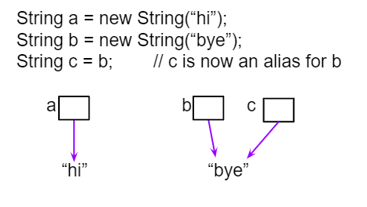

.. qnum::
   :prefix: 3-7-
   :start: 1 
   
.. |CodingEx| image:: ../../_static/codingExercise.png
    :width: 30px
    :align: middle
    :alt: coding exercise
    
    
.. |Exercise| image:: ../../_static/exercise.png
    :width: 35
    :align: middle
    :alt: exercise
    
    
.. |Groupwork| image:: ../../_static/groupwork.png
    :width: 35
    :align: middle
    :alt: groupwork
    
Comparing Objects
=================

Comparing objects is a little different than comparing primitive typed values like numbers. Objects can be very complex and have many attribute values or instance variables inside them. For example, the turtle objects have many instance variables like name, width, height, xPos, yPos, etc. When comparing two turtle objects, we need a specially written **equals** method to compare all of these values. In this lesson, we will take a look at String objects and how they are compared with == vs. the equals method.

String Equality
---------------

..	index::
	pair: String; equality
	pair: String; equals

The **equals** method for Strings compares two strings letter by letter. ``s1.equals(s2)`` is true if s1 and s2 have all the same characters in the same order. With Strings and other objects, you almost always use equals instead of == to check their equality. 

 

When the operator ``==`` is used to compare object variables, it returns true when the two variables *refer to the same object*. These variables are called **object references** and **aliases** for the same object. With strings this happens when one string variable is set to another. 

    Figure 1: String aliases

|CodingEx| **Coding Exercise**

.. activecode:: lcse1
   :language: java
   :autograde: unittest    
   
   If you run the following, what will be printed?
   ~~~~
   public class Test1
   {
      public static void main(String[] args)
      {
        String s1 = new String("Hello");
        String s2 = new String("Bye");
        String s3 = s2;
        System.out.println(s3);
        System.out.println(s2 == s3);
        System.out.println(s2.equals(s3));
      }
   }
   ====
   import static org.junit.Assert.*;
    import org.junit.*;;
    import java.io.*;

    public class RunestoneTests extends CodeTestHelper
    {
        @Test
        public void testMain() throws IOException
        {
            String output = getMethodOutput("main");
            String expect = "Bye\ntrue\ntrue\n";
            boolean passed = getResults(expect, output, "Expected output from main", true);
            assertTrue(passed);
        }
    }

The code above will print ``Bye`` since s3 has been assigned to a copy of the value in s2 which is an object reference to the String object that has the characters "Bye" in it.  
In addition, ``s2 == s3`` will be true since the two variables refer to the same object.  Also, ``s2.equals(s3)`` will also be true; again since the two variables refer to the same object, of course the characters will be the same.  

.. figure:: Figures/stringRefExamplev2.png
    :width: 250px
    :align: center
    :figclass: align-center

    Figure 2: Several String variables with references to objects of the String class. 

.. note::
    
    Only use ``==`` with primitive types like int or to test if two strings (or objects) refer to the same object.  Use ``equals``, not ``==``, with strings which will check to see if they are equal  letter by letter.      
    
The one common place to use == or != with objects is to compare them to **null** to see if they really exist. Sometimes short-circuit evaluation is used to avoid an error if the object doesn't exist. Remember that **short-circuit evaluation** is used with && in Java meaning that if the first part of the if condition is false, it doesn't even have to check the second condition and it knows the whole && test is false. 

|CodingEx| **Coding Exercise**

.. activecode:: nullTest
   :language: java
   :autograde: unittest    

   Try the following code to see a NullPointer error. Since s is null, indexOf throws an NullPointer error for s. Comment out the first if statement and run the program again. The second if statement avoids the error with shortcircuit evaluation. Because s != null is false, the rest of the boolean expression is not evaluated. Now, change s to set it to "apple" instead of null in the first line and run the code again to see that the if statements can print out that "apple contains an a".
   ~~~~
   public class NullTest
   {    
      public static void main(String[] args)
      {
        String s = null;
        if (s.indexOf("a") >= 0)
        {
            System.out.println(s + " contains an a");
        }
        if (s != null && s.indexOf("a") >= 0)
        {
            System.out.println(s + " contains an a");   
        }
      }
   }
   ====
   import static org.junit.Assert.*;
    import org.junit.*;;
    import java.io.*;
    
    public class RunestoneTests extends CodeTestHelper
    {

      @Test
        public void testChangedCode() {
            String origCode = "public class NullTest { public static void main(String[] args) { String s = null; if (s.indexOf(\"a\") >= 0) {  System.out.println(s + \" contains an a\"); } if (s != null && s.indexOf(\"a\") >= 0) { System.out.println(s + \" contains an a\"); } } }";

            boolean changed = codeChanged(origCode);
            assertTrue(changed);
        }
    }
     

    
Using new with Strings
----------------------

If you use the ``new`` keyword to create a string, it will always create a new string object. So, even if we create two string objects with new that contain all the same characters in the same order, they will not refer to the same object. 

.. activecode:: lcse2
   :language: java
   :autograde: unittest    
   
   What will the following print?
   ~~~~
   public class Test2
   {
      public static void main(String[] args)
      {
        String s1 = new String("Hello");
        String s2 = new String("Hello");
        System.out.println(s1 == s2);
        System.out.println(s1.equals(s2));
      }
   }
   ====
   import static org.junit.Assert.*;
    import org.junit.*;;
    import java.io.*;
    
    public class RunestoneTests extends CodeTestHelper
    {
        @Test
        public void testMain() throws IOException
        {
            String output = getMethodOutput("main");
            String expect = "false\ntrue\n";
            boolean passed = getResults(expect, output, "Expected output from main");
            assertTrue(passed);
        }
    }
  
Since we used the ``new`` keyword, two different String objects will be created that each have the characters ``Hello`` in them.  So ``s1 == s2`` will be false since they don't refer to the same object, but ``s1.equals(s2)`` is true since the two different objects contain the same characters in the same order.  

.. figure:: Figures/twoStringRefsv2.png
    :width: 175px
    :align: center
    :figclass: align-center

    Figure 3: Two strings that are equal with equals but not with ==.
   
Note that you can also create Strings using string literals instead of new. String literals behave a little differently because they are re-used if they already exist instead of creating a new object. But you should not see questions with string literals and == on the exam.

  
  
|Exercise| **Check your understanding**

.. mchoice:: qsbeq_1
   :practice: T
   :answer_a: s1 == s2 && s1 == s3
   :answer_b: s1 == s2 && s1.equals(s3)
   :answer_c: s1 != s2 && s1.equals(s3)
   :correct: b
   :feedback_a: Do s1 and s3 refer to the same object?
   :feedback_b: Yes s2 was set to refer to the same object as s1 and s1 and s3 have the same characters.
   :feedback_c: Did you miss that s2 was set to refer to the same object as s1?

   Which of the following is true after the code executes?
   
   .. code-block:: java

     String s1 = new String("hi");
     String s2 = new String("bye");
     String s3 = new String("hi");
     s2 = s1;
     
.. mchoice:: qsbeq_2
   :practice: T
   :answer_a: s1 == s2 && s1 == s3
   :answer_b: s2.equals(s3) && s1.equals(s3)
   :answer_c: s1 != s3 && s1.equals(s3)
   :correct: c
   :feedback_a: Do s1 and s2 refer to the same object?
   :feedback_b: Does s2 have the same characters as s1 or s3?
   :feedback_c: s1 and s3 refer to different string objects but they  contain the same characters "hi" in the same order.   

   Which of the following is true after the code executes?
   
   .. code-block:: java

     String s1 = new String("hi");
     String s2 = new String("bye");
     String s3 = new String("hi");
     
.. mchoice:: qsbeq_3
   :practice: T
   :answer_a: s1 == s3 && s1.equals(s3)
   :answer_b: s2.equals(s3) && s1.equals(s3)
   :answer_c: !(s1 == s2) && !(s1 == s3)
   :correct: c
   :feedback_a: Since s3 uses the new operator it will not refer to the same object as s1.  
   :feedback_b: Do s2 and s3 have the same characters in the same order?
   :feedback_c: All of the variables refer to different objects.  But, s1.equals(s3) would be true since they have the same characters in the same order.

   Which of the following is true after the code executes?
   
   .. code-block:: java

     String s1 = new String("hi");
     String s2 = new String("bye");
     String s3 = new String("hi");
     
     
|Groupwork| Programming Challenge : Tracing Code 
------------------------------------------------

What will the following code print out? Trace through the code by drawing diagrams of what is going on in memory like the figures above, and then show the values of s1, s2, s3, s4 and the output after each line of code. Remember that you can use trace tables to track the values of variables as they change throughout a program. To trace through code, write down a variable in each column in a table and keep track of its value throughout the program as you go through it line by line.

.. code-block:: java

    String s1 = null;
    String s2 = new String("hi");
    String s3 = new String("hi");
    String s4 = new String("bye");
    if (s1 == null)
        s1 = s2;
    if (s1 == s2)    
       System.out.println("s1 and s2 refer to the same object");
    if (s2 == s3)
       System.out.println("s2 and s3 refer to the same object");
    if (s3 == s4)
       System.out.println("s3 and s4 refer to the same object");
    if (s1.equals(s2) && s2.equals(s3))
        System.out.println("s1, s2, s3 are equal");
      
.. shortanswer:: challenge3-7-tracingStrings

   Write your tracing table here that keeps track of s1, s2, s3, s4 and the output.
   
   
Summary
-------------------

- Often classes have their own **equals** method, which can be used to determine whether two objects of the class are equivalent.

- Two object references are considered **aliases** when they both reference the same object. 

- Object reference values can be compared, using == and !=, to identify aliases.

- A reference value can be compared with null, using == or !=,  to determine if the reference actually references an object.

