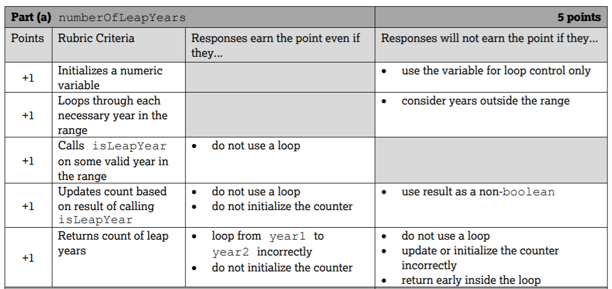
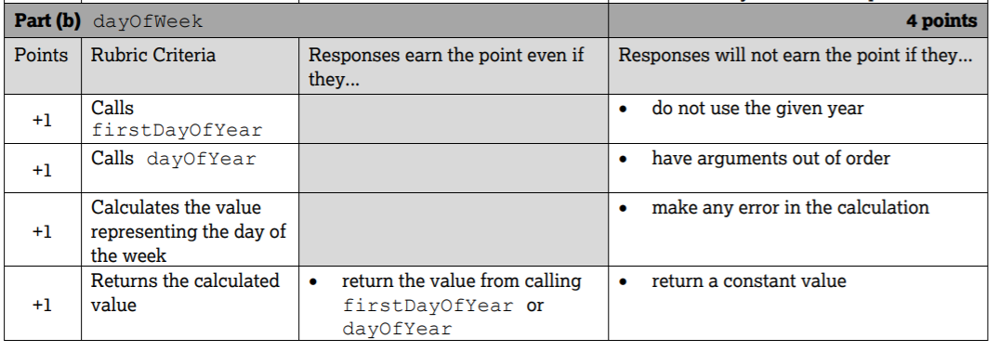

.. qnum::
   :prefix: 4-11-
   :start: 1

Free Response Questions (FRQs) for Control Structures
-----------------------------------------------------

.. index::
    single: control structures
    single: free response

The AP exam's first free response question (FRQ) is on Methods and Control Structures as of 2019. This question 1 uses expressions, loops, and if statements. The AP exam provides the method header with some parameter variables and other methods that you will need to call in the solution. This question does not involve more complex topics such as arrays.

FRQ Question 1 on Control Structures will probably involve:

- a **for-loop** that probably uses the method's parameter variables,

- an **if statement**, probably inside the loop,

- calls to other class **methods given to you**,

- a numerical or string value that is calculated by the loop and **returned** at the end of the method.

- if the question has 2 parts, 1 part will probably require a loop and the other just an expression.

On question 1, you will get points for:

- constructing the loop correctly,
- calling the correct methods,
- calculating the correct value,
- and returning the value.

Try to have some code for each of these steps. Do not use arrays or other more complex code. You may need to use Math or string methods.

2019 APCalendar FRQ
=====================

The 2019 FRQ 1 is a good example of what to expect. It is available as question 1 on pages 3-6 of https://apstudents.collegeboard.org/sites/default/files/2019-05/ap19-frq-computer-science-a.pdf , reproduced below.

Question 1.

The APCalendar class contains methods used to calculate information about a calendar. You will write two methods of the class.

.. code-block:: java

    public class APCalendar
    {
        /** Returns true if year is a leap year and false otherwise. */
        private static boolean isLeapYear(int year)
        {
            /* implementation not shown */
        }

        /**
         * Returns the number of leap years between year1 and year2, inclusive.
         * Precondition: 0 <= year1 <= year2
         */
        public static int numberOfLeapYears(int year1, int year2)
        {
            /* to be implemented in part (a) */
        }

        /**
         * Returns the value representing the day of the week for the first day of
         * year, where 0 denotes Sunday, 1 denotes Monday, ..., and 6 denotes Saturday.
         */
        private static int firstDayOfYear(int year)
        {
            /* implementation not shown */
        }

        /**
         * Returns n, where month, day, and year specify the nth day of the year.
         * Returns 1 for January 1 (month = 1, day = 1) of any year. Precondition: The
         * date represented by month, day, year is a valid date.
         */
        private static int dayOfYear(int month, int day, int year)
        {
            /* implementation not shown */
        }

        /**
         * Returns the value representing the day of the week for the given date
         * (month, day, year), where 0 denotes Sunday, 1 denotes Monday, ..., and 6
         * denotes Saturday. Precondition: The date represented by month, day, year is
         * a valid date.
         */
        public static int dayOfWeek(int month, int day, int year)
        {
            /* to be implemented in part (b) */
        }

        // There may be instance variables, constructors, and other methods not shown.
    }

Part A: numberOfLeapYear()
===========================

Write the static method numberOfLeapYears, which returns the number of leap years between year1 and year2, inclusive. In order to calculate this value, a helper method is provided for you.

- **isLeapYear(year)** returns true if year is a leap year and false otherwise.

Complete method numberOfLeapYears below. You must use isLeapYear appropriately to receive full credit.

.. code-block:: java

    /** Returns the number of leap years between year1 and year2, inclusive.
     * Precondition: 0 <= year1 <= year2
     */
     public static int numberOfLeapYears(int year1, int year2)

How to solve numberOfLeapYears()
================================

First, circle the information given that you will need to use:

- the parameters year1 and year2
- the isLeapYear(year) method

Also, circle what the return type of what you need to return. In this case, the return type of numberOfLeapYears is int and you need to calculate the number of leap years between year1 and year2 and return it. Declare a variable for this return value and return it at the end of the method to get 1 point.

.. code-block:: java

    /** Returns the number of leap years between year1 and year2, inclusive.
     * Precondition: 0 <= year1 <= year2
     */
     public static int numberOfLeapYears(int year1, int year2)
     {
        int numLeapYears = 0;
        // Your loop will go in here

        return numLeapYears;
     }

Next, plan your loop. Click to reveal some problems that may help you to plan the loop.

.. reveal:: call_loop_type_r1
   :showtitle: Reveal Problems
   :hidetitle: Hide Problems
   :optional:

   .. mchoice:: callooptype
        :answer_a: for loop
        :answer_b: while loop
        :correct: a
        :feedback_a: Use a for loop when you know how many times a loop needs to execute.
        :feedback_b: Although you could use a while loop. It is  easier to use a for loop in this case. Use a while loop when you don't know how many times a loop needs to execute.

        Which loop should you use to count the number of leap years between year1 and year2?

   .. mchoice:: calloop2
        :answer_a: Loop from 0 to year1
        :answer_b: Loop from 0 to year2
        :answer_c: Loop from 2020 to 2030
        :answer_d: Loop from year1 to year2
        :correct: d
        :feedback_a: You need to count the leap years between year1 and year2. The problem does not mention starting at year 0.
        :feedback_b: You need to count the leap years between year1 and year2. The problem does not mention starting at year 0.
        :feedback_c: You need to count the leap years between year1 and year2. The problem does not mention starting at year 2020.
        :feedback_d: You need to count the leap years between year1 and year2.

        What is the starting and ending values for the loop to count the leap years between year 1 and year 2?

.. reveal:: call_loop_type_r2
   :showtitle: Reveal Algorithm
   :hidetitle: Hide Algorithm
   :optional:

   It is usually easiest to use a **for loop** if you know how many times the loop should execute using the given information. Figure out what the initial and ending values of the loop variable should be. Some of the method parameters will usually be used for these. In this case, we need to loop from year1 to year2.  The preconditions stated for the method tells us that we don't have to worry about year1 and year2 being out of order or below 0. So don't waste time on error-checking these values. Here's a possible loop:

   .. code-block:: java

      for(int i = year1 ; i <= year2 ; i++)
      {

      }

   Note that you are given a method to use called isLeapYear(). The method header for it says that it returns a boolean. Any method that starts with the word "is" usually returns a boolean. If it returns a boolean, that is a signal to you that you should use it in an if statement. The method will usually take an argument. If it is used inside the loop, this could be the loop variable. For example,

   .. code-block:: java

      if (isLeapYear(i))
          ...

   Put all of the code together to solve this problem.

.. activecode:: APCalendarFRQPartA
   :language: java
   :autograde: unittest

   Write the code for the method numberOfLeapYears below and run to test it.
   ~~~~
   import java.util.GregorianCalendar;

   public class APCalendar
   {

       /**
        * Returns the number of leap years between year1 and year2, inclusive.
        * Precondition: 0 <= year1 <= year2
        */
       public static int numberOfLeapYears(int year1, int year2)
       {
           // WRITE YOUR CODE HERE

       }

       /** Returns true if year is a leap year and false otherwise. */
       private static boolean isLeapYear(int year)
       {
           return new GregorianCalendar().isLeapYear(year);
       }

       public static void main(String[] args)
       {
           int answer = APCalendar.numberOfLeapYears(2000, 2050);
           System.out.println("Your answer should be 13: " + answer);
       }
   }

   ====
   import static org.junit.Assert.*;

   import org.junit.*;

   import java.io.*;

   public class RunestoneTests extends CodeTestHelper
   {
       public RunestoneTests()
       {
           super("APCalendar");
       }

       @Test
       public void test1()
       {
           String output = getMethodOutput("main");
           String expect = "Your answer should be 13: 13";

           boolean passed = getResults(expect, output, "Running main");
           assertTrue(passed);
       }

       @Test
       public void test2()
       {
           int answer = APCalendar.numberOfLeapYears(1990, 2100);
           int expect = 27;

           boolean passed = getResults("" + expect, "" + answer, "numberOfLeapYears(1990, 2100)");
           assertTrue(passed);
       }

       @Test
       public void test3()
       {
           int answer = APCalendar.numberOfLeapYears(2001, 2002);
           int expect = 0;

           boolean passed = getResults("" + expect, "" + answer, "numberOfLeapYears(2001, 2002)");
           assertTrue(passed);
       }
   }

In the 2019 AP exam, part A numberOfLeapYears method was worth 5 points using the rubric below. Did you receive all 5 points? In class, your teacher may have you grade each others' code.

    Figure 1: Rubric for the numberOfLeapYears method

Part B: dayOfWeek()
===========================

In part B of the AP Calendar FRQ, you need to write the code inside a static method **dayOfWeek**, which returns the integer value representing the day of the week for the given date (month, day, year), where 0 denotes Sunday, 1 denotes Monday, ..., and 6 denotes Saturday.  This seems difficult at first, but helper methods are given to you to do most of the work. You just need to put them together to calculate the value. The helper methods given to you are:

- **firstDayOfYear(year)** returns the integer value representing the day of the week for the first day of year, where 0 denotes Sunday, 1 denotes Monday, ..., and 6 denotes Saturday. For example, since 2019 began on a Tuesday, firstDayOfYear(2019) returns 2.

- **dayOfYear(month, day, year)** returns n, where month, day, and year specify the nth day of the year. For the first day of the year, January 1 (month = 1, day = 1), the value 1 is returned. This method accounts for whether year is a leap year. For example, dayOfYear(3, 1, 2017) returns 60, since 2017 is not a leap year, while dayOfYear(3, 1, 2016) returns 61, since 2016 is a leap year.

If you know that 1/1/2019 was a Tuesday (2) using the firstDayYear method, and you know that today is the nth day of the year using the dayOfYear method, you can figure out what day of the week today is by adding those together. Try some examples by revealing the problems below.

.. reveal:: dow_r1
   :showtitle: Reveal Problem
   :hidetitle: Hide Problem
   :optional:

   .. mchoice:: dow1
        :answer_a: Wednesday (3)
        :answer_b: Thursday (4)
        :answer_c: Friday (5)
        :answer_d: Saturday (6)
        :correct: c
        :feedback_a: Since 1/1/19 is a Tuesday, Jan. 4th 2019 is 3 days later.
        :feedback_b: Since 1/1/19 is a Tuesday, Jan. 4th 2019 is 3 days later.
        :feedback_c: Since 1/1/19 is a Tuesday, Jan. 4th 2019 is 3 days later on a Friday.
        :feedback_d: Since 1/1/19 is a Tuesday, Jan. 4th 2019 is 3 days later.

        If firstDayOfYear(2019) returns 2 for a Tuesday for 1/1/2019, what day of the week is Jan. 4th 2019?

.. reveal:: dow_r2
   :showtitle: Reveal Problem
   :hidetitle: Hide Problem
   :optional:

   .. mchoice:: dow2
        :answer_a: firstDayOfYear(2019) + dayOfYear(1,4,2019)
        :answer_b: firstDayOfYear(2019) + dayOfYear(1,4,2019) - 1
        :answer_c: firstDayOfYear(2019) - dayOfYear(1,4,2019)
        :answer_d: firstDayOfYear(2019) * dayOfYear(1,4,2019)
        :correct: b
        :feedback_a: You must start at the firstDayOfYear and add on the days following up until that date - 1 since you start counting at 1.
        :feedback_b: You must start at the firstDayOfYear and add on the days following up until that date - 1 since you start counting at 1.
        :feedback_c: You must start at the firstDayOfYear and add on the days following up until that date.
        :feedback_d: You must start at the firstDayOfYear and add on the days following up until that date.

        Which of the following expressions return the right value for the day of the week (5) for Jan. 4th 2019 given that firstDayOfYear(2019) returns 2 and dayOfYear(1,4,2019) returns 4?

.. reveal:: dow_r3
   :showtitle: Reveal Problem
   :hidetitle: Hide Problem
   :optional:

   .. mchoice:: dow3
        :answer_a: 1
        :answer_b: 2
        :answer_c: 3
        :answer_d: 9
        :correct: b
        :feedback_a: Since 1/1/19 is a Tuesday (2), Jan. 8th 2019, the 8th day of the year, is 7 days later, but since there are only 7 days of the week, so we need to start over at 0 on each Sunday.
        :feedback_b: Since 1/1/19 is a Tuesday, Jan. 8th 2019 is 7 days later so would fall on the same day of the week.
        :feedback_c: Since 1/1/19 is a Tuesday, Jan. 8th 2019 is 7 days later.
        :feedback_d: Since 1/1/19 is a Tuesday (2), Jan. 8th 2019, the 8th day of the year, is 7 days later, but since there are only 7 days of the week, so we need to start over at 0 on each Sunday.

        If firstDayOfYear(2019) returns 2 for a Tuesday for 1/1/2019, what day of the week from (0-6 where 0 is Sunday) is Jan. 8th 2019?

   If we used the formula in the exercise above for the date 1/8/2019, we would get 9:

   - firstDayOfYear(2019) + dayOfYear(1,8,2019) - 1 = 2 + 8 - 1 = 9

   But there is no 9th day of week. There are only 7 days of the week. So when we reach a Sunday, we must start back at 0. This is a place where the remainder operator % is useful. Note that 9 % 7 = 2 which means that 1/8/2019 is the 2nd day of the week starting at 0.

The FRQ that involves writing an expression will probably use the **remainder operator** (``%``). Remember these tips about when to use the ``%`` operator:

- Use remainder whenever you need to wrap around to the front if the value goes over the limit (``num % limit``). For example here for weekdays or for hours and minutes.

- Use remainder to check for odd or even numbers (``num % 2 != 0``) is odd and (``num % 2 == 0``) is even. Actually, you can use it to check if any number is evenly divisible by another (``num1 % num2 == 0``).

- Use ``%`` to get the last digit from an integer number (``num % 10`` gives the last digit on right).

Try the ``%`` operator below.

.. reveal:: mod_r
   :showtitle: Reveal Problem
   :hidetitle: Hide Problem
   :optional:

   .. activecode:: mod
       :language: java
       :autograde: unittest

       Complete the program below to figure out a day of the week from 0-6 where 0 is Sunday and 6 is Saturday for 7 days of the week. What value would you use for the divisor?
       ~~~~
       public class Mod
       {
          public static void main(String[] args)
          {
            int day1 = 7;
            int day2 = 8;
            int day3 = 9;
            // fill in the divisor value below
            int divisor =   ;
            System.out.println("Remainder of " + day1 + "/" + divisor + " is " + (day1 % divisor) );
            System.out.println("Remainder of " + day2 + "/" + divisor + " is " + (day2 % divisor) );
            System.out.println("Remainder of " + day3 + "/" + divisor + " is " + (day3 % divisor) );
          }
       }
       ====
       import static org.junit.Assert.*;

       import org.junit.*;

       import java.io.*;

       public class RunestoneTests extends CodeTestHelper
       {
           public RunestoneTests()
           {
               super("Mod");
           }

           @Test
           public void test1()
           {
               String output = getMethodOutput("main");
               String expect = "Remainder of 7/7 is 0\nRemainder of 8/7 is 1\nRemainder of 9/7 is 2";

               boolean passed = getResults(expect, output, "Running main");
               assertTrue(passed);
           }
       }

.. reveal:: dow_r4
   :showtitle: Reveal Problem
   :hidetitle: Hide Problem
   :optional:

   .. mchoice:: dow4
        :answer_a: firstDayOfYear(2019) + dayOfYear(1,8,2019)
        :answer_b: firstDayOfYear(2019) + dayOfYear(1,8,2019) - 1
        :answer_c: firstDayOfYear(2019) + dayOfYear(1,8,2019) % 7
        :answer_d: firstDayOfYear(2019) + dayOfYear(1,8,2019) - 1 % 4
        :answer_e: (firstDayOfYear(2019) + dayOfYear(1,8,2019) - 1) % 7
        :correct: e
        :feedback_a: This would return 10 but there are only 7 days of the week.
        :feedback_b: This would return 9 but there are only 7 days of the week.
        :feedback_c: Remember that % has precedence so this would return 2 + (8 % 7) = 2 + 1 = 3
        :feedback_d: Remainder 4 does not make sense because there are 7 days of the week.
        :feedback_e: This would return (2 + 8 - 1) % 7 = 2.

        Which of the following expressions return the right value for the day of the week (2) for Jan. 8th 2019 given that firstDayOfYear(2019) returns 2 and dayOfYear(1,8,2019) returns 8?

Complete the code for the method dayOfWeek below for Part B of this FRQ.

.. activecode:: APCalendarFRQPartB
   :language: java
   :autograde: unittest

   Write the code for the method dayOfWeek below and run to test it. Then, try it with today's date and see if it returns the right value.
   ~~~~
   import java.util.Calendar;
   import java.util.GregorianCalendar;

   public class APCalendar
   {

       /**
        * Returns the value representing the day of the week for the given date
        * (month, day, year), where 0 denotes Sunday, 1 denotes Monday, ..., and 6
        * denotes Saturday. Precondition: The date represented by month, day, year is
        * a valid date.
        */
       public static int dayOfWeek(int month, int day, int year)
       {
           // WRITE YOUR CODE HERE using methods firstDayOfYear and dayOfYear

       }

       public static void main(String[] args)
       {
           int answer = APCalendar.dayOfWeek(1, 8, 2019);
           System.out.println("Your answer should be 2: " + answer);
       }

       /**
        * Returns the value representing the day of the week for the first day of
        * year, where 0 denotes Sunday, 1 denotes Monday, ..., and 6 denotes Saturday.
        */
       private static int firstDayOfYear(int year)
       {
           GregorianCalendar gc = new GregorianCalendar(year, Calendar.JANUARY, 1);
           return gc.get(Calendar.DAY_OF_WEEK) - 1;
       }

       /**
        * Returns n, where month, day, and year specify the nth day of the year.
        * Returns 1 for January 1 (month = 1, day = 1) of any year. Precondition: The
        * date represented by month, day, year is a valid date.
        */
       private static int dayOfYear(int month, int day, int year)
       {
           GregorianCalendar gc = new GregorianCalendar(year, month - 1, day);
           return gc.get(Calendar.DAY_OF_YEAR);
       }
   }

   ====
   import static org.junit.Assert.*;

   import org.junit.*;

   import java.io.*;

   public class RunestoneTests extends CodeTestHelper
   {
       public RunestoneTests()
       {
           super("APCalendar");
       }

       @Test
       public void test1()
       {
           String output = getMethodOutput("main");
           String expect = "Your answer should be 2: 2";

           boolean passed = getResults(expect, output, "Running main");
           assertTrue(passed);
       }

       @Test
       public void test2()
       {
           int answer = APCalendar.dayOfWeek(7, 2, 2020);
           int expect = 4;

           boolean passed = getResults("" + expect, "" + answer, "dayOfWeek(7, 2, 2020)");
           assertTrue(passed);
       }

       @Test
       public void test3()
       {
           int answer = APCalendar.dayOfWeek(2, 29, 2022);
           int expect = 2;

           boolean passed = getResults("" + expect, "" + answer, "dayOfWeek(2, 29, 2022)");
           assertTrue(passed);
       }
   }

In the 2019 AP exam, part B dayOfWeek method was worth 4 points using the rubric below. Did you receive all 4 points? In class, your teacher may have you grade each others' code.

    Figure 2: Rubric for the dayOfWeek method
