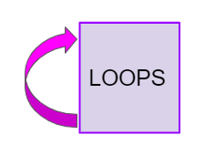
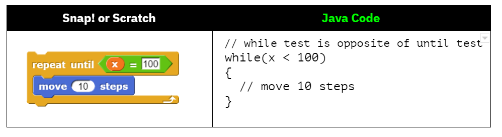
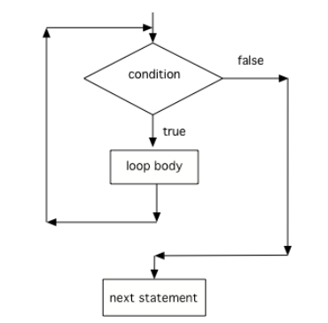
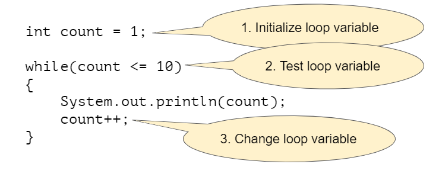
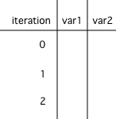

.. include:: ../common.rst

.. qnum::
   :prefix: 4-1-
   :start: 1

|Time90|

While Loops
============

.. index::
    single: loop
    single: looping
    single: iteration
    single: while
    pair: loop; while

When you play a song, you can set it to loop, which means that when it reaches
the end it starts over at the beginning. A **loop** in programming, also called
**iteration** or **repetition**, is a way to repeat one or more statements. If
you didn't have loops to allow you to repeat code, your programs would get very
long very quickly! Using a sequence of code, selection (ifs), and repetition
(loops), the **control structures** in programming, you can construct an
algorithm to solve almost any programming problem!

A ``while`` loop executes the body of the loop as long as (or while) a ``boolean``
condition is true. When the condition is false, we exit the loop and continue
with the statements that are after the body of the ``while`` loop. If the
condition is false the first time you check it, the body of the loop will not
execute.

Notice the ``while`` statement looks a lot like an ``if`` statement, but it runs
more than once. The curly braces (``{}``) are optional when there is just 1
statement following the condition, but required if there are more than 1
statement in the loop. In the AP exam, they will always use curly braces, which
is a good practice to follow.

.. code-block:: java

    // The statements in an if run one time if the condition is
    // is true and zero times if it is false.
    if (condition)
    {
        statements;
    }

    // The statements in a while loop run zero or more times,
    // determined by how many times the condition is true
    while (condition)
    {
        statements;
    }

If you took AP CSP with a block programming language like App Inventor, you may
have used a loop block like below that looks very similar to Java ``while``
loops (or you may have used a ``for`` loop which will be covered in the next
lesson). Almost every programming language has a ``while`` loop.

.. figure:: Figures/whileInAppInventor.png
    :width: 100%
    :align: center
    :figclass: align-center

    Figure 1: Comparing App Inventor and Java for ``while`` loops

If you're used to a language like Snap! or Scratch, you may be familiar with the
Repeat Until loop. However, you have to be very careful comparing repeat until
to ``while`` loops. The ``while`` test is the opposite of the repeat until test.
For example, if you are repeatedly moving until reaching x position 100, you
must create a Java ``while`` loop that repeatedly moves while it has *not* yet
reached x position 100 or is less than 100 as below.

    Figure 2: Comparing Snap! or Scratch Repeat Until Loop to Java ``while`` loop

The following `video <https://www.youtube.com/watch?v=Uw9mv53Jnfs>`_ introduces while loops.

.. youtube:: Uw9mv53Jnfs
    :width: 700
    :height: 400
    :align: center
    :optional:

Here's what the flow of control looks like in a Java while loop. Notice that while the condition is true, the loop body is repeated.

    Figure 3: Control Flow in a while Loop

Three Steps to Writing a Loop
-------------------------------

The simplest loops are **counter-controlled loops** like below, where the **loop control variable** is a counter that controls how many times to repeat the loop. There are 3 steps to writing a loop using this loop control variable as seen below in a loop that counts from 1 to 10.

    Figure 4: Three Steps of Writing a Loop

.. note::

    Remember these 3 steps to writing a loop:

    1. Initialize the loop variable (before the ``while`` loop)
    2. Test the loop variable (in the loop header)
    3. Change the loop variable (in the while loop body at the end)

|CodingEx| **Coding Exercise**

.. activecode:: whileloop
   :language: java
   :autograde: unittest
   :practice: T

   Here is a while loop that counts from 1 to 5 that demonstrates the 3 steps of writing a loop. Can you change it to count from 2 to 10?
   ~~~~
   public class LoopTest1
   {
       public static void main(String[] args)
       {
           // 1. initialize the loop variable
           int count = 1;

           // 2. test the loop variable
           while (count <= 5)
           {
               System.out.println(count);
               // 3. change the loop variable
               count++;
           }
       }
   }

   ====
   import static org.junit.Assert.*;

   import org.junit.*;

   import java.io.*;

   public class RunestoneTests extends CodeTestHelper
   {
       @Test
       public void testMain() throws IOException
       {
           String output = getMethodOutput("main");
           String expect = "2\n3\n4\n5\n6\n7\n8\n9\n10\n";
           boolean passed = getResults(expect, output, "Expected output from main");
           assertTrue(passed);
       }
   }

Java doesn't require your code to be correctly indented (code moved to the right a few spaces) to make it clear what statements are part of the body of the loop, but it is standard practice to do so.

.. note::

    On the free response part of the exam, the reader will use the indention when determining the meaning of your code, even if you forget the open or close curly brace.

|Exercise| **Check your understanding**

.. mchoice:: while1
   :practice: T
   :answer_a: while (count == 10)
   :answer_b: while (count < 10)
   :answer_c: while (count <= 10)
   :answer_d: while (count > 10)
   :correct: c
   :feedback_a: This would not print out anything because count = 0 at the start of the loop, so it never equals 10.
   :feedback_b: This would print out 0 2 4 6 8. Try it in the Active Code window above.
   :feedback_c: Yes, try it in the Active Code window above.
   :feedback_d: This would not print out anything because count = 0 at the start of the loop, so it is not greater than 10.

   Consider the following code segment. Which of the following can be used as a replacement for the missing loop header so that the loop prints out "0 2 4 6 8 10"?

   .. code-block:: java

        int count = 0;
        /* missing loop header */
        {
            System.out.print(count + " ");
            count += 2;
        }

Tracing Loops
-------------

.. |video| raw:: html

   <a href="https://www.youtube.com/watch?v=TZss5ukwN8s" target="_blank">video</a>

A really important skill to develop is the ability to trace the values of variables and how they change during each iteration of a loop.

You can create a tracing table that keeps track of the variable values each time through the loop as shown below.  This is very helpful on the exam. Studies have shown that students who create tables like this do much better on code tracing problems on multiple choice exams.

    Figure 5: A trace table showing the values of all of the variables each time through the loop.  Iteration 0 means before the loop.

Watch the following |video| for a tracing demo. When you are tracing through code, pretend to be the computer running the code line by line, repeating the code in the loop, and keeping track of the variable values and output.

.. youtube:: TZss5ukwN8s
    :width: 600
    :height: 400
    :align: center

.. |visualizer| raw:: html

   <a href="http://www.pythontutor.com/visualize.html#code=public%20class%20TraceLoop%20%7B%0A%20%20%20%20public%20static%20void%20main%28String%5B%5D%20args%29%20%7B%0A%20%20%20%20%20%20int%20count%20%3D%201%3B%0A%20%20%20%20%20%20while%20%28count%20%3C%3D%2010%29%0A%20%20%20%20%20%20%7B%0A%20%20%20%20%20%20%20%20%20count%20*%3D%202%3B%0A%20%20%20%20%20%20%7D%0A%20%20%20%20%20%20count%20%3D%20count%20-%2010%3B%0A%20%20%20%20%7D%0A%7D&cumulative=false&curInstr=16&heapPrimitives=nevernest&mode=display&origin=opt-frontend.js&py=java&rawInputLstJSON=%5B%5D&textReferences=false" target="_blank">visualizer</a>

|Exercise| **Check your understanding**

.. mchoice:: while2
   :practice: T
   :answer_a: 0
   :answer_b: 1
   :answer_c: 16
   :answer_d: 6
   :correct: d
   :feedback_a: Count is changed inside the loop and after the loop.
   :feedback_b: Count is changed inside the loop and after the loop.
   :feedback_c: Don't forget to subtract 10 from count after the loop.
   :feedback_d: Yes, the loop will keep multiplying count by 2 to get 2, 4, 8, 16 and then it subtracts 10 from 16 after the loop.

   Consider the following code segment. What is count's value after running this code segment? (To trace through the code, keep track of the variable count and its value through each iteration of the loop.)

   .. code-block:: java

     int count = 1;
     while (count <= 10)
     {
         count *= 2;
     }
     count = count - 10;

Step through the code above with the |visualizer|.

.. mchoice:: qlb_2_1
   :practice: T
   :answer_a: 5 4 3 2 1
   :answer_b: -5 -4 -3 -2 -1
   :answer_c: -4 -3 -2 -1 0
   :correct: c
   :feedback_a: x is initialized (set) to -5 to start.
   :feedback_b: x is incremented (x++) before the print statement executes.
   :feedback_c: x is set to -5 to start but then incremented by 1 so it first prints -4.

   What does the following code print? (To trace through the code, keep track of the variable x and its value, the iteration of the loop, and the output every time through the loop.)

   .. code-block:: java

     int x = -5;
     while (x < 0)
     {
        x++;
        System.out.print(x + " ");
     }

Common Errors with Loops
------------------------

.. index::
   single: infinite loop
   pair: loop; infinite

One common error with loops is to accidentally create an **infinite loop**. An
infinite loop is one that never stops because the condition is always true.

Sometimes we will write an infinite loop on purpose like this:

.. code-block:: java

   while (true)
   {
       System.out.println("This is a loop that never ends");
   }

But if we create an infinite loop by accident, our program may seem to get
stuck. For example look at this loop:

.. code-block:: java

   int i = 0;
   while (i < 10)
   {
       System.out.println(i);
   }

That loop looks a lot like loops earlier in this chapter but it is actually an
infinite loop. Can you see why?

The problem in this loop—and a common way to accidentally create an infinite
``while`` loop—is that although it includes steps 1 and 2 (initializing the loop
variable and testing it) it forgot step 3 and never changes the loop variable.
The loop variable, ``i``, starts at ``0`` and the loop loops as long as ``i <
10`` which will always be true because there’s no code in the loop that changes
``i``. The simple fix is to add a line that increments ``i``:

.. code-block:: java

   int i = 0;
   while (i < 10)
   {
       System.out.println(i);
       i++;
   }

Another common error with loops is an **off-by-one error** where the loop runs
one too many or one too few times. This is usually a problem with step 2 the
test condition and using the incorrect relational operator ``<`` or ``<=``.

|CodingEx| **Coding Exercise**

.. activecode:: whileloopbugs
   :language: java
   :autograde: unittest

   The while loop should print out the numbers 1 to 8, but it has 2 errors that
   cause an infinite loop and an off-by-one error. Can you fix the errors? If
   you run an infinite loop, you may need to refresh the page to stop it (so
   make sure all active code windows on the page have been saved and click on
   Load History after refreshing).

   ~~~~
   public class LoopTest2
   {
       public static void main(String[] args)
       {
           int count = 1;
           while (count < 8)
           {
               System.out.println(count);
           }
       }
   }

   ====
   import static org.junit.Assert.*;

   import org.junit.*;

   import java.io.*;

   public class RunestoneTests extends CodeTestHelper
   {
       public RunestoneTests()
       {
           super("LoopTest2");
       }

       @Test
       public void test1()
       {
           String output = getMethodOutput("main");
           String expect = "1\n2\n3\n4\n5\n6\n7\n8";

           boolean passed = getResults(expect, output, "Running main");
           assertTrue(passed);
       }
   }

Input-Controlled Loops
----------------------

.. |Magpie chatbot lab on repl.it| raw:: html

   <a href="https://firewalledreplit.com/@BerylHoffman/Magpie-ChatBot-Lab-v2#Main.java" target="_blank">Magpie chatbot lab on repl.it</a>

You can use a ``while`` loop to repeat the body of the loop a certain number of times as shown above.  However, a ``while`` loop is typically used when you don't know how many times the loop will execute. It is often used for a **input-controlled loop** where the user's input indicates when to stop. For example, in the |Magpie chatbot lab on repl.it| below, the while loop stops when you type in "Bye". The stopping value is often called the **sentinel value** for the loop. Notice that if you type in "Bye" right away, the loop will never run. If the loop condition evaluates to false initially, the loop body is not executed at all. Another way to stop the loop prematurely is to put in a ``return`` statement that makes it immediately return from the method.

.. raw:: html

    <iframe height="700px" width="100%" style="max-width:90%; margin-left:5%" src="https://firewalledreplit.com/@BerylHoffman/Magpie-ChatBot-Lab-v2?lite=true#Main.java" scrolling="no" frameborder="no" allowtransparency="true" allowfullscreen="true" sandbox="allow-forms allow-pointer-lock allow-popups allow-same-origin allow-scripts allow-modals"></iframe>

|CodingEx| **Coding Exercise**

.. |numbers on repl.it| raw:: html

   <a href="https://firewalledreplit.com/@BerylHoffman/Average#Main.java" target="_blank">numbers on repl.it</a>

Here's another example with |numbers on repl.it|. This code calculates the average of positive numbers, but it is missing the condition for the loop on line 14.  Let's use -1 as the **sentinel value**. Add the condition to  the while loop to run while the user does not input -1. What would happen if you forgot step 3 (change the loop variable - get a new input)? Try commenting out line 19 with // to see what happens (note there is a stop button at the top!).

.. raw:: html

    <iframe height="700px" width="100%" style="max-width:90%; margin-left:5%" src="https://firewalledreplit.com/@BerylHoffman/Average?lite=true#Main.java" scrolling="no" frameborder="no" allowtransparency="true" allowfullscreen="true" sandbox="allow-forms allow-pointer-lock allow-popups allow-same-origin allow-scripts allow-modals"></iframe>

There are standard algorithms that use loops to compute the sum or average like above, or determine the minimum or maximum value entered, or the frequency of a certain condition. You can also use loops to identify if some integers are evenly divisible by other integers or identify the individual digits in an integer. We will see a lot more of these algorithms in Unit 6 with loops and arrays.

|Groupwork| Programming Challenge : Guessing Game
-------------------------------------------------

We encourage you to work in pairs on this guessing game. In the guessing game, the computer picks a random number from 0-100 and you have to guess it. After each guess, the computer will give you clues like "Too high" or "Too low". Here's the pseudocode for the guessing game. **Pseudocode** is an English description or plan of what your code will do step by step. What's the loop variable for this program? Can you identify the 3 steps of writing this loop with respect to the loop variable?

1. Choose a random number from 0-100
2. Get the first guess
3. Loop while the guess does not equal the random number,

   - If the guess is less than the random number, print out "Too low!"
   - If the guess is greater than the random number, print out "Too high!"
   - Get a new guess (save it into the same variable)

4. Print out something like "You got it!"

As an extension to this project, you can add a counter variable to count how many guesses the user took and print it out when they guess correctly.

When you finish and run your program, what is a good guessing strategy for guessing a number between 0 and 100? What was your first guess? One great strategy is to always split the guessing space into two and eliminating half, so guessing 50 for the first guess. This is called a **divide and conquer** or **binary search** algorithm. If your guess is between 0-100, you should be able to guess the number within 7 guesses. Another extension to this challenge is to test whether the user got it in 7 guesses or less and provide feedback on how well they did.

.. |Scanner class| raw:: html

   <a href="https://www.w3schools.com/java/java_user_input.asp" target="_blank">Scanner class</a>

.. |repl.it| raw:: html

   <a href="https://firewalledreplit.com/@BerylHoffman/Guessing-Game#Main.java" target="_blank">repl.it</a>

For this project, you will need to use the |Scanner class| for input and |repl.it| or another IDE of your choice.

.. raw:: html

    <iframe height="600px" width="100%" style="max-width:90%; margin-left:5%" src="https://firewalledreplit.com/@BerylHoffman/Guessing-Game?lite=true#Main.java" scrolling="no" frameborder="no" allowtransparency="true" allowfullscreen="true" sandbox="allow-forms allow-pointer-lock allow-popups allow-same-origin allow-scripts allow-modals"></iframe>

.. activecode:: challenge4-1-loop-GuessingGame-autograde
  :language: java
  :autograde: unittest

  Copy and paste all of your code from your repl.it and run to see if it passes the autograder tests. Include the link to your repl.it code in comments. Note that this code will only run with the autograder's input and will not ask the user for input.
  ~~~~
    // Copy in your link to your code on repl.it here:
    // Copy in all of your code from repl.it below (include import and public class
    // Main)

  ====
  import static org.junit.Assert.*;

  import org.junit.*;

  import java.io.*;

  public class RunestoneTests extends CodeTestHelper
  {
      public RunestoneTests()
      {
          super("Main", input1.replaceAll(" ", "\n")); // For Book
          // super("GuessingGame", input1.replaceAll(" ", "\n")); // For Repl.it
      }

      private static int goal = 1;
      private static String input1 =
              "100 99 98 97 96 95 94 93 92 91 90 89 88 87 86 85 84 83 82 81 80 79 78 77 76 75 74 73"
                  + " 72 71 70 69 68 67 66 65 64 63 62 61 60 59 58 57 56 55 54 53 52 51 50 49 48 47"
                  + " 46 45 44 43 42 41 40 39 38 37 36 35 34 33 32 31 30 29 28 27 26 25 24 23 22 21"
                  + " 20 19 18 17 16 15 14 13 12 11 10 9 8 7 6 5 4 3 2 1 0";
      private static String input2 =
              "0 1 2 3 4 5 6 7 8 9 10 11 12 13 14 15 16 17 18 19 20 21 22 23 24 25 26 27 28 29 30 31"
                  + " 32 33 34 35 36 37 38 39 40 41 42 43 44 45 46 47 48 49 50 51 52 53 54 55 56 57"
                  + " 58 59 60 61 62 63 64 65 66 67 68 69 70 71 72 73 74 75 76 77 78 79 80 81 82 83"
                  + " 84 85 86 87 88 89 90 91 92 93 94 95 96 97 98 99 100";
      private String output1, output2;

      @Test
      public void test1()
      {
          String input = input1.replaceAll(" ", "\n");
          String output = getMethodOutputWithInput("main", input);
          output1 = output;

          String[] lines = output.split("\n");

          boolean passed = lines.length >= goal;

          passed =
                  getResults(
                          ">" + goal + " lines",
                          "" + lines.length + " lines",
                          "Outputs at least " + goal + " lines",
                          passed);
          assertTrue(passed);
      }

      @Test
      public void test2()
      {
          String input = input2.replaceAll(" ", "\n");
          String output = getMethodOutputWithInput("main", input);
          output2 = output;

          if (output1 == null)
          {
              input = input1.replaceAll(" ", "\n");
              output1 = getMethodOutputWithInput("main", input);
          }

          boolean passed = !output1.equals(output2);

          passed =
                  getResults(
                          "true",
                          "" + passed,
                          "Outputs different results for different inputs",
                          passed);
          assertTrue(passed);
      }

      @Test
      public void test3()
      {
          String code = getCode();
          int num = countOccurences(code, "if");
          boolean passed = num >= 1;

          getResults(">=1", "" + num, "Number of if statements", passed);
          assertTrue(passed);
      }

      @Test
      public void test4()
      {
          // boolean passed = checkCodeContainsRegex("while loop", "while(*)");
          boolean passed = checkCodeContains("while loop", "while");
          assertTrue(passed);
      }

      @Test
      public void test5()
      {
          String input = input1.replaceAll(" ", "\n");
          int[] values = new int[10];

          for (int i = 0; i < values.length; i++)
          {
              String output = getMethodOutputWithInput("main", input);
              values[i] = output.split("\n").length;
          }

          boolean passed = false;
          for (int i = 0; i < values.length - 1; i++)
          {
              if (values[i] != values[i + 1]) passed = true;
          }

          passed = getResults("true", "" + passed, "Guesses random numbers", passed);
          assertTrue(passed);
      }
  }

Summary
-------------------

- Iteration statements (loops) change the flow of control by repeating a set of statements zero or more times until a condition is met.

- Loops often have a **loop control variable** that is used in the boolean condition of the loop. Remember the 3 steps of writing a loop:

  - Initialize the loop variable
  - Test the loop variable
  - Change the loop variable

- In ``while`` loops, the Boolean expression is evaluated before each iteration
  of the loop body, including the first. When the expression evaluates to true,
  the loop body is executed. This continues until the expression evaluates to
  false which signals to exit the loop.

- If the Boolean expression evaluates to false initially, the loop body is not
  executed at all.

- A loop is an **infinite loop** when the Boolean expression always evaluates to
  true so that the loop never ends.

- **Off-by-one** errors occur when the iteration statement loops one time too
  many or one time too few.

- **Input-controlled loops** often use a **sentinel value** that is input by the
  user like "bye" or -1 as the condition for the loop to stop. Input-controlled
  loops are not on the AP CSA exam, but are very useful to accept data from the
  user.

- There are standard algorithms to compute a sum or average.

AP Practice
------------

.. mchoice:: AP4-1-1
    :practice: T

    Consider the following code segment.

    .. code-block:: java

        int n = 35;
        int result = 1;
        while (n > 0)
        {
            int d = n % 10;
            result *= d;
            n /= 10;
        }
        System.out.println(result);

    What is the output after the code has been executed?

    - 35

      - Keep track of the variables n, d, and result. Watch the tracing video in lesson 4.1.

    - 15

      + Correct! The digits in n = 35 are 3 and 5 and 3*5 = 15.

    - 10

      - Keep track of the variables n, d, and result. Watch the tracing video in lesson 4.1.

    - 8

      - Although the sum of the digits in 35 are 8. This code uses multiplication.

    - 33

      - Keep track of the variables n, d, and result. Watch the tracing video in lesson 4.1.

.. mchoice:: AP4-1-2
    :practice: T

    Consider the following code segment which is intended to print out the even numbers from 0 to 8 (including 8).

    .. code-block:: java

        int count = 0;
        /* missing loop header */
        {
            if (count % 2 == 0)
            {
                System.out.println(count);
            }
            count++;
        }

    Which of the following could replace the missing loop header to ensure that the code segment
    will work as intended to print out the even numbers from 0 to 8?

    - while (count > 0)

      - This would cause an infinite loop.

    - while (count >= 8)

      - This would not print out anything since count is 0 before the loop and not greater than 8.

    - while (count < 8)

      - This would print out one too few numbers and would stop before it printed out 8.

    - while (count < 10)

      + Correct! This would stop the loop when count is 10.

    - while (count <= 10)

      - This would print out one too many numbers, 0, 2, 4, 6, 8, 10.
