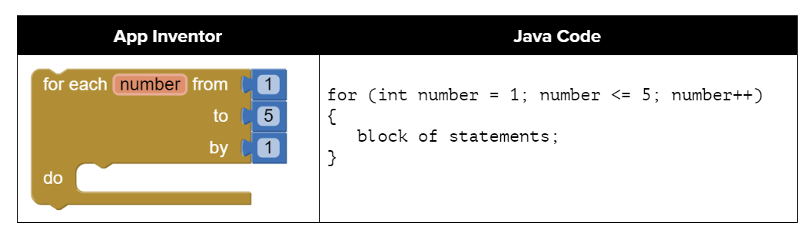
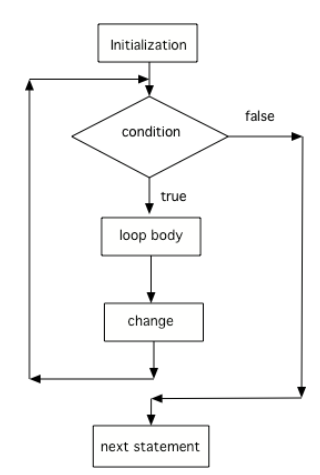

.. include:: ../common.rst

.. qnum::
   :prefix: 4-2-
   :start: 1

.. |github| raw:: html

   <a href="https://github.com/bhoffman0/APCSA-2019/tree/master/_sources/Unit2-Using-Objects/TurtleJavaSwingCode.zip" target="_blank" style="text-decoration:underline">here</a>

|Time90|

For Loops
=========

.. index::
   single: for loop
   pair: loop; for

Another type of loop in Java is a **for loop**. This is usually used when you know how many times you want the loop to execute. It is often a simple **counter-controlled loop** to do the loop body a set number of times.

If you took AP CSP with a block programming language like App Inventor, you probably used a for loop block like below that looks very similar to Java for loops. If you have used a language like Scratch or Snap!, you may remember the repeat(n) block where you type in a number of times you want the code to be repeated, just like the AP pseudocode REPEAT block. In fact, almost every programming language has a for or repeat loop.

    Figure 1: Comparing App Inventor and Java for loops

Three Parts of a For Loop
--------------------------

A for-loop combines all 3 parts of writing a loop in one line to initialize, test, and change the loop control variable.  The 3 parts are separated by semicolons (``;``).  Each of the three parts of a ``for`` loop declaration is optional (initialization, condition, and change), but the semicolons are not optional.

.. code-block:: java

  for (initialize; test condition; change)
  {
     loop body
  }

The for-loop is almost a shortcut way to write a while loop with all three steps that you need in one line.

.. figure:: Figures/compareForAndWhile.png
    :width: 600px
    :align: center
    :figclass: align-center

    Figure 2: Showing how a for loop maps to a while loop

Watch the following `video <https://www.youtube.com/watch?v=SEDnzXeb2hU&list=PLHqz-wcqDQIEP6p1_0wOb9l9aQ0qFijrP&index=9&ab_channel=colleenlewis>`_ which compares a while loop and for loop line by line.

.. youtube:: SEDnzXeb2hU
    :width: 700
    :height: 400
    :align: center
    :optional:

Here is a control flow diagram for a for loop.  The code in the initialization area is executed only one time before the loop begins, the test condition is checked each time through the loop and the loop continues as long as the condition is true, and the loop control variable change is done at the end of each execution of the body of the loop, just like a while loop.  When the loop condition is false, execution will continue at the next statement after the body of the loop.

    Figure 2: Control flow in a for loop

|CodingEx| **Coding Exercise**

.. activecode:: forloop
   :language: java
   :autograde: unittest
   :practice: T

   Here is a for loop that counts from 1 to 5. Can you change it to count from 2 to 10?
   ~~~~
   public class ForLoop
   {
       public static void main(String[] args)
       {
           for (int count = 1; count <= 5; count++)
           {
               System.out.println(count);
           }
       }
   }

   ====
   import static org.junit.Assert.*;

   import org.junit.*;

   import java.io.*;

   public class RunestoneTests extends CodeTestHelper
   {
       @Test
       public void testMain() throws IOException
       {
           String output = getMethodOutput("main");
           String expect = "2\n3\n4\n5\n6\n7\n8\n9\n10\n";
           boolean passed = getResults(expect, output, "Expected output from main");
           assertTrue(passed);
       }
   }

.. activecode:: forloopfromwhile
   :language: java
   :autograde: unittest
   :practice: T

   Here is a while loop that counts from 5 to 10. Run it and see what it does. Can you change it to a for-loop? Run your for-loop. Does it do the same thing?
   ~~~~
   public class ForLoopFromWhile
   {
       public static void main(String[] args)
       {
           int count = 5;
           while (count <= 10)
           {
               System.out.println(count);
               count++;
           }
       }
   }

   ====
   import static org.junit.Assert.*;

   import org.junit.Test;

   import java.io.*;

   public class RunestoneTests extends CodeTestHelper
   {
       public RunestoneTests()
       {
           super("ForLoopFromWhile");
       }

       @Test
       public void testMain() throws IOException
       {
           String output = getMethodOutput("main");
           String expect = "5\n6\n7\n8\n9\n10\n";

           boolean passed = getResults(expect, output, "Running main");
           assertTrue(passed);
       }

       @Test
       public void testWhile() throws IOException
       {
           String target = "while (*)";
           boolean passed = checkCodeNotContainsRegex("while loop", target);
           assertTrue(passed);
       }

       @Test
       public void testFor() throws IOException
       {
           String target = "for (int * = #; * ? #; *~)";
           boolean passed = checkCodeContainsRegex("for loop", target);
           assertTrue(passed);
       }
   }

.. note::

   Two common patterns in for-loops are to count from 0 up to an number (using <) or count from 1 to the number including the number (using <=). Remember that if you start at 0 use <, and if you start at 1, use <=. The two loops below using these two patterns both run 10 times. The variable i (for index) is often used as a counter in for-loops.

   .. code-block:: java

      // These loops both run 10 times
      // If you start at 0, use <
      for(int i = 0; i < 10; i++)
      {
         System.out.println(i);
      }
      // If you start at 1, use <=
      for(int i = 1; i <= 10; i++)
      {
         System.out.println(i);
      }

|Exercise| **Check your understanding**

.. mchoice:: qlb_3_1
   :practice: T
   :answer_a: 3 4 5 6 7 8
   :answer_b: 0 1 2 3 4 5 6 7 8
   :answer_c: 8 8 8 8 8
   :answer_d: 3 4 5 6 7
   :correct: d
   :feedback_a: This loop starts with i equal to 3 but ends when i is equal to 8.
   :feedback_b: What is i set to in the initialization area?
   :feedback_c: This would be true if the for loop was missing the change part <code>(int i = 3; i < 8; )</code> but it does increment i in the change part <code>(int i = 3; i < 8; i++)</code>.
   :feedback_d: The value of i is set to 3 before the loop executes and the loop stops when i is equal to 8.  So the last time through the loop i is equal to 7.

   What does the following code print?

   .. code-block:: java

     for (int i = 3; i < 8; i++)
     {
        System.out.print(i + " ");
     }

.. mchoice:: qlb_3_2
   :practice: T
   :answer_a: 3 4 5 6 7 8
   :answer_b: 0 1 2 3 4 5 6 7 8 9
   :answer_c: 1 2 3 4 5 6 7 8 9 10
   :answer_d: 1 3 5 7 9
   :correct: c
   :feedback_a: What is i set to in the initialization area?
   :feedback_b: What is i set to in the initialization area?
   :feedback_c: The value of i starts at 1 and this loop will execute until i equals 11.  The last time through the loop the value of i is 10.
   :feedback_d: This loop changes i by 1 each time in the change area.

   What does the following code print?

   .. code-block:: java

     for (int i = 1; i <= 10; i++)
     {
        System.out.print(i + " ");
     }

.. mchoice:: qlb_3_3
   :practice: T
   :answer_a: 10
   :answer_b: 6
   :answer_c: 7
   :answer_d: 9
   :correct: c
   :feedback_a: This would be true if i started at 0 and ended at 9.  Does it?
   :feedback_b: Since i starts at 3 and the last time through the loop it is 9 the loop executes 7 times (9 - 3 + 1 = 7)
   :feedback_c: How many numbers are between 3 and 9 (including 3 and 9)?
   :feedback_d: This would be true if i started at 0 and the value of i the last time through the loop it was 8.

   How many times does the following method print a ``*``?

   .. code-block:: java

     for (int i = 3; i <= 9; i++)
     {
        System.out.print("*");
     }

.. parsonsprob:: print_evens
   :numbered: left
   :practice: T
   :adaptive:

   The following method has the correct code to print out all the even values from 0 to the value of 10, but the code is mixed up.  Drag the blocks from the left into the correct order on the right and indent them correctly.  Even though Java doesn't require indention it is a good habit to get into. You will be told if any of the blocks are in the wrong order or not indented correctly when you click the "Check Me" button.
   -----
   public static void printEvens()
   {
   =====
      for (int i = 0; i <= 10; i+=2)
      {
   =====
         System.out.println(i);
   =====
      } // end for
   =====
   } // end method

Decrementing Loops
-------------------

You can also count backwards in a loop starting from the last number and decrementing down to 0 or 1. All 3 parts of the loop must change to count backwards including the test of when to stop. For example, ``for (int i=5; i > 0; i--)`` counts from 5 down to 1.

|CodingEx| **Coding Exercise**

.. activecode:: lcfcp1
   :language: java
   :autograde: unittest

   What do you think will happen when you run the code below?  How would it change if you changed line 11 to initialize i's value to 3? Try the Code Lens button to visualize and trace through this code.
   ~~~~
   public class SongTest
   {

       public static void printPopSong()
       {
           String line1 = " bottles of pop on the wall";
           String line2 = " bottles of pop";
           String line3 = "Take one down and pass it around";

           // loop 5 times (5, 4, 3, 2, 1)
           for (int i = 5; i > 0; i--)
           {
               System.out.println(i + line1);
               System.out.println(i + line2);
               System.out.println(line3);
               System.out.println((i - 1) + line1);
               System.out.println();
           }
       }

       public static void main(String[] args)
       {
           SongTest.printPopSong();
       }
   }

   ====
   // Test Code for Lesson 4.1 - popSong
   import static org.junit.Assert.*;

   import org.junit.Test;

   import java.io.*;

   public class RunestoneTests extends CodeTestHelper
   {
       public RunestoneTests()
       {
           super("SongTest");
       }

       @Test
       public void testMain() throws IOException
       {
           String output = getMethodOutput("main");
           String expect = "3 bottles of pop on the wall";

           String expect1 = expect.split("\n")[0];
           String output1 = output.split("\n")[0];

           boolean passed = output.contains(expect);
           passed = getResults(expect1, output1, "Print the song from 3", passed);
           assertTrue(passed);
       }

       @Test
       public void testMain2() throws IOException
       {
           String output = getMethodOutput("main");
           String expect = "5 bottles of pop on the wall";

           boolean passed = !output.contains(expect);

           String expect1 = expect.split("\n")[0];
           String output1 = output.split("\n")[0];

           passed = getResults(expect1, output1, "Do not start loop from 5", passed);
           assertTrue(passed);
       }
   }

The method **printPopSong** prints the words to a song.  It initializes the value of the variable i equal to 5 and then checks if i is greater than 0.  Since 5 is greater than 0, the body of the loop executes.  Before the condition is checked again, i is decreased by 1.  When the value in i is equal to 0 the loop stops executing.

.. activecode:: forloop-backwards
   :language: java
   :autograde: unittest
   :practice: T

   Can you make the loop count by 2s backwards? It should print out 5 3 1? Remember to change all 3 parts of the for loop.
   ~~~~
   public class ForLoop
   {
       public static void main(String[] args)
       {
           for (int count = 1; count <= 5; count++)
           {
               System.out.println(count);
           }
       }
   }

   ====
   import static org.junit.Assert.*;

   import org.junit.*;

   import java.io.*;

   public class RunestoneTests extends CodeTestHelper
   {
       @Test
       public void testMain() throws IOException
       {
           String output = getMethodOutput("main");
           String expect = "5\n3\n1";
           boolean passed = getResults(expect, output, "Expected output from main");
           assertTrue(passed);
       }
   }

Turtle Loops
------------

|CodingEx| **Coding Exercise**

Do you remember when we used the turtle objects to draw shapes? To create a square without loops we had to repeat code to go forward and turn 90 degrees to the right 4 times like below. Can you change the code below to remove the repeated lines of code and use a loop to draw 4 sides of the square? Did you notice that the code becomes a lot shorter? You should only need 1 call to forward and 1 call to turn in the loop. Whenever you find yourself repeating code, try to use a loop instead!

(If the code below does not work for you, you can copy the code into  this |repl link| (refresh page after forking and if it gets stuck) or download the files |github| to use in your own IDE.)

.. activecode:: TurtleSquare
    :language: java
    :autograde: unittest
    :datafile: turtleClasses.jar

    Can you change the code below to remove the repeated lines of code and use a loop to draw 4 sides of the square?
    ~~~~
    import java.awt.*;
    import java.util.*;

    public class TurtleDrawSquare
    {
        public static void main(String[] args)
        {
            World world = new World(300, 300);
            Turtle yertle = new Turtle(world);

            // Change the following code to use a for loop to draw the square
            yertle.forward();
            yertle.turn(90);
            yertle.forward();
            yertle.turn(90);
            yertle.forward();
            yertle.turn(90);
            yertle.forward();
            yertle.turn(90);

            world.show(true);
        }
    }

    ====
    import static org.junit.Assert.*;

    import org.junit.*;

    import java.io.*;

    public class RunestoneTests extends CodeTestHelper
    {
        public RunestoneTests()
        {
            super("TurtleDrawSquare");
        }

        @Test
        public void test1()
        {
            String target = "for (int * = #; * ? #; *~)";
            boolean passed = checkCodeContainsRegex("for loop", target);
            assertTrue(passed);
        }

        @Test
        public void test2()
        {
            String code = getCode();
            String forwards = ".forward()";

            int count = countOccurences(code, forwards);

            boolean passed = count == 1;

            passed =
                    getResults(
                            "1 forward()",
                            "" + count + " forward()",
                            "Should only need forward() once",
                            passed);
            assertTrue(passed);
        }

        @Test
        public void test3()
        {
            String code = getCode();
            String forwards = ".turn(90)";

            int count = countOccurences(code, forwards);

            boolean passed = count == 1;

            passed =
                    getResults(
                            "1 turn(90)",
                            "" + count + " turn(90)",
                            "Should only need turn(90) once",
                            passed);
            assertTrue(passed);
        }
    }

|Groupwork| Programming Challenge : Turtles Drawing Shapes
----------------------------------------------------------

.. |repl link| raw:: html

   <a href="https://firewalledreplit.com/@BerylHoffman/Java-Swing-Turtle" target="_blank">repl.it link</a>

In the last exercise, you used a for-loop to have the turtle draw a square. Use the Active Code window below or this |repl link| to have yertle draw the following shapes using loops. We encourage you to work in pairs.

1. Have yertle draw an equilateral triangle using a loop. How many times should the loop run? Remember that it ran 4 times for a square, so how many for a triangle? What angle should you use for the turns? One way to figure this out is to notice that to complete a shape, all the exterior angles should add up to 360 degrees. So, for a square 4x90 = 360.

2. Have yertle draw a pentagon using a loop. A pentagon has 5 sides. What external angle should you use for the turns? Remember they have to add up to 360 degrees.

3. Create a variable n that holds the number of sides for any polygon, and use n in your loop for the sides and to calculate the angle to turn. Can you have the loop draw a variety of shapes by just changing the value of the variable n? The power of abstraction! Can you draw a 9 sided nonagon? (Note that if the turtle runs into walls, it stays there and will mess up the shape, so you may have to move the turtle or go forward smaller amounts).

.. activecode:: challenge4-2-TurtleLoopShapes
    :language: java
    :autograde: unittest
    :datafile: turtleClasses.jar

    Use a for-loop to draw a triangle. Then, change it to a pentagon. Then change it to draw any polygon using a variable n that holds the number of sides. Note that the angles in the turns have to add up to 360. The autograder only checks one shape at a time, so comment out the code for one shape before starting on the next.
    ~~~~
    import java.awt.*;
    import java.util.*;

    public class TurtleDrawShapes
    {
        public static void main(String[] args)
        {
            World world = new World(400, 400);
            Turtle yertle = new Turtle(world);
            yertle.penUp(); // move a little to the left
            yertle.moveTo(100, 200);
            yertle.penDown();
            yertle.setColor(Color.blue);

            // Add your loop here!
            yertle.forward(100);
            yertle.turn(90);

            world.show(true);
        }
    }

    ====
    import static org.junit.Assert.*;

    import org.junit.*;

    import java.io.*;

    public class RunestoneTests extends CodeTestHelper
    {
        public RunestoneTests()
        {
            super("TurtleDrawShapes");
        }

        @Test
        public void test1()
        {
            String target = "for (int * = *; * ? *; *~)";
            boolean passed = checkCodeContainsRegex("for loop", target);
            assertTrue(passed);
        }

        @Test
        public void test2()
        {
            String code = getCode();
            String forwards = ".forward(";

            int count = countOccurences(code, forwards);

            boolean passed = count == 1;

            passed =
                    getResults(
                            "1 forward(...)",
                            "" + count + " forward(...)",
                            "Should only need forward() once",
                            passed);
            assertTrue(passed);
        }

        @Test
        public void test3()
        {
            String code = getCode();
            String forwards = ".turn(";

            int count = countOccurences(code, forwards);

            boolean passed = count == 1;

            passed =
                    getResults(
                            "1 turn(...)",
                            "" + count + " turn(...)",
                            "Should only need turn(...) once",
                            passed);
            assertTrue(passed);
        }

        @Test
        public void test4()
        {
            String code = getCode();
            String forwards = "int n";

            int count = countOccurences(code, forwards);

            boolean passed = count == 1;

            passed = getResults("true", "" + passed, "Declare int n", passed);
            assertTrue(passed);
        }

        @Test
        public void test5()
        {
            String code = getCode();
            String test = "360/n";

            int count = countOccurences(code.replaceAll(" ", ""), test);
            boolean passed = count == 1;

            passed = getResults("true", "" + passed, "Calculates angle correctly using n", passed);
            assertTrue(passed);
        }
    }

Summary
-------

- There are three parts in a for loop header: the initialization, the test condition (a Boolean expression), and an increment or decrement statement to change the loop control variable.

- In a for loop, the initialization statement is only executed once before the evaluation of the test Boolean expression. The variable being initialized is referred to as a **loop control variable**.

- In each iteration of a for loop, the increment or decrement statement is executed after the entire loop body is executed and before the Boolean expression is evaluated again.

- A for loop can be rewritten into an equivalent while loop and vice versa.

AP Practice
------------

.. mchoice:: AP4-2-1
    :practice: T

    Consider the following code segment.

    .. code-block:: java

        int count = 0, sum = 0;
        while (count <= 6)
        {
            count++;
            if (count % 2 == 0)
            {
                sum += count;
            }
        }
        System.out.println(sum);

    Which of the following code segments will produce the same output as the code segment above?

    .. code-block:: java

        I.  int sum = 0;
            for(int count = 0; count <= 6; count++)
            {
                count++;
                if (count % 2 == 0)
                {
                     sum += count;
                }
            }
            System.out.println(sum);

        II. int sum = 0;
            for(int i = 0; i <= 6; i += 2)
            {
               sum += i;
            }
            System.out.println(sum);

        III. int sum = 0;
             for(int j = 7; j > 1; j--)
             {
                if (j % 2 == 0)
                {
                     sum += j;
                }
             }
             System.out.println(sum);

    - I and II only

      - Note that I has an extra count++ at the beginning of the loop body that should be deleted.

    - II and III only

      + Correct! In the II, the loop counter increments by 2's making sure it visits only even numbers and III generates the same sum but backwards.

    - I and III only

      - Note that I has an extra count++ at the beginning of the loop body that should be deleted.

    - III only

      - This is partially correct.

    - I, II, and III

      - Note that I has an extra count++ at the beginning of the loop body that should be deleted.

.. mchoice:: AP4-2-2
    :practice: T

    Consider the following code segment.

    .. code-block:: java

        int result = 1;
        for(int i = 3; i < 6; i += 2)
        {
          result *= i;
        }
        System.out.println(result);

    Which of the following best explains how changing the for loop header to ``for (int i = 4; i <= 6; i += 2)`` affects the output of the code segment?

    - The output of the code segment will be unchanged.

      - One will multiply odd numbers and the other even numbers.

    - The output will be the same, but the new loop will iterate more times.

      - One will multiply odd numbers and the other even numbers.

    - The output will be different, but both versions of the loop will iterate two times.

      + Correct! One will multiply 3*5 and the other 4*6.

    - The output will be different, and the new loop will iterate more times.

      - The output is different but they both would iterate 2 times.

    - This will cause an error.

      - It will not cause an error.
