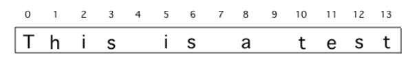

.. include:: ../common.rst

.. qnum::
   :prefix: 4-3-
   :start: 1

.. |AP CSA Reference Sheet| raw:: html

   <a href="https://apstudents.collegeboard.org/ap/pdf/ap-computer-science-a-java-quick-reference_0.pdf" target="_blank">AP CSA Java Quick Reference Sheet</a>

|Time90|

Loops and Strings
=================

.. index::
   single: string processing
   pair: string; loop

Loops are often used for **String Traversals** or **String Processing** where the code steps through a string character by character. In lesson 2.6 and 2.7, we learned to use String objects and built-in string methods to process strings. In this lesson, we will write our own loops to process strings.

Remember that strings are a sequence of characters where each character is at a position or **index** starting at 0.

    Figure 1: A string with the position (index) shown above each character

.. note::

   The first character in a Java String is at index 0 and the last characters is at **length()** - 1. So loops processing Strings should start at 0!

The String methods (covered in lesson 2.7 and given in the |AP CSA Reference Sheet|) that are most often used to process strings are:

- **int length()** : returns the number of characters in a String object.

- **int indexOf(String str)** : returns the index of the first occurrence of ``str`` or -1 if ``str`` is not found.

- **String substring(int from, int to)** : returns the substring beginning at index from  and ending at index (to – 1). Note that s.substring(i,i+1) returns the character at index i.

- **String substring(int from)** : returns substring(from, length()).

.. |Java visualizer1| raw:: html

   <a href="http://www.pythontutor.com/visualize.html#code=public%20class%20RemoveAs%20%7B%0A%20%20%20%0A%20%20%20public%20static%20void%20main%28String%5B%5D%20args%29%0A%20%20%20%7B%0A%0A%20%20%20%20%20%20String%20s%20%3D%20%22are%20apples%20tasty%20without%20a's%3F%22%3B%20%0A%20%20%20%20%20%20int%20index%20%3D%200%3B%0A%20%20%20%20%20%20System.out.println%28%22Original%20string%3A%20%22%20%2B%20s%29%3B%0A%0A%20%20%20%20%20%20//%20while%20there%20is%20an%20a%20in%20s%0A%20%20%20%20%20%20while%20%28s.indexOf%28%22a%22%29%20%3E%3D%200%29%0A%20%20%20%20%20%20%7B%0A%20%20%20%0A%20%20%20%20%20%20%20%20%20//%20Find%20the%20next%20index%20for%20an%20a%0A%20%20%20%20%20%20%20%20%20index%20%3D%20s.indexOf%28%22a%22%29%3B%0A%20%20%20%20%20%20%20%20%20%20%20%0A%20%20%20%20%20%20%20%20%20//%20Remove%20the%20a%20at%20index%20by%20concatenating%20%0A%20%20%20%20%20%20%20%20%20//%20substring%20up%20to%20index%20and%20then%20rest%20of%20the%20string.%0A%20%20%20%20%20%20%20%20%20s%20%3D%20s.substring%280,index%29%20%2B%20%0A%20%20%20%20%20%20%20%20%20%20%20%20%20s.substring%28index%2B1%29%3B%0A%20%20%20%20%20%20%20%20%20%20%20%20%0A%20%20%20%20%20%20%7D%20//%20end%20loop%20%0A%20%20%0A%20%20%20%20%20%20System.out.println%28%22String%20with%20a's%20removed%3A%22%20%2B%20s%29%3B%0A%20%20%20%0A%20%20%20%7D%20//%20end%20method%0A%7D&cumulative=false&curInstr=23&heapPrimitives=nevernest&mode=display&origin=opt-frontend.js&py=java&rawInputLstJSON=%5B%5D&textReferences=false" target="_blank"  style="text-decoration:underline">Java visualizer</a>

.. |Java visualizer| raw:: html

   <a href="http://www.pythontutor.com/visualize.html#code=public%20class%20Test%0A%20%20%20%7B%0A%20%20%20%20%20%20public%20static%20void%20main%28String%5B%5D%20args%29%0A%20%20%20%20%20%20%7B%0A%20%20%20%20%20%20%20%20String%20message%20%3D%20%22Have%20a%201ong%20and%20happy%201ife%22%3B%20%0A%20%20%20%20%20%20%20%20int%20index%20%3D%200%3B%0A%20%20%20%20%20%20%20%20%0A%20%20%20%20%20%20%20%20//%20while%20more%201s%20in%20the%20message%0A%20%20%20%20%20%20%20%20while%20%28message.indexOf%28%221%22%29%20%3E%3D%200%29%0A%20%20%20%20%20%20%20%20%7B%0A%20%20%20%20%20%20%20%20%20%20%20//%20Find%20the%20next%20index%20for%201%0A%20%20%20%20%20%20%20%20%20%20%20index%20%3D%20message.indexOf%28%221%22%29%3B%0A%20%20%20%20%20%20%20%20%20%20%20System.out.println%28%22Found%20a%201%20at%20index%3A%20%22%20%2B%20index%29%3B%0A%20%20%20%20%20%20%20%20%20%20%20//%20Replace%20the%201%20with%20a%20l%20at%20index%20by%20concatenating%20substring%20up%20to%20index%20and%20then%20the%20rest%20of%20the%20string.%0A%20%20%20%20%20%20%20%20%20%20%20String%20firstpart%20%3D%20message.substring%280,index%29%3B%0A%20%20%20%20%20%20%20%20%20%20%20String%20lastpart%20%3D%20message.substring%28index%2B1%29%3B%0A%20%20%20%20%20%20%20%20%20%20%20message%20%3D%20firstpart%20%2B%20%22l%22%20%2B%20lastpart%3B%0A%20%20%20%20%20%20%20%20%20%20%20System.out.println%28%22Replaced%201%20with%20l%20at%20index%20%22%20%2B%20index%29%3B%20%20%20%20%20%20%20%0A%20%20%20%20%20%20%20%20%7D%0A%20%20%20%20%20%20%20%20System.out.println%28%22Cleaned%20text%3A%20%22%20%2B%20message%29%3B%0A%20%20%20%20%20%20%7D%0A%20%20%20%7D&cumulative=false&curInstr=21&heapPrimitives=nevernest&mode=display&origin=opt-frontend.js&py=java&rawInputLstJSON=%5B%5D&textReferences=false&curInstr=0" target="_blank"  style="text-decoration:underline">Java visualizer</a>

While Find and Replace Loop
---------------------------

A while loop can be used with the ``String`` ``indexOf`` method to find certain characters in a string and process them, usually using the ``substring`` method.

.. code-block:: java

   String s = "example";
   int i = 0;
   // while there is an a in s
   while (s.indexOf("a") >= 0)
   {
     // Find and save the next index for an a
     i = s.indexOf("a");
     // Process the string at that index
     String ithLetter = s.substring(i,i+1);
     ...
   }

The example in the mixed up code below finds and removes all the letter a's in a string. You can watch it in action in this |Java visualizer1|.

|Exercise| **Check Your Understanding**

.. parsonsprob:: removeA
   :numbered: left
   :practice: T
   :adaptive:
   :noindent:

   The following program removes all the a's from a string, but the code is mixed up.  Drag the blocks from the left area into the correct order in the right area.  Click on the "Check Me" button to check your solution.
   -----
   public static void main(String[] args)
   {
   =====
      String s = "are apples tasty without an a?";
      int index = 0;
      System.out.println("Original string: " + s);
   =====
      // while there is an a in s
      while (s.indexOf("a") >= 0)
      {
   =====
         // Find the next index for an a
         index = s.indexOf("a");
   =====
         // Remove the a at index by concatenating
         // substring up to index and then rest of the string.
         s = s.substring(0,index) +
             s.substring(index+1);
   =====
      } // end loop
   =====
      System.out.println("String with a's removed:" + s);
   =====
   } // end method

Google has been scanning old books and then using software to read the scanned text.  But, the software can get things mixed up like using the number 1 for the letter l. Try the code below (and in the |Java visualizer|) to clean up scanning mistakes like this.

|CodingEx| **Coding Exercise**

The following code loops through a string replacing all 1's with l's.  Trace through the code below with a partner and explain how it works on the given message.  You can run it line by line in the |Java visualizer|. Note that ``indexOf`` here can work repeatedly to find the next occurrence of a 1 because they are replaced as soon as they are found.

.. activecode:: lclw1
   :language: java
   :autograde: unittest

   Change the code to add code for a counter variable to count the number of 1's replaced in the message and print it out. Change the message to have more mistakes with 1's to test it.
   ~~~~
   public class FindAndReplace
   {
       public static void main(String[] args)
       {
           String message = "Have a 1ong and happy 1ife";
           int index = 0;

           // while more 1's in the message
           while (message.indexOf("1") >= 0)
           {
               // Find the next index for 1
               index = message.indexOf("1");
               System.out.println("Found a 1 at index: " + index);
               // Replace the 1 with a l at index by concatenating substring up to
               // index and then the rest of the string.
               String firstpart = message.substring(0, index);
               String lastpart = message.substring(index + 1);
               message = firstpart + "l" + lastpart;
               System.out.println("Replaced 1 with l at index " + index);
               System.out.println(
                       "The message is currently "
                               + message
                               + " but we aren't done looping yet!");
           }
           System.out.println("Cleaned text: " + message);
       }
   }

   ====
   // Test for Lesson 4.3.1 - While Loop FindAndReplace lclw1
   import static org.junit.Assert.*;

   import org.junit.*;

   import java.io.*;

   public class RunestoneTests extends CodeTestHelper
   {
       public RunestoneTests()
       {
           super("FindAndReplace");
       }

       @Test
       public void testMain() throws IOException
       {
           String output = getMethodOutput("main").trim();
           String expect =
                   "Found a 1 at index: 7\n"
                       + "Replaced 1 with l at index 7\n"
                       + "The message is currently Have a long and happy 1ife but we aren't done"
                       + " looping yet!\n"
                       + "Found a 1 at index: 22\n"
                       + "Replaced 1 with l at index 22\n"
                       + "The message is currently Have a long and happy life but we aren't done"
                       + " looping yet!\n"
                       + "Cleaned text: Have a long and happy life\n";

           boolean pass = !output.equals(expect.trim());

           boolean passed = getResults(expect, output, "Output should be different", pass);
           assertTrue(passed);
       }
   }

For Loops: Reverse String
--------------------------

``for`` loops can also be used to process strings, especially in situations where you know you will visit every character.

.. note::

    ``while`` loops are often used with strings when you are looking for a certain character or substring in a string and do not know how many times the loop needs to run. ``for`` loops are used when you know you want to visit every character.

``for`` loops with strings usually start at 0 and use the string's length() for the ending condition to step through the string character by character.

.. code-block:: java

   String s = "example";
   // loop through the string from 0 to length
   for(int i=0; i < s.length(); i++)
   {
      String ithLetter = s.substring(i,i+1);
      // Process the string at that index
      ...
   }

|Exercise| **Check Your Understanding**

.. parsonsprob:: countEs
   :numbered: left
   :practice: T
   :adaptive:
   :noindent:

   The following main method has the correct code to count the number of e's in a string, but the code is mixed up.  Drag the blocks from the left area into the correct order in the right area.  Click on the "Check Me" button to check your solution.
   -----
   public static void main(String[] args)
   {
   =====
      String message = "e is the most frequent English letter.";
      int count = 0;
   =====
      for(int i=0; i < message.length(); i++)
      {
   =====
         if (message.substring(i,i+1).equalsIgnoreCase("e"))
   =====
            count++;
   =====
      }
   =====
      System.out.println(count);
   =====
   }

Here is a ``for`` loop that creates a new string that reverses the string ``s``.  We start with a blank string ``sReversed`` and build up our reversed string in that variable by copying in characters from the string ``s``. You can also run this code in this |Java visualizer link| or by clicking on the Code Lens button below.

.. |Java visualizer link| raw:: html

   <a href="http://www.pythontutor.com/visualize.html#code=%20%20%20public%20class%20ReverseString%0A%20%20%20%7B%0A%20%20%20%20%20%20public%20static%20void%20main%28String%5B%5D%20args%29%0A%20%20%20%20%20%20%7B%0A%20%20%20%20%20%20%20%20String%20s%20%3D%20%22Hello%22%3B%0A%20%20%20%20%20%20%20%20String%20sReversed%20%3D%20%22%22%3B%0A%20%20%20%20%20%20%20%20String%20ithLetter%3B%0A%20%20%20%20%20%20%20%20%0A%20%20%20%20%20%20%20%20for%28int%20i%3D0%3B%20i%20%3C%20s.length%28%29%3B%20i%2B%2B%29%20%7B%0A%20%20%20%20%20%20%20%20%20%20%20%20ithLetter%20%3D%20s.substring%28i,i%2B1%29%3B%0A%20%20%20%20%20%20%20%20%20%20%20%20//%20add%20the%20letter%20at%20index%20i%20to%20what%20is%20already%20reversed.%0A%20%20%20%20%20%20%20%20%20%20%20%20sReversed%20%3D%20ithLetter%20%2B%20sReversed%3B%0A%20%20%20%20%20%20%20%20%7D%0A%20%20%20%20%20%20%20%20System.out.println%28s%20%2B%20%22%20reversed%20is%20%22%20%2B%20sReversed%29%3B%0A%20%20%20%20%20%20%7D%0A%20%20%20%20%7D&cumulative=false&curInstr=25&heapPrimitives=nevernest&mode=display&origin=opt-frontend.js&py=java&rawInputLstJSON=%5B%5D&textReferences=false&curInstr=0" target="_blank">Java visualizer link</a>

|CodingEx| **Coding Exercise**

.. activecode:: reverseString
   :language: java
   :autograde: unittest

   What would happen if you started the loop at 1 instead? What would happen if you used <= instead of <? What would happen if you changed the order in which you added the ithLetter in line 12?
   ~~~~
   public class ReverseString
   {
       public static void main(String[] args)
       {
           String s = "Hello";
           String sReversed = "";
           String ithLetter;

           for (int i = 0; i < s.length(); i++)
           {
               ithLetter = s.substring(i, i + 1);
               // add the letter at index i to what's already reversed.
               sReversed = ithLetter + sReversed;
           }
           System.out.println(s + " reversed is " + sReversed);
       }
   }

    ====
    // Test for Lesson 4.3 - ReverseString
    import static org.junit.Assert.*;

    import org.junit.*;

    import java.io.*;

    public class RunestoneTests extends CodeTestHelper
    {
        public RunestoneTests()
        {
            super("ReverseString");
        }

        @Test
        public void testMain() throws IOException
        {
            String origCode =
                    "public class ReverseString\n"
                        + "{\n"
                        + "   public static void main(String[] args)\n"
                        + "   {\n"
                        + "     String s = \"Hello\";\n"
                        + "     String sReversed = \"\";\n"
                        + "     String ithLetter;\n\n"
                        + "     for(int i=0; i < s.length(); i++) {\n"
                        + "         ithLetter = s.substring(i,i+1);\n"
                        + "         // add the letter at index i to what's already reversed.\n"
                        + "         sReversed = ithLetter + sReversed;\n"
                        + "     }\n"
                        + "     System.out.println(s + \" reversed is \" + sReversed);\n"
                        + "   }\n"
                        + " }\n\n";

            boolean passed = codeChanged(origCode);
            assertTrue(passed);
        }
    }

|Groupwork| Programming Challenge : String Replacement Cats and Dogs
---------------------------------------------------------------------

Are you a cat person or a dog person? The code below prints a nice message about cats, but if you're a dog person, you might not agree.

1. Write some code below that changes every occurrence of "cat" to "dog" in the message. This code will be more like the first program in this lesson where we replaced 1's with l's.

2. (Optional - not autograded) add a counter to count the number of replacements and print it out.

3. (Optional - challenging and not autograded) What if you like both cats and dogs? After you replace "cat" with "dog", add another loop that looks for the word "dogs" and adds " and cats" to it. Do not replace "dog", just replace "dogs". This will just replace the first sentence in the example below but you can add other sentences to test. For this loop, you will need to use a special version of ``indexOf`` that searches from a given index, so that you don't end up with an infinite loop that keeps finding the first "dogs". Make sure you add a variable **fromIndex** that is initialized to 0 and that is changed each time through the loop to skip over the last word that was found.

   - **int indexOf(String target, int fromIndex)** searches left-to-right for the target substring, but starts the search at the given fromIndex. You are not required to know this version of indexOf for the AP CSA exam, but you can use it (and any valid Java code) in the Free Response Questions.

.. activecode:: challenge4-3-string-replace
   :language: java
   :autograde: unittest
   :practice: T

   Write a while loop that replaces every occurrence of "cat" in the message with "dog" using the indexOf and substring methods.
   ~~~~
   public class ChallengeReplace
   {
       public static void main(String[] args)
       {
           String message =
                   "I love cats! I have a cat named Coco. My cat's very smart!";

           // Write a loop here that replaces every occurrence of "cat"
           // in the message with "dog", using indexOf and substring.

           System.out.println(message);
       }
   }

   ====
   // Test Code for Lesson 4.3.3 - String Replacement - ChallengeReplace

   import static org.junit.Assert.*;

   import org.junit.Test;

   import java.io.*;

   public class RunestoneTests extends CodeTestHelper
   {
       public RunestoneTests()
       {
           super("ChallengeReplace");
       }

       @Test
       public void test1() throws IOException
       {
           String output = getMethodOutput("main");
           String expect =
                   "I love cats! I have a cat named Coco. My cat's very smart!"
                           .replaceAll("cat", "dog");

           boolean passed = getResults(expect, output, "Running main");
           assertTrue(passed);
       }

       @Test
       public void testWhile() throws IOException
       {
           String target = "while(";
           boolean passed = checkCodeContains("while loop", target);
           assertTrue(passed);
       }

       @Test
       public void testSubString()
       {
           String target = "substring(";
           boolean passed = checkCodeContains("substring", target);
           assertTrue(passed);
       }

       @Test
       public void testReplace() throws IOException
       {
           String target = ".replace";
           boolean passed = checkCodeNotContains("shortcut replace", target);
           assertTrue(passed);
       }
   }

Summary
---------

- Loops can be used to traverse or process a string.

There are standard algorithms that utilize String traversals to:

* Find if one or more substrings has a particular property
* Determine the number of substrings that meet specific criteria
* Create a new string with the characters reversed

For more practice with string processing, see the Free Response Question in the Practice and Summary section of this unit.
