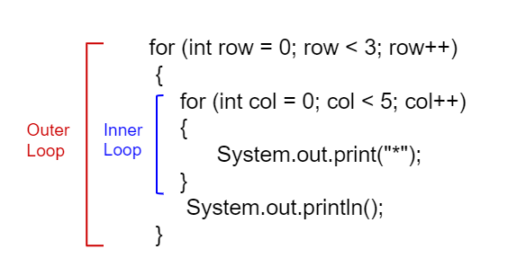

.. include:: ../common.rst

.. qnum::
   :prefix: 4-4-
   :start: 1

|Time90|

Nested For Loops
================

.. index::
   single: nested for loop
   pair: loop; nested

A **nested loop** has one loop inside of another.  These are typically used for working with two dimensions such as printing stars in rows and columns as shown below.   When a loop is nested inside another loop, the inner loop runs many times inside the outer loop. In each iteration of the outer loop, the inner loop will be re-started. The inner loop must finish all of its iterations before the outer loop can continue to its next iteration.

    Figure 1: Nested Loops

.. |Java visualizer| raw:: html

   <a href="http://www.pythontutor.com/visualize.html#code=public%20class%20NestedLoops%0A%7B%0A%20%20%20public%20static%20void%20main%28String%5B%5D%20args%29%0A%20%20%20%7B%0A%20%20%20%20%20%20%20for%20%28int%20row%20%3D%201%3B%20row%20%3C%3D%203%3B%20row%2B%2B%29%0A%20%20%20%20%20%20%20%7B%0A%20%20%20%20%20%20%20%20%20%20%20for%20%28int%20col%20%3D%201%3B%20col%20%3C%3D%205%3B%20col%2B%2B%29%0A%20%20%20%20%20%20%20%20%20%20%20%7B%0A%20%20%20%20%20%20%20%20%20%20%20%20%20%20%20System.out.print%28%22*%22%29%3B%0A%20%20%20%20%20%20%20%20%20%20%20%7D%0A%20%20%20%20%20%20%20%20%20%20%20System.out.println%28%29%3B%0A%20%20%20%20%20%20%20%7D%0A%20%20%20%7D%0A%7D&cumulative=false&heapPrimitives=nevernest&mode=display&origin=opt-frontend.js&py=java&rawInputLstJSON=%5B%5D&textReferences=false&curInstr=0" target="_blank"  style="text-decoration:underline">Java visualizer</a>

|CodingEx| **Coding Exercises**

What does the following code print out? Watch the code run in the  |Java visualizer| by clicking the CodeLens button and then forward. Notice how the inner loop is started over for each row. Can you predict how many rows and columns of stars there will be?

.. activecode:: lcfcnl1
   :language: java
   :autograde: unittest
   :practice: T

   Can you change the code to print a rectangle with 10 rows and 8 columns of stars? You can also try replacing line 10 with this print statement to see the rows and columns: ``System.out.print(row + "-" + col + " ");``
   ~~~~
   public class NestedLoops
   {

       public static void main(String[] args)
       {
           for (int row = 1; row <= 3; row++)
           {
               for (int col = 1; col <= 5; col++)
               {
                   System.out.print("*");
               }
               System.out.println();
           }
       }
   }

   ====
   import static org.junit.Assert.*;

   import org.junit.*;

   import java.io.*;

   public class RunestoneTests extends CodeTestHelper
   {
       public RunestoneTests()
       {
           super("NestedLoops");
       }

       @Test
       public void test2()
       {
           boolean passed =
                   checkCodeContains("10 rows", "row <= 10")
                           && checkCodeContains("8 columns", "col <= 8");
           assertTrue(passed);
       }
   }

|Exercise| **Check your understanding**

.. mchoice:: nested1
   :practice: T
   :answer_a: A rectangle of 7 rows with 5 stars per row.
   :answer_b: A rectangle of 7 rows with 4 stars per row.
   :answer_c: A rectangle of 6 rows with 5 stars per row.
   :answer_d: A rectangle of 6 rows with 4 stars per row.
   :correct: c
   :feedback_a: This would be true if i was initialized to 0.
   :feedback_b: This would be true if i was initialized to 0 and the inner loop continued while <code>y < 5</code>.
   :feedback_c: The outer loop runs from 1 up to 7 but not including 7 so there are 6 rows and the inner loop runs 1 to 5 times including 5 so there are 5 columns.
   :feedback_d: This would be true if the inner loop continued while <code>y < 5</code>.

   What does the following code print?

   .. code-block:: java

     for (int i = 1; i < 7; i++)
     {
         for (int y = 1; y <= 5; y++)
         {
             System.out.print("*");
         }
         System.out.println();
     }

.. mchoice:: nested2
   :practice: T
   :answer_a: A rectangle of 4 rows with 3 star per row.
   :answer_b: A rectangle of 5 rows with 3 stars per row.
   :answer_c: A rectangle of 4 rows with 1 star per row.
   :answer_d: The loops have errors.
   :correct: b
   :feedback_a: This would be true if i was initialized to 1 or ended at 4.
   :feedback_b: Yes, the outer loop runs from 0 up to 5 but not including 5 so there are 5 rows and the inner loop runs from 3 down to 1 so 3 times.
   :feedback_c: The inner loop runs 3 times when j is 3, 2, and then 1, so there are 3 stars per row.
   :feedback_d: Try the code in an Active Code window and you will see that it does run.

   What does the following code print?

   .. code-block:: java

     for (int i = 0; i < 5; i++)
     {
         for (int j = 3; j >= 1; j--)
         {
             System.out.print("*");
         }
         System.out.println();
     }

.. parsonsprob:: ch6ex6muc
   :numbered: left
   :practice: T
   :adaptive:
   :noindent:

   The main method in the following class should print 10 rows with 5 \*s in each row.   But, the blocks have been mixed up and include one extra block that isn't needed in the solution.  Drag the needed blocks from the left and put them in the correct order on the right.  Click the Check button to check your solution.
   -----
   public class Test1
   {
       public static void main(String[] args)
       {
   =====
           for (int x = 0; x < 10; x++)
           {
   =====
               for (int y = 0; y < 5; y++)
               {
   =====
               for (int y = 0; y <= 5; y++)
               { #paired
   =====
                   System.out.print("*");
   =====
               }
   =====
               System.out.println();
   =====
           }
   =====
       }
   }

Nested Loops with Turtles
---------------------------

Try nested loops with turtles to create a snowflake design!

|CodingEx| **Coding Exercise**

.. |github| raw:: html

   <a href="https://github.com/bhoffman0/APCSA-2019/tree/master/_sources/Unit2-Using-Objects/TurtleJavaSwingCode.zip" target="_blank" style="text-decoration:underline">here</a>

.. activecode:: TurtleNestedLoop
    :language: java
    :datafile: turtleClasses.jar
    :autograde: unittest

    The turtle below is trying to draw a square many times to create a snowflake pattern.
    Can you change the outer loop so that the pattern completes all the way around? Try different ending values for the counter i to find the smallest number that works between 5 and 15.

    To make the drawing faster, you can call the World or Turtle object's setSpeed method with a 0-100 delay value where 0 is the fastest.
    If the code below does not work in your browser, you can copy the code into  this |repl link| (refresh page after forking and if it gets stuck) or download the files |github| to use in your own IDE.
    ~~~~
    import java.awt.*;
    import java.util.*;

    public class TurtleDrawSnowflake
    {
        public static void main(String[] args)
        {
            World world = new World(300, 300);
            Turtle yertle = new Turtle(world);
            yertle.setSpeed(25); // fast 0 - 100 slow
            yertle.setColor(Color.blue);

            // Outer loop will do inner loop to draw a square,
            // and then turn a little each time
            // How many times should the outer loop run to complete the pattern? Try
            // some numbers between 5 and 15.
            for (int i = 1; i <= 5; i++)
            {

                // inner loop draws a square
                for (int sides = 1; sides <= 4; sides++)
                {
                    yertle.forward();
                    yertle.turn(90);
                }
                // turn a little before drawing square again
                yertle.turn(30);
            }
            world.show(true);
        }
    }

    ====
    import static org.junit.Assert.*;

    import org.junit.*;

    import java.io.*;

    public class RunestoneTests extends CodeTestHelper
    {
        public RunestoneTests()
        {
            super("TurtleDrawSnowflake");
        }     

        @Test
        public void test2()
        {
            boolean passed = false;
            String code = getCode();
            int find = code.indexOf("i <=");
            if (find != -1)
            {
                int end = code.indexOf(";", find);
                String s = code.substring(find + 5, end);
                int max = 0;
                try
                {
                    max = Integer.parseInt(s);
                }
                catch (NumberFormatException e)
                {
                    System.out.println("Couldn't parse int");
                }
                passed = max >= 12;
                getResults("i <= ?;", "i <= " + max + ";", "Iterations complete drawing", passed);
            } else
                getResults(
                        "i <= ?;",
                        "i <= ",
                        "Could not find number of iterations - check spacing",
                        passed);
            assertTrue(passed);
        }
    }

|Groupwork| Programming Challenge : Turtle Snowflakes
----------------------------------------------------------

.. |repl link| raw:: html

   <a href="https://firewalledreplit.com/@BerylHoffman/Java-Swing-Turtle" target="_blank">repl.it link</a>

.. |Color| raw:: html

   <a href= "https://docs.oracle.com/javase/7/docs/api/java/awt/Color.html" target="_blank">Color</a>

In the last exercise, you used nested for-loops to have the turtle draw a square repeatedly to make a snowflake. Use the Active Code window below or this |repl link| to have yertle draw the following shapes using nested loops. We encourage you to work in pairs on this.

1. Complete the code in the active code window below to draw a snowflake of triangles. Remember that triangles have 3 sides and you will need to turn 120 degrees (external angle) 3 times to draw the triangle. Use the ``turnAmount`` variable for the single turn after drawing a triangle. How many times did you need to run the outer loop to go all the way around? Try changing the ``turnAmount`` variable to 40 to see how many times you need to loop with a wider distance between the triangles.

2. In the exercise above, you figured out how many times to run the outer loop to finish the snowflake. You may have noticed that the number of times the loop needs to run is related to the angle you turn before drawing the next triangle. These turns have to add up to 360 degrees to go all the way around.  Change the outer loop so that it runs the number of times needed by using a formula with the  ``turnAmount`` variable and 360. Can you draw a snowflake using more or less triangles than before by just changing the ``turnAmount`` value?

3. Create another variable called ``n`` for the number of sides in the polygon the inner loop draws. Change the angle in the inner loop to also use a formula with 360 and this new variable. Can you change your snowflake to draw squares or pentagons instead? (Note if this overwhelms the Active Code server and times out, try a larger ``turnAmount``. (Or you can switch to using this |repl link| or your own IDE).

4. Let's add some more color! Add an ``if``/``else`` statement that changes the |Color| of the pen before the inner loop depending on whether the outer loop variable is odd or even. Remember that even numbers have no remainder when divided by 2.

5. Be creative and design a unique snowflake!

.. activecode:: challenge4-4-Turtle-Nested-Loop-Snowflakes
    :language: java
    :autograde: unittest
    :datafile: turtleClasses.jar

    Use nested for-loops to have the turtle draw a snowflake of polygons.
    Use the variable turnAmount to turn after each shape and the variable n for the sides of the polygon.

    To make the drawing faster, you can call the World or Turtle object's setSpeed method with a 0-100 delay value where 0 is the fastest.
    If the code below does not work in your browser, you can copy the code into  this |repl link| (refresh page after forking and if it gets stuck) or download the files |github| to use in your own IDE.
    ~~~~
    import java.awt.*;
    import java.util.*;

    public class TurtleSnowflakes
    {
        public static void main(String[] args)
        {
            World world = new World(300, 300);
            Turtle yertle = new Turtle(world);
            yertle.setSpeed(25); // fast 0 - 100 slow
            yertle.setColor(Color.blue);

            // Use this variable in the loops
            int turnAmount = 30;

            // 1. Write a for loop that runs many times
            // 2. Change it to use turnAmount to figure out how many times to run

            // 1 & 2. Write an inner loop that draws a triangle (3 sides, 120 degree
            // turns)
            // 3. Then change it to be any polygon with a variable n

            // turn turnAmount degrees before drawing the polygon again

            // 4. Add an if statement that changes the colors depending on the loop
            // variables

            world.show(true);
        }
    }

    ====
    import static org.junit.Assert.*;

    import org.junit.*;

    import java.io.*;

    public class RunestoneTests extends CodeTestHelper
    {
        public RunestoneTests()
        {
            super("TurtleSnowflakes");
        }

        @Test
        public void test2()
        {
            String code = getCode();
            String target = "for (int * = #; * ? *; *~)";

            int num = countOccurencesRegex(code, target);

            boolean passed = num == 2;

            getResults("2", "" + num, "2 For loops (nested)", passed);
            assertTrue(passed);
        }

        @Test
        public void test3()
        {
            boolean passed = checkCodeContains("if statement to change colors", "if");
            assertTrue(passed);
        }

        @Test
        public void test4()
        {
            String code = getCode();
            String forwards = ".forward(";

            int count = countOccurences(code, forwards);

            boolean passed = count == 1;

            passed =
                    getResults(
                            "1 forward(...)",
                            "" + count + " forward(...)",
                            "Should only need forward() once",
                            passed);
            assertTrue(passed);
        }

        @Test
        public void test5()
        {
            String code = getCode();
            String forwards = ".turn(";

            int count = countOccurences(code, forwards);

            boolean passed = count == 2;

            passed =
                    getResults(
                            "2 turn(...)",
                            "" + count + " turn(...)",
                            "Should only need turn(...) twice",
                            passed);
            assertTrue(passed);
        }

        @Test
        public void test6()
        {
            boolean passed =
                    checkCodeContains(
                            "Calculates number of iterations using turnAmount", "360/turnAmount");
            assertTrue(passed);
        }
    }

Summary
-------

- Nested iteration statements are iteration statements that appear in the body of another iteration statement.

- When a loop is nested inside another loop, the inner loop must complete all its iterations before the outer loop can continue.
