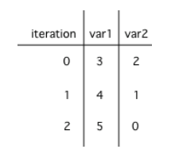

.. include:: ../common.rst

.. qnum::
   :prefix: 4-5-
   :start: 1

|Time45|

Loop Analysis
==============

.. index::
    pair: loop; analysis
    pair: loop; tracing
    pair: tracing; loop
    pair: loop; counting iterations

In this lesson, you will practice tracing through code with loops and analyzing loops to determine how many times they run.

Tracing Loops
----------------------------

.. |Java visualizer| raw:: html

   <a href="https://goo.gl/qEHnpg" target="_blank"  style="text-decoration:underline">Java visualizer</a>

Let's practice tracing through loops with many variables. Remember to make a tracing table to keep track of all the variables, the iterations, and the output.

|CodingEx| **Coding Exercise**

Here is a complex loop.  See if you can trace the code on paper by making a tracing table to predict what the code will do when you run it. Click on the this |Java visualizer| link or the Code Lens button to help you step through the code.

.. activecode:: example_trace_loop
   :language: java
   :autograde: unittest

   Can you trace through this code? Add in output statements ``System.out.println("var1: " + var1 + " var2: " + var2);`` before the loop and inside the loop at the end to keep track of the variables and run. Click on the Code Lens button to visualize the code step by step.
   ~~~~
   public class Trace
   {
       public static void main(String[] args)
       {
           int var1 = 3;
           int var2 = 2;

           while ((var2 != 0) && ((var1 / var2) >= 0))
           {
               var1 = var1 + 1;
               var2 = var2 - 1;
           }
       }
   }

   ====
   import static org.junit.Assert.*;

   import org.junit.*;

   import java.io.*;

   public class RunestoneTests extends CodeTestHelper
   {
       @Test
       public void testMain() throws IOException
       {
           String output = getMethodOutput("main");
           String expect = "var1: 3 var2: 2\nvar1: 4 var2: 1\nvar1: 5 var2: 0\n";
           boolean passed = getResults(expect, output, "Expected output from main", true);
           assertTrue(passed);
       }
   }

Did your trace table look like the following?

    Figure 1: A table showing the values of all of the variables each time through the loop.  The 0 means before the first loop.

|Exercise| **Check your understanding**

.. mchoice:: qlb_2_2
   :practice: T
   :answer_a: var1 = 1, var2 = 1
   :answer_b: var1 = 2, var2 = 0
   :answer_c: var1 = 3, var2 = -1
   :answer_d: var1 = 0, var2 = 2
   :answer_e: The loop will cause a run-time error with a division by zero
   :correct: b
   :feedback_a: The loop stops one of two ways, when var2 = 0 or when var1 / var2 = 0 - neither is true in this case
   :feedback_b: The loop stopped because var2 = 0.  After the first execution of the loop var1 = 1 and var2 = 1.  After the second execution of the loop var1 = 2 and var2 = 0.  This stops the loop and doesn't execute the second part of the complex conditional.
   :feedback_c: The loop stops one of two ways, when var2 = 0 or when var1 / var2 = 0 - neither is true in this case
   :feedback_d: The loop stops one of two ways, when var2 = 0 or when var1 / var2 = 0 - neither is true in this case
   :feedback_e: Even though var1 = 2 and var2 = 0 when the conditional is executed the first condition is true so the rest of the complex conditional won't execute.

   What are the values of var1 and var2 when the code finishes executing?

   .. code-block:: java

     int var1 = 0;
     int var2 = 2;

     while ((var2 != 0) && ((var1 / var2) >= 0))
     {
        var1 = var1 + 1;
        var2 = var2 -1;
     }

.. mchoice:: qlb_2_3
   :practice: T
   :answer_a: x = 5, y = 2
   :answer_b: x = 2, y = 5
   :answer_c: x = 5, y = 2
   :answer_d: x = 3, y = 4
   :answer_e: x = 4, y = 3
   :correct: e
   :feedback_a: This would be true if the and (&&) was an or (||) instead.  But in a complex conditional joined with and (&&) both conditions must be true for the condition to be true.
   :feedback_b: This would be true if the loop never executed, but both conditions are true so the loop will execute.
   :feedback_c: This would be true if the values were swapped, but they are not.
   :feedback_d: This would be true the loop only executed one time, but it will execute twice.
   :feedback_e: The first time the loop changes to x = 3, y = 4, the second time x = 4, y = 3 then the loop will stop since x is not less than y anymore.

   What are the values of x and y when the code finishes executing?

   .. code-block:: java

     int x = 2;
     int y = 5;

     while (y > 2 && x < y)
     {
        x = x + 1;
        y = y - 1;
     }

Counting Loop Iterations
------------------------

Loops can be also analyzed to determine how many times they run.  This is called **run-time analysis** or a **statement execution count**.

|CodingEx| **Coding Exercise**

.. activecode::  countstars1
   :language: java
   :autograde: unittest

   How many stars are printed out in this loop? How many times does the loop run? Figure it out on paper before you run the code.
   ~~~~
   public class CountLoop
   {

       public static void main(String[] args)
       {
           for (int i = 3; i < 7; i++)
           {
               System.out.print("*");
           }
       }
   }

   ====
   import static org.junit.Assert.*;

   import org.junit.*;

   import java.io.*;

   public class RunestoneTests extends CodeTestHelper
   {
       @Test
       public void testMain() throws IOException
       {
           String output = getMethodOutput("main");
           String expect = "****\n";
           boolean passed = getResults(expect, output, "Expected output from main");
           assertTrue(passed);
       }
   }

If you made a trace table, you would know that the loop runs when i = 3, 4, 5, 6 but finishes as soon as i becomes 7 since that is not less than 7. So, the loop runs 4 times. Or you can use the shortcut formula in the note below.

.. note::

   The number of times a loop executes can be calculated by *(largestValue - smallestValue + 1)*.

   - If the loop uses counter <= limit, limit is the largest value.
   - If the loop uses counter < limit, limit-1 is the largest value that allows the loop to run.

In the code above the largest value that allows the loop to run is 6 (which is the largest value < 7) and the smallest value that allows the loop to execute is 3 so this loop executes (6 - 3 + 1 = 4 times).

|CodingEx| **Coding Exercise**

.. activecode::  countstars
   :language: java
   :autograde: unittest

   How many stars are printed out by the following loops? How many times do the loops run? Calculate on paper before you run the code.
   ~~~~
   public class NestedLoops
   {

       public static void main(String[] args)
       {
           for (int row = 0; row < 5; row++)
           {
               for (int col = 0; col < 10; col++)
               {
                   System.out.print("*");
               }
               System.out.println();
           }
       }
   }

   ====
   import static org.junit.Assert.*;

   import org.junit.*;

   import java.io.*;

   public class RunestoneTests extends CodeTestHelper
   {
       @Test
       public void testMain() throws IOException
       {
           String output = getMethodOutput("main");
           String expect = "**********\n**********\n**********\n**********\n**********\n";
           boolean passed = getResults(expect, output, "Expected output from main");
           assertTrue(passed);
       }
   }

.. note::

   The number of times a nested for loop body is executed is the number of times the outer loop runs multiplied by the number of times the inner loop runs (outer loop runs * inner loop runs).

For the example above, the outer loop executes 4 - 0 + 1 = 5 times and the inner 9 - 0 + 1 = 10 times so the total is 5 * 10 = 50.

|Groupwork| Programming Challenge : POGIL Analyzing Loops
----------------------------------------------------------

.. |pogil| raw:: html

   <a href="https://pogil.org/about-pogil/what-is-pogil" target="_blank">POGIL</a>

.. |pogil role| raw:: html

   <a href="https://docs.google.com/document/d/1_NfNLWJxaG4qZ2Jd2x8UctDS05twn1h6p-o3XaAcRv0/edit?usp=sharing" target="_blank">POGIL role</a>

We encourage you to do this activity as a |POGIL| (Process Oriented Guided Inquiry Learning) group activity. POGIL groups are self-managed teams of up to 4 students where everyone has a |pogil role| and works together to solve the problems, making sure that everyone in the team participates and learns.

Do the following exercises in your group. Make sure you draw the trace tables keeping track of all the variables in the loops. Use the formulas to determine how many times the loops run. If your group finishes early, do some of the multiple-choice problems in the 4.6 Practice and Summary section of this unit.

.. mchoice:: qln_6_1
   :practice: T
   :answer_a: 40
   :answer_b: 20
   :answer_c: 24
   :answer_d: 30
   :correct: b
   :feedback_a: This would be true if the outer loop executed 8 times and the inner 5 times, but what is the initial value of <code>i</code>?
   :feedback_b: The outer loop executes 7-3+1=5 times and the inner 4-1+1=4 so this will print 5 * 4 = 20 stars.
   :feedback_c: This would be true if the outer loop executed 6 times such as if it was <code>i <= 8</code>.
   :feedback_d: This would be true if the inner loop executed 5 times such as if it was <code>y <= 5</code>.

   How many times does the following code print a ``*``?

   .. code-block:: java

      for (int i = 3; i < 8; i++)
      {
          for (int y = 1; y < 5; y++)
          {
              System.out.print("*");
          }
          System.out.println();
      }

.. mchoice:: qln_6_2
   :practice: T
   :answer_a: A rectangle of 8 rows with 5 stars per row.
   :answer_b: A rectangle of 8 rows with 4 stars per row.
   :answer_c: A rectangle of 6 rows with 5 stars per row.
   :answer_d: A rectangle of 6 rows with 4 stars per row.
   :correct: c
   :feedback_a: This would be true if i was initialized to 0.
   :feedback_b: This would be true if i was initialized to 0 and the inner loop continued while <code>y < 5</code>.
   :feedback_c: The outer loop executes 8-2+1=6 times so there are 6 rows and the inner loop executes 5-1+1=5 times so there are 5 columns.
   :feedback_d: This would be true if the inner loop continued while <code>y < 5</code>.

   What does the following code print?

   .. code-block:: java

     for (int i = 2; i < 8; i++)
     {
         for (int y = 1; y <= 5; y++)
         {
             System.out.print("*");
         }
         System.out.println();
     }

.. mchoice:: qln_6_3
   :practice: T
   :answer_a: A rectangle of 9 rows and 5 stars per row.
   :answer_b: A rectangle of 6 rows and 6 stars per row.
   :answer_c: A rectangle of 7 rows and 5 stars per row.
   :answer_d: A rectangle of 7 rows and 6 stars per row.
   :correct: d
   :feedback_a: Did you notice what i was initialized to?
   :feedback_b: It would print 6 rows if it was <code>i < 9</code>.
   :feedback_c: It would print 5 stars per row if it was <code>j > 1</code>.
   :feedback_d: The outer loop executes 9 - 3 + 1 = 7 times and the inner 6 - 1 + 1 = 6 times.

   What does the following print?

   .. code-block:: java

     for (int i = 3; i <= 9; i++)
     {
        for (int j = 6; j > 0; j--)
        {
            System.out.print("*");
        }
        System.out.println();
     }

.. mchoice:: qln4
   :practice: T
   :answer_a: 15
   :answer_b: 12
   :answer_c: 10
   :answer_d: 8
   :correct: a
   :feedback_a: The outer loop executes 4-0+1=5 times and the inner loop 2-0+1=3, so hi is printed 5*3 = 15 times
   :feedback_b: The outer loop runs 5 times for i = 0, 1, 2, 3, 4.
   :feedback_c: The inner loop runs 3 times for j = 0, 1, 2.
   :feedback_d: The outer loop runs 5 times for i = 0, 1, 2, 3, 4.

   Consider the following code segment. How many times is the string "Hi!" printed as a result of executing the code segment?

   .. code-block:: java

       int i = 0;
       while (i <= 4)
       {
         for (int j = 0; j < 3; j++)
         {
           System.out.println("Hi!");
         }
         i++;
       }

Summary
-------

- A trace table can be used to keep track of the variables and their values throughout each iteration of the loop.

- We can determine the number of times a code segment will execute with a **statement execution count**. This is called **run-time analysis**.

- The number of times a loop executes can be calculated by ``largestValue - smallestValue + 1`` where these are the largest and smallest values of the loop counter variable possible in the body of the loop.

- The number of times a nested for-loop runs is the number of times the outer loop runs **times** the number of times the inner loop runs.

Loop Analysis Game
-------------------------

.. |game| raw:: html

   <a href="https://csa-games.netlify.app/" target="_blank">game</a>

Try the game below to practice loop analysis. Click on **Loops** and click on the number of times the loop runs. For an added challenge, try the check boxes for Backwards, Do While, and Nested. We encourage you to work in pairs and see how high a score you can get.

.. raw:: html

    <iframe height="700px" width="100%" style="margin-left:10%;max-width:80%" src="https://csa-games.netlify.app/"></iframe>
    
