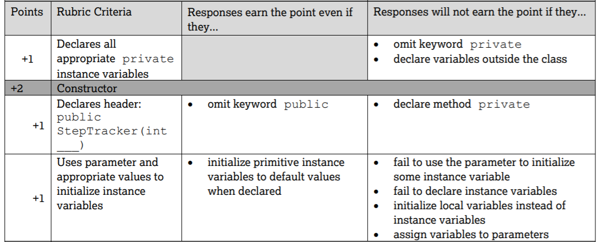
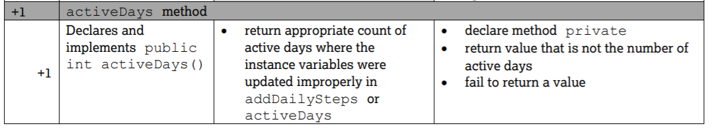
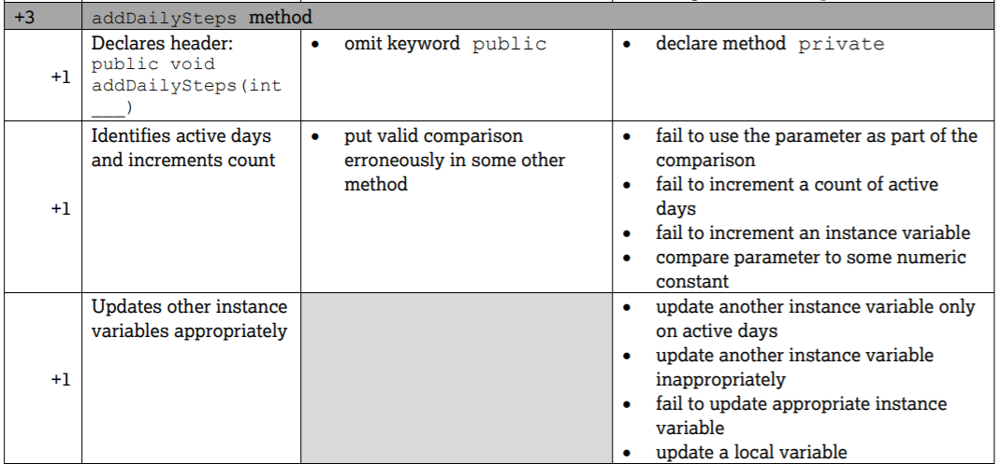
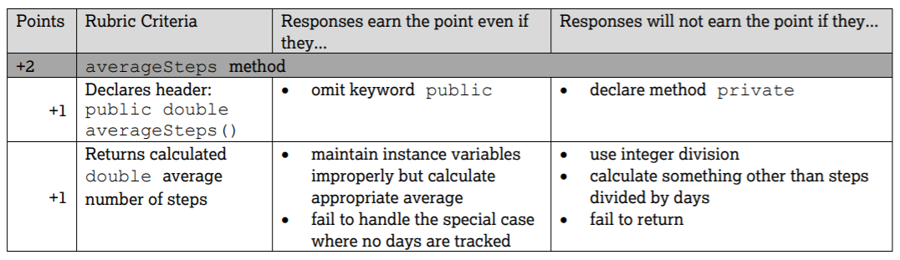

.. include:: ../common.rst

.. qnum::
   :prefix: 5-16-
   :start: 1

Free Response Question (FRQ) for Classes
-----------------------------------------------------

.. index::
    single: class
    single: free response

As of 2019, the AP exam's second free response question (FRQ) is on classes, where students design and implement a described class.  This question involves creating a class with private instance variables and public methods. The College Board will provide a description of the class and the methods. This question does not involve more complex topics such as arrays.

To succeed on the FRQ Question 2 on Classes, you must know how to:

- Create a class using ``public class Classname { }``

- Write a constructor with the same name as the class and no return type. This constructor will probably have a parameter that is assigned to an instance variable  and will need to assign default values to the other instance variables.

- Write public methods in the class that use the instance variables as well as parameters and return values. These methods will probably use if statements but not more complex coding. One of these methods will probably be an **accessor method** that returns an instance variable or a calculated value that is dependent on the instance variables, and one will probably be a **mutator method** that changes the value of an instance variable.

2019 StepTracker Class FRQ
==========================

The 2019 FRQ 2 for the class StepTracker is a good example of what to expect. It is available as question 2 on page 7 of https://apstudents.collegeboard.org/sites/default/files/2019-05/ap19-frq-computer-science-a.pdf , reproduced below.

Question 2.

This question involves the implementation of a fitness tracking system that is represented by the **StepTracker** class. A StepTracker object is created with a parameter that defines the minimum number of steps that must be taken for a day to be considered active. The StepTracker class provides a constructor and the following methods.

- **addDailySteps**, which accumulates information about steps, in readings taken once per day

- **activeDays**, which returns the number of active days

- **averageSteps**, which returns the average number of steps per day, calculated by dividing the total number of steps taken by the number of days tracked

The following table contains a sample code execution sequence and the corresponding results.

.. raw:: html

    
    <table border width="100%"><tr><th>Statements and Expressions</th><th width="15%">Value Returned (blank if no value)</th><th>Comment</th> </tr>
    <tr><td>StepTracker tr = new StepTracker(10000); </td>
    <td></td><td>Days with at least 10,000 steps are considered active. Assume that the parameter is positive.</td></tr>
    <tr><td>tr.activeDays(); </td>
    <td>0</td><td>No data have been recorded yet.</td></tr>
    <tr><td>tr.averageSteps(); </td>
    <td>0.0</td><td>When no step data have been recorded, the averageSteps method returns 0.0.</td></tr>
    <tr><td>tr.addDailySteps(9000);</td>
    <td></td><td>This is too few steps for the day to be considered active.</td></tr>
    <tr><td>tr.addDailySteps(5000);</td>
    <td></td><td>This is too few steps for the day to be considered active.</td></tr>
    <tr><td>tr.activeDays(); </td>
    <td>0</td><td>No day had at least 10,000 steps.
    </td></tr>
    <tr><td>tr.averageSteps(); </td>
    <td>7000.0</td><td>The average number of steps per day is (14000 / 2).</td></tr>
    <tr><td>tr.addDailySteps(13000); </td>
    <td></td><td>This represents an active day.</td></tr>
    <tr><td>tr.activeDays();  </td>
    <td>1</td><td>Of the three days for which step data were entered, one day had at least 10,000 steps.</td></tr>
    <tr><td>tr.averageSteps(); </td>
    <td>9000.0</td><td>The average number of steps per day is (27000 / 3).</td></tr>
    <tr><td>tr.addDailySteps(23000); </td>
    <td></td><td>This represents an active day.</td></tr>
    <tr><td>tr.addDailySteps(1111); </td>
    <td></td><td>This is too few steps for the day to be considered active.</td></tr>
    <tr><td>tr.activeDays(); </td>
    <td>2</td><td>Of the five days for which step data were entered, two days had at least 10,000 steps.</td></tr>
    <tr><td>tr.averageSteps(); </td>
    <td>10222.2</td><td>The average number of steps per day is (51111 / 5). </td></tr>
    </table>

This question asks you to write the complete StepTracker class, including the constructor and any required instance variables and
methods. Your implementation must meet all specifications and conform to the example.

|Groupwork| Determining the Instance Variables
==============================================

Work in pairs or groups to read through the problem statement and determine the instance variables required for this class. During the exam, it helps to circle the words that are important and may describe the instance variables. Different groups may come up with different variables that will still work. Groups should report back and compare answers in class to determine the best variables before writing the class.

It may help to first identify the variables that are needed for the constructor and the accessor and mutator methods.

.. clickablearea:: steptracker_instance_variables
         :question: Select the phrases below which probably mention an instance variable. Note that some of these may be referring to the same variable or to local variables.
         :feedback: Think about phrases that indicate a value that is being stored or changed or returned.
         :iscode:

         This question involves the implementation of :click-incorrect:a fitness tracking system:endclick: 
         that is represented by the :click-incorrect:**StepTracker** class.:endclick:

         :click-incorrect:A StepTracker object:endclick: is created with a parameter that defines
         :click-correct:the minimum number of steps that must be taken for a day to be active.:endclick:

         :click-incorrect:The StepTracker class:endclick: provides a constructor and the following methods.

              - addDailySteps, which accumulates :click-correct:information about steps:endclick: in readings 
                taken once per day.

              - activeDays, which returns :click-correct:the number of active days.:endclick:

              - averageSteps, which returns :click-correct:the average number of steps per day:endclick:
                calculated by dividing :click-correct:the total number of steps taken:endclick: 
                by :click-correct:the number of days tracked.:endclick:

Click to reveal multiple choice questions that will help you to determine the instance variables through the constructor parameters and accessor and mutator methods.

.. reveal:: steptraker_ctor_r1
   :showtitle: Reveal Problem
   :hidetitle: Hide Problem
   :optional:

   .. mchoice:: steptracker-constructor
        :answer_a: the minimum number of steps that must be taken for a day to be considered active
        :answer_b: the number of active days
        :answer_c: the average number of steps per day
        :answer_d: the total number of steps taken
        :answer_e: number of days tracked
        :correct: a
        :feedback_a: Yes, the problem definition describes this as a parameter to create a StepTracker object.
        :feedback_b: This is not described as a parameter to create an StepTracker object.
        :feedback_c: This is not described as a parameter to create an StepTracker object.
        :feedback_d: This is not described as a parameter to create an StepTracker object.
        :feedback_e: This is not described as a parameter to create an StepTracker object.

        Given the StepTracker class description above, which of these statements describes an instance variable that the StepTracker constructor should set using a parameter?

.. reveal:: accessor_r1
   :showtitle: Reveal Problem
   :hidetitle: Hide Problem
   :optional:

   .. mchoice:: steptracker-accessor
        :answer_a: StepTracker tr = new StepTracker(1000)
        :answer_b: tr.addDailysteps(1000);
        :answer_c: tr.activeDays();
        :correct: c
        :feedback_a: This is a call to the constructor.
        :feedback_b: No, addDailySteps(1000) probably adds the given steps to an instance variable as a mutator method.
        :feedback_c: Yes, activeDays() is an accessor method that returns the number of active days (a great instance variable!).

        Which of the following methods is an accessor method that returns the value of an instance variable?

.. reveal:: mutator_r1
   :showtitle: Reveal Problem
   :hidetitle: Hide Problem
   :optional:

   .. mchoice:: steptracker-mutator
        :answer_a: StepTracker tr = new StepTracker(1000)
        :answer_b: tr.addDailysteps(1000);
        :answer_c: tr.activeDays();
        :answer_d: tr.averageSteps();
        :correct: b
        :feedback_a: No, this is a call to the constructor.
        :feedback_b: Yes, addDailySteps(1000) is a mutator method that adds the steps given as a parameter to an instance variable that keeps track of the steps taken so far.
        :feedback_c: No, activeDays() is an accessor method that returns the number of active days.
        :feedback_d: No, averageSteps() is a complex accessor method that calculates and returns the average number of steps from the instance variable.

        Which of the following methods is a mutator method that changes the value of an instance variable?

.. shortanswer:: steptracker-variables

      What are the instance variables (at least 4!) that you need for the StepTracker class? What are the data types for each instance variable?

Writing the Class Header and Constructor
========================================

You will receive at least 1 point if you write the class header and a constructor that has the same name as the class and no return type. You will receive another point for creating **private** instance variables inside the class. Complete the class definition below with the class name, the instance variables you determined above, and the constructor. Remember that for this problem, a StepTracker object is created (with a constructor) with a parameter that defines the minimum number of steps that must be taken for a day to be considered active. The constructor will often have a parameter which it should assign to an instance variable. It should also assign default values to the other instance variables.

.. activecode:: stepTrackerCode1
   :language: java
   :autograde: unittest

   Write the first draft of the class StepTracker below with the class name, the instance variables, and the constructor with a parameter for the minimum number of steps threshold for active days. Make sure it compiles.
   ~~~~
                       // Write public class your classname here and delete comment
   {
      // write instance variable declarations here

      // write the constructor with a parameter here

      public static void main(String[] args)
      {
         StepTracker tr = new StepTracker(10000);
      }
   }
   ====
   import static org.junit.Assert.*;

   import org.junit.*;

   import java.io.*;

   // Tests for ActiveCode StepTrackerCode1
   public class RunestoneTests extends CodeTestHelper
   {
       @Test
       public void test1()
       {
           // check class name
           boolean passed = checkCodeContains("correct class heading", "public class StepTracker");
           assertTrue(passed);
       }

       @Test
       public void test2()
       {
           // constructor with 1 parameter for threshold minSteps
           String args = "int";
           String results = checkConstructor(args);

           boolean passed = getResults("pass", results, "Checking constructor with one int argument");
           assertTrue(passed);
       }

       @Test
       public void test3()
       {
           // check int - declaration of instance variables and parameter in constructor
           String actual = testPrivateInstanceVariables();
           String expected = "4 Private";

           boolean passed = getResults(expected, actual, "Checking declaration of instance variables");
           assertTrue(passed);
       }
   }

Here is the rubric for the instance variables and the constructor for this problem. Did you receive all 3 points? In class, your teacher may have you grade each others' code.

    Figure 1: Rubric for instance variables and constructor

Writing the Accessor Method activeDays
========================================

Each method in the FRQ is worth 1 - 3 points. The method header is usually worth 1 point and the code in the method body is usually worth another point or two depending on how complex it is.

This problem asks you to write a simple accessor method called **activeDays** which returns the number of active days (which should be an instance variable) for 1 point.

Remember that accessor methods usually look like the following:

.. code-block:: java

   class ExampleClass
   {
       // Instance variable declaration
       private typeOfVar varName;

       // Accessor method template
       public typeOfVar getVarName()
       {
           return varName;
       }
   }

Click to reveal a multiple choice problem to help you determine the accessor method header.

.. reveal:: steptracker_accessor_r1
   :showtitle: Reveal Problem
   :hidetitle: Hide Problem
   :optional:

   .. mchoice:: steptracker-accessor-header
        :answer_a: public void activeDays()
        :answer_b: private void activeDays()
        :answer_c: public int activeDays(int numSteps)
        :answer_d: public void activeDays(int numSteps)
        :answer_e: public int activeDays()
        :correct: e
        :feedback_a: Accessor methods need a return type since they return the value of an instance variable or a value calculated from instance variables.
        :feedback_b: Accessor methods should not be private.
        :feedback_c: Accessor methods do not usually take parameters.
        :feedback_d: Accessor methods need a return type since they return the value of an instance variable or a value calculated from instance variables, and  they do not usually have a parameter.
        :feedback_e: Correct, accessor methods are public, have a return type, and no parameter.

        Which of the following is a good method header for the accessor method activeDays()?

.. activecode:: stepTrackerCode2
   :language: java
   :autograde: unittest

   Copy the code from your first draft of the class StepTracker above  with the instance variables and constructor. Write the accessor methods **activeDays** which returns the number of active days.
   ~~~~
   public class StepTracker
   {
       // copy the instance variable declarations here

       // copy the constructor with a parameter here

       // Write the accessor method activeDays() here
       // @return activeDays

       public static void main(String[] args)
       {
           StepTracker tr = new StepTracker(10000);
           System.out.println(
                   tr.activeDays()); // returns 0. No data have been recorded yet.
       }
   }

   ====
   import static org.junit.Assert.*;

   import org.junit.*;

   import java.io.*;

   public class RunestoneTests extends CodeTestHelper
   {
       @Test
       public void testMain() throws IOException
       {
           String output = getMethodOutput("main");
           String expect = "0\n";
           boolean passed = getResults(expect, output, "Expected output from main");
           assertTrue(passed);
       }

       @Test
       public void checkCodeContains1()
       {
           // check accessor method activeDays()
           boolean passed = checkCodeContains("activeDays() method", "public int activeDays()");
           assertTrue(passed);
       }

       @Test
       public void checkCodeContains2()
       {
           // check that activeDays() returns a value
           boolean passed = checkCodeContains("return");
           assertTrue(passed);
       }
   }

Here is the rubric for the accessor method ``activeDays`` for this problem. The second column is small mistakes that will still earn the point but the third column is larger mistakes that will not earn the point. Did you receive the point for this method? In class, your teacher may have you grade each others' code.

    Figure 2: Rubric for accessor method activeDays()

Writing the Mutator Method addDailySteps
========================================

This problem asks you to write a more complex mutator method called addDailySteps worth 3 points.

Remember that mutator methods often look like the following:

.. code-block:: java

     class Example
     {
         // Instance variable declaration
         private typeOfVar varName;

         // Mutator method template
         public void changeVarName(typeOfVar newValue)
         {
             // an instance variable is changed through = or an operator like +=, -=,
             // ++, etc.
             varName = newValue;
         }
     }

Click to reveal a multiple choice problem to help you determine the mutator method header.

.. reveal:: steptracker_mutator_r1
   :showtitle: Reveal Problem
   :hidetitle: Hide Problem
   :optional:

   .. mchoice:: steptracker-mutator-header
        :answer_a: public void addDailySteps()
        :answer_b: private void addDailySteps()
        :answer_c: public int addDailySteps(int numSteps)
        :answer_d: public void addDailySteps(int numSteps)
        :answer_e: private int addDailySteps()
        :correct: d
        :feedback_a: Mutator methods take a parameter to change the value of an instance variable.
        :feedback_b: Mutator methods should not be private.
        :feedback_c: Mutator methods do not usually return a value.
        :feedback_d: Correct, mutator methods are public with a void return type and take a parameter to change the value of an instance variable.
        :feedback_e: Mutator methods should not be private and should take a parameter to change the value of an instance variable.

        Which of the following is a good method header for the mutator method addDailySteps?

The code for this mutator method is a little more complex than the template above, because it needs to change more than 1 instance variable. Notice the comments in the sample code execution:

.. raw:: html

    
    <table border width="100%"><tr><th>Statements and Expressions</th><th width="15%">Value Returned (blank if no value)</th><th>Comment</th> </tr>
    <tr><td>tr.addDailySteps(5000);</td>
    <td></td><td>This is too few steps for the day to be considered active.</td></tr>
    <tr><td>tr.activeDays(); </td>
    <td>0</td><td>No day had at least 10,000 steps.
    </td></tr>
    <tr><td>tr.addDailySteps(13000); </td>
    <td></td><td>This represents an active day.</td></tr>
    <tr><td>tr.activeDays();  </td>
    <td>1</td><td>Of the three days for which step data were entered, one day had at least 10,000 steps.</td></tr>
    </table>

Consider each of your instance variables and whether this method should change them. The problem which you can reveal below may help you.

.. reveal:: steptracker_mutator_r2
   :showtitle: Reveal Problem
   :hidetitle: Hide Problem
   :optional:

   .. mchoice:: steptracker-mutator-changes
        :answer_a: the minimum number of steps that must be taken for a day to be considered active
        :answer_b: the number of active days
        :answer_c: the average number of steps per day
        :answer_d: the total number of steps taken
        :answer_e: number of days tracked
        :correct: b, d, e
        :feedback_a: The minimum is set by the constructor.
        :feedback_b: Yes, addDailySteps should determine whether the number of steps given in its parameter is an active day and if so, change this variable.
        :feedback_c: This method does not have to calculate the average.
        :feedback_d: Yes, addDailySteps should add the number of steps taken that day in its parameter to the total.
        :feedback_e: Yes, addDailySteps is called each day and can change the variable for the number of days being tracked.

        Which of the following values does the mutator method addDailySteps need to change? (check all that apply)

.. activecode:: stepTrackerCode3
   :language: java
   :autograde: unittest

   Copy the code from your draft of the class StepTracker above  with the class name, the instance variables, constructor, and accessory method. Write the mutator method **addDailySteps** which takes a parameter and adds it to the appropriate instance variable and changes other instance variables appropriately.
   ~~~~
   public class StepTracker
   {
       // copy the instance variable declarations here

       // copy the constructor with a parameter here

       // copy the accessor method activeDays() here.

       // Write the mutator method addDailySteps here.
       // @param number of steps taken that day

       public static void main(String[] args)
       {
           StepTracker tr = new StepTracker(10000);

           // returns 0. No data have been recorded yet.
           System.out.println(tr.activeDays());

           // This is too few steps for the day to be considered active.
           tr.addDailySteps(9000);

           // This is too few steps for the day to be considered active.
           tr.addDailySteps(5000);

           // returns 0.  No day had at least 10,000 steps.
           System.out.println(tr.activeDays());

           // This represents an active day.
           tr.addDailySteps(13000);

           // returns 1. Of the three days for which step data were entered, one day
           // had at least 10,000 steps.
           System.out.println(tr.activeDays());
       }
   }

   ====
   import static org.junit.Assert.*;

   import org.junit.*;

   import java.io.*;

   public class RunestoneTests extends CodeTestHelper
   {
       @Test
       public void testMain() throws IOException
       {
           String output = getMethodOutput("main");
           String expect = "0\n0\n1\n";
           boolean passed = getResults(expect, output, "Expected output from main");
           assertTrue(passed);
       }

       @Test
       public void checkCodeContains1()
       {
           // check mutator method addDailySteps()
           boolean passed =
                   checkCodeContains(
                           "addDailySteps method with parameter", "public void addDailySteps(int");
           assertTrue(passed);
       }

       @Test
       public void checkCodeContains2()
       {
           // check mutator method addDailySteps() contains "if"
           boolean passed = checkCodeContains("if statement", "if (");
           assertTrue(passed);
       }
   }

Here is the rubric for the mutator method for this problem. The second column is small mistakes that will still earn the point but the third column is larger mistakes that will not earn the point. Did you receive all the points? In class, your teacher may have you grade each others' code.

    Figure 3: Rubric for mutator method

Writing the Accessor Method averageSteps
==========================================

This problem asks you to write a more complex accessor method which uses the instance variables to calculate and return the **averageSteps** for 2 points. This method returns the average number of steps per day, calculated by dividing the total number of steps taken by the number of days tracked.

Click to reveal a multiple choice problem to help you determine the accessor method header.

.. reveal:: steptracker_accessor_r2
   :showtitle: Reveal Problem
   :hidetitle: Hide Problem
   :optional:

   .. mchoice:: steptracker-accessor-header2
        :answer_a: public void averageSteps()
        :answer_b: public int averageSteps()
        :answer_c: public double averageSteps()
        :answer_d: public void averageSteps(int numSteps)
        :answer_e: public int averageSteps(int numSteps)
        :correct: c
        :feedback_a: Accessor methods need a return type since they return the value of an instance variable or a value calculated from instance variables.
        :feedback_b: When you compute an average using division, you usually end up with a double value, not int.
        :feedback_c: Correct, accessor methods are public, have a return type, and no parameter. In this case, returning an average requires a double return type.
        :feedback_d: Accessor methods need a return type since they return the value of an instance variable or a value calculated from instance variables, and  they do not usually have a parameter.
        :feedback_e: Accessor methods do not usually take parameters.

        Which of the following is a good method header for the accessor method averageSteps() which returns the average number of steps per day?

The complex accessor method **averageSteps()** must calculate the average number of steps from your instance variables. Notice that the first time it is called in the sample code execution, it returns 0.0 since there are no steps recorded. This avoids a divide by 0 error.

.. raw:: html

    
    <table border width="100%"><tr><th>Statements and Expressions</th><th width="15%">Value Returned (blank if no value)</th><th>Comment</th> </tr>
    <tr><td>tr.averageSteps(); </td>
    <td>0.0</td><td>When no step data have been recorded, the averageSteps method returns 0.0.</td></tr>
    </table>

.. activecode:: stepTrackerCode4
   :language: java
   :autograde: unittest

   Copy the code from your draft of the class StepTracker above  with the instance variables, constructor, accessor and mutator methods. Write the accessor method **averageSteps** which returns the average number of steps per day, calculated by dividing the total number of steps taken by the number of days tracked.
   ~~~~
   public class StepTracker
   {
       // copy the instance variable declarations here

       // copy the constructor with a parameter here

       // copy the accessor method activeDays() here.

       // Write the mutator method addDailySteps here.
       // @param number of steps taken that day

       public static void main(String[] args)
       {
           StepTracker tr = new StepTracker(10000);
           // returns 0. No data has been recorded yet.
           System.out.println(tr.activeDays());
           // returns 0.0. When no step data have been recorded, 
           //  the averageSteps method returns 0.0
           System.out.println(tr.averageSteps());

           // This is too few steps for the day to be considered active.
           tr.addDailySteps(9000);

           // This is too few steps for the day to be considered active.
           tr.addDailySteps(5000);

           // returns 0.  No day had at least 10,000 steps.
           System.out.println(tr.activeDays());
           // returns 7000.0 The average number of steps per day is (14000/2).
           System.out.println(tr.averageSteps());

           // This represents an active day.
           tr.addDailySteps(13000);
           // returns 1. Of the three days for which step data were entered, 
           // one day had at least 10,000 steps.
           System.out.println(tr.activeDays());
           // returns 9000.0. The average number of steps per day is (27000/3).
           System.out.println(tr.averageSteps());

           tr.addDailySteps(23000); // This represents an active day.
           tr.addDailySteps(1111); // This is too few steps for the day to be active.
           // returns 2. Of the five days for which step data were entered, 
           //    two days had at least 10,000 steps.
           System.out.println(tr.activeDays()); 
           // returns 10222.2. The average number of steps per day is (51111/5).
           System.out.println(tr.averageSteps());
       }
   }

   ====
   import static org.junit.Assert.*;

   import org.junit.*;

   import java.io.*;

   public class RunestoneTests extends CodeTestHelper
   {
       @Test
       public void testMain() throws IOException
       {
           String output = getMethodOutput("main");
           String expect = "0\n0.0\n0\n7000.0\n1\n9000.0\n2\n10222.2\n";
           boolean passed =
                   getResults(
                           expect,
                           output,
                           "Expected output from main. Make sure you used casting to double for the"
                                   + " last result!");
           assertTrue(passed);
       }

       @Test
       public void checkCodeContains1()
       {
           // check mutator method averageSteps()
           boolean passed = checkCodeContains("averageSteps() method", "public double averageSteps()");
           assertTrue(passed);
       }

       @Test
       public void checkCodeZero()
       {
           StepTracker tr = new StepTracker(10000);
           double average = tr.averageSteps();

           boolean passed =
                   getResults(0.0, average, "averageSteps() returns 0.0 when no days recorded");
           assertTrue(passed);
       }

       @Test
       public void checkCodeDoubleResult()
       {
           StepTracker tr = new StepTracker(10000);
           tr.addDailySteps(9000); // This is too few steps for the day to be considered active.
           tr.addDailySteps(5000);
           tr.addDailySteps(13000);
           tr.addDailySteps(23000);
           tr.addDailySteps(1111);
           double average = tr.averageSteps();

           boolean passed =
                   getResults(
                           10222.2, average, "averageSteps() returns 10222.2 (no integer division)");
           assertTrue(passed);
       }
   }

Here is the rubric for the ``averageSteps`` method for this problem.  Did you receive all the points? In class, your teacher may have you grade each others' code.

    Figure 4: Rubric for averageSteps method
