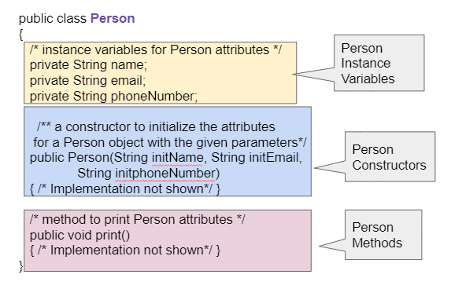

.. qnum::
   :prefix: 5-1-
   :start: 1

.. |CodingEx| image:: ../../_static/codingExercise.png
    :width: 30px
    :align: middle
    :alt: coding exercise

.. |Exercise| image:: ../../_static/exercise.png
    :width: 35
    :align: middle
    :alt: exercise

.. |Groupwork| image:: ../../_static/groupwork.png
    :width: 35
    :align: middle
    :alt: groupwork

Anatomy of a Java Class
=======================

In Unit 2, we learned to use **classes** and **objects** that are built-in to Java or written by other programmers. In this unit, you will learn to write your own classes and objects!

Creating a Class
------------------

Remember that a **class** in programming defines a new **abstract data type**. When you create **objects**, you create new variables or **instances** of that class data type. For example in Unit 2, we created yertle and myrtle, 2 turtle objects created from the class Turtle, and we used the Java String class to create different String variables, also called **object references**.

Watch this short video to review the vocabulary in object-oriented programming:

.. youtube:: LfSaSANJPLg
    :width: 650
    :height: 415
    :align: center

.. .. |video| raw:: html

   <a href="https://www.youtube.com/watch?v=1JJL0YszYik" target="_blank">video</a>

.. Here is a fun |video| demonstrating the difference between the class

You can think of a class as like a blueprint or a cookie cutter or a factory that produces objects. For example, the class House below is a blueprint of a house and the objects which are individual houses built from that blueprint. You can't live on a blueprint although it describes a house! But you can use it to build houses and live in those.

.. .. youtube:: 1JJL0YszYik
    :height: 315
    :width: 560
    :align: left

To write your own class, you typically start a class declaration with ``public`` then ``class`` then the name of the class.  The body of the class is defined inside a ``{`` and a ``}``. For example, the class House below. Then, you can create objects of that new House type by using ``Classname objectname = new Classname();``

.. code-block:: java

    public class House
    {
       // define class here - a blueprint

    }

    House myHouse = new House();
    House neighborsHouse = new House();

Remember that objects have attributes and behaviors. These correspond to **instance variables** and **methods** in the class definition.   Instance variables hold the data for objects where as the methods code the behaviors or the actions the object can do.   A class also has **constructors** which initialize the instance variables when the object is created, for example new House() above.  And a class can also have a **main method** which can be used to test the class.

Let's create a class called Person. What would we want to know about a person?  What we want to know depends on what problem we are trying to solve.  In one situation, perhaps when creating an address book, we might want to know the person's name and phone number and email. Here's a possible Person class with instance variables, constructor, and methods.

    Figure 1: Person class

Run the code below to see how it constructs 2 Person objects and fills in their data. We will explain all parts of this class in the next sections, but notice that execution always starts in the main method. When a method like the print() method is called, we run the code in the print method for that object. After a method is done, the control returns back to the next line of code in the main method. You can also see this in the |Java visualizer| (click on the link and then Forward at the bottom to run the code step by step).

.. |Java visualizer| raw:: html

   <a href="http://www.pythontutor.com/visualize.html#code=public%20class%20Person%20%0A%7B%0A%20%20%20%20%20//%20instance%20variables%20%0A%20%20%20%20%20private%20String%20name%3B%0A%20%20%20%20%20private%20String%20email%3B%0A%20%20%20%20%20private%20String%20phoneNumber%3B%0A%20%20%20%20%20%0A%20%20%20%20%20//%20constructor%3A%20construct%20a%20Person%20copying%20in%20the%20data%20into%20the%20instance%20variables%0A%20%20%20%20%20public%20Person%28String%20initName,%20String%20initEmail,%20String%20initPhone%29%0A%20%20%20%20%20%7B%0A%20%20%20%20%20%20%20%20name%20%3D%20initName%3B%0A%20%20%20%20%20%20%20%20email%20%3D%20initEmail%3B%0A%20%20%20%20%20%20%20%20phoneNumber%20%3D%20initPhone%3B%0A%20%20%20%20%20%7D%0A%20%20%20%20%20%0A%20%20%20%20%20//%20Print%20all%20the%20data%20for%20a%20person%0A%20%20%20%20%20public%20void%20print%28%29%0A%20%20%20%20%20%7B%0A%20%20%20%20%20%20%20System.out.println%28%22Name%3A%20%22%20%2B%20name%29%3B%0A%20%20%20%20%20%20%20System.out.println%28%22Email%3A%20%22%20%2B%20email%29%3B%0A%20%20%20%20%20%20%20System.out.println%28%22Phone%20Number%3A%20%22%20%2B%20phoneNumber%29%3B%0A%20%20%20%20%20%7D%0A%20%20%20%20%20%0A%20%20%20%20%20//%20main%20method%20for%20testing%0A%20%20%20%20%20public%20static%20void%20main%28String%5B%5D%20args%29%0A%20%20%20%20%20%7B%0A%20%20%20%20%20%20%20%20//%20call%20the%20constructor%20to%20create%20a%20new%20person%0A%20%20%20%20%20%20%20%20Person%20p1%20%3D%20new%20Person%28%22Sana%22,%20%22sana%40gmail.com%22,%20%22123-456-7890%22%29%3B%0A%20%20%20%20%20%20%20%20//%20call%20p1%27s%20print%20method%0A%20%20%20%20%20%20%20%20p1.print%28%29%3B%0A%20%20%20%20%20%20%20%20Person%20p2%20%3D%20new%20Person%28%22Jean%22,%20%22jean%40gmail.com%22,%20%22404%20899-9955%22%29%3B%0A%20%20%20%20%20%20%20%20p2.print%28%29%3B%0A%20%20%20%20%20%7D%0A%20%20%7D&cumulative=false&curInstr=34&heapPrimitives=nevernest&mode=display&origin=opt-frontend.js&py=java&rawInputLstJSON=%5B%5D&textReferences=false&curInstr=0" target="_blank"  style="text-decoration:underline">Java visualizer</a>

.. activecode:: PersonClass
  :language: java
  :autograde: unittest

  Run the following class. Try changing the Person p2 object in main to your name.
  ~~~~
  public class Person
  {
     // instance variables
     private String name;
     private String email;
     private String phoneNumber;

     // constructor: construct a Person copying in the data into the instance variables
     public Person(String initName, String initEmail, String initPhone)
     {
        name = initName;
        email = initEmail;
        phoneNumber = initPhone;
     }

     // Print all the data for a person
     public void print()
     {
       System.out.println("Name: " + name);
       System.out.println("Email: " + email);
       System.out.println("Phone Number: " + phoneNumber);
     }

     // main method for testing
     public static void main(String[] args)
     {
        // call the constructor to create a new person
        Person p1 = new Person("Sana", "sana@gmail.com", "123-456-7890");
        // call p1's print method
        p1.print();
        Person p2 = new Person("Jean", "jean@gmail.com", "404 899-9955");
        p2.print();
     }
  }

  ====
  // Test for Lesson 5.1.0 - Person class - should pass if/when they run code
  import static org.junit.Assert.*;
  import org.junit.*;;
  import java.io.*;

  public class RunestoneTests extends CodeTestHelper
  {
        @Test
        public void testMain() throws IOException
        {
           String output = getMethodOutput("main");
            String expect = "Name: Sana\nEmail: sana@gmail.com\nPhone Number: 123-456-7890\nName: Jean\nEmail: jean@gmail.com\nPhone Number: 404 899-9955";

            boolean passed = getResults(expect, output, "Expected output from main", true);
            assertTrue(passed);
        }
  }

Instance Variables
---------------------------

..	index::
   pair: class; instance variables

**Instance Variables** hold the data for an object.  They record what an object needs to know to do work in the program.  Instance variables are also called **attributes**, **fields**, or **properties**.

Instance variables in general and on the AP CS A exam should be declared **private**.  Think of ``private`` as like your diary.  Only you should have direct access to it.  In this case ``private`` means that only the code in this class can directly access the instance  variable values.

.. note::

   Instance variables are declared right after the class declaration.  They usually start with ``private`` then the *type* of the variable and then a *name* for the variable. Private means only the code in this class has access to it.

The ``Person`` class declares 3 private instance variables: name, email, and phoneNumber. These are things that you might want to know about a person.  They are declared at the top of the class and they exist inside the { } of the class. The methods of the class share the instance variables. They can access and use them.

Once we have created a class like Person, we can have many objects declared of the class.  The class is like a blueprint or cookie cutter that defines the variables and methods for that class. Each object will have their own copies of the same instance variables but with possibly different values in them (as seen in the cookie decorations below).

.. figure:: Figures/PersonClassWithCookies.png
    :width: 100%
    :align: center
    :alt: Person data encapsulation
    :figclass: align-center

    Figure 2: Person Class and Objects

**Object-oriented Programming** stresses **data encapsulation** where  the data (instance variables) and the code acting on the data (methods) are wrapped together into a single unit and the implementation details are hidden. The data is protected from harm by being kept private. Anything outside the class can only interact with the public methods and cannot interact directly with the private instance variables (encapsulated in the pink box above).

When designing a class, programmers make decisions about what data to make accessible and/or modifiable from an external class. The private access modifier is used to encapsulate and protect the data from external access. Private instance variables can only be accessed by methods within the class in which they are defined.

|Exercise| **Check Your Understanding**

.. clickablearea:: name_instance_variables
    :question: Click on all the instance  variable declarations in the following class
    :iscode:
    :feedback: Remember, instance  variables are private and are declared after the class declaration.

    :click-incorrect:public class Name {:endclick:

        :click-correct:private String first;:endclick:
        :click-correct:private String last;:endclick:

        :click-incorrect:public Name(String theFirst, String theLast) {:endclick:
            :click-incorrect:first = theFirst;:endclick:
            :click-incorrect:last = theLast;:endclick:
         :click-incorrect:}:endclick:

         :click-incorrect:public void setFirst(String theFirst) {:endclick:
            :click-incorrect:first = theFirst;:endclick:
         :click-incorrect:}:endclick:

         :click-incorrect:public void setLast(String theLast) {:endclick:
            :click-incorrect:last = theLast;:endclick:
         :click-incorrect:}:endclick:

    :click-incorrect:}:endclick:

Methods
-------

..	index::
   pair: class; method

**Methods** define what an object can do or the behavior of the object.   Most methods are ``public`` which means they can be accessed from outside the class. Some methods can be marked as``private`` if they are helper methods that are just used internally by other methods inside the same class. They will not be accessible outside of the class. The private and public keywords determine the external access and visibility of classes, data, constructors, and methods.

.. note::

   Methods define what the object can do.  They typically start with ``public`` then a type, then the name of the method followed by parentheses for optional parameters. Methods defined for an object can access and use its instance variables!

The ``Person`` class above has a constructor called Person() which we will discuss in the next lesson,  a print() method for output, and a main method which runs the whole program. We will also discuss **accessor** (also called getters) and **mutator** (also called setters or modifier) methods in the next lessons which allow get and set access to the instance variables.

Here is an example of the print() method that prints out all the data stored for a person object. Notice that it starts with public and then the return type.
The **void** return type is used to indicate that the method does not return anything. Then it has the method name followed by parentheses for possible parameters. The body of the method is in curly brackets. Notice that the method can access and use the instance variables in the class: name, email, and phoneNumber. The instance variables are shared by all the methods of the class.

.. code-block:: java

     public void print()
     {
       System.out.println("Name: " + name);
       System.out.println("Email: " + email);
       System.out.println("Phone Number: " + phoneNumber);
     }

To call a method to do its job, we create an object of the class and then use the dot (.) operator to call its public methods, for example p1.print() means call p1's print method.

.. code-block:: java

    // call the constructor to create a new person
    Person p1 = new Person("Sana", "sana@gmail.com", "123-456-7890");
    // call p1's print method
    p1.print();

|Exercise| Check Your Understanding

.. clickablearea:: name_methods
    :question: Click on all the lines of code that are part of a method in the following class.
    :iscode:
    :feedback: Methods follow the constructor.  They include a return type in case they returns something from the method.

    :click-incorrect:public class Name {:endclick:

        :click-incorrect:private String first;:endclick:
        :click-incorrect:private String last;:endclick:

        :click-incorrect:public Name(String theFirst, String theLast) {:endclick:
            :click-incorrect:first = theFirst;:endclick:
            :click-incorrect:last = theLast;:endclick:
         :click-incorrect:}:endclick:

         :click-correct:public void setFirst(String theFirst) {:endclick:
            :click-correct:first = theFirst;:endclick:
         :click-correct:}:endclick:

         :click-correct:public void setLast(String theLast) {:endclick:
            :click-correct:last = theLast;:endclick:
         :click-correct:}:endclick:

    :click-incorrect:}:endclick:

Object-Oriented Design
----------------------

.. |tutorial on class diagrams| raw:: html

   <a href="https://medium.com/@smagid_allThings/uml-class-diagrams-tutorial-step-by-step-520fd83b300b" target="_blank">tutorial on class diagrams</a>

.. |Creately.com| raw:: html

   <a href="https://creately.com" target="_blank">Creately.com</a>

.. |app diagrams| raw:: html

   <a href="https://app.diagrams.net/" target="_blank">app.diagrams.net</a>

In **Object-Oriented Design** (OOD), programmers first decide which classes are needed to solve a problem and then figure out the data and methods in each class. For example, here is the class diagram for the Turtle class that we have seen before. The - in front of the attributes indicate that they are private, and the + in front of the methods indicate that they are public. Here is a |tutorial on class diagrams| that explains it in more detail if you are curious (Class diagrams are not on the AP CS A exam). If you want to draw your own, |app diagrams| or |Creately.com| are good free online drawing tools for UML class diagrams.

.. figure:: Figures/turtleUMLClassDiagram.png
    :width: 350px
    :align: center
    :alt: Turtle class diagram
    :figclass: align-center

    Figure 3: Turtle Class Diagram

When you are given a problem specification, look for the **nouns** to identify what classes you need to create. For an example, try the problem below.

|Exercise| **Check Your Understanding**

.. shortanswer:: OOD1

    You've been hired by your school to create a program that keeps track of "students at your school and the courses they are taking". Name 2 classes that you would create in your program. Name 2 attributes (data kept in instance variables) for each class.

The two nouns in the problem description above, **Student** and **Course** would make good class names! Then, you can think about what data you need to keep track of for students and courses and what methods you need. Note that the instance variables in the Person class could also work for a Student class!

|Exercise| **Check Your Understanding**

.. shortanswer:: OOD2

    Say you wanted to make a computer game from a board game that you are playing. Think about what objects are in the game. For example, here is the description for Monopoly (trademark Hasbro games): "Buy, sell, dream and scheme your way to riches. Players buy, sell and trade to win. Build houses and hotels on your properties and bankrupt your opponents to win it all. Chance and Community Chest cards can change everything." What classes would you need to create a computer version of this game? (Remember to look for the nouns). Take one of the classes you listed, and try to come up with 2 pieces of data in that class that will be the instance variables.

|Groupwork| Programming Challenge : Riddle Class
----------------------------------------------------------

.. image:: Figures/chicken.png
    :width: 130
    :align: left
    :alt: Chicken

In this project, you will create a class that can tell riddles like the following:

- Riddle Question: Why did the chicken cross the playground?
- Riddle Answer: To get to the other slide!

1. First, brainstorm in pairs to do the **Object-Oriented Design** for a riddle asking program. What should we call this class? What data does it need to keep track of in instance variables? What is the data type for the instance variables? What methods do we need? (You could draw a Class Diagram for this class using |app diagrams| or |Creately.com|, although it is not required).

2. Using the Person class above as a guide, write a Riddle class in the Active Code template below that has 2 instance variables for the riddle's question and answer, a constructor that initializes the riddle, and 2 methods to ask the riddle and answer the riddle. Don't name your instance variables initQuestion and initAnswer since they are used as constructor parameter variables. If you came up with other instance variables and methods for this class, you can add those too! Don't forget to specify the private or public access modifiers. Use the outline in the Active Code below. You will learn how to write constructors and other methods in detail in the next lessons.

3. Complete the main method to construct at least 2 Riddle objects that call the Riddle constructor with the arguments for the riddle question and answer and call their printQuestion() and printAnswer() methods to ask and answer the riddle. You can look up some good riddles online.

.. activecode:: challenge-5-1-Riddle-Class
  :language: java
  :autograde: unittest

  Complete the Riddle class below and complete the main method to construct 2 Riddle objects and call their printQuestion() and printAnswer() methods.
  ~~~~
  public class Riddle
  {
      // write 2 instance variables for Riddle's question and answer: private type variableName;

      // constructor
      public Riddle(String initQuestion, String initAnswer)
      {
          // set the instance variables to the init parameter variables

      }

      // Print riddle question
      public void printQuestion()
      {
          // print out the riddle question with System.out.println

      }

      // Print riddle answer
      public void printAnswer()
      {
          // print out the riddle answer with System.out.println

      }

      // main method for testing
      public static void main(String[] args)
      {
          // call the Riddle constructor to create 2 new Riddle objects
          // with the arguments for the riddle question and answer.

          // call the riddle objects' printQuestion() and printAnswer methods

      }
  }
  ====
  // Test Code for Lesson 5.1.5 - Riddle
  // @author Kate McDonnell
  // Test Code for Lesson 5.1.5 - Riddle
  import static org.junit.Assert.*;
  import org.junit.*;

  import java.io.*;

  public class RunestoneTests extends CodeTestHelper
  {
        public RunestoneTests()
        {
            super("Riddle"); // class name / location of main

            Object[] values = new Object[]{"Question", "Answer"};
            setDefaultValues(values);
        }

        @Test
        public void testPrintQuestion()
        {
            String output = getMethodOutput("printQuestion");
            String expect = "Question";

            boolean passed = getResults(expect, output, "Checking method printQuestion()");
            assertTrue(passed);
        }

        @Test
        public void testPrintAnswer()
        {
            String output = getMethodOutput("printAnswer");
            String expect = "Answer";

            boolean passed = getResults(expect, output, "Checking method printAnswer()");
            assertTrue(passed);
        }

        @Test
        public void testDefaultConstructor()
        {
            String[] args = {"Question 1", "Answer 1"};
            String output = checkDefaultConstructor();
            String expect = "fail";

            boolean passed = getResults(expect, output, "Checking default constructor");
            assertTrue(passed);
        }

        @Test
        public void testConstructor()
        {
            String[] args = {"Question 1", "Answer 1"};
            String output = checkConstructor(args);
            String expect = "pass";

            boolean passed = getResults(expect, output, "Checking constructor with parameters");
            assertTrue(passed);
        }

        @Test
        public void testVariableTypes()
        {
            String varTypes = "String String";
            String output = testInstanceVariableTypes(varTypes.split(" "));

            boolean passed = getResults(varTypes, output, "Checking Instance Variable Type(s)");
            assertTrue(passed);
        }

        @Test
        public void testPrivateVariables()
        {
            String expect = "2 Private";
            String output = testPrivateInstanceVariables();

            boolean passed = getResults(expect, output, "Checking Private Instance Variable(s)");
            assertTrue(passed);
        }

        @Test
        public void testMain()
        {
            String output = getMethodOutput("main");

            String expect = "2+ line(s) of text";
            String actual = " line(s) of text";

            int len = output.split("\n").length;

            if (output.length() > 0) {
                actual = len + actual;
            } else {
                actual = output.length() + actual;
            }
            boolean passed = len >= 2;

            getResults(expect, actual, "Checking main method", passed);
            assertTrue(passed);
        }
    }

|Groupwork| Design a Class for your Community
----------------------------------------------------------

.. |worksheet| raw:: html

   <a href="https://docs.google.com/document/d/11QMyHAZYhPwNLInhURqkTffeY9re05yH97xAsiSJhLg/edit?usp=sharing" target="_blank">worksheet</a>

In this unit, you will design a class of your own choice that is relevant to your community.
You will improve the class in each lesson of this unit. If you would rather work on this project
as 1 stand-alone lab project rather than a piece at a time at the end of each lesson,
you can do this in lesson 5.18 at the end of Unit 5. You can work in pairs on this project.

Ask someone in your family or community what would be important for them to track. For example, you could create a class to keep track of community events, health tracking, athlete games or statistics, community leaders, performers or performances, or another subject of your choice.  Fill in question 1 in this |worksheet|.

In this lesson, come up with your class name for your community data-tracking class (it should be a category of people or things, not a specific person or thing) and at least 3 instance variables that are attributes of things in that class. Think about what data type each variable should be.
You will add constructors and other methods to this class in the next lessons.
You can use this |worksheet| to design your class, and then fill in the class below. Your class will not print out anything yet, but it should run without errors.

.. activecode:: community-challenge-5-1
  :language: java
  :autograde: unittest

  Come up with your class name for your community data-tracking class (it should be a category of people or things, not a specific person or thing) and at least 3 instance variables that are attributes of things in that class.  Your class will not print out anything yet, but it should run without errors.
  ~~~~
  public class          // Add your class name here!
  {
      // write 3 instance variables for class: private type variableName;

      public static void main(String[] args)
      {

      }
  }
  ====
  import static org.junit.Assert.*;
  import org.junit.*;
  import java.io.*;

  public class RunestoneTests extends CodeTestHelper
  {
        @Test
        public void testPrivateVariables()
        {
            String expect = "3 Private";
            String output = testPrivateInstanceVariables();
            boolean passed = false;
            if (Integer.parseInt(expect.substring(0,1)) <= Integer.parseInt(output.substring(0,1)))
               passed = true;
            passed = getResults(expect, output, "Checking private instance variable(s)", passed);
            assertTrue(passed);
        }
    }

Summary
----------

- Programmers use code to represent a physical object or nonphysical concept, real or imagined, by defining a class based on the attributes and/or behaviors of the object or concept.

- **Instance Variables** define the attributes or data needed for objects, and **methods** define the behaviors or functions of the object.

- **Data encapsulation** is a technique in which the implementation details of a class are kept hidden from the user. The data is kept private with access only through the public methods that can act on the data in the class.

- The keywords **public** and **private** affect the access of classes, data, constructors, and methods.

- The keyword private restricts access to the declaring class, while the keyword public allows access from classes outside the declaring class.

- Instance variables are encapsulated by using the **private access modifier**.

- Methods can be public or private, but they are usually public.

AP Practice
------------

.. mchoice:: AP5-1-1
        :practice: T
        :random:

        Consider the Cat class which will contain a String and an int attribute for a cat’s name and age and a constructor.

        .. code-block:: java

            public class Cat
            {
              /* missing code */
            }

            Which of the following replacements for /* missing code */ is the most appropriate
            implementation of the class?

        - .. code-block:: java

            public String name;
            public int age;
            private Cat(String name, int age)
            { /* implementation not shown */ }

          - Instance variables should be private.

        - .. code-block:: java

            public String name;
            private int age;
            private Cat(String name, int age)
            { /* implementation not shown */ }

          - Instance variables should be private.

        - .. code-block:: java

            private String name;
            private int age;
            public Cat(String name, int age)
            { /* implementation not shown */ }

          + Correct! The instance variables are private and the constructor is public.

        - .. code-block:: java

            public String name;
            public int age;
            public Cat(String name, int age)
            { /* implementation not shown */ }

          - Instance variables should be private.

        - .. code-block:: java

            private String name;
            private int age;
            private Cat(String name, int age)
            { /* implementation not shown */ }

          - Constructor should be public.

.. mchoice:: AP5-1-2
    :practice: T

    Consider the Party class below which will contain three int attributes for numOfPeople, volumeOfMusic, and numOfBoxesOfPizza, a constructor, and a startParty method. The startParty method is intended to be accessed outside the class.

    .. code-block:: java

        public class Party
        {
        /* missing code */
        }

        Which of the following replacements for /* missing code */ is the most appropriate
        implementation of the class?

    - .. code-block:: java

        private int numOfPeople;
        private int volumeOfMusic;
        private int numOfBoxesOfPizza;
        public Party()
        { /* implementation not shown */ }
        private void startParty()
        { /* implementation not shown */ }

      - Method startParty() should be public.

    - .. code-block:: java

        private int numOfPeople;
        private int volumeOfMusic;
        private int numOfBoxesOfPizza;
        public Party()
        { /* implementation not shown */ }
        public void startParty()
        { /* implementation not shown */ }

      + Correct, instance variables should be private and the methods should be public.

    - .. code-block:: java

        public int numOfPeople;
        public int volumeOfMusic;
        public int numOfBoxesOfPizza;
        public Party()
        { /* implementation not shown */ }
        public void startParty()
        { /* implementation not shown */ }

      - Instance variables should be private.

    - .. code-block:: java

        private int numOfPeople;
        private int volumeOfMusic;
        private int numOfBoxesOfPizza;
        private Party()
        { /* implementation not shown */ }
        private void startParty()
        { /* implementation not shown */ }

      - Methods should be public.

