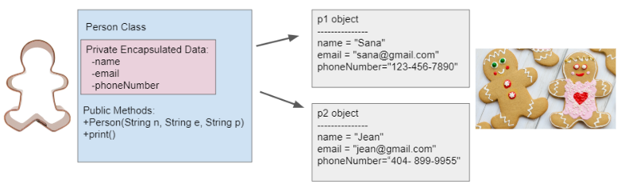
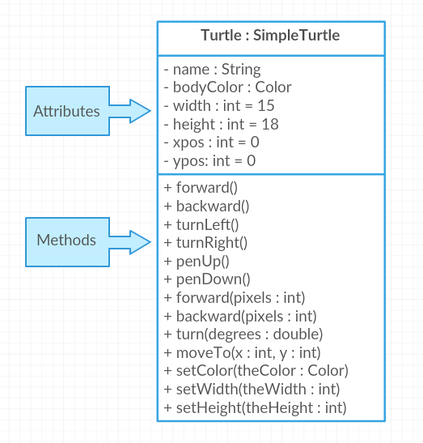

.. include:: ../common.rst

.. qnum::
   :prefix: 5-1-
   :start: 1

|Time90|

Anatomy of a Java Class
=======================

In Unit 2, we learned to use **classes** and **objects** that are built-in to
Java or written by other programmers. In this unit, you will learn to write your
own classes and make your own objects!

Remember that a **class** in Java defines a blueprint for creating objects. When
you create **objects**, you create new **instances** of that class and what you
can do with those instances is determined by what methods are defined in the
class.

For example in Unit 2, we created ``yertle`` and ``myrtle``, 2 ``Turtle``
variables and assigned them references to objects created from the class
``Turtle`` and we used instances of Java’s ``String`` class to assign values to
different ``String`` variables.

Watch this short video to review the vocabulary of object-oriented programming:

.. youtube:: LfSaSANJPLg
    :width: 650
    :height: 415
    :align: center

Creating a Class
------------------

Most classes you write will have the keyword ``public`` before them though it is
not required. The class definition itself always starts with the word ``class``
followed by the name of the class. Then the rest of the class, called the body,
is defined inside a pair of ``{}``\ s.

Since we’re talking about anatomy, let’s create a class called ``Person``.
Classes are almost always named with capitalized names though this is a matter
of style, not a rule of the language. Here is the basic skeleton of a ``Person``
class:

.. code-block:: java

    public class Person
    {
        // define class here - also called the “body” of the class

    }

You can create instances of the ``Person`` class with ``new`` as in ``new
Person()`` And you can declare variables that can hold a reference to a
``Person`` object with ``Person variableName``.

Or put it altogether to declare some variables and initialize each one with a
reference to a new ``Person`` as shown here.

.. code-block:: java

    Person ada = new Person();
    Person charles = new Person();

So what makes up the body of the class—the stuff between the ``{}``\
s?

Remember that objects have both attributes and behaviors. These correspond to
**instance variables** and **methods** in the class definition.

The first things we define in a class are usually the instance variables. They
are called that because each instance of the class (each object) has its own set
of variables that aren’t shared with other instances. This is what allowed
``yertle`` and ``myrtle`` from Unit 2 to be at different positions at the same
time; they each had their own x position and y position instance variables.

The next thing we define in a class is usually its **constructors**. We’ll talk
about writing constructors in more detail in the next section but a
constructor’s job is to initialize the instance variables when the object is
created. Usually that will mean they need to take arguments. (The call to ``new
Person()`` before is to a constructor that doesn’t take any arguments. In a
moment we’ll see that our ``Person`` constructor will actually need arguments.)

The real meat of a class is in the **methods** which define the behaviors of the
objects of that class. Recall from Unit 2 that most methods either do things
(like the ``Turtle`` methods that moved the turtle on the screen) or return
values like the ``getXPos`` and ``getYPos`` on ``Turtle``.

The methods of the class share access to the object’s instance variables and
when a method is called on an object it uses the instance variables for that
object. For example in the ``Turtle`` class the ``forward`` method changes an
instance variable ``xPos``. When you call ``forward`` on ``yertle`` it changes
``xPos`` on the ``yertle`` object and when you call it on ``myrtle`` it changes
the ``xPos`` on the ``myrtle`` object.

Putting it all together, the three main anatomical features of a class are the
**instance variables** which hold values associated with each object, the
**constructors** whose job is to initialize the instance variables, and the
**methods** who contain the code that gives the objects their behavior and which
can use the instance variables defined in the class.

.. code-block:: java

    public class Person
    {
        // instance variables

        // constructors

        // methods

    }

And finally one last bit of weird anatomy, kind of like the appendix: any Java
class can have a ``main`` method which can be used to run that class as a
program either to test that one class or sometimes as the entry point to a whole
program made up of many classes and objects.

Designing a Class
-----------------

Now that we know what the skeleton of a class looks like and the elements that
make up the body of the class, we’re ready to create our own class. Let’s start
with a quick look at how to design a class such as ``Person``.

One important question we have to ask when designing a class is, what data does
it represent? In this case we can ask, what would we want to know about a
person? Our answer will depend on what problem we are trying to solve. In one
program, perhaps an address book, we might want to know the person's name and
phone number and email. In another program, such as a medical application, we
might need to know their vital signs such as their blood pressure, temperature,
and pulse rate.

For now let’s go with the address book example. Here's a fleshed out ``Person``
class with instance variables, a constructor, and methods. We’ll go through the
details in the next few sections but for now you can run the code to see how it
constructs 2 ``Person`` objects and fills in their data.

Remember that execution always starts in the ``main`` method. When a method like
``print`` is called, the code defined in the method runs but when it gets the
values of ``name``, ``email``, and ``phoneNumber`` it gets the specific values
of those variables that were set by the constructor when the particular object
we called ``print`` on was created. Click on the Show CodeLens button below and 
the Next button to run the code step by step.

.. activecode:: PersonClass
  :language: java
  :autograde: unittest

  Run the following class. Try changing the Person p2 object in main to your name.
  Click on the Show CodeLens button and then Next to step through the code.
  ~~~~
  public class Person
  {
      // instance variables
      private String name;
      private String email;
      private String phoneNumber;

      // constructor: construct a Person copying in the data into the instance
      // variables
      public Person(String initName, String initEmail, String initPhone)
      {
          name = initName;
          email = initEmail;
          phoneNumber = initPhone;
      }

      // Print all the data for a person
      public void print()
      {
          System.out.println("Name: " + name);
          System.out.println("Email: " + email);
          System.out.println("Phone Number: " + phoneNumber);
      }

      // main method for testing
      public static void main(String[] args)
      {
          // call the constructor to create a new person
          Person p1 = new Person("Sana", "sana@gmail.com", "123-456-7890");
          // call p1's print method
          p1.print();
          Person p2 = new Person("Jean", "jean@gmail.com", "404 899-9955");
          p2.print();
      }
  }

  ====
  // Test for Lesson 5.1.0 - Person class - should pass if/when they run code
  import static org.junit.Assert.*;

  import org.junit.*;

  import java.io.*;

  public class RunestoneTests extends CodeTestHelper
  {
      @Test
      public void testMain() throws IOException
      {
          String output = getMethodOutput("main");
          String expect =
                  "Name: Sana\n"
                      + "Email: sana@gmail.com\n"
                      + "Phone Number: 123-456-7890\n"
                      + "Name: Jean\n"
                      + "Email: jean@gmail.com\n"
                      + "Phone Number: 404 899-9955";

          boolean passed = getResults(expect, output, "Expected output from main", true);
          assertTrue(passed);
      }
  }

Instance Variables
---------------------------

.. index::
   pair: class; instance variables

As we’ve said, **instance Variables** hold the data for an object. They record
what an object needs to know to play its role in the program. Instance variables
are also sometimes called **attributes**, **fields**, or **properties**.

In general and definitely on the AP CSA exam, instance variables should be
declared **private**. Think of ``private`` as like your diary. Only you should
have direct access to it. Similarly, in Java a ``private`` instance variable can
only be accessed by code in the class that declares the variable.

.. note::

   Instance variables are declared right after the class declaration.  They usually start with ``private`` then the *type* of the variable and then a *name* for the variable. Private means only the code in this class has access to it.

The ``Person`` class declares 3 private instance variables: ``name``, ``email``,
and ``phoneNumber``. These are things that you might want to know about a
person. They are declared at the top of the class and they exist inside the ``{
}`` of the class.

Once we have created a class like ``Person``, we can create many instances
(objects) of the class. The class is like a blueprint or cookie cutter that
defines the variables and methods for that class. Each object will have their
own copies of the same instance variables but with possibly different values in
them (as seen in the cookie decorations below).

    Figure 2: Person Class and Objects

Good Java style stresses **data encapsulation** where the data (instance
variables) and the code acting on the data (methods) are wrapped together into a
single unit and the implementation details are hidden. Because only code in the
class can access or change the values of ``private`` instance variables it is a
lot easier to keep track of how your program works than if you had to worry that
any code anywhere in a much larger program could possibly change the values of
the variables.

Code in other classes can only interact with the ``public`` methods you provide
and cannot directly access the ``private`` instance variables (shown in the pink
box above).

When designing a class you get to decide what data to make accessible or
modifiable from other classes by what ``public`` methods you provide. (Remember
from Unit 2 how the ``Turtle`` class provided ``getXPos`` and ``getYPos`` to get
the turtle’s position but no ``setXPos`` and ``setYPos`` since the only way to
move a turtle is through  ``forward`` and ``moveTo`` methods?)

|Exercise| **Check Your Understanding**

.. clickablearea:: name_instance_variables
    :question: Click on all the instance  variable declarations in the following class
    :iscode:
    :feedback: Remember, instance  variables are private and are declared after the class declaration.

    :click-incorrect:public class Name:endclick:
    :click-incorrect:{:endclick:
        :click-correct:private String first;:endclick:
        :click-correct:private String last;:endclick:

        :click-incorrect:public Name(String theFirst, String theLast):endclick:
        :click-incorrect:{:endclick:
            :click-incorrect:first = theFirst;:endclick:
            :click-incorrect:last = theLast;:endclick:
         :click-incorrect:}:endclick:

         :click-incorrect:public void setFirst(String theFirst):endclick:
         :click-incorrect:{:endclick:
            :click-incorrect:first = theFirst;:endclick:
         :click-incorrect:}:endclick:

         :click-incorrect:public void setLast(String theLast):endclick:
         :click-incorrect:{:endclick:
            :click-incorrect:last = theLast;:endclick:
         :click-incorrect:}:endclick:

    :click-incorrect:}:endclick:

Methods
-------

.. index::
   pair: class; method

Now to **methods** which define what we can actually do with an object. The most
important methods in a class are the ``public`` methods since they can be
accessed from outside the class. You may also write ``private`` methods that are
not accessible outside of the class and therefore can only be used by other
methods inside the same class. As you’ve probably figured out, the ``public``
and ``private`` keywords determine the external access and visibility of
classes, instance variables, constructors, and methods.

.. note::

   Methods define what the object can do. They typically start with ``public``
   then a type, then the name of the method followed by parentheses for optional
   parameters. Methods defined for an object can access and use its instance
   variables!

The ``Person`` class above has a ``print`` method that prints out all the data
stored for a person object. Notice that it is marked as ``public`` and after
``public`` comes the return type. The ``void`` return type, as you may recall
from Unit 2, is used to indicate that the method does not return anything but
has some effect such as printing to the screen. After the return type comes the
method name followed by parentheses containing the list of parameters. In this
case there are no parameters but we still need the ``()``\ s. The body of the
method is in ``{}``\ s. As we’ve discussed, the method can access and use the
instance variables defined in the class: ``name``, ``email``, and
``phoneNumber`` but will get the values specific to the object we called
``print`` on.

.. code-block:: java

     public void print()
     {
       System.out.println("Name: " + name);
       System.out.println("Email: " + email);
       System.out.println("Phone Number: " + phoneNumber);
     }

To call a method, we need an object that is an instance of the class such as we
get by calling its constructor. Then we use the dot (``.``) operator to call its
``public`` methods, for example ``p1.print()`` means call the ``print`` method
on the object ``p1``.

.. code-block:: java

    // call the constructor to create a new person
    Person p1 = new Person("Sana", "sana@gmail.com", "123-456-7890");
    // call p1's print method
    p1.print();

|Exercise| Check Your Understanding

.. clickablearea:: name_methods
    :question: Click on all the lines of code that are part of a method in the following class.
    :iscode:
    :feedback: Methods follow the constructor.  They include a return type in case they returns something from the method.

    :click-incorrect:public class Name:endclick:
    :click-incorrect:{:endclick:
        :click-incorrect:private String first;:endclick:
        :click-incorrect:private String last;:endclick:

        :click-incorrect:public Name(String theFirst, String theLast):endclick:
        :click-incorrect:{:endclick:
            :click-incorrect:first = theFirst;:endclick:
            :click-incorrect:last = theLast;:endclick:
        :click-incorrect:}:endclick:

        :click-correct:public void setFirst(String theFirst):endclick:
        :click-correct:{:endclick:
            :click-correct:first = theFirst;:endclick:
        :click-correct:}:endclick:

        :click-correct:public void setLast(String theLast):endclick:
        :click-correct:{:endclick:
            :click-correct:last = theLast;:endclick:
        :click-correct:}:endclick:

    :click-incorrect:}:endclick:

Object-Oriented Design
----------------------

So far we’ve just talked about designing one class. In **object-oriented
design** (OOD), programmers often start by deciding which classes are needed to
solve a problem and then figure out the data and methods in each class.

When you are given a problem specification, you can identify classes you’ll need
by looking for the **nouns** in the specification. For instance, the
specification for the turtle graphics system from Unit 2 probably contained a
sentence that said something like, “there are turtles that can exist on a
2-dimensional world and can draw lines by moving around the world”. The main
nouns in that description are “turtle” and “world” and indeed the classes in the
system are ``Turtle`` and ``World``. (The one noun that was not turned into a
class was “line”. Do you think it would have made sense to create a ``Line``
class? Why or why not?)

Once you’ve determined the classes you need, then you can go through the process
we described above to design the individual classes. Note that you can often
identify methods that should exist on classes by looking for verbs in the
specification like “move”.

Sometimes it’s useful, when designing a complex system with lots of classes, to
make diagrams of the classes that show you at a glance what instance variables
and methods they have. Often these can just be sketches in your notebook or on a
whiteboard but there are also more formal systems such as the Unified Modeling
Language (UML) for drawing these diagrams.

For example, here is a UML class diagram for the ``Turtle`` class. The ``-`` in
front of the attributes indicate that they are private, and the ``+`` in front
of the methods indicate that they are public. Here is a |tutorial on class
diagrams| that explains it in more detail if you are curious (Class diagrams are
not on the AP CSA exam). If you want to draw your own, |app diagrams| or
|Creately.com| are good free online drawing tools for UML class diagrams.

    Figure 3: Turtle Class Diagram

|Exercise| **Check Your Understanding**

.. shortanswer:: OOD1

    You've been hired by your school to create a program that keeps track of "students at your school and the courses they are taking". Name 2 classes that you would create in your program. Name 2 attributes (data kept in instance variables) for each class.

The two nouns in the problem description above, **Student** and **Course** would make good class names! Then, you can think about what data you need to keep track of for students and courses and what methods you need. Note that the instance variables in the Person class could also work for a Student class!

|Exercise| **Check Your Understanding**

.. shortanswer:: OOD2

    Say you wanted to make a computer game from a board game that you are playing. Think about what objects are in the game. For example, here is the description for Monopoly (trademark Hasbro games): "Buy, sell, dream and scheme your way to riches. Players buy, sell and trade to win. Build houses and hotels on your properties and bankrupt your opponents to win it all. Chance and Community Chest cards can change everything." What classes would you need to create a computer version of this game? (Remember to look for the nouns). Take one of the classes you listed, and try to come up with 2 pieces of data in that class that will be the instance variables.

|Groupwork| Programming Challenge : Riddle Class
----------------------------------------------------------

.. image:: Figures/chicken.png
    :width: 130
    :align: left
    :alt: Chicken

In this project, you will create a class that can tell riddles like the following:

- Riddle Question: Why did the chicken cross the playground?
- Riddle Answer: To get to the other slide!

1. First, brainstorm in pairs to create an **object-oriented design** for a riddle asking program. What should we call this class? What data does it need to keep track of in instance variables? What is the data type for the instance variables? What methods do we need? (You could draw a Class Diagram for this class using |app diagrams| or |Creately.com|, although it is not required).

2. Using the ``Person`` class above as a guide, write a ``Riddle`` class in the Active Code template below that has 2 instance variables for the riddle's question and answer, a constructor that initializes the riddle, and 2 methods to ask the riddle and answer the riddle. Don't name your instance variables ``initQuestion`` and ``initAnswer`` since they are used as constructor parameter variables. If you came up with other instance variables and methods for this class, you can add those too! Don't forget to specify the ``private`` or ``public`` access modifiers. Use the outline in the Active Code below. You will learn how to write constructors and other methods in detail in the next lessons.

3. Complete the ``main`` method to construct at least 2 ``Riddle`` objects that call the ``Riddle`` constructor with the arguments for the riddle question and answer and call their ``printQuestion`` and ``printAnswer`` methods to ask and answer the riddle. You can look up some good riddles online.

.. activecode:: challenge-5-1-Riddle-Class
  :language: java
  :autograde: unittest

  Complete the Riddle class below and complete the main method to construct 2 Riddle objects and call their printQuestion() and printAnswer() methods.
  ~~~~
  public class Riddle
  {
      // write 2 instance variables for Riddle's question and answer: private type
      // variableName;

      // constructor
      public Riddle(String initQuestion, String initAnswer)
      {
          // set the instance variables to the init parameter variables

      }

      // Print riddle question
      public void printQuestion()
      {
          // print out the riddle question with System.out.println

      }

      // Print riddle answer
      public void printAnswer()
      {
          // print out the riddle answer with System.out.println

      }

      // main method for testing
      public static void main(String[] args)
      {
          // call the Riddle constructor to create 2 new Riddle objects
          // with the arguments for the riddle question and answer.

          // call the riddle objects' printQuestion() and printAnswer methods

      }
  }

  ====
  // Test Code for Lesson 5.1.5 - Riddle
  // @author Kate McDonnell
  // Test Code for Lesson 5.1.5 - Riddle
  import static org.junit.Assert.*;

  import org.junit.*;

  import java.io.*;

  public class RunestoneTests extends CodeTestHelper
  {
      public RunestoneTests()
      {
          super("Riddle"); // class name / location of main

          Object[] values = new Object[] {"Question", "Answer"};
          setDefaultValues(values);
      }

      @Test
      public void testPrintQuestion()
      {
          String output = getMethodOutput("printQuestion");
          String expect = "Question";

          boolean passed = getResults(expect, output, "Checking method printQuestion()");
          assertTrue(passed);
      }

      @Test
      public void testPrintAnswer()
      {
          String output = getMethodOutput("printAnswer");
          String expect = "Answer";

          boolean passed = getResults(expect, output, "Checking method printAnswer()");
          assertTrue(passed);
      }

      @Test
      public void testCallConstructors()
      {
          String code = getCodeWithoutComments();
          String search = "= new Riddle(";

          int num = countOccurences(code, search);

          String expect = search + "...) x 2";
          String actual = search + "...) x " + num;

          boolean passed = getResults(expect, actual, "Checking that you made 2 Riddle objects");
          assertTrue(passed);
      }

      @Test
      public void testVariableTypes()
      {
          String varTypes = "String String";
          String output = testInstanceVariableTypes(varTypes.split(" "));

          boolean passed = getResults(varTypes, output, "Checking Instance Variable Type(s)");
          assertTrue(passed);
      }

      @Test
      public void testPrivateVariables()
      {
          String expect = "2 Private";
          String output = testPrivateInstanceVariables();

          boolean passed = getResults(expect, output, "Checking Private Instance Variable(s)");
          assertTrue(passed);
      }

      @Test
      public void testMain()
      {
          String output = getMethodOutput("main");

          String expect = "2+ line(s) of text";
          String actual = " line(s) of text";

          int len = output.split("\n").length;

          if (output.length() > 0)
          {
              actual = len + actual;
          }
          else
          {
              actual = output.length() + actual;
          }
          boolean passed = len >= 2;

          getResults(expect, actual, "Checking main method", passed);
          assertTrue(passed);
      }
  }

|Groupwork| Design a Class for your Community
----------------------------------------------------------

.. |worksheet| raw:: html

   <a href="https://docs.google.com/document/d/11QMyHAZYhPwNLInhURqkTffeY9re05yH97xAsiSJhLg/edit?usp=sharing" target="_blank">worksheet</a>

.. |community1| raw:: html

   <a href="https://runestone.academy/ns/books/published/csawesome/Unit5-Writing-Classes/community-challenge.html" target="_blank">Lesson 5.19</a>

In this unit, you will design a class of your own choice that is relevant to your community.
You will improve the class in each lesson of this unit. We suggest that you work in pairs on this project.
If you would rather work on this project as 1 stand-alone lab project rather than a piece at a time at the end of each lesson,
you can do this in |community1| at the end of Unit 5.

1. Make your own copy of this |worksheet| from the File menu. For question 1, brainstorm and ask people in your community what would be important or useful for them to track in a community organization or activity or to help your community. For example, you could create a Java class to keep track of community events, club activities, athletic games or statistics, community leaders, performers or performances, health tracking, or another subject of your choice.

2. Come up with the class name for your community data-tracking class (it should be a category of people or things, not a specific person or thing). Come up with at least 3 instance variables that are attributes of things in that class. Think about what data type each variable should be.You can use the |worksheet| to design your class. Optionally, you may want to draw a UML class diagram for your class on paper or using |app diagrams| or |Creately.com| (see |tutorial on class diagrams|).

3. Type in your class name and declare the instance variables for your class in the active code exercise below. Click on run. Your class will not print out anything yet, but it should run without errors. You will add constructors and other methods to this class in the next lessons.

.. activecode:: community-challenge-5-1
  :language: java
  :autograde: unittest

  Come up with the class name for your community data-tracking class (it should be a category of people or things, not a specific person or thing) and at least 3 instance variables that are attributes of things in that class.  Your class will not print out anything yet, but it should run without errors.
  ~~~~
  public class          // Add your class name here!
  {
      // write 3 instance variables for class: private type variableName;

      public static void main(String[] args)
      {
        // Run your code to check for errors.
        // It will not print anything yet.
        // You will add more in the next lesson.
      }
  }
  ====
  import static org.junit.Assert.*;

  import org.junit.*;

  import java.io.*;

  public class RunestoneTests extends CodeTestHelper
  {
      @Test
      public void testPrivateVariables()
      {
          String expect = "3 Private";
          String output = testPrivateInstanceVariables();
          boolean passed = false;
          if (Integer.parseInt(expect.substring(0, 1)) <= Integer.parseInt(output.substring(0, 1)))
              passed = true;
          passed = getResults(expect, output, "Checking private instance variable(s)", passed);
          assertTrue(passed);
      }
  }

Summary
----------

- Programmers use code to represent a physical object or nonphysical concept,
  real or imagined, by defining a class based on the attributes and/or behaviors
  of the object or concept.

- **Instance Variables** define the attributes or data needed for objects, and
  **methods** define the behaviors or functions of the object.

- **Data encapsulation** is a technique in which the implementation details of a
  class are kept hidden from the user. The data is kept private with access only
  through the public methods that can act on the data in the class.

- The keywords ``public`` and ``private`` affect the access of classes, data,
  constructors, and methods.

- The keyword ``private`` restricts access to the declaring class, while the
  keyword ``public`` allows access from classes outside the declaring class.

- Instance variables are encapsulated by using the ``private`` **access
  modifier**.

- Methods can be ``public`` or ``private``. The set of ``public`` methods define
  what other classes can do with an instance of a class.

AP Practice
------------

.. mchoice:: AP5-1-1
        :practice: T
        :random:

        Consider the Cat class which will contain a String and an int attribute for a cat’s name and age and a constructor.

        .. code-block:: java

            public class Cat
            {
                /* missing code */
            }

        Which of the following replacements for /* missing code \*/ is the most appropriate
        implementation of the class?

        - .. code-block:: java

            public String name;
            public int age;
            private Cat(String name, int age)
            { /* implementation not shown */ }

          - Instance variables should be private.

        - .. code-block:: java

            public String name;
            private int age;
            private Cat(String name, int age)
            { /* implementation not shown */ }

          - Instance variables should be private.

        - .. code-block:: java

            private String name;
            private int age;
            public Cat(String name, int age)
            { /* implementation not shown */ }

          + Correct! The instance variables are private and the constructor is public.

        - .. code-block:: java

            public String name;
            public int age;
            public Cat(String name, int age)
            { /* implementation not shown */ }

          - Instance variables should be private.

        - .. code-block:: java

            private String name;
            private int age;
            private Cat(String name, int age)
            { /* implementation not shown */ }

          - Constructor should be public.

.. mchoice:: AP5-1-2
    :practice: T

    Consider the Party class below which will contain three int attributes for numOfPeople, volumeOfMusic, and numOfBoxesOfPizza, a constructor, and a startParty method. The startParty method is intended to be accessed outside the class.

    .. code-block:: java

        public class Party
        {
            /* missing code */
        }

    Which of the following replacements for /* missing code \*/ is the most appropriate
    implementation of the class?

    - .. code-block:: java

        private int numOfPeople;
        private int volumeOfMusic;
        private int numOfBoxesOfPizza;
        public Party()
        { /* implementation not shown */ }
        private void startParty()
        { /* implementation not shown */ }

      - Method startParty() should be public.

    - .. code-block:: java

        private int numOfPeople;
        private int volumeOfMusic;
        private int numOfBoxesOfPizza;
        public Party()
        { /* implementation not shown */ }
        public void startParty()
        { /* implementation not shown */ }

      + Correct, instance variables should be private and the methods should be public.

    - .. code-block:: java

        public int numOfPeople;
        public int volumeOfMusic;
        public int numOfBoxesOfPizza;
        public Party()
        { /* implementation not shown */ }
        public void startParty()
        { /* implementation not shown */ }

      - Instance variables should be private.

    - .. code-block:: java

        private int numOfPeople;
        private int volumeOfMusic;
        private int numOfBoxesOfPizza;
        private Party()
        { /* implementation not shown */ }
        private void startParty()
        { /* implementation not shown */ }

      - Methods should be public.

.. |tutorial on class diagrams| raw:: html

   <a href="https://medium.com/@smagid_allThings/uml-class-diagrams-tutorial-step-by-step-520fd83b300b" target="_blank">tutorial on class diagrams</a>

.. |Creately.com| raw:: html

   <a href="https://creately.com" target="_blank">Creately.com</a>

.. |app diagrams| raw:: html

   <a href="https://app.diagrams.net/" target="_blank">app.diagrams.net</a>
