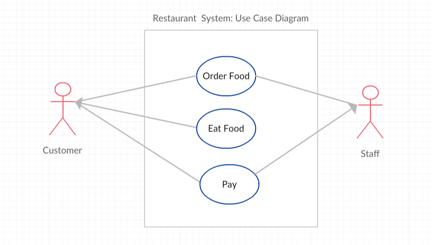
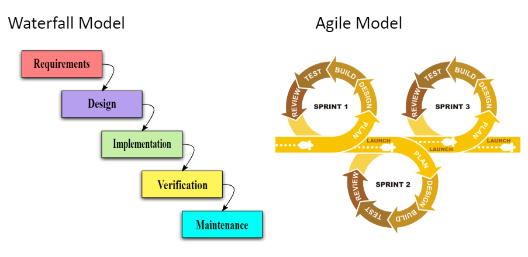

.. include:: ../common.rst

.. qnum::
   :prefix: 5-3-
   :start: 1

|Time45|

Comments and Conditions
=======================

Comments
---------

Adding comments to your code helps to make it more readable and maintainable. In the commercial world, software development is usually a team effort where many programmers will use your code and maintain it for years. Commenting is essential in this kind of environment and a good habit to develop. Comments will also help you to remember what you were doing when you look back to your code a month or a year from now.

There are 3 types of comments in Java:

1. ``//`` Single line comment
2. ``/*`` Multiline comment ``*/``
3. ``/**`` Documentation comment ``*/``

.. |Java JDK| raw:: html

   <a href="https://www.oracle.com/technetwork/java/javase/downloads/index.html" target="_blank">Java JDK</a>

.. |javadoc| raw:: html

   <a href="https://www.tutorialspoint.com/java/java_documentation.htm" target="_blank">javadoc</a>

.. |String class| raw:: html

   <a href="http://docs.oracle.com/javase/7/docs/api/java/lang/String.html" target="_blank">String class</a>

The special characters ``//`` are used to mark the rest of the line as a comment in many programming languages.  If the comment is going to be multiple lines, we use ``/*`` to start the comment and ``*/`` to end the comment.

There is also a special version of the multi-line comment, ``/**``  ``*/``, called the documentation comment. Java has a cool tool called |javadoc| that comes with the |Java JDK| that will pull out all of these comments to make documentation of a class as a web page.  This tool generates the official Java documentation too, for example for the |String class|. Although you do not have to use this in the AP exam, it's a good idea to use the documentation comment in front of classes, methods, and instance variables in case you want to use this tool.

|Exercise| **Check your understanding**

.. dragndrop:: comments
    :feedback: Review the section above.
    :match_1: single-line comment|||//
    :match_2: multi-line comment|||/* */
    :match_3: Java documentation comment|||/** */

    Drag the definition from the left and drop it on the correct symbols on the right.  Click the "Check Me" button to see if you are correct.

The compiler will skip over comments, and they don't affect how your program runs. They are for you, your teacher, and other programmers working with you.  Here are some examples of good commenting:

.. code-block:: java

    /**
    * MyClass.java
    * @author My Name
    * @since Date
    * This class keeps track of the max score.
    */
    public class MyClass()
    {
       private int max = 10; // this keeps track of the max score
       /* The print() method prints out the max */
       public print() {  System.out.println(max); }

Note that most IDEs will tend to show comments formatted in italics -- to make them easier to spot.

Notice that there are some special tags that you can use in Java documentation. These are not required but many programmers use them. Here are some common tags:

- @author  Author of the program
- @since   Date released
- @version Version of program
- @param   Parameter of a method
- @return  Return value for a method

Preconditions and  Postconditions
---------------------------------

As you write methods in a class, it is a good idea to keep in mind the **preconditions** and the **postconditions** for the method and write them in the comments. A precondition is a condition that must be true for your method code to work, for example the assumption that the parameters have values and are not null. The methods could check for these preconditions, but they do not have to. The precondition is what the method expects in order to do its job properly.

A postcondition is a condition that is true after running the method. It is what the method promises to do. Postconditions describe the outcome of running the method, for example what is being returned or the changes to the instance variables. These assumptions are very useful to other programmers who want to use your class and get the correct results.

Here is an example of preconditions, postconditions, and @param in the Turtle code that we have used in the past for our drawing turtles.

.. code-block:: java

       /**
         * Constructor that takes the x and y position for the
         * turtle
         * Preconditions: parameters x and y are coordinates from 0 to
         *    the width and height of the world.
         * Postconditions: the turtle is placed in (x,y) coordinates
         * @param x the x position to place the turtle
         * @param y the y position to place the turtle
         */
        public Turtle(int x, int y)
        {
          xPos = x;
          yPos = y;
        }

|CodingEx| **Coding Exercise**

Try to break the preconditions of the Turtle constructor below. Does the Turtle constructor behave properly if you break the preconditions that x and y are between 0 and 300. Try giving the Turtle constructor  x and y values out of these ranges. What happens? Does the method give good results? Does it give any warnings? What about the t.forward() method? Does it have any preconditions that you can break?

.. |github| raw:: html

   <a href="https://github.com/bhoffman0/APCSA-2019/tree/master/_sources/Unit2-Using-Objects/TurtleJavaSwingCode.zip" target="_blank" style="text-decoration:underline">here</a>

.. |repl link| raw:: html

   <a href="https://firewalledreplit.com/@BerylHoffman/Java-Swing-Turtle" target="_blank" style="text-decoration:underline">repl.it link</a>

(If the code below does not work for you, you can copy the code into  this |repl link| (refresh page after forking and if it gets stuck) or download the files |github| to use in your own IDE.)

.. activecode:: turtle-preconditions
    :language: java
    :autograde: unittest
    :datafile: turtleClasses.jar

    Try to break the preconditions about the range of the values of x and y in the Turtle constructor below.
    ~~~~
    import java.awt.*;
    import java.util.*;

    public class TurtlePreconditions
    {
        public static void main(String[] args)
        {
            World world = new World(300, 300);
            // Change 0, 0 in the Turtle constructor to other values 
            // outside of 0-300 to break the preconditions 
            // and see what happens
            Turtle t = new Turtle(0, 0, world);
            t.turnRight();
            world.show(true);
        }
    }

    ====
    import static org.junit.Assert.*;

    import org.junit.*;

    import java.io.*;

    public class RunestoneTests extends CodeTestHelper
    {
        public RunestoneTests()
        {
            super("TurtlePreconditions");
        }

        @Test
        public void test1()
        {
            String code = getCode();
            boolean passed = !(code.contains("new Turtle(0, 0"));
            passed = getResults("true", "" + passed, "Change (0, 0) to try to break preconditions", passed);
            assertTrue(passed);
        }
    }

The Turtle constructor's precondition is that x and y should be between 0 and the width and height of the world. If it receives values out of this range, it sets x and y to the closest legal values that it can so that the turtle appears just at the edge of the world. Similarly, the forward() method will not allow the turtle to leave the world.

|Exercise| **Check your understanding**

.. mchoice:: AP5-3-1
    :practice: T
    :answer_a: /* Precondition: s <= 0 */
    :answer_b: /* Precondition: score >= 0 */
    :answer_c: /* Precondition: s and ec >= 0 */
    :answer_d: /* Precondition: n is not the empty String */
    :answer_e: /* Precondition: studentName is not the empty String */
    :correct: c, d
    :feedback_a: It is not reasonable the s which sets the score should be negative.
    :feedback_b: The precondition should be about the parameters of the constructor. score is not the parameter variable.
    :feedback_c: Correct. It is reasonable that the score and extraCredit should be set to positive values using the parameters s and ec.
    :feedback_d: Correct. It is reasonable that the parameter n which sets the name should be not empty.
    :feedback_e: The precondition should be about the parameters of the constructor. score is not the parameter variable.

    Consider the following class definition.

    .. code-block:: java

        public class TestScore
        {
            private String studentName;
            private double score;
            private double extraCredit;

            public TestScore (String n, double s, double ec)
            {
                studentName = n;
                score = s;
                extraCredit = ec;
            }
            /* Other methods not shown */
        }

     Which of the following preconditions are reasonable for the TestScore constructor?

Let's consider the substring method in Java. This method has a strong precondition that its arguments refer to indices within the given string.

|CodingEx| **Coding Exercise**

.. activecode:: substring-preconditions
    :language: java
    :autograde: unittest

    The following code breaks the preconditions of the substring method and throws an IndexOutOfBoundsException. Can you fix the code by changing the arguments for the substring method to print out the substring "lo"? What are the preconditions for the substring method?
    ~~~~
    public class SubstringPreconditions
    {
        public static void main(String[] args)
        {
            String str = "hello";
            System.out.println(str.substring(-1, 10));
        }
    }

    ====
    // Test for Lesson 5.3.2 Substring-preconditions
    import static org.junit.Assert.*;

    import org.junit.*;

    import java.io.*;

    public class RunestoneTests extends CodeTestHelper
    {
        public RunestoneTests()
        {
            super("SubstringPreconditions");
        }

        @Test
        public void testMain() throws IOException
        {
            String output = getMethodOutput("main");
            String expect = "lo";
            boolean passed = getResults(expect, output, "Expected output from main");
            assertTrue(passed);
        }
    }

.. note::

    The method str.substring(beginIndex, endIndex) has the precondition that 0 <= beginIndex <= endIndex <= str.length.

|Exercise| **Check your understanding**

.. mchoice:: AP5-3-2
   :practice: T
   :answer_a: /* Precondition: i >= 0 */
   :answer_b: /* Precondition: i <= str.length() */
   :answer_c: /* Precondition: 0 < i < str.length() */
   :answer_d: /* Precondition: 0 <= i < str.length() */
   :correct: d
   :feedback_a: This is true but it could still throw an exception if i is a large value.
   :feedback_b: This is true but it could still throw an exception if i is a negative value.
   :feedback_c: This is true but a little too restrictive.
   :feedback_d: Correct. i can refer to character 0 up to str.length().

   The following method is intended to return the substring starting at index i until the end of the string. For example, getiToEnd("012",1) should return "12". Which of the following is the most appropriate precondition for the method so that it does not throw an exception?

   .. code-block:: java

        /* missing precondition */
        public String getiToEnd(String str, int i)
        {
            return str.substring(i, str.length());
        }

Software Validity and Use-Case Diagrams
----------------------------------------

Preconditions and postconditions are covered on the AP CSA exam. Software validity, testing, and use-case diagrams which are discussed in this subsection are not covered on the AP CSA exam, but they are described here because they use preconditions and postconditions and are used by professional programmers.

Determining the preconditions and postconditions help us to test our code and determine the **validity** of our software.  Software validity tests whether the software does what it is supposed to do before it is released. This is sometimes very important. For example, if the code is part of a satellite going to outerspace or is going to be used in an emergency condition, we want to test it thoroughly and make sure it works and is valid before it is put into use.

Good software testers actually try to break the code! They try all kinds of input to see what the software will do because you never know what users will try or what conditions there will be. So, always think what the preconditions of your code are and see what happens when you break them, and then see if you can protect or warn against that.

Preconditions and postconditions can also help us to design better software systems. Software designers often first draw a high-level **Use-Case Diagram** of a system that shows the different ways that a user might interact with a system before they build it. Here is a simple Use-Case Diagram of a restaurant system. It shows 2 actors in the system: the customer and the staff at the restaurant, and 3 use-cases in circles. A **Use-case** is a particular user interaction or situation in the system or software, and they often become methods in the program.

    Figure 1: Use-Case Diagram of a Restaurant System

After drawing a Use-Case Diagram, designers write down the preconditions and the postconditions for each Use-Case. Often the successful post-condition for one use-case becomes the preconditions for the next use-case. For example, for the "Order Food" and "Eat Food" Use Cases:

- Preconditions for "Order Food": Customer enters restaurant. Staff is ready to take the order.
- Postconditions for "Order Food": Customer orders the food. Staff takes the order.
- Preconditions for "Eat Food": Customer has already ordered food. Staff has delivered food.
- Postcondition for "Eat Food": Customer eats the food.

|Exercise| **Check your understanding**

.. shortanswer:: payconditions

   What are the preconditions and postconditions of the use-case "Pay for food"? Remember that these are often related to the other use-case conditions "order food" and "eat food".

Agile Software Development
----------------------------

There are many different models for software development. The **waterfall model**, developed in the 1970s, is a step by step model where each phase is finished before the next phase begins. This model has recently been criticized because it is not very adaptable. The more recent **Agile** development model involves iterative, incremental development where  teams works in short 2-3 week **sprints** to completely develop, test, and release a component of the project to the customer for feedback. It is very adaptable as project requirements change because of early testing, immediate customer feedback and collaboration.

    Figure 2: Waterfall vs Agile Models

One very popular type of agile development is called **Scrum**. The following short |video| describes software development  with Scrum.

.. |video| raw:: html

   <a href="https://www.youtube.com/watch?v=TRcReyRYIMg" target="_blank">video</a>

.. youtube:: TRcReyRYIMg
    :height: 400
    :width: 600
    :align: left

|Groupwork| Group Exercise

.. |pogil game| raw:: html

   <a href="https://www.agilesparks.com/blog/wake-up-in-the-morning-game/" target="_blank">Wake Up In the Morning Game</a>

Try the |pogil game| in groups to practice the iterative and incremental agile development process.

|Groupwork| Programming Challenge : Comments and Conditions
-----------------------------------------------------------

.. |Creately.com| raw:: html

   <a href="https://creately.com" target="_blank">Creately.com</a>

Working in pairs or groups, come up with 4 steps that a user must do to purchase a product, for example a book on Java, in an online store, and list the preconditions and postconditions for each step. You could pretend to buy something online to come up with the steps. (You could use an online drawing tool like |Creately.com| (choose Use-Case Diagrams) to draw a Use-Case diagram for the Online Store System, but it is not required). Don't forget to list  the preconditions and postconditions for each step.  You can type in your answer below.

.. shortanswer:: challenge-5-3-use-case-preconditions

     Write down 4 steps that a user must do to purchase a product, for example a book on Java, in an online store, and list the preconditions and postconditions for each step.

Here is a simple class called User that could be used in an online store. Add good commenting to this code before the class, the instance variables, and the methods.

.. activecode:: challenge-5-3-comments
    :language: java
    :autograde: unittest

    // comments?
    public class User
    {

        private String username;
        private String password;

        public User()
        {
            username = "guest";
            password = "guest" + (int) (Math.random() * 1000);
        }

        public User(String nameInit, String pwordInit)
        {
            username = nameInit;
            password = pwordInit;
        }

        public void welcome()
        {
            System.out.println("Welcome " + username + "!");
        }

        public static void main(String[] args)
        {
            User u1 = new User(); // guest login
            // new user
            User u2 = new User("cooldude@gmail.com", "Coolness*10");
            u1.welcome();
            u2.welcome();
        }
    }

    ====
    // Test for 5.3.5 Comments
    import static org.junit.Assert.*;

    import org.junit.*;

    import java.io.*;

    public class RunestoneTests extends CodeTestHelper
    {
        private String program;

        @Test
        public void testMain()
        {
            String output = getMethodOutput("main");
            String expect = "Welcome guest!\nWelcome cooldude@gmail.com!";
            boolean passed = getResults(expect, output, "Expected output from main");
            assertTrue(passed);
        }

        @Test
        public void testClassComment()
        {
            program = getCodeWithComments();

            int index = program.indexOf("public class User");

            String beginning = program.substring(0, index - 1).trim();
            String expected = "A comment starting with // or /* and not // comments?";
            // System.out.println(beginning);

            boolean pass = !beginning.startsWith("// comments") && isComment(beginning);

            boolean passed = getResults(expected, beginning, "Class comment", pass);
            assertTrue(passed);
        }

        @Test
        public void testVariablesComment()
        {
            program = getCodeWithComments();

            int start = program.indexOf("{") + 1;
            int end = program.indexOf("private String username");

            String comment = program.substring(start, end).trim();
            String expected = "A comment starting with // or /*";
            // System.out.println(beginning);

            boolean passed = getResults(expected, comment, "Variable comment", isComment(comment));
            assertTrue(passed);
        }

        @Test
        public void testDefaultConstructorComment()
        {
            program = getCodeWithComments();

            int start = program.indexOf("password;") + "password;".length() + 1;
            int end = program.indexOf("public User()");

            String comment = program.substring(start, end).trim();
            String expected = "A comment starting with // or /*";
            // System.out.println(beginning);

            boolean passed =
                    getResults(expected, comment, "Default constructor comment", isComment(comment));
            assertTrue(passed);
        }

        @Test
        public void testConstructorComment()
        {
            program = getCodeWithComments();

            int start = program.indexOf("*1000);");
            start = program.indexOf("}", start) + 1;
            int end = program.indexOf("public User(String nameInit, String pwordInit)");

            String comment = program.substring(start, end).trim();
            String expected = "A comment starting with // or /*";
            // System.out.println(beginning);

            boolean passed = getResults(expected, comment, "Constructor comment", isComment(comment));
            assertTrue(passed);
        }

        @Test
        public void testWelcomeComment()
        {
            program = getCodeWithComments();

            int start = program.indexOf("password = pwordInit;");
            start = program.indexOf("}", start) + 1;
            int end = program.indexOf("public void welcome()");

            String comment = program.substring(start, end).trim();
            String expected = "A comment starting with // or /*";
            // System.out.println(beginning);

            boolean passed =
                    getResults(expected, comment, "Welcome method comment", isComment(comment));
            assertTrue(passed);
        }

        @Test
        public void testMainComment()
        {
            program = getCodeWithComments();

            int start = program.indexOf("username + \"!\");");
            start = program.indexOf("}", start) + 1;
            int end = program.indexOf("public static void main");

            String comment = program.substring(start, end).trim();
            String expected = "A comment starting with // or /*";
            // System.out.println(beginning);

            boolean passed = getResults(expected, comment, "Main method comment", isComment(comment));
            assertTrue(passed);
        }

        private boolean isComment(String block)
        {
            if (!block.contains("\n") && block.startsWith("//")) return true;
            if (block.startsWith("/*") && block.endsWith("*/")) return true;
            return false;
        }
    }

Summary
-------

- Comments are ignored by the compiler and are not executed when the program is run.

- Three types of comments in Java include ``/* */``, which generates a block of comments, ``//``, which generates a comment on one line, and ``/** */``, which are Javadoc comments and are used to create API documentation.

- A precondition is a condition that must be true just prior to the execution of a section of program code in order for the method to behave as expected. There is no expectation that the method will check to ensure preconditions are satisfied.

- A postcondition is a condition that must always be true after the execution of a section of program code. Postconditions describe the outcome of the execution in terms of what is being returned or the state of an object.

- Programmers write method code to satisfy the postconditions when preconditions are met.

