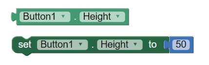

.. qnum::
   :prefix: 5-4-
   :start: 1

.. |CodingEx| image:: ../../_static/codingExercise.png
    :width: 30px
    :align: middle
    :alt: coding exercise
    
    
.. |Exercise| image:: ../../_static/exercise.png
    :width: 35
    :align: middle
    :alt: exercise
    
    
.. |Groupwork| image:: ../../_static/groupwork.png
    :width: 35
    :align: middle
    :alt: groupwork
    
    
Accessor Methods
=================

Since the instance variables in a class are usually marked as private to the class, programmers provide public methods that allow safe access to the instance variable values in a class. **Accessor methods**, also called **get methods** or **getters**, allow a way to get the value of each instance variable from outside of the class. In the next lesson, we will see **mutator methods**, also called **set methods** or **setters**, that allow a way to change the values of the instance variables. In Unit 2, we also used set/get methods with the Turtle class to get the Turtle object's width, height, xPosition, etc. or to change them.

If you used a language like App Inventor in an AP CSP class, you may have used setter and getter blocks. In App Inventor, you cannot make your own classes, but you can declare UI objects like Button1, Button2 from the Button class and use their get/set methods for any property like below. 

    Figure 1: App Inventor Set and Get blocks for object Button1
    
Java programmers write get methods for each instance variable that look like the following. Notice that the get method returns the instance variable's value and it has a return type that is the same type as the variable that it is returning.

.. code-block:: java

   class ExampleTemplate {
 
     //Instance variable declaration
     private typeOfVar varName;
  
     // Accessor (getter) method template
     public typeOfVar getVarName()
     {
        return varName;
     }
     
  }

Here's an example of an accessor method called getName() for the Student class which also demonstrates how to call getName() using a Student object:

.. code-block:: java

   class Student {
 
     //Instance variable name
     private String name;
  
     /** getName() example
      *  @return name */
     public String getName()
     {
        return name;
     }
     
     public static void main(String[] args)
     { 
        // To call a get method, use objectName.getVarName()
        Student s = new Student();
        System.out.println("Name: " + s.getName() );
     }

.. note::

    Some common errors with methods that return values are:
    
    - Forgetting a return type like int before the method name.
    - Forgetting to use the return keyword to return a value at the end of the method.
    - Forgetting to do something with the value returned from a method (like saving it into a variable or printing it out).
    
    
.. |Java visualizer1| raw:: html

   <a href="http://www.pythontutor.com/visualize.html#code=public%20class%20TesterClass%20%0A%20%20%7B%0A%20%20%20%20%20//%20main%20method%20for%20testing%0A%20%20%20%20%20public%20static%20void%20main%28String%5B%5D%20args%29%0A%20%20%20%20%20%7B%0A%20%20%20%20%20%20%20%20Student%20s1%20%3D%20new%20Student%28%22Skyler%22,%20%22skyler%40sky.com%22,%20123456%29%3B%0A%20%20%20%20%20%20%20%20System.out.println%28%22Name%3A%22%20%2B%20%20s1.getName%28%29%20%29%3B%0A%20%20%20%20%20%20%20%20System.out.println%28%22Email%3A%22%20%2B%20%20s1.getEmail%28%29%20%29%3B%0A%20%20%20%20%20%20%20%20System.out.println%28%22ID%3A%20%22%20%2B%20s1.getId%28%29%20%29%3B%0A%20%20%20%20%20%7D%0A%20%20%20%7D%0A%20%20%0A%20%20class%20Student%20%0A%20%20%7B%0A%20%20%20%20%20private%20String%20name%3B%0A%20%20%20%20%20private%20String%20email%3B%0A%20%20%20%20%20private%20int%20id%3B%0A%20%20%20%20%20%0A%20%20%20%20%20public%20Student%28String%20initName,%20String%20initEmail,%20int%20initId%29%0A%20%20%20%20%20%7B%0A%20%20%20%20%20%20%20%20name%20%3D%20initName%3B%0A%20%20%20%20%20%20%20%20email%20%3D%20initEmail%3B%0A%20%20%20%20%20%20%20%20id%20%3D%20initId%3B%0A%20%20%20%20%20%7D%0A%20%20%20%20%20%0A%20%20%20%20%20//%20accessor%20methods%20-%20getters%20%0A%20%20%20%20%20/**%20getName%28%29%20%20%40return%20name%20*/%0A%20%20%20%20%20public%20String%20getName%28%29%20%0A%20%20%20%20%20%7B%20%0A%20%20%20%20%20%20%20%20return%20name%3B%0A%20%20%20%20%20%7D%0A%20%20%20%20%20/**%20getEmail%28%29%20%20%40return%20email%20*/%0A%20%20%20%20%20public%20String%20getEmail%28%29%20%0A%20%20%20%20%20%7B%20%0A%20%20%20%20%20%20%20%20return%20email%3B%0A%20%20%20%20%20%7D%0A%20%20%20%20%20/**%20getName%28%29%20%20%40return%20id%20*/%0A%20%20%20%20%20public%20int%20getId%28%29%20%0A%20%20%20%20%20%7B%20%0A%20%20%20%20%20%20%20%20return%20id%3B%0A%20%20%20%20%20%7D%0A%20%20%7D&cumulative=false&curInstr=26&heapPrimitives=nevernest&mode=display&origin=opt-frontend.js&py=java&rawInputLstJSON=%5B%5D&textReferences=false" target="_blank"  style="text-decoration:underline">Java visualizer</a>
    
Try the following code. Note that this active code window has 2 classes! The main method is in a separate **Tester** or **Driver** class. It does not have access to the private instance variables in the other Student class. Note that when you use multiple classes in an IDE, you usually put them in separate files, and you give the files the same name as the public class in them. In active code and IDEs, you can put 2 classes in 1 file, as demonstrated here, but only 1 of them can be public and have a main method in it. You can also view the fixed code in the |Java visualizer1|.     
     
|CodingEx| **Coding Exercise**

.. activecode:: StudentObjExample
  :language: java
  :autograde: unittest
  :practice: T

  Try the following code. Note that it has a bug! It tries to access the private instance variable email from outside the class Student.  Change the main method in Tester class so that it uses the appropriate public accessor method (get method) to access the email value instead.
  ~~~~
  public class TesterClass 
  {
     // main method for testing
     public static void main(String[] args)
     {
        Student s1 = new Student("Skyler", "skyler@sky.com", 123456);
        System.out.println("Name:" +  s1.getName() );
        // Fix the bug here!
        System.out.println("Email:" +  s1.email );
        System.out.println("ID: " + s1.getId() );
     }   
   }
  /** Class Student keeps track of name, email, and id of a Student. */
  class Student 
  {
     private String name;
     private String email;
     private int id;
     
     public Student(String initName, String initEmail, int initId)
     {
        name = initName;
        email = initEmail;
        id = initId;
     }
     
     // accessor methods - getters 
     /** getName()  @return name */
     public String getName() 
     { 
        return name;
     }
     /** getEmail()  @return email */
     public String getEmail() 
     { 
        return email;
     }
     /** getName()  @return id */
     public int getId() 
     { 
        return id;
     }
  }
  ====
  import static org.junit.Assert.*;
    import org.junit.*;;
    import java.io.*;
    
    public class RunestoneTests extends CodeTestHelper
    {
        @Test
        public void testMain() throws IOException
        {
            String output = getMethodOutput("main");
            String expect = "Name:Skyler\nEmail:skyler@sky.com\nID: 123456";
            boolean passed = getResults(expect, output, "Checking for expected output");
            assertTrue(passed);
        }

        @Test
        public void testMethodCall() throws IOException
        {
            String target = "s1.getEmail()";
            boolean passed = checkCodeContains("call to accessor method for email", target);
            assertTrue(passed);
        }
    }

    

There is a subtle difference in methods that return primitive types versus reference/object types. If the method is returning a primitive type like int, it returns a copy of the value. This is called **return by value**. This means the original value is not changed and it is a safe way to access the instance variables. 

However, object variables really hold a reference to the object in memory. This is not the actual value, but its address in memory. So, if the method is returning an object like String, Java returns a copy of the object reference, not the value itself. Java was especially designed this way because objects tend to be large and we want to avoid copying large objects, so we just pass around references to the objects (their addresses in memory). So, when we call getName(), we actually get back a reference to the String for the name in memory. 
  
toString()
----------

.. |Java visualizer| raw:: html

   <a href="http://www.pythontutor.com/visualize.html#code=public%20class%20TesterClass%20%0A%20%20%7B%0A%20%20%20%20%20//%20main%20method%20for%20testing%0A%20%20%20%20%20public%20static%20void%20main%28String%5B%5D%20args%29%0A%20%20%20%20%20%7B%0A%20%20%20%20%20%20%20%20Student%20s1%20%3D%20new%20Student%28%22Skyler%22,%20%22skyler%40sky.com%22,%20123456%29%3B%0A%20%20%20%20%20%20%20%20System.out.println%28s1%29%3B%0A%20%20%20%20%20%7D%0A%20%20%20%7D%0A%20%20%0A%20%20class%20Student%20%0A%20%20%7B%0A%20%20%20%20%20private%20String%20name%3B%0A%20%20%20%20%20private%20String%20email%3B%0A%20%20%20%20%20private%20int%20id%3B%0A%20%20%20%20%20%0A%20%20%20%20%20public%20Student%28String%20initName,%20String%20initEmail,%20int%20initId%29%0A%20%20%20%20%20%7B%0A%20%20%20%20%20%20%20%20name%20%3D%20initName%3B%0A%20%20%20%20%20%20%20%20email%20%3D%20initEmail%3B%0A%20%20%20%20%20%20%20%20id%20%3D%20initId%3B%0A%20%20%20%20%20%7D%0A%20%20%20%20%20%0A%20%20%20%20%20//%20toString%28%29%20method%0A%20%20%20%20%20public%20String%20toString%28%29%20%0A%20%20%20%20%20%7B%20%0A%20%20%20%20%20%20%20return%20id%20%2B%20%22%3A%20%22%20%2B%20name%20%2B%20%22,%20%22%20%2B%20email%3B%0A%20%20%20%20%20%7D%0A%20%20%7D&cumulative=false&curInstr=14&heapPrimitives=nevernest&mode=display&origin=opt-frontend.js&py=java&rawInputLstJSON=%5B%5D&textReferences=false&curInstr=0" target="_blank"  style="text-decoration:underline">Java visualizer</a>

Another common method that returns a value is the toString() method which returns a String description of the instance variables of the object. 

This method is called automatically to try to convert an object to a String when it is needed, for example in a print statement. 

Here is the Student class again, but this time with a toString() method. Note that when we call System.out.println(s1); it will automatically call the toString() method to cast the object into a String. The toString() method will return a String that is then printed out. Watch how the control moves to the toString() method and then comes back to main in the |Java visualizer| or by using the Code Lens button.

.. activecode:: StudentToString
  :language: java
  :autograde: unittest

  See the toString() method in action.
  ~~~~
  public class TesterClass 
  {
     // main method for testing
     public static void main(String[] args)
     {
        Student s1 = new Student("Skyler", "skyler@sky.com", 123456);
        System.out.println(s1);
     }
   }
  
  class Student 
  {
     private String name;
     private String email;
     private int id;
     
     public Student(String initName, String initEmail, int initId)
     {
        name = initName;
        email = initEmail;
        id = initId;
     }
     
     // toString() method
     public String toString() 
     { 
       return id + ": " + name + ", " + email;
     }
  }
  ====
  import static org.junit.Assert.*;
    import org.junit.*;;
    import java.io.*;
    
    public class RunestoneTests extends CodeTestHelper
    {
        @Test
        public void testMain() throws IOException
        {
            String output = getMethodOutput("main");
            String expect = "123456: Skyler, skyler@sky.com";
            boolean passed = getResults(expect, output, "Checking for expected output", true);
            assertTrue(passed);
        }
    }
  
  
|Groupwork| Programming Challenge : Class Pet
--------------------------------------------------

.. image:: Figures/animalclinic.png
    :width: 150
    :align: left
    :alt: Animal Clinic
    
You've been hired to create a software system for the Awesome Animal Clinic! They would like to keep track of their animal patients. Here are some attributes of the pets that they would like to track:

- Name
- Age
- Weight
- Type (dog, cat, lizard, etc.)
- Breed

1. Create a class that keeps track of the attributes above for pet records at the animal clinic. Decide what instance variables are needed and their data types. Make sure you use int, double, and String data types. Make the instance variables private.

2. Create 2 constructors, one with no parameters and one with many parameters to initialize all the instance variables. 

3. Create Accessor (get) methods for each of the instance variables.

4. Create a toString() method that returns all the information in a pet record.

5. In the main method below, create 3 pet objects and call their constructors, accessor methods, and toString methods to test all of your methods. 

6. Make sure you use good commenting!

.. activecode:: challenge-5-4-Pet-Class
  :language: java

  Create a Pet class that keeps track of the name, age, weight, type of animal, and breed for records at an animal clinic.
  ~~~~
  /**
      Pet class (complete comments)
      @author
      @since
      
  */
  class Pet 
  {
     // keep track of the name, age, weight, type of animal, and breed of the pet
     
     
     // Write 2 constructors, accessor (get) methods, and a toString method. Use good commenting.
     
     // Don't forget to complete the main method in the TesterClass below!   
  }
  
  public class TesterClass 
  {
     // main method for testing
     public static void main(String[] args)
     {
        // Create 3 Pet objects and test all your methods
        
     }   
   }
  

Summary
-------
- An accessor method allows other objects to obtain the value of instance variables or static variables.

- A non-void method returns a single value. Its header includes the return type in place of the keyword void.

- Accessor methods that return primitive types use "return by value" where a copy of the value is returned. 

- When the return expression is a reference to an object, a copy of that reference is returned, not a copy of the object.

- The return keyword is used to return the flow of control to the point immediately following where the method or constructor was called.

- The toString method is an overridden method that is included in classes to provide a description of a specific object. It generally includes what values are stored in the instance data of the object.

- If System.out.print or System.out.println is passed an object, that object’s toString method is called, and the returned string is printed.

AP Practice
------------

.. mchoice:: AP5-4-1
   :practice: T
   :answer_a: The getNumOfPeople method should be declared as public.
   :answer_b: The return type of the getNumOfPeople method should be void.
   :answer_c: The getNumOfPeople method should have at least one parameter.
   :answer_d: The variable numOfPeople is not declared inside the getNumOfPeople method.
   :answer_e: The instance variable num should be returned instead of numOfPeople,  which is local to the constructor.
   :correct: a
   :feedback_a: Correct, accessor methods should be public so they can be accessed from outside the class.
   :feedback_b: The method return type should stay as int.
   :feedback_c: This method should not have any parameters
   :feedback_d: This is an instance variable and should be declared outside.
   :feedback_e: The numOfPeople variable is correctly returned.

    Consider the following Party class. The getNumOfPeople method is intended to allow methods in other classes to access a Party object’s numOfPeople instance variable value; however, it does not work as intended. Which of the following best explains why the getNumOfPeople method does NOT work as intended?
    
    .. code-block:: java

        public class Party
        {
            private int numOfPeople;

            public Party(int num)
            {
                numOfPeople = num;
            }

            private int getNumOfPeople()
            {
                return numOfPeople;
            }
        }

.. mchoice:: AP5-4-2
    :practice: T

    Consider the following class definition. The class does not compile.

    .. code-block:: java

        public class Student
        {
            private int id;
            public getId()
            {
                return id;
            }
            // Constructor not shown
        }

    The accessor method getId is intended to return the id of a Student object. Which of the following best explains why the class does not compile?
    
    - The id instance variable should be public.
    
      - Instance variables should be private.
    
    - The getId method should be declared as private.
    
      - Accessor methods should be public methods.
    
    - The getId method requires a parameter.
    
      - Accessor methods usually do not require parameters.

    - The return type of the getId method needs to be defined as void.
        
      - void is not the correct return type.
      
    - The return type of the getId method needs to be defined as int. 
    
      + Correct! Accessor methods have a return type of the instance variable they are returning.
      

