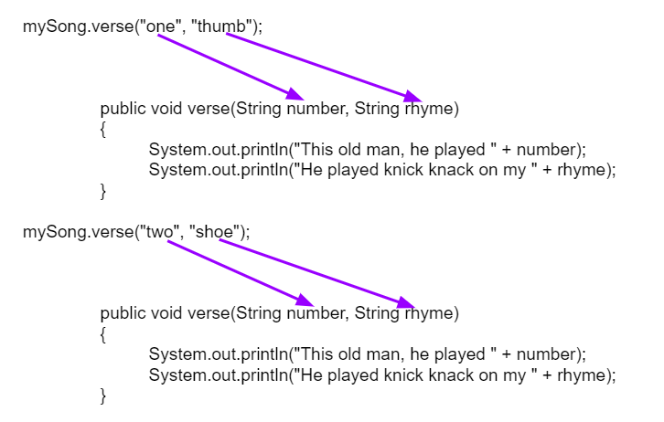
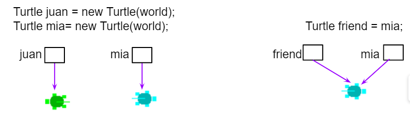

.. include:: ../common.rst

.. qnum::
   :prefix: 5-6-
   :start: 1

.. index::
    single: method
    single: return
    single: parameter
    single: argument
    single: abstraction
    pair: method; parameter
    pair: method; argument
    pair: method; return

|Time90|

Writing Methods
=================

Up until this unit, you wrote all your code in the main method, but now we are using lots of methods. Why have multiple methods instead of just one? **Procedural Abstraction** allows us to name a block of code as a method and call it whenever we need it, abstracting away the details of how it works.  This serves to organize our code by function and reduce its complexity and reduce the repetition of code. In addition, it helps with debugging and maintenance since changes to that block of code only need to happen in one place. Here are some of the main reasons to use multiple methods in your programs:

- Organization and Reducing Complexity: organize your program into small sections of code by function to reduce its complexity. Divide a problem into subproblems to solve it a piece at a time.
- Reusing Code: avoid repetition of code. Reuse code by putting it in a method and calling it whenever needed.
- Maintainability and Debugging: smaller methods are easier to debug and understand than searching through a large main method.

Let's look at an example with lots of repetition of code and create methods to reduce the repetition of code. You can sing along here https://www.youtube.com/watch?v=Di23O5cN4ZU&ab_channel=Rock%27NLearn .

|Exercise| Check Your Understanding

.. clickablearea:: repeatedcode
    :question: Click on all the lines that are completely identical and repeated.
    :iscode:
    :feedback: Look for lines that are completely identical.

    :click-incorrect:public static void main(String args[]) {:endclick:
        :click-incorrect:System.out.println("This old man, he played one.");:endclick:
        :click-incorrect:System.out.println("He played knick knack on my thumb. ");:endclick:
        :click-correct:System.out.println("With a knick knack paddy whack, give a dog a bone.");:endclick:
        :click-correct:System.out.println("This old man came rolling home.");:endclick:
        :click-incorrect:System.out.println("This old man, he played two.");:endclick:
        :click-incorrect:System.out.println("He played knick knack on my shoe. ");:endclick:
        :click-correct:System.out.println("With a knick knack paddy whack, give a dog a bone.");:endclick:
        :click-correct:System.out.println("This old man came rolling home.");:endclick:
    :click-incorrect:}:endclick:

Did you find some repeated lines of the `This Old Man song <https://www.youtube.com/watch?v=Di23O5cN4ZU&ab_channel=Rock%27NLearn>`_? You may have noticed that the chorus is repeated "With a knick knack paddy whack, give a dog a bone. This old man came rolling home." When you see repeated code, that is a signal for you to make a new method!

There are three steps to creating and calling a method:

1. **Object of the Class**: Declare an object of your class in the main method or from outside the class.

    .. code-block:: java

       // Step 1: declare an object in main or from outside the class
       Classname objectName = new Classname();

2. **Method Call**: whenever you want to use the method, call objectName.methodName();

    .. code-block:: java

       // Step 2: call the object's method
       objectName.methodName(); //Step 2

3. **Method Definition**:  write the method's **header** and **body** code like below:

    .. code-block:: java

        // Step 3: Define the method in the class
        // method header
        public void methodName()
        {
              // method body for the code
        }

For example, here is a chorus() method definition that we could write for the "This Old Man Song":

.. code-block:: java

        public void chorus()
        {
              System.out.println("With a knick knack paddy whack, give a dog a bone.");
              System.out.println("This old man came rolling home.");
        }

.. |Java visualizer| raw:: html

   <a href="http://www.pythontutor.com/visualize.html#code=public%20class%20Song%20%0A%20%20%7B%20%0A%20%20%20%20//%20The%20chorus%20method%0A%20%20%20%20public%20void%20chorus%28%29%20%0A%20%20%20%20%7B%0A%20%20%20%20%20%20%20System.out.println%28%22With%20a%20knick%20knack%20paddy%20whack,%20give%20a%20dog%20a%20bone.%22%29%3B%0A%20%20%20%20%20%20%20System.out.println%28%22This%20old%20man%20came%20rolling%20home.%22%29%3B%0A%20%20%20%20%7D%0A%20%20%20%20%0A%20%20%20%20public%20static%20void%20main%28String%20args%5B%5D%29%20%0A%20%20%20%20%7B%0A%20%20%20%20%20%20Song%20mySong%20%3D%20new%20Song%28%29%3B%0A%20%20%20%20%20%20System.out.println%28%22This%20old%20man,%20he%20played%20one.%22%29%3B%0A%20%20%20%20%20%20System.out.println%28%22He%20played%20knick%20knack%20on%20my%20thumb.%20%22%29%3B%0A%20%20%20%20%20%20mySong.chorus%28%29%3B%0A%0A%20%20%20%20%20%20System.out.println%28%22This%20old%20man,%20he%20played%20two.%22%29%3B%0A%20%20%20%20%20%20System.out.println%28%22He%20played%20knick%20knack%20on%20my%20shoe.%20%22%29%3B%0A%20%20%20%20%20%20mySong.chorus%28%29%3B%0A%20%20%20%20%7D%0A%20%20%7D&cumulative=false&curInstr=22&heapPrimitives=nevernest&mode=display&origin=opt-frontend.js&py=java&rawInputLstJSON=%5B%5D&textReferences=false&curInstr=0" target="_blank"  style="text-decoration:underline">Java visualizer</a>

|CodingEx| **Coding Exercise**

.. activecode:: Song1
  :language: java
  :autograde: unittest
  :practice: T

  Run the following code to see the song This Old Man print out. Can you replace the last two lines in the second verse in the main method with a call the chorus() method instead? You can also see this code run in the |Java visualizer| by clicking on the Code Lens button.
  ~~~~
  public class Song
  {
      // The chorus method
      public void chorus()
      {
          System.out.println("With a knick knack paddy whack, give a dog a bone.");
          System.out.println("This old man came rolling home.");
      }

      public static void main(String args[])
      {
          Song mySong = new Song();
          System.out.println("This old man, he played one.");
          System.out.println("He played knick knack on my thumb. ");
          mySong.chorus();

          System.out.println("This old man, he played two.");
          System.out.println("He played knick knack on my shoe. ");
          // Can you replace these 2 lines with a method call to chorus()?
          System.out.println("With a knick knack paddy whack, give a dog a bone.");
          System.out.println("This old man came rolling home.");
      }
  }

  ====
  import static org.junit.Assert.*;

  import org.junit.*;

  import java.io.*;

  public class RunestoneTests extends CodeTestHelper
  {
      @Test
      public void testMain() throws IOException
      {
          String output = getMethodOutput("main");
          String expect =
                  "This old man, he played one.\n"
                      + "He played knick knack on my thumb.  \n"
                      + "With a knick knack paddy whack, give a dog a bone.\n"
                      + "This old man came rolling home.\n"
                      + "This old man, he played two.\n"
                      + "He played knick knack on my shoe. \n"
                      + "With a knick knack paddy whack, give a dog a bone.\n"
                      + "This old man came rolling home.";
          boolean passed = getResults(expect, output, "Expected output from main");
          assertTrue(passed);
      }

      @Test
      public void testChangedCode()
      {
          String origCode =
                  "public class Song\n"
                      + "{\n"
                      + "  // The chorus method\n"
                      + "  public void chorus()\n"
                      + "  {\n"
                      + "     System.out.println(\"With a knick knack paddy whack, give a dog a"
                      + " bone.\");\n"
                      + "     System.out.println(\"This old man came rolling home.\");\n"
                      + "  }\n\n"
                      + "  public static void main(String args[])\n"
                      + "  {\n"
                      + "    Song mySong = new Song();\n"
                      + "    System.out.println(\"This old man, he played one.\");\n"
                      + "    System.out.println(\"He played knick knack on my thumb. \");\n"
                      + "    mySong.chorus();\n\n"
                      + "    System.out.println(\"This old man, he played two.\");\n"
                      + "    System.out.println(\"He played knick knack on my shoe. \");\n"
                      + "    // Can you replace these 2 lines with a method call to chorus()?\n"
                      + "    System.out.println(\"With a knick knack paddy whack, give a dog a"
                      + " bone.\");\n"
                      + "    System.out.println(\"This old man came rolling home.\");\n"
                      + "  }\n"
                      + "}\n";

          boolean changed = codeChanged(origCode);

          assertTrue(changed);
      }

      @Test
      public void testcodeContains()
      {
          int count = countOccurences(getCode(), "mySong.chorus();");
          boolean passed = count > 1;
          passed =
                  getResults(
                          "> 1 chorus call",
                          count + " chorus call(s)",
                          "Added a call to chorus?",
                          passed);
          assertTrue(passed);
      }
  }

Parameters
-----------

You may have noticed more repetition in the song above. What about the lines of each verse? Notice that every word is repeated except the last ones that include a number and a rhyme such as one/thumb and two/shoe.

.. code-block:: java

    System.out.println("This old man, he played one.");
    System.out.println("He played knick knack on my thumb.");
    ...
    System.out.println("This old man, he played two.");
    System.out.println("He played knick knack on my shoe.");

We can make methods even more powerful and more abstract by giving them parameters for data that they need to do their job. We can make a method called verse that takes the number and the rhyme to print out any verse!

.. code-block:: java

    public void verse(String number, String rhyme)
    {
       System.out.println("This old man, he played " + number);
       System.out.println("He played knick knack on my " + rhyme);
    }

.. |visualizer| raw:: html

   <a href="http://www.pythontutor.com/visualize.html#code=public%20class%20Song%20%0A%20%20%7B%20%0A%20%20%20%20%0A%20%20%20%20/**%20Verse%0A%20%20%20%20%20*%20%40param%20number%20-%20a%20String%20like%20%22one%22,%20%22two%22,%20etc.%0A%20%20%20%20%20*%20%40param%20rhyme%20-%20a%20String%20like%20%22thumb%22,%20%22shoe%22,%20etc.%0A%20%20%20%20%20*/%0A%20%20%20%20%20public%20void%20verse%28String%20number,%20String%20rhyme%29%0A%20%20%20%20%20%7B%0A%20%20%20%20%20%20%20System.out.println%28%22This%20old%20man,%20he%20played%20%22%20%2B%20number%29%3B%0A%20%20%20%20%20%20%20System.out.println%28%22He%20played%20knick%20knack%20on%20my%20%22%20%2B%20rhyme%29%3B%0A%20%20%20%20%20%7D%0A%20%20%20%20%20%0A%20%20%20%20//%20The%20chorus%20method%0A%20%20%20%20public%20void%20chorus%28%29%20%0A%20%20%20%20%7B%0A%20%20%20%20%20%20%20System.out.println%28%22With%20a%20knick%20knack%20paddy%20whack,%20give%20a%20dog%20a%20bone.%22%29%3B%0A%20%20%20%20%20%20%20System.out.println%28%22This%20old%20man%20came%20rolling%20home.%22%29%3B%0A%20%20%20%20%7D%0A%20%20%20%20%0A%20%20%20%20%0A%20%20%20%20public%20static%20void%20main%28String%20args%5B%5D%29%20%0A%20%20%20%20%7B%0A%20%20%20%20%20%20Song%20mySong%20%3D%20new%20Song%28%29%3B%0A%20%20%20%20%20%20mySong.verse%28%22one%22,%20%22thumb%22%29%3B%0A%20%20%20%20%20%20mySong.chorus%28%29%3B%0A%20%20%20%20%20%20mySong.verse%28%22two%22,%20%22shoe%22%29%3B%0A%20%20%20%20%20%20mySong.chorus%28%29%3B%0A%20%20%20%20%7D%0A%20%20%7D&cumulative=false&curInstr=24&heapPrimitives=nevernest&mode=display&origin=opt-frontend.js&py=java&rawInputLstJSON=%5B%5D&textReferences=false&curInstr=0" target="_blank"  style="text-decoration:underline">Java visualizer</a>

|CodingEx| **Coding Exercise**

.. activecode:: Song2
  :language: java
  :autograde: unittest
  :practice: T

  Run the following code to see the song This Old Man print out using the verse and chorus methods.  You can also see this code run in the |visualizer| by clicking on the Show Code Lens button below. Can you add verse three with the rhyme "knee"? Can you add verse four with the rhyme "door"? How many verses do you know?
  ~~~~
  public class Song
  {

      /**
       * Verse - prints out a verse of the song
       *
       * @param number - a String like "one", "two", etc.
       * @param rhyme - a String like "thumb", "shoe", etc.
       */
      public void verse(String number, String rhyme)
      {
          System.out.println("This old man, he played " + number);
          System.out.println("He played knick knack on my " + rhyme);
      }

      // The chorus method
      public void chorus()
      {
          System.out.println("With a knick knack paddy whack, give a dog a bone.");
          System.out.println("This old man came rolling home.");
      }

      public static void main(String args[])
      {
          Song mySong = new Song();
          mySong.verse("one", "thumb");
          mySong.chorus();
          mySong.verse("two", "shoe");
          mySong.chorus();
      }
  }

  ====
  import static org.junit.Assert.*;

  import org.junit.*;

  import java.io.*;

  public class RunestoneTests extends CodeTestHelper
  {
      @Test
      public void testThree()
      {
          boolean passed = checkCodeContains("verse three", "mySong.verse(\"three\", \"knee\");");
          assertTrue(passed);
      }

      @Test
      public void testFour()
      {
          boolean passed = checkCodeContains("verse four", "mySong.verse(\"four\", \"door\");");
          assertTrue(passed);
      }
  }

When you create your own method, the variables you define for it in the method header are called **formal parameters**. When you call the method to do its job, you give or pass in **arguments** or **actual parameters** to it that are then saved in these local parameter variables.

When a method is called, the right method definition is found by checking the **method signature** or **header** at the top of the method definition to match the method name, the number of arguments, the data types for the arguments and the return type.

Here's what that looks like with the 2 method calls above. Notice how the parameter variables get new values with every method call.

    Figure 1: Matching Arguments to Parameters

Java uses **Call by Value** when it passes arguments to methods. This means that a copy of the value in the argument is saved in the parameter variable. If the parameter variable changes its value inside the method, the original value outside the method is not changed.

If you pass in an argument that holds a reference to an object, like a String or Person or Turtle object, a copy of this reference is passed in and saved in the parameter variable. The formal parameter and the actual parameter (argument) are then **aliases**, both refering to the same object. Java was designed this way to avoid copying large objects from method to method. Remember when we discussed reference aliases with turtle objects who are set equal to one another.

    Figure 2: Turtle Reference Equality

(Advanced topics warning): Although String objects are not mutable, the classes that you create will have mutable objects. If the reference parameter is for a mutable object, the method could change the actual object. However, it is good programming practice to not modify mutable objects that are passed as parameters unless required in the specification. Methods can even access the private data and methods of a parameter that is a reference to an object if the parameter is the same type as the method’s enclosing class. Note that Strings are immutable objects, so they cannot be changed by the method; only a new changed copy of them can be made.

Methods can also return values of any type back to the calling method. The calling method should do something with this return value, like printing it out or assigning it to a variable. Try the problems below to practice with a String method that takes a parameter and returns a boolean value.

|CodingEx| **Coding Exercise**

.. activecode:: StringFind
  :language: java
  :autograde: unittest
  :practice: T

  Run the following program which contains a method called findLetter that takes a letter and a text as parameters and uses a loop to see if that letter is in the text and returns true if it is, false otherwise. Set the variables ``letter`` and ``message`` to new values in the main method and run it again to try finding a different letter. Then, change the code of the findLetter method to return how many times it finds letter in text, using a new variable called ``count``. How would the return type change?
  ~~~~
  public class StringFind
  {
      /**
       * findLetter looks for a letter in a String
       *
       * @param String letter to look for
       * @param String text to look in
       * @return boolean true if letter is in text After running the code, change
       *     this method to return an int count of how many times letter is in the
       *     text.
       */
      public boolean findLetter(String letter, String text)
      {
          boolean flag = false;
          for (int i = 0; i < text.length(); i++)
          {
              if (text.substring(i, i + 1).equalsIgnoreCase(letter))
              {
                  flag = true;
              }
          }
          return flag;
      }

      public static void main(String args[])
      {
          StringFind test = new StringFind();
          String message = "Apples and Oranges";
          String letter = "p";
          System.out.println("Does " + message + " contain a " + letter + "?");
          System.out.println(test.findLetter(letter, message));
      }
  }

  ====
  import static org.junit.Assert.*;

  import org.junit.*;

  import java.io.*;

  public class RunestoneTests extends CodeTestHelper
  {
      @Test
      public void tryfindLetter() throws IOException
      {
          String message = "Apples and Oranges";
          String letter = "p";
          Object[] args = {letter, message};
          String output = getMethodOutput("findLetter", args);
          String expect = "2";

          boolean passed = getResults(expect, output, "findLetter(\"p\",\"Apples and Oranges\")");
          assertTrue(passed);
      }

      @Test
      public void tryfindLetter2() throws IOException
      {
          String message = "Test strings";
          String letter = "s";
          Object[] args = {letter, message};
          String output = getMethodOutput("findLetter", args);
          String expect = "3";

          boolean passed = getResults(expect, output, "findLetter(\"s\",\"Test strings\")");
          assertTrue(passed);
      }

      @Test
      public void test2()
      {
          boolean passed =
                  checkCodeContains(
                          "changed return type of findLetter",
                          "public int findLetter(String letter, String text)");
          assertTrue(passed);
      }

      @Test
      public void test1()
      {
          boolean passed = checkCodeContains("variable count set to 0", "int count = 0;");
          assertTrue(passed);
      }

      @Test
      public void test3()
      {
          String code = removeSpaces(getCode());
          boolean passed =
                  code.contains("count++;")
                          || code.contains("count=count+1;")
                          || code.contains("count=1+count;")
                          || code.contains("count+=1;")
                          || code.contains("++count;");
          passed =
                  getResults(
                          "count incremented",
                          Boolean.toString(passed),
                          "Count incremented?",
                          passed);
          assertTrue(passed);
      }
  }

|Groupwork| Programming Challenge : Song with Parameters
---------------------------------------------------------

.. |The Ants Go Marching| raw:: html

   <a href="https://youtu.be/QPwEZ8Vv2YQ" target="_blank">The Ants Go Marching</a>

Here's another song, |The Ants Go Marching|, that is very similar to the This Old Man song in its repetitive structure. Notice that the verses below have a lot of repeated words and phrases. Click on the words or phrases that are different in each verse. These will be the arguments that you will pass to the methods in your song code.

.. clickablearea:: differentAntsWords
    :question: Click on the phrases that are different in each verse.
    :iscode:
    :feedback: Look for words that are different in verse 1, 2, and 3.

    :click-incorrect:The ants go marching :endclick::click-correct:one by one:endclick::click-incorrect:, hurrah, hurrah:endclick:
    :click-incorrect:The ants go marching :endclick::click-correct:one by one:endclick::click-incorrect:, hurrah, hurrah:endclick:
    :click-incorrect:The ants go marching :endclick::click-correct:one by one:endclick:
    :click-incorrect:The little one stops to :endclick::click-correct:suck a thumb:endclick:
    :click-incorrect:And they all go marching down to the ground:endclick:
    :click-incorrect:To get out of the rain, BOOM! BOOM! BOOM! BOOM!:endclick:

    :click-incorrect:The ants go marching :endclick::click-correct:two by two:endclick::click-incorrect:, hurrah, hurrah:endclick:
    :click-incorrect:The ants go marching :endclick::click-correct:two by two:endclick::click-incorrect:, hurrah, hurrah:endclick:
    :click-incorrect:The ants go marching :endclick::click-correct:two by two:endclick:
    :click-incorrect:The little one stops to :endclick::click-correct:tie a shoe:endclick:
    :click-incorrect:And they all go marching down to the ground:endclick:
    :click-incorrect:To get out of the rain, BOOM! BOOM! BOOM! BOOM!:endclick:

    :click-incorrect:The ants go marching :endclick::click-correct:three by three:endclick::click-incorrect:, hurrah, hurrah:endclick:
    :click-incorrect:The ants go marching :endclick::click-correct:three by three:endclick::click-incorrect:, hurrah, hurrah:endclick:
    :click-incorrect:The ants go marching :endclick::click-correct:three by three:endclick:
    :click-incorrect:The little one stops to :endclick::click-correct:climb a tree:endclick:
    :click-incorrect:And they all go marching down to the ground:endclick:
    :click-incorrect:To get out of the rain, BOOM! BOOM! BOOM! BOOM!:endclick:

1. In the active code window below, create a method or methods that takes parameters to print out a verse. The method(s) should be abstract enough to work for all 3 verses.  Use good commenting for your methods that describe the @param. For the autograder, make sure you create a method called verse that takes 2 parameters.

2. In the main method, create an object of the class and call the method(s) you created in the last step to print out 3 verses of the song. Can you add more verses?

.. activecode:: challenge-5-6-song
  :language: java
  :autograde: unittest

  Create method(s) with parameters to print out verses of the song The Ants Go Marching. https://youtu.be/QPwEZ8Vv2YQ/The+Ants+Go+Marching
  ~~~~
  public class Song
  {
      // Create at least 1 method called verse that takes 2 parameters
      // that can be used to print out the verses of the song The Ants Go Marching

      public static void main(String args[])
      {
          // Create a Song object and call its method(s) to print out
          // the verses of The Ants Go Marching
          // There should be atleast 1 method called verse that takes 2 arguments.

      }
  }

  ====
  import static org.junit.Assert.*;

  import org.junit.*;

  import java.io.*;

  /* Do NOT change Main or CodeTestHelper.java.
  Put the active code exercise in a file like ForLoop.java.
  Put your Junit test in the file RunestoneTests.java.
  Run. Test by changing ForLoop.java (student code).
  */
  public class RunestoneTests extends CodeTestHelper
  {
      @Test
      public void checkCodeContains1()
      {
          // check verse 1
          boolean passed =
                  checkCodeContains(
                          "verse(...) method header with two String parameters",
                          "public void verse(String *, String *)");

          assertTrue(passed);
      }

      @Test
      public void checkCodeContains2()
      {
          boolean passed = checkCodeContains("a new Song object", "= new Song()");

          assertTrue(passed);
      }

      @Test
      public void checkCodeContains3()
      {
          // check static
          String code = getCode();
          int actual = countOccurences(code, ".verse(");
          String expected = "3";

          boolean passed = actual >= 3;
          getResults(
                  expected,
                  "" + actual,
                  "Checking that code contains three calls to verse(...) method using"
                      + " object.method(...) syntax",
                  passed);
          assertTrue(passed);
      }

      @Test
      public void testVerses() throws IOException
      {
          String output = getMethodOutput("main").replaceAll(" his ", " a ").replaceAll("\n\n", "\n");
          String[] actualArray = output.split("\n");

          boolean passed = true;
          String error = "";
          String expect = "No errors";
          String actual = "No errors";

          int j = 0;

          for (int i = 0; i < actualArray.length; i++)
          {
              while (j < expectedArray.length && expectedArray[j].length() < 2) j++;
              while (i < expectedArray.length && actualArray[i].length() < 2) i++;

              if (j < expectedArray.length && actualArray[i].length() > 1)
              {
                  /*
                   * System.out.println(expectedArray[j]);
                   * System.out.println(actualArray[i]);
                   * System.out.println();
                   */
                  if (actualArray[i].matches("[\\s\\S]*[0-9]+[\\s\\S]*"))
                  {
                      continue;
                  }

                  String compAct = removeSpaces(actualArray[i].toLowerCase());
                  String compExp = removeSpaces(expectedArray[j].toLowerCase());

                  if (!compAct.equals(compExp))
                  {
                      expect = expectedArray[j].trim();
                      actual = actualArray[i].trim() + "\n(Error on line " + (i + 1) + " of output)";
                      passed = false;
                      error =
                              "\n"
                                  + "There may be more than one error! Did you forget a line?\n"
                                  + "(check spelling, new lines, and punctuation carefully)";
                      break;
                  }
              }

              j++;
          }

          getResults(expect, actual, "Checking output from main" + error, passed);
          assertTrue(passed);
      }

      private static String expectedOutput =
              "The ants go marching one by one, hurrah, hurrah\n"
                      + "The ants go marching one by one, hurrah, hurrah\n"
                      + "The ants go marching one by one\n"
                      + "The little one stops to suck a thumb\n"
                      + "And they all go marching down to the ground\n"
                      + "To get out of the rain, BOOM! BOOM! BOOM! BOOM!\n"
                      + "\n"
                      + "The ants go marching two by two, hurrah, hurrah\n"
                      + "The ants go marching two by two, hurrah, hurrah\n"
                      + "The ants go marching two by two\n"
                      + "The little one stops to tie a shoe\n"
                      + "And they all go marching down to the ground\n"
                      + "To get out of the rain, BOOM! BOOM! BOOM! BOOM!\n"
                      + "\n"
                      + "The ants go marching three by three, hurrah, hurrah\n"
                      + "The ants go marching three by three, hurrah, hurrah\n"
                      + "The ants go marching three by three\n"
                      + "The little one stops to climb a tree\n"
                      + "And they all go marching down to the ground\n"
                      + "To get out of the rain, BOOM! BOOM! BOOM! BOOM!";
      private static String[] expectedArray = expectedOutput.replaceAll("\n\n", "\n").split("\n");
  }

|Groupwork| Design a Class for your Community
----------------------------------------------------------

.. |lesson 5.2| raw:: html

   <a href="https://runestone.academy/ns/books/published/csawesome/Unit5-Writing-Classes/topic-5-2-writing-constructors.html#groupwork-design-a-class-for-your-community" target="_blank">lesson 5.2</a>

In lessons 5.1 and 5.2, you came up with a class of your own choice relevant to your community.

1. Copy your class with its 3 instance variables, constructor, and its print() and main methods from |lesson 5.2| into the active code exercise below.

2. Create accessor (get) methods and mutator (set) methods for each of the instance variables.

3. Create a ``toString`` method that returns all the information in the instance variables.

4. Write an additional method for your class that takes a parameter. For example, there could be a print method with arguments that indicate how you want to print out the information, e.g. ``print(format)`` could print the data according to an argument that is "plain" or "table" where the data is printed in a table drawn with dashes and lines (``|``). Or come up with another creative method for your class.

5. Use these methods in the main method to test them. Make sure you use good commenting.

.. activecode:: community-challenge-5-6
  :language: java
  :autograde: unittest

  Copy your class from |lesson 5.2|. Add get, set, toString, and a method that takes a parameter. For example, there could be a print method with arguments that indicate how you want to print out the information, print(format) where format is "plain" or "table".
  ~~~~
  public class          // Add your class name here!
  {
      // 1. Copy your class instance variables, constructor, and print() from 5.2.

      // 2. Create accessor (get) and mutator (set) methods for each of the instance variables.

      // 3. Create a toString() method that returns all the information in the instance variables.
      // 4.  Add a method for your class that takes a parameter.
      // For example, there could be a print method with arguments that indicate
      // how you want to print out the information, print(format) where format is "plain" or "table".

      // 5. Test all the methods in the main method.
      public static void main(String[] args)
      {
         // Construct an object of your class

         // call the object's methods

      }
  }
  ====
  import static org.junit.Assert.*;

  import org.junit.*;

  import java.io.*;

  public class RunestoneTests extends CodeTestHelper
  {
      @Test
      public void testPrivateVariables()
      {
          String expect = "3 Private";
          String output = testPrivateInstanceVariables();
          boolean passed = false;
          if (Integer.parseInt(expect.substring(0, 1)) <= Integer.parseInt(output.substring(0, 1)))
              passed = true;
          passed = getResults(expect, output, "Checking private instance variable(s)", passed);
          assertTrue(passed);
      }

      /* @Test
      public void testDefaultConstructor()
      {
          String output = checkDefaultConstructor();
          String expect = "pass";

          boolean passed = getResults(expect, output, "Checking default constructor");
          assertTrue(passed);
      } */

      @Test
      public void testConstructor3()
      {
          String output = checkConstructor(3);
          String expect = "pass";

          boolean passed = getResults(expect, output, "Checking constructor with 3 parameters");
          assertTrue(passed);
      }

      @Test
      public void testPrint()
      {
          String output = getMethodOutput("print");
          String expect = "More than 15 characters";
          String actual = " than 15 characters";

          if (output.length() < 15)
          {
              actual = "Less" + actual;
          }
          else
          {
              actual = "More" + actual;
          }
          boolean passed = getResults(expect, actual, "Checking print method");
          assertTrue(passed);
      }

      @Test
      public void testMain() throws IOException
      {
          String output = getMethodOutput("main"); // .split("\n");
          String expect = "3+ line(s) of text";
          String actual = " line(s) of text";
          int len = output.split("\n").length;

          if (output.length() > 0)
          {
              actual = len + actual;
          }
          else
          {
              actual = output.length() + actual;
          }
          boolean passed = len >= 3;

          getResults(expect, actual, "Checking output", passed);
          assertTrue(passed);
      }

      @Test
      public void test1()
      {
          String code = getCode();
          String target = "public * get*()";

          int num = countOccurencesRegex(code, target);

          boolean passed = num >= 3;

          getResults("3", "" + num, "Checking accessor (get) methods for each variable", passed);
          assertTrue(passed);
      }

      @Test
      public void test2()
      {
          String code = getCode();
          String target = "public void set*(*)";

          int num = countOccurencesRegex(code, target);

          boolean passed = num >= 3;

          getResults("3", "" + num, "Checking mutator (set) methods for each variable", passed);
          assertTrue(passed);
      }

      @Test
      public void test3()
      {
          String target = "public String toString()";
          boolean passed = checkCodeContains("toString() method", target);
          assertTrue(passed);
      }

      @Test
      public void testPrintFormat()
      {
          String target = "public void print(String";
          boolean passed = checkCodeContains("print method with String argument", target);
          assertTrue(passed);
      }
  }

Summary
-------

- **Procedural Abstraction** (creating methods) reduces the complexity and repetition of code. We can name a block of code as a method and call it whenever we need it, abstracting away the details of how it works.

- A programmer breaks down a large problem into smaller subproblems by creating methods to solve each individual subproblem.

- To write methods, write a **method definition** with a **method signature** like "public void chorus()" and a **method body** in {} and method calls using an object.the method name and arguments whenever you need it to do its job.

- To call an object's method, you must use the object name and the dot (.) operator followed by the method name, for example **object.method();**

- When you call a method, you can give or pass in **arguments** or **actual parameters** to it inside the parentheses **object.method(arguments)**. The arguments are saved in local **formal parameter** variables that are declared in the method header, for example: public void method(type param1, type param2) { ... }.

- Values provided in the arguments in a method call need to correspond to the order and type of the parameters in the method signature.

- When an actual parameter is a primitive value, the formal parameter is initialized with a copy of that value. Changes to the formal parameter have no effect on the corresponding actual parameter.

- When an actual parameter is a reference to an object, the formal parameter is initialized with a copy of that reference, not a copy of the object. The formal parameter and the actual parameter are then aliases, both refering to the same object.

-  When an actual parameter is a reference to an object, the method or constructor could use this reference to alter the state of the original object. However, it is good programming practice to not modify mutable objects that are passed as parameters unless required in the specification.

AP Practice
-----------

.. mchoice:: AP5-6-1
    :practice: T

    Consider the following class, which uses the instance variable dollars to represent the money in a wallet in dollars.

    .. code-block:: java

        public class Wallet
        {
            private double dollars;

            public double putMoneyInWallet(int amount)
            {
                /* missing code */
            }
        }

    The putMoneyInWallet method is intended to increase the dollars in the wallet by the parameter amount and then return the updated dollars in the wallet. Which of the following code segments should replace  *missing code* so that the putMoneyInWallet method will work as intended?

    - .. code-block:: java

        amount += dollars;
        return dollars;

      - dollars should be incremented by amount.

    - .. code-block:: java

        dollars = amount;
        return amount;

      - dollars should be incremented by amount.

    - .. code-block:: java

        dollars += amount;
        return dollars;

      + Correct.

    - .. code-block:: java

        dollars = dollars + amount;
        return amount;

      - amount is returned instead of dollars.

    - .. code-block:: java

        amount = dollars + amount;
        return dollars;

      - dollars should be incremented by amount.

.. mchoice:: AP5-6-2
    :practice: T

    Consider the Liquid class below.

    .. code-block:: java

        public class Liquid
        {
            private int currentTemp;
            private int boilingPoint;

            public Liquid(int ct, int bp)
            {
                currentTemp = ct;
                boilingPoint = bp;
            }

            public boolean isBoiling(int amount)
            {
                /* missing code */
            }
        }

    The isBoiling method is intended to return true if increasing the currentTemp by the parameter amount is greater than or equal to the boilingPoint, or otherwise return false. Which of the following code segments can replace *missing code* to ensure that the isBoiling method works as intended?

    .. code-block:: java

       I.   if (currentTemp + amount < boilingPoint)
            {
                return false;
            }
            else
            {
                return true;
            }
       II.  if (amount > currentTemp)
            {
                return false;
            }
            else
            {
                return currentTemp;
            }
       III. if (amount + currentTemp >= boilingPoint)
            {
                return true;
            }
            else
            {
                return false;
            }

    - I only

      - I would work but it is not the only code that would work.

    - II only

      - II does not check against the boilingPoint and does not return only boolean values.

    - III only

      - III would work but it is not the only code that would work.

    - I and III only.

      + Correct!

    - I, II, III

      - II does not check against the boilingPoint and does not return only boolean values.
