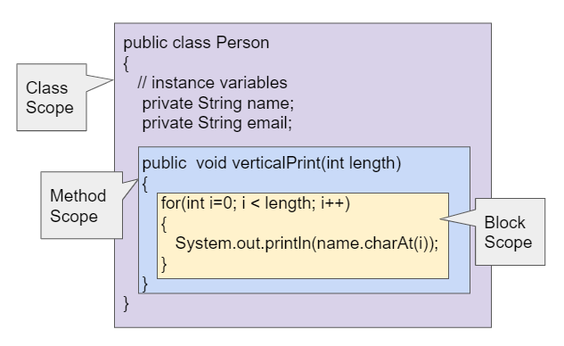

.. include:: ../common.rst

.. qnum::
   :prefix: 5-8-
   :start: 1

|Time45|

Scope and Access
=================

.. index::
    single: scope
    single: access
    single: local variable

The **scope** of a variable is defined as where a variable is accessible or can be used. The scope is determined by where you declare the variable when you write your programs. When you declare a variable, look for the closest enclosing curly braces (``{}``) -- this is its scope.

Java has 3 levels of scope that correspond to different types of variables:

- **Class Level Scope** for **instance variables** inside a class.

- **Method Level Scope** for **local variables** (including **parameter variables**) inside a method.

- **Block Level Scope** for **loop variables** and other local variables defined inside of blocks of code with { }.

The image below shows these 3 levels of scope.

    Figure 1: Class, Method, and Block Level Scope

|Exercise| Check Your Understanding

.. clickablearea:: name_class_scope
    :question: Click on all the variable declarations that are at Class Level Scope.
    :iscode:
    :feedback: Remember that the instance variables declared at the top of the class have Class Scope.

    :click-incorrect:public class Name:endclick:
    :click-incorrect:{:endclick:
        :click-correct:private String first;:endclick:
        :click-correct:public String last;:endclick:

        :click-incorrect:public Name(String theFirst, String theLast):endclick:
        :click-incorrect:{:endclick:
            :click-incorrect:String firstName = theFirst;:endclick:
            :click-incorrect:first = firstName;:endclick:
            :click-incorrect:last = theLast;:endclick:
        :click-incorrect:}:endclick:
    :click-incorrect:}:endclick:

.. clickablearea:: name_method_scope
    :question: Click on all the variable declarations that are at Method Level Scope.
    :iscode:
    :feedback: Remember that the parameter variables and the local variables declared inside a method have Method Level Scope.

    :click-incorrect:public class Name:endclick:
    :click-incorrect:{:endclick:
        :click-incorrect:private String first;:endclick:
        :click-incorrect:public String last;:endclick:

        public Name(:click-correct:String theFirst:endclick:, :click-correct:String theLast:endclick:)
        :click-incorrect:{:endclick:
            :click-correct:String firstName = theFirst;:endclick:
            :click-incorrect:first = firstName;:endclick:
            :click-incorrect:last = theLast;:endclick:
        :click-incorrect:}:endclick:
    :click-incorrect:}:endclick:

**Local variables** are variables that are declared inside a method, usually at the top of the method. These variables can only be used within the method and do not exist outside of the method. Parameter variables are also considered local variables that only exist for that method. It's good practice to declare any variables that are used by just one method as local variables in that method.

Instance variables at class scope are shared by all the methods in the class and can be marked as public or private with respect to their access outside of the class. They have Class scope regardless of whether they are public or private.

Another way to look at scope is that a variable's scope is where it lives and exists. You cannot use the variable in code outside of its scope. The variable does not exist outside of its scope.

|CodingEx| **Coding Exercise**

.. activecode:: PersonScope
  :language: java
  :autograde: unittest

  Try the following code to see that you cannot access the variables outside of their scope levels in the toString() method. Explain to someone sitting next to you why you can't access these. Try to fix the errors by either using variables that are in scope or moving the variable declarations so that the variables have larger scope.
  ~~~~
  public class Person
  {
      private String name;
      private String email;

      public Person(String initName, String initEmail)
      {
          name = initName;
          email = initEmail;
      }

      public String toString()
      {
          for (int i = 0; i < 5; i++)
          {
              int id = i;
          }
          // Can you access the blockScope variables i or id?
          System.out.println("i at the end of the loop is " + i);
          System.out.println("The last id is " + id);

          // Can toString() access parameter variables in Person()?
          return initName + ": " + initEmail;
      }

      // main method for testing
      public static void main(String[] args)
      {
          // call the constructor to create a new person
          Person p1 = new Person("Sana", "sana@gmail.com");
          System.out.println(p1);
      }
  }

  ====
  import static org.junit.Assert.*;

  import org.junit.*;

  import java.io.*;

  public class RunestoneTests extends CodeTestHelper
  {
      @Test
      public void testCodeContains()
      {
          boolean passed =
                  checkCodeContains("returning instance variables", "return  name + \": \" + email;");
          assertTrue(passed);
      }

      @Test
      public void testCodeContains2()
      {
          boolean passed =
                  checkCodeContains("declaration and initialization of id to 0", "int id = 0;");
          assertTrue(passed);
      }
  }

If there is a local variable with the same name as an instance variable, the variable name will refer to the local variable instead of the instance variable, as seen below. We'll see in the next lesson, that we can distinguish between the local variable and the instance variable using the keyword this to refer to this object's instance variables.

.. activecode:: PersonLocalVar
  :language: java
  :autograde: unittest

  In this example, the local variable is used instead of the instance variable of the same name. What will the code print out? Try it with the CodeLens button.
  ~~~~
  public class Person
  {
      private String name;
      private String email;

      public Person(String initName, String initEmail)
      {
          name = initName;
          email = initEmail;
      }

      public String toString()
      {
          String name = "unknown";
          // The local variable name here will be used,
          //  not the instance variable name.
          return name + ": " + email;
      }

      // main method for testing
      public static void main(String[] args)
      {
          // call the constructor to create a new person
          Person p1 = new Person("Sana", "sana@gmail.com");
          System.out.println(p1);
      }
  }

  ====
  import static org.junit.Assert.*;

  import org.junit.*;

  import java.io.*;

  public class RunestoneTests extends CodeTestHelper
  {
      @Test
      public void testMain() throws IOException
      {
          String output = getMethodOutput("main");
          String expect = "unknown: sana@gmail.com";
          boolean passed = getResults(expect, output, "Expected output from main", true);
          assertTrue(passed);
      }
  }

|Groupwork| Programming Challenge : Debugging
------------------------------------------------------------

.. activecode:: challenge-5-8-Debug
  :language: java
  :autograde: unittest
  :practice: T

  Debug the following program that has scope violations. You may need to add methods or use methods that are in the class Fraction appropriately. Then, add comments that label the variable declarations as class, method, or block scope.
  ~~~~
  public class TesterClass
  {
      public static void main(String[] args)
      {
          Fraction f1 = new Fraction();
          Fraction f2 = new Fraction(1, 2);
          System.out.println(f1);
          System.out.println(f2.numerator / f2.denominator);
      }
  }

  /** Class Fraction */
  class Fraction
  {
      //  instance variables
      private int numerator;
      private int denominator;

      // constructor: set instance variables to default values
      public Fraction()
      {
          int d = 1;
          numerator = d;
          denominator = d;
      }

      // constructor: set instance variables to init parameters
      public Fraction(int initNumerator, int initDenominator)
      {
          numerator = initNumerator;
          denominator = initDenominator;
      }

      public String toString()
      {
          // if the denominator is 1, then just return the numerator
          if (denominator == d)
          {
              int newNumerator = 1;
          }
          return newNumerator + "/" + denominator;
      }
  }

  ====
  import static org.junit.Assert.*;

  import org.junit.*;

  import java.io.*;

  public class RunestoneTests extends CodeTestHelper
  {
      public RunestoneTests()
      {
          super("TesterClass");
      }

      @Test
      public void test1()
      {
          String orig =
                  "public class TesterClass\n"
                      + "{\n"
                      + "   public static void main(String[] args)\n"
                      + "   {\n"
                      + "      Fraction f1 = new Fraction();\n"
                      + "      Fraction f2 = new Fraction(1,2);\n"
                      + "      System.out.println(f1);\n"
                      + "      System.out.println(f2.numerator / f2.denominator);\n"
                      + "   }\n"
                      + " }\n\n"
                      + "/** Class Fraction */\n"
                      + "class Fraction\n"
                      + "{\n"
                      + "   //  instance variables\n"
                      + "   private int numerator;\n"
                      + "   private int denominator;\n\n"
                      + "   // constructor: set instance variables to default values\n"
                      + "   public Fraction()\n"
                      + "   {\n"
                      + "      int d = 1;\n"
                      + "      numerator = d;\n"
                      + "      denominator = d;\n"
                      + "   }\n\n"
                      + "   // constructor: set instance variables to init parameters\n"
                      + "   public Fraction(int initNumerator, int initDenominator)\n"
                      + "   {\n"
                      + "      numerator = initNumerator;\n"
                      + "      denominator = initDenominator;\n"
                      + "   }\n\n"
                      + "   public String toString()\n"
                      + "   {\n"
                      + "     // if the denominator is 1, then just return the numerator\n"
                      + "     if (denominator == d) {\n"
                      + "        int newNumerator = 1;\n"
                      + "     }\n"
                      + "     return newNumerator + \"/\" + denominator;\n"
                      + "   }\n"
                      + "}\n";

          boolean passed = codeChanged(orig);
          assertTrue(passed);
      }

      @Test
      public void test2()
      {
          String expect = "1\n1/2";
          String actual = getMethodOutput("main");

          boolean passed = getResults(expect, actual, "Testing main()");
          assertTrue(passed);
      }

      @Test
      public void test3()
      {
          String code = getCodeWithoutComments();
          int count = countOccurences(code, "private");
          boolean passed = (count >= 2);
          getResults(
                  "2 private vars",
                  count + " private vars",
                  "Keep the instance variables private! Use other Fraction methods.",
                  passed);
          assertTrue(passed);
      }
  }

Summary
-------

- **Scope** is defined as where a variable is accessible or can be used.

- Local variables can be declared in the body of constructors and methods. These variables may only be used within the constructor or method and cannot be declared to be public or private.

- When there is a local variable with the same name as an instance variable, the variable name will refer to the local variable instead of the instance variable.

- Formal parameters and variables declared in a method or constructor can only be used within that method or constructor.

AP Practice
------------

.. mchoice:: AP5-8-1
   :practice: T
   :answer_a: The class is missing an accessor method.
   :answer_b: The instance variables boxesOfFood and numOfPeople should be designated public instead of private.
   :answer_c: The return type for the Party constructor is missing.
   :answer_d: The variable updatedAmountOfFood is not defined in eatFoodBoxes method.
   :answer_e: The Party class is missing a constructor
   :feedback_a: There is a scope violation.
   :feedback_b: There is a scope violation. Instance variables are usually private.
   :feedback_c: There is a scope violation. Constructors do not have return types.
   :feedback_d: There is a scope violation. The updatedAmountOfFood variable is a local variable in another method.
   :feedback_e: There is a scope violation.
   :correct: d

   Consider the following class definitions. Which of the following best explains why the class will not compile?

   .. code-block:: java

        public class Party
        {
            private int boxesOfFood;
            private int numOfPeople;

            public Party(int people, int foodBoxes)
            {
                numOfPeople = people;
                boxesOfFood = foodBoxes;
            }

            public void orderMoreFood(int additionalFoodBoxes)
            {
                int updatedAmountOfFood = boxesOfFood + additionalFoodBoxes;
                boxesOfFood = updatedAmountOfFood;
            }

            public void eatFoodBoxes(int eatenBoxes)
            {
                boxesOfFood = updatedAmountOfFood - eatenBoxes;
            }
        }

.. mchoice:: AP5-8-2
    :practice: T

    Consider the following class definition.

    .. code-block:: java

        public class Movie
        {
            private int currentPrice;
            private int movieRating;

            public Movie(int p, int r)
            {
                currentPrice = p;
                movieRating = r;
            }

            public int getCurrentPrice()
            {
                int currentPrice = 16;
                return currentPrice;
            }

            public void printPrice()
            {
                System.out.println(getCurrentPrice());
            }
        }

    Which of the following reasons explains why the printPrice method is "broken" and only ever prints out a value of 16?

    - The private variables currentPrice and movieRating are not properly initialized.

      - The constructor will initialize them.

    - The private variables currentPrice and movieRating should have been declared public.

      - Instance variables should be private.

    - The printPrice method should have been declared as private.

      - Methods are usually public.

    - currentPrice is declared as a local variable in the getCurrentPrice method and set to 16, and will be used instead of the instance variable currentPrice.

      + Correct!

    - The currentPrice instance variable does not have a value.

      - Accessor methods are usually public.

