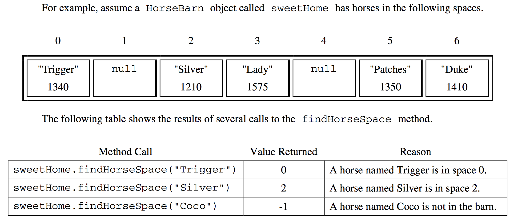

.. qnum::
   :prefix: 6-4-1-
   :start: 1

Free Response - Horse Barn A
-------------------------------

.. index::
    single: horse barn
    single: free response

The following FRQ is a great example of working with an array of objects. It is a variation of part a of a free response question from 2012.  It was question 3 on the exam.  You can see all the free response questions from past exams at https://apstudents.collegeboard.org/courses/ap-computer-science-a/free-response-questions-by-year.

The original question had an interface called Horse, but the problem below has been changed to a class Horse instead of the interface. Interfaces are no longer covered on the AP CSA exam. However, you can still solve problems that have interfaces in them by changing them to a class, since an interface just describes the methods that a class must have.

**Question 3.**  Consider a software system that models a horse barn.

.. code-block:: java

   public class Horse
   {
      /** @return the horse's name */
      public String getName()
      { implementation not shown }

      /** @return the horse's weight */
      public int getWeight()
      { implementation not shown }

      // There may be other methods that are not shown

   }

Another class called HorseBarn consists of N numbered spaces where each space can hold at most one horse. The spaces are indexed starting from 0; the index of the last space is N - 1. No two horses in the barn have the same name. The declaration of the HorseBarn class is shown below.

.. code-block:: java

   public class HorseBarn
   {
       /**
        * The spaces in the barn. Each array element holds a reference to the horse
        * that is currently occupying the space. A null value indicates an empty
        * space.
        */
       private Horse[] spaces;

       /**
        * Returns the index of the space that contains the horse with the specified
        * name. Precondition: No two horses in the barn have the same name.
        *
        * @param name the name of the horse to find
        * @return the index of the space containing the horse with the specified name;
        *     -1 if no horse with the specified name is in the barn.
        */
       public int findHorseSpace(String name)
       {
           /* to be implemented in part (a) */
       }
   }

**Part a.**  Write the HorseBarn method findHorseSpace. This method returns the index of the space in which the horse with the specified name is located. If there is no horse with the specified name in the barn, the method returns -1.

    Figure 1: Example calls and results

How to solve this problem
===========================

In order to find the index of the horse with the same name we are looking for, we will need to loop through the array ``spaces``. As we loop, we will compare the name we are looking for with the ``Horse`` object's name at the current index.
We will have to watch out for spaces that are empty (are null).  Click to reveal a practice problem about objects.

.. reveal:: frhba_r1
   :showtitle: Reveal Problem
   :hidetitle: Hide Problem
   :optional:

   .. mchoice:: frhba_1
        :answer_a: spaces[index].name;
        :answer_b: spaces[index].getName();
        :answer_c: spaces.get(index).getName();
        :correct: b
        :feedback_a: Getter methods are needed to access private class variables.
        :feedback_b: This is the syntax for getting the value of an element in an array.
        :feedback_c: This is the syntax for getting the value of an element in an arrayList.

        Which of the following correctly retrieves the name of a "Horse" object from the "spaces" array?

Once we have the name of the current ``Horse`` object, we need to compare this name to the name we are looking for. Click to reveal a practice problem about String comparisons.

.. reveal:: frhba_r2
   :showtitle: Reveal Problem
   :hidetitle: Hide Problem
   :optional:

   .. mchoice:: frhba_2
        :answer_a: str.compareTo(anotherString);
        :answer_b: str == anotherString;
        :answer_c: str.equals(anotherString);
        :correct: c
        :feedback_a: This String method is used for comparing two strings alphabetically. It returns 0 if they are equal so you would need to check the return value.
        :feedback_b: This would only return true if the two variables refer to the same object.
        :feedback_c: This String method will compare the characters in both strings and return true if they are the same.

        What is the best way to compare two strings for equality?

Try It!
========

Try to write the code for the method ``findHorseSpace`` in the ``HorseBarn`` class. When you are ready click "Run" to test your solution.  There are 3 tests so if you only see output for 1 or 2 check for errors below the code.

.. activecode:: lcfrhba1
   :language: java
   :autograde: unittest

   FRQ HorseBarn A: Write the method findHorseSpace.
   ~~~~
   class Horse
   {
       private String name;
       private int weight;

       public Horse(String theName, int theWeight)
       {
           this.name = theName;
           this.weight = theWeight;
       }

       public String getName()
       {
           return this.name;
       }

       public int getWeight()
       {
           return this.weight;
       }

       public String toString()
       {
           return "name: " + this.name + " weight: " + this.weight;
       }
   }

   public class HorseBarn
   {
       private Horse[] spaces;

       /**
        * Constructor that takes the number of stalls
        *
        * @param numStalls - the number of stalls in the barn
        */
       public HorseBarn(int numStalls)
       {
           spaces = new Horse[numStalls];
       }

       /**
        * Returns the index of the space that contains the horse with the specified
        * name. * Precondition: No two horses in the barn have the same name.
        *
        * @param name the name of the horse to find
        * @return the index of the space containing the horse with the specified name;
        *     -1 if no horse with the specified name is in the barn.
        */
       public int findHorseSpace(String name) {}

       public String toString()
       {
           String result = "";
           Horse h = null;
           for (int i = 0; i < spaces.length; i++)
           {
               h = spaces[i];
               result = result + "space " + i + " has ";
               if (h == null)
               {
                    result = result + " null \n";
               }
               else 
               {
                   result = result + h.toString() + "\n";
               }
           }
           return result;
       }

       public static void main(String[] args)
       {
           HorseBarn barn = new HorseBarn(7);
           barn.spaces[0] = new Horse("Trigger", 1340);
           barn.spaces[2] = new Horse("Silver", 1210);
           barn.spaces[3] = new Horse("Lady", 1575);
           barn.spaces[5] = new Horse("Patches", 1350);
           barn.spaces[6] = new Horse("Duke", 1410);

           // print out what is in the barn
           System.out.println(barn);

           // test
           System.out.println(
                   "Index of Trigger should be 0 and is "
                           + barn.findHorseSpace("Trigger"));
           System.out.println(
                   "Index of Silver should be 2 and is "
                           + barn.findHorseSpace("Silver"));
           System.out.println(
                   "Index of Coco should be -1 and is "
                           + barn.findHorseSpace("Coco"));
       }
   }

   ====
   import static org.junit.Assert.*;

   import org.junit.*;

   import java.io.*;
   import java.lang.reflect.Field;

   public class RunestoneTests extends CodeTestHelper
   {
       @Test
       public void testMain() throws IOException
       {
           String output = getMethodOutput("main");
           String expect =
                   "Index of Trigger should be 0 and is 0\n"
                       + "Index of Silver should be 2 and is 2\n"
                       + "Index of Coco should be -1 and is -1";

           boolean passed = removeSpaces(output).contains(removeSpaces(expect));

           getResults(expect, output, "Expected output from main", passed);
           assertTrue(passed);
       }

       @Test
       public void test1()
       {
           HorseBarn barn = new HorseBarn(7);

           try
           {
               Field barnField = HorseBarn.class.getDeclaredField("spaces");
               barnField.setAccessible(true);

               Horse[] spaces = (Horse[]) barnField.get(barn);

               spaces[1] = new Horse("Trigger", 1340);
               spaces[3] = new Horse("Silver", 1210);
               spaces[4] = new Horse("Lady", 1575);
               spaces[6] = new Horse("Patches", 1350);
               spaces[0] = new Horse("Duke", 1410);

               String expected = "3";
               String actual = "" + barn.findHorseSpace("Silver");

               String msg =
                       "Checking findHorseSpace(\"Silver\") with [\"Duke\", \"Trigger\", null,"
                           + " \"Silver\", \"Lady\", null, \"Patches\"]";
               boolean passed = getResults(expected, actual, msg);
               assertTrue(passed);

           }
           catch (Exception e)
           {
               getResults("", "", "There was a error with the testing code.", false);
               fail();
           }
       }

       @Test
       public void test2()
       {
           HorseBarn barn = new HorseBarn(7);

           try
           {
               Field barnField = HorseBarn.class.getDeclaredField("spaces");
               barnField.setAccessible(true);

               Horse[] spaces = (Horse[]) barnField.get(barn);

               spaces[1] = new Horse("Trigger", 1340);
               spaces[3] = new Horse("Silver", 1210);
               // spaces[4] = new Horse("Lady", 1575);
               spaces[6] = new Horse("Patches", 1350);
               spaces[0] = new Horse("Duke", 1410);

               String expected = "-1";
               String actual = "" + barn.findHorseSpace("Lady");

               String msg =
                       "Checking findHorseSpace(\"Lady\") with [\"Duke\", \"Trigger\", null,"
                           + " \"Silver\", null, null, \"Patches\"]";
               boolean passed = getResults(expected, actual, msg);
               assertTrue(passed);

           }
           catch (Exception e)
           {
               getResults("", "", "There was a error with the testing code.", false);
               fail();
           }
       }
   }

Video - One way to code the solution
=====================================

.. the video is 2012Q3A.mov

The following video is also on YouTube at https://youtu.be/sk9i_mhrc5M.  It walks through coding a solution.

.. youtube:: sk9i_mhrc5M
    :width: 800
    :align: center

