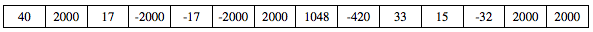

.. qnum::
   :prefix: 6-4-4-
   :start: 1

Free Response - Sound A
=======================

..    index::
    single: sounda
    single: free response

The following is a free response question from 2011.  It was question 1 on the exam.  You can see all the free response questions from past exams at https://apstudents.collegeboard.org/courses/ap-computer-science-a/free-response-questions-by-year.

**Question 1.**  Digital sounds can be represented as an array of integer values. For this question, you will write two unrelated methods of the *Sound* class.

A partial declaration of the ``Sound`` class is shown below.

.. code-block:: java

   public class Sound
   {
       /** the array of values in this sound; guaranteed not to be null */
       private int[] samples;

       /** Changes those values in this sound that have an amplitude
        *  greater than limit */
        *  Values greater than limit are changed to limit.
        *  @param limit the amplitude limit
        *         Precondition: limit >= 0
        *  @return the number of values in this sound that this
        *         method changed
        */
       public int limitAmplitude(int limit)
       { /* to be implemented in part (a) */ }

       /** Removes all silence from the beginning of this sound.
        *  Silence is represented by a value of 0.
        *  Precondition: samples contains at least one nonzero value
        *  Postcondition: the length of samples reflects the removal
        *               of starting silence
        */
       public void trimSilenceFromBeginning()
       { /* to be implemented in part (b) */ }

       // There may be instance variables, constructors, and methods
       // that are not shown.
   }

**Part a.** The volume of a sound depends on the amplitude of each value in the sound. The amplitude of a value is its absolute value. For example, the amplitude of -2300 is 2300 and the amplitude of 4000 is 4000.

Write the method ``limitAmplitude`` that will change any value that has an amplitude greater than the
given limit. Values that are greater than ``limit`` are replaced with ``limit``, and values that are less than
``-limit`` are replaced with ``–limit``. The method returns the total number of values that were changed in
the array. For example, assume that the array samples has been initialized with the following values.

.. figure:: Figures/soundTable.png
  :width: 592px
  :align: center
  :figclass: align-center

When the statement

.. code-block:: java

  int numChanges = limitAmplitude(2000);

is executed, the value of ``numChanges`` will be 5, and the array ``samples`` will contain the following values.

How to Solve This
--------------------

Click to reveal problems and the algorithm to help you write your solution.

.. reveal:: soundA_algorithm_r1
   :showtitle: Reveal Algorithm
   :hidetitle: Hide Algorithm
   :optional:

   We will have to loop through each value in the array and compare the value to the limit. We will need to keep track of the number of values changed.

   If the current value is greater than the
   limit, it should be reset to the limit and the count of the values changed should be incremented.

   If the current value is less than the negative of the limit, then it should be reset to the negative of the limit and the count of values should be incremented.

   We will have to return the count of values changed.

.. reveal:: fr_sounda_r1
   :showtitle: Reveal Problems
   :hidetitle: Hide Problems
   :optional:

   .. mchoice:: fr_sounda_1
        :answer_a: while
        :answer_b: for
        :answer_c: for-each
        :correct: b
        :feedback_a: You could use a while loop, but if you are looping through all values in an array it is better to use a for loop.  It is easier to make mistakes with a while loop and forget to increment a value in the body of the loop so that the loop eventually stops.
        :feedback_b: Use a for loop when you want to loop through all or part of an array and need to change some of the values in the array.
        :feedback_c: You could use a for-each loop to loop through all of the values in the array, but you wouldn't be able to change the values.

        Which loop would be best for this problem?

   .. mchoice:: fr_sounda_2
        :answer_a: samples[i].set(-limit);
        :answer_b: samples[i] = limit;
        :answer_c: samples[i] = -limit;
        :correct: c
        :feedback_a: There is no set method on arrays.
        :feedback_b: This would set the value at index i to limit rather than the negative of the limit.
        :feedback_c: This will set the value at index i to the negative of the limit.

        Which is the correct code for changing the current value to the negative of the limit?

Mixed Up Code
-------------------

Click to reveal the Mixed Up Code for the solution of this problem.

.. reveal:: soundA_parsons
    :showtitle: Reveal Mixed Up Code
    :hidetitle: Hide Mixed Up Code

    .. parsonsprob:: SoundA
      :numbered: left
      :adaptive:

      The method ``limitAmplitude`` below contains the correct code for a solution to this problem, but the code blocks are mixed up.  Drag the blocks from the left to the right and put them in order with the correct indentation so that the code would work correctly.
      -----
      public int limitAmplitude(int limit) 
      {
      =====
        int numChanged = 0;
        for (int i = 0; i < samples.length; i++)
        {
      =====
           if (samples[i] > limit)
           {
      =====
              samples[i] = limit;
              numChanged++;
      =====
           } // end first if
           if (samples[i] < -limit)
           {
      =====
              samples[i] = -limit;
              numChanged++;
      =====
            } // end second if
      =====
        } // end for
      =====
        return numChanged;
      =====
      } // end method

Try and Solve Part A
--------------------

.. activecode:: FRQSoundA
   :language: java
   :autograde: unittest

   FRQ Sound A: Write the method ``limitAmplitude`` that will change any value that has an amplitude greater than the given limit. Values that are greater than ``limit`` are replaced with ``limit``, and values that are less than ``-limit`` are replaced with ``–limit``. The method returns the total number of values that were changed in the array.  The ``main`` method has code to test your solution.
   ~~~~
   import java.util.Arrays;

   public class Sound
   {
       // the array of values in this sound; guaranteed not to be null
       private int[] samples =
       {
           40, 2532, 17, -2300, -17, -4000, 2000, 1048, -420, 33, 15, -32, 2030, 3223
       };

       /**
        * Changes those values in this sound that have an amplitude greater than limit
        * Values greater than limit are changed to limit.
        *
        * @param limit the amplitude limit Precondition: limit >= 0
        * @return the number of values in this sound that this method changed
        */
       public int limitAmplitude(int limit)
       {
           // Complete this method
       }

       public static void main(String[] args)
       {

           Sound s = new Sound();
           System.out.println("The original array is: " + Arrays.toString(s.samples));
           System.out.println(
                   "limitAmplitude(2000) should return 5 "
                           + "and returned "
                           + s.limitAmplitude(2000));
           System.out.println("The changed array is: " + Arrays.toString(s.samples));
       }
   }

   ====
   import static org.junit.Assert.*;

   import org.junit.*;

   import java.io.*;
   import java.lang.reflect.Field;
   import java.util.Arrays;

   public class RunestoneTests extends CodeTestHelper
   {
       @Test
       public void testMain()
       {
           String output = getMethodOutput("main");
           String expect =
                   "40, 2000, 17, -2000, -17, -2000, 2000, 1048, -420, 33, 15, -32, 2000, 2000";
           boolean passed = output.contains(expect);

           expect =
                   "The original array is: [40, 2532, 17, -2300, -17, -4000, 2000, 1048, -420, 33, 1\n"
                       + "5, -32, 2030, 3223]\n"
                       + "limitAmplitude(2000) should return 5 and returned 5\n"
                       + "The changed array is: [40, 2000, 17, -2000, -17, -2000, 2000, 1048, -420,"
                       + " 33, 15, -32, 2000, 2000]";

           getResults(expect, output, "Checking output from main()", passed);
           assertTrue(passed);
       }

       @Test
       public void test1()
       {
           Sound s = new Sound();

           String expected = "8";
           String actual = "" + s.limitAmplitude(75);

           String msg = "Checking limitAmplitude(75) return value";
           boolean passed = getResults(expected, actual, msg);
           assertTrue(passed);
       }

       @Test
       public void test2()
       {
           Sound s = new Sound();
           s.limitAmplitude(75);

           try
           {
               Field sampleField = Sound.class.getDeclaredField("samples");
               sampleField.setAccessible(true);

               int[] samples = (int[]) sampleField.get(s);

               String expected = "[40, 75, 17, -75, -17, -75, 75, 75, -75, 33, 15, -32, 75, 75]";
               String actual = Arrays.toString(samples);

               String msg = "Checking limitAmplitude(75) array results";
               boolean passed = getResults(expected, actual, msg);
               assertTrue(passed);

           }
           catch (Exception e)
           {
               getResults("", "", "There was a error with the testing code.", false);
               fail();
           }
       }
   }

