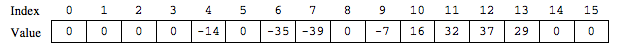

.. qnum::
   :prefix: 6-4-5-
   :start: 1

Free Response - Sound B
=======================

.. index::
    single: soundb
    single: free response

The following is a free response question from 2011.  It was question 1 on the exam.  You can see all the free response questions from past exams at https://apstudents.collegeboard.org/courses/ap-computer-science-a/free-response-questions-by-year.

**Question 1.**  Digital sounds can be represented as an array of integer values. For this question, you will write two unrelated methods of the *Sound* class.

A partial declaration of the ``Sound`` class is shown below.

.. code-block:: java

   public class Sound
   {
    /** the array of values in this sound; guaranteed not to be null */
    private int[] samples;

    /** Changes those values in this sound that have an amplitude
     *  greater than limit */
     *  Values greater than limit are changed to limit.
     *  @param limit the amplitude limit
     *         Precondition: limit >= 0
     *  @return the number of values in this sound that this
     *    method changed
     */
    public int limitAmplitude(int limit)
    { /* to be implemented in part (a) */ }

    /** Removes all silence from the beginning of this sound.
     *  Silence is represented by a value of 0.
     *  Precondition: samples contains at least one nonzero value
     *  Postcondition: the length of samples reflects the
     *                  removal of starting silence
     */
    public void trimSilenceFromBeginning()
    { /* to be implemented in part (b) */ }

    // There may be instance variables, constructors, and methods
    // that are not shown.
   }

**Part b.** Recorded sound often begins with silence. Silence in a sound is represented by a value of 0.

Write the method ``trimSilenceFromBeginning`` that removes the silence from the beginning of a
sound. To remove starting silence, a new array of values is created that contains the same values as the
original ``samples`` array in the same order but without the leading zeros. The instance variable ``samples``
is updated to refer to the new array. For example, suppose the instance variable ``samples`` refers to the
following array.

After ``trimSilenceFromBeginning`` has been called, the instance variable ``samples`` will refer to the following array.

.. figure:: Figures/soundTable4.png
  :width: 470px
  :align: center
  :figclass: align-center

How to Solve This
--------------------

Click to reveal problems and the algorithm to help you write your solution.

.. reveal:: soundB_algorithm_r1
   :showtitle: Reveal Algorithm
   :hidetitle: Hide Algorithm
   :optional:

   1. You will need to loop through each element in the array until you reach a non-zero element. You will also need to keep track of the number of leading zeros.
   2. Remember that you must replace the samples array with a new array without the leading zeros.  How do you create an array of a particular size?

.. reveal:: fr_soundb_r1
   :showtitle: Reveal Problems
   :hidetitle: Hide Problems
   :optional:

   .. mchoice:: fr_soundb_1
        :answer_a: while
        :answer_b: for
        :answer_c: for-each
        :correct: a
        :feedback_a: A while loop is the best choice when you don't know the number of times you need to loop.
        :feedback_b: You could use a for loop, but typically a while loop is used when you want to loop while a condition is true.
        :feedback_c: A for-each loop would only allow you to loop through all the values, but you first want to loop while there are leading zeros.

        Which loop would be best for this problem?

   .. mchoice:: fr_soundb_2
        :answer_a: int[] samples2;
        :answer_b: int[] samples2 = new Array(count);
        :answer_c: int[] samples2 = new int[count];
        :correct: c
        :feedback_a: This only declares the variable samples2 which will refer to an array of integers, it doesn't create the array object.
        :feedback_b: The new keyword is not used to create an array.
        :feedback_c: This will create an array of integers of size count and a variable named samples2 which will refer to that array.

        Which is the correct code for creating an integer array variable named ``samples2`` and setting it to refer to an array of integers of size ``count``?

Mixed Up Code
-------------------

Click to reveal the Mixed Up Code for the solution of this problem.

.. reveal:: soundB_parsons
    :showtitle: Reveal Mixed Up Code
    :hidetitle: Hide Mixed Up Code

    .. parsonsprob:: SoundB
      :numbered: left
      :adaptive:

      The method ``trimSilenceFromBeginning`` below contains correct code for one solution to this problem, but it is mixed up.  Drag the code blocks from the left to the right and put them in order with the correct indention so that the code would work correctly.
      -----
      public void trimSilenceFromBeginning() 
      {
        int i = 0;
      =====
        while (this.samples[i] == 0)
        {
      =====
           i++;
      =====
        } // end while
      =====
        int samplesLen = this.samples.length;
        int[] newSamples = new int[samplesLen - i];
      =====
        for (int j = 0; j < newSamples.length; j++)
        {
      =====
           newSamples[j] = this.samples[j+i];
      =====
        } // end for
      =====
        this.samples = newSamples;
      =====
      } // end method

Try and Solve Part B
--------------------

.. activecode:: FRQSoundB
   :language: java
   :autograde: unittest

   FRQ Sound B: Finish writing the method ``trimSilenceFromBeginning`` below that removes the silence from the beginning of a sound. To remove starting silence, a new array of values is created that contains the same values as the original ``samples`` array in the same order but without the leading zeros. The instance variable ``samples`` is updated to refer to the new array.
   ~~~~
   import java.util.Arrays;

   public class Sound
   {
       /** the array of values in this sound; guaranteed not to be null */
       private int[] samples =
       {
           0, 0, 0, 0, -14, 0, -35, -39, 0, -7, 16, 32, 37, 29, 0, 0
       };

       /**
        * Removes all silence from the beginning of this sound. Silence is represented
        * by a value of 0. Precondition: samples contains at least one nonzero value
        * Postcondition: the length of samples reflects the removal of starting
        * silence
        */
       public void trimSilenceFromBeginning()
       {
           // Complete this method
       }

       public static void main(String[] args)
       {

           Sound s = new Sound();

           System.out.println(
                   "The original array of samples is " + Arrays.toString(s.samples));
           s.trimSilenceFromBeginning();
           System.out.println(
                   "The new array of samples is " + Arrays.toString(s.samples));
           System.out.println(
                   "The length of the new array should be 12 and is "
                           + s.samples.length);
       }
   }

   ====
   import static org.junit.Assert.*;

   import org.junit.*;

   import java.io.*;
   import java.lang.reflect.Field;

   public class RunestoneTests extends CodeTestHelper
   {
       @Test
       public void testMain()
       {
           String output = getMethodOutput("main");
           String expect = "-14, 0, -35, -39, 0, -7, 16, 32, 37, 29, 0, 0";

           boolean passed = output.contains(expect);

           expect =
                   "The original array of samples is [0, 0, 0, 0, -14, 0, -35, -39, 0, -7, 16, 32, 37,"
                       + " 29, 0, 0]\n"
                       + "The new array of samples is [-14, 0, -35, -39, 0, -7, 16, 32, 37, 29, 0, 0]";

           getResults(expect, output, "Checking output from main()", passed);
           assertTrue(passed);
       }

       @Test
       public void test2()
       {
           Sound s = new Sound();
           s.trimSilenceFromBeginning();

           try
           {
               Field sampleField = Sound.class.getDeclaredField("samples");
               sampleField.setAccessible(true);

               int[] samples = (int[]) sampleField.get(s);

               String expected = "12";
               String actual = "" + samples.length;

               String msg = "Checking samples array length after trimSilenceFromBeginning()";
               boolean passed = getResults(expected, actual, msg);
               assertTrue(passed);

           }
           catch (Exception e)
           {
               getResults("", "", "There was a error with the testing code.", false);
               fail();
           }
       }
   }

