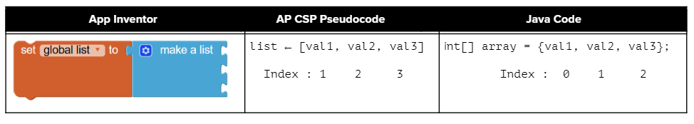
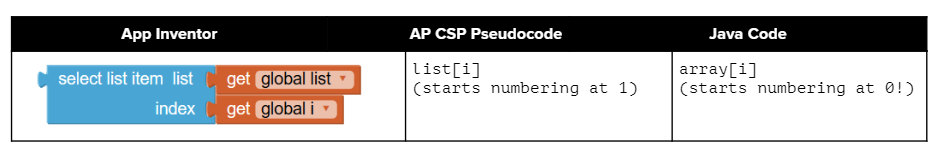

.. include:: ../common.rst

.. qnum::
   :prefix: 6-1-
   :start: 1

|Time90|

Array Creation and Access
==========================

.. index::
   single: array
   single: index
   pair: array; index

To keep track of 10 exam scores, we could declare 10 separate variables:  int score1, score2, score3, … , score10;
But what if we had 100 exam scores? That would be a lot of variables! Most programming languages have a simple **data structure** for a collection of related data that makes this easier. In many block-based programming languages like App Inventor and Scratch, this is called a list. In Java and many programming languages, this is called an **array**.

An **array** is a block of memory that stores a collection of data items (**elements**) of the same type under one name. Arrays are useful whenever you have many elements of data of the same type that you want to keep track of, but you don't need to name each one. Instead you use the array name and a number (called an **index**) for the position of an item in the array. You can make arrays of ints, doubles, Strings, and even classes that you have written like Students.

.. |video| raw:: html

   <a href="https://youtu.be/G7aF-OuLfl4" target="_blank">video</a>

Here's a fun |video| that introduces the concept of an array and gives an example.

.. youtube:: G7aF-OuLfl4
    :width: 640
    :height: 415
    :align: center

An array is like a row of small lockers, except that you can't cram lots of stuff into it. You can only store one value at each locker.

.. figure:: Figures/rowLockers.jpg
    :width: 400px
    :align: center
    :figclass: align-center

    Figure 1: A row of lockers

You can store a value in an array using an **index** (location in the array). An array index is like a locker number.  It helps you find a particular place to store your stuff and retrieve stuff.    You can get or store a value from or to an array using an index.

Arrays and lists in most programming languages start counting elements from the number 0, so the first element in an array is at index 0. This is similar to how Strings are indexed in Java -- the first character is at index 0.  If you used App Inventor in the past, you might remember that list elements there start at 1 instead of 0, so make sure you remember that in Java, arrays start the index at 0!

    Figure 2: Comparing App Inventor lists and Java arrays

.. shortanswer:: arrayAnalogy

   Can you think of another example of something that is like an array (like a row of lockers)?

Declaring and Creating an Array
-------------------------------

When we declare a variable, we specify its type and then the variable name.  To make a variable into an array, we put square brackets after the data type. For example, ``int[] scores`` means we have an array called scores that contains int values.

.. code-block:: java

   // Declaration for a single int variable
   int score;
   // Declaration for an array of ints
   int[] scores;

The declarations do not create the array.  Arrays are **objects** in Java, so any variable that declares an array holds a reference to an object.  If the array hasn't been created yet and you try to print the value of the variable, it will print **null** (meaning it doesn't reference any object yet).

There are two ways to create an array. You can use the keyword **new** to get new memory or use an **initializer list** to set up the values in the array.

.. |video2| raw:: html

   <a href="https://youtu.be/IbPFjw1FNkE" target="_blank">video</a>

Watch the following |video2| which shows the two ways of creating an array with a physical model of Java memory.

.. youtube:: IbPFjw1FNkE
    :width: 650
    :height: 415
    :align: center

Using new to Create Arrays
--------------------------

To create an empty array after declaring the variable, use the **new** keyword with the type and the size of the array (the number of elements it can hold). This will actually create the array in memory.  You can do the declaration and the creation all in one step, see the String array names below. The size of an array is set at the time of creation and cannot be changed after that.

.. code-block:: java

  //declare an array variable
  int[] highScores;
  // create the array
  highScores = new int[5];
  // declare and create array in 1 step!
  String[] names = new String[5];

|Exercise| **Check Your Understanding**

.. mchoice:: createarray
   :practice: T
   :answer_a: int[] prices = new int[10];
   :answer_b: double[] prices = new double[10];
   :answer_c: double[] prices;
   :answer_d: double[10] prices = new double[];
   :correct: b
   :feedback_a: We need double for money amounts in prices.
   :feedback_b: Yes correct!
   :feedback_c: This declares the array but does not create it with new.
   :feedback_d: This is not the correct syntax.

   Which of the following creates an array of 10 doubles called prices?

|CodingEx| **Coding Exercise**

.. activecode:: lcab1
   :language: java
   :autograde: unittest
   :practice: T

   In the following code, add another two more array declarations, one that creates an array of 5 doubles called prices and another of 5 Strings called names. Then add ``System.out.println`` calls to print their lengths.
   ~~~~
   public class Test1
   {
       public static void main(String[] args)
       {
           // Array example
           int[] highScores = new int[10];
           // Add an array of 5 doubles called prices.

           // Add an array of 5 Strings called names.

           System.out.println(
                   "Array highScores declared with size " + highScores.length);
           // Print out the length of the new arrays
       }
   }

   ====
   import static org.junit.Assert.*;

   import org.junit.*;

   import java.io.*;

   public class RunestoneTests extends CodeTestHelper
   {
       public RunestoneTests()
       {
           super("Test1");
       }

       @Test
       public void testDouble() throws IOException
       {
           String target = "new double[5];";
           boolean passed = checkCodeContains(target);
           assertTrue(passed);
       }

       @Test
       public void testString() throws IOException
       {
           String target = "new String[5];";
           boolean passed = checkCodeContains(target);
           assertTrue(passed);
       }
   }

.. index::
   pair: array; initialization

.. note::

   Array elements are initialized to default values like the following.

   - 0 for elements of type ``int``
   - 0.0 for elements of type ``double``
   - false for elements of type ``boolean``
   - null for elements of type ``String``

.. figure:: Figures/arrayIndicies.png
    :width: 200px
    :align: center
    :figclass: align-center

    Figure 3: Two 5 element arrays with their values set to the default values for integer and object arrays.

Initializer Lists to Create Arrays
------------------------------------

Another way to create an array is to use an **initializer list**. You can initialize (set) the values in the array to a list of values in curly braces (``{}``) when you create it, like below.  In this case you don't specify the size of the array, it will be determined from the number of values that you specify.

.. code-block:: java

  int[ ] highScores = {99,98,98,88,68};
  String[ ] names = {"Jamal", "Emily", "Destiny", "Mateo", "Sofia"};

When you create an array of a **primitive type** (like ``int``) with initial values specified, space is allocated for the specified number of items of that type and the values in the array are set to the specified values.  When you create an array of an **object type** (like ``String``) with initial values, space is set aside for that number of object references.  The objects are created and the object references set so that the objects can be found.

.. figure:: Figures/intAndStringArrays.png
    :width: 500
    :align: center
    :figclass: align-center

    Figure 4: A primitive array and an object array

.. |video3| raw:: html

   <a href="https://youtu.be/T-YZvVvPOac" target="_blank">video</a>

Watch the following |video3| which shows an array of String objects with a physical model of Java memory.

.. youtube:: T-YZvVvPOac
    :width: 650
    :height: 415
    :align: center

.. index::
    single: dot-notation
    pair: array; length

Array length
--------------------------

Arrays know their length (how many elements they can store).  It is a public read-only instance variable so you can use **dot-notation** to access the instance variable (``arrayName.length``).  **Dot-notation** is using variable name followed by a ``.`` and then the instance variable (property) name or a method name. Try the following.

|CodingEx| **Coding Exercise**

.. activecode:: lcab2
   :language: java
   :autograde: unittest

   Try running the code below to see the length. Try adding another value to the highScores initializer list and run again to see the length value change.
   ~~~~
   public class Test2
   {
       public static void main(String[] args)
       {
           int[] highScores = {99, 98, 98, 88, 68};
           System.out.println(highScores.length);
       }
   }

   ====
   // Test for Lesson 6.1.2 - While Loop FindAndReplace lclw1
   import static org.junit.Assert.*;

   import org.junit.*;

   import java.io.*;

   public class RunestoneTests extends CodeTestHelper
   {
       public RunestoneTests()
       {
           super("Test2");
       }

       @Test
       public void testMain() throws IOException
       {
           String output = getMethodOutput("main").trim();
           String expect = "6";

           // boolean pass = !output.equals(expect.trim());

           boolean passed = getResults(expect, output, "Did you add another value?");
           assertTrue(passed);
       }

       @Test
       public void testChangedCode()
       {
           String origCode =
                   "public class Test2 { public static void main (String [] args) { int [] highScores"
                       + " = {99,98,98,88,68}; System.out.println(highScores.length); } }";

           boolean changed = codeChanged(origCode);

           assertTrue(changed);
       }
   }

.. note::

   Note that length is an instance variable and not a method, unlike the String ``length()`` method, so you don't add parentheses after length.  However, if you use parentheses after length during the exam, you won't lose any points. The length instance variable is declared as a ``public final int``.  ``public`` means you can access it and ``final`` means the value can't change.

|Exercise| **Check your understanding**

.. mchoice:: qab_2
   :practice: T
   :answer_a: <code>highScores.length</code>
   :answer_b: <code>highScores.length - 1</code>
   :correct: b
   :feedback_a: Remember that the first element in an array starts at index 0. If the length (the number of elements) of the array is 5, at what index would you find the last element?
   :feedback_b: Since the first element in an array is at index 0 the last element is the length minus 1.

   Which index is for the last element of an array called ``highScores``?

Access and Modify Array Values
-------------------------------------

To access the items in an array, we use an **indexed array variable** which is the array name and the index inside of square bracket [ ]. Remember that an **index** is a number that indicates the position of an item in a list, starting at 0. Here's a comparison of App Inventor, AP CSP Pseudocode, and Java array access.

    Figure 5: Comparing Access to App Inventor lists and Java arrays

An indexed variable like **arrayname[index]** can be used anywhere a regular variable can be used, for example to assign a new value or to get a value from the array like below.

.. code-block:: java

  // assign a new value 99 to the first element in the array
  highScores[0] = 99;
  // print the first element of the array
  System.out.println( highScores[0] );

.. note::

    The first value in an array is stored at index 0 and the index of the last value is the length of the array minus one (since the first index is 0). Use arrayname[index] to access or modify array items.

.. |video4| raw:: html

   <a href="https://youtu.be/uagEJw6bTM4" target="_blank">video</a>

Watch the following |video4| which shows a physical model of Java memory setting array values.

.. youtube:: uagEJw6bTM4
    :width: 650
    :height: 415
    :align: center

|Exercise| **Check your understanding**

.. fillintheblank:: array-access1

    Fill in the blank with code to access the cars array. NOTE: The semicolon is provided for you after the box.

   String[] cars = {"Honda", "Volvo", "BMW"};

   // Access cars array to get Volvo

   String v = |blank|;

   -   :cars\[1\]: Correct.
       :x: Use the array name cars with [ ] with a number in it. Don't use spaces or ; in your answer!

.. fillintheblank:: array-access2

    Fill in the blank with code to access the cars array.  

   String[] cars = {"Honda", "Volvo", "BMW"};

   // Set the first item of the cars array to be Toyota

   |blank|  = "Toyota";

   -   :cars\[0\]: Correct.
       :x: Use the array name cars with [ ] with a number in it. Remember which index is for the first item in the array. Don't use spaces in your answer!

If you want to keep track of the top 5 highest scores in a game and the names of the people with those scores, you could use two **parallel arrays**.  One array could keep track of the scores and the other the names. You have to make sure you keep them in the same order so that the same index can be used to get correponding names and scores.

|CodingEx| **Coding Exercise**

.. activecode:: array-set
   :language: java
   :autograde: unittest

   Try out the following code which has two parallel arrays, highScores and names. Can you print out Mateo's score? Can you change Sofia's score to 97 using an assignment statement in the code? Can you change the arrays so that they have 6 elements and add your name and score and print them out?
   ~~~~
   public class Test1
   {
       public static void main(String[] args)
       {
           // declare, create, initialize arrays
           int[] highScores = {99, 98, 98, 88, 68};
           String[] names = {"Jamal", "Emily", "Destiny", "Mateo", "Sofia"};

           // Print corresponding names and scores
           System.out.println(names[0] + " has a score of " + highScores[0]);
           System.out.println(names[1] + " has a score of " + highScores[1]);
       }
   }

   ====
   // Test for Lesson 6.1.2 - While Loop FindAndReplace lclw1

   import static org.junit.Assert.*;

   import org.junit.*;

   import java.io.*;

   public class RunestoneTests extends CodeTestHelper
   {
       public RunestoneTests()
       {
           super("Test1");
       }

       @Test
       public void test1() throws IOException
       {
           String output = getMethodOutput("main");
           String expect = "Jamal has a score of 99\nEmily has a score of 98";

           boolean passed = !output.equals(expect);

           passed = getResults(expect, output, "Did you change the main?", passed);
           assertTrue(passed);
       }

       @Test
       public void test2() throws IOException
       {
           String output = getMethodOutput("main");
           String expect = "Mateo has a score of 88";

           boolean passed = output.contains("Mateo");

           passed = getResults(expect, output, "Did you print out Mateo?", passed);
           assertTrue(passed);
       }
   }

What happens if you try to access an element that is not there? Try to access a ``highScore`` or ``name`` at index 7 above to see what happens. The index must be between 0 and the length of the array - 1 or it will give an error message called ``ArrayIndexOutOfBoundsException``.

.. note::

    Using an index value outside of 0 - (length-1) will result in an ArrayIndexOutOfBoundsException being thrown.

One powerful feature in the array **data abstraction** is that we can use variables for the index! As long as the variable holds an integer, we can use it as an index.

.. code-block:: java

  // use a variable for the index
  int index = 3;
  System.out.println(  highScores[index] );

|CodingEx| **Coding Exercise**

Here's a fun String array of image filenames. The following code displays an online image using an HTML tag. (Note that this just works in this Active Code window which interprets HTML. In other Java IDEs you would need to use Java Swing graphics instead). Run the code and see that it displays images[0] which is "cow.jpg". The images array holds 5 images.

.. activecode:: imageArray
   :language: java
   :autograde: unittest

   Can you change the index variable's value so that it prints out the puppy image? Can you print out the reindeer? Try all of them! What indices did you need to use? Then try using a random number for the index instead. Remember that (int)(Math.random()*max) will return a number from 0 up to max. What's the maximum number it can be for this array?
   ~~~~
   public class ImageEx
   {
       public static void main(String[] args)
       {
           String[] images =
           {
               "cow.jpg", "kitten.jpg", "puppy.jpg", "pig.jpg", "reindeer.jpg"
           };

           ImageEx obj = new ImageEx();
           // Change index to see different images in the array!
           // Can you have it pick out a random image?
           int index = 0;
           obj.printHTMLimage(images[index]);
       }

       // This method will just work in Active Code which interprets html
       public void printHTMLimage(String filename)
       {
           String baseURL =
                   "https://raw.githubusercontent.com/bhoffman0/CSAwesome/master/_sources/Unit6-Arrays/6-1-images/";
           System.out.print("");
       }
   }

    ====
    import static org.junit.Assert.*;

    import org.junit.*;

    import java.io.*;

    // ActiveCode imageArray
    public class RunestoneTests extends CodeTestHelper
    {
        @Test
        public void testCode()
        {
            String code = getCode();
            String expect = "int index = 0;";

            boolean passed = !code.contains(expect);

            getResults("index not 0", passed + "", "Changed index to another value", passed);
            assertTrue(passed);
        }

        @Test
        public void testRandomAdded()
        {
            boolean passed = checkCodeContains("Math.random to set index", "Math.random");
            assertTrue(passed);
        }
    }

|Groupwork| Programming Challenge : Countries Array
---------------------------------------------------------

In this challenge, you will create a guide to different countries using arrays.

1. Use the Active Code window below to create 4 parallel arrays and initialize them using initialization lists that represent the data below. Remember that the order of these arrays has to match so that you can use the same index and get corresponding values out.

  - **Countries:** China, Egypt, France, Germany, India, Japan, Kenya, Mexico, United Kingdom, United States
  - **Capitals:** Beijing, Cairo, Paris, Berlin, New Delhi, Tokyo, Nairobi, Mexico City, London, Washington D.C.
  - **Languages:** Chinese, Arabic, French, German, Hindi, Japanese, Swahili, Spanish, English, English
  - **Filenames for map images:** China.jpg, Egypt.jpg, France.jpg, Germany.jpg, India.jpg, Japan.jpg, Kenya.jpg, Mexico.jpg, UK.jpg, US.jpg

2. You are encouraged to add additional country, capital, and language names that match in position in the parallel arrays to represent your family origins or places you would like to visit. Although we do not have image files for each country in the CSAwesome map images, we do have regional map images called south-america.png, central-america.png, north-america.png, asia-pacific.png, europe.png, africa.png, and middle-east.png which you can use. Note that these are png files and not jpg. If you create more maps for your project, you can have your teacher share it in the teaching-csawesome google group to contribute to this map image collection.

3. Choose a random number using Math.random() and the **length** of one of the arrays and save it in a variable called index.

4. Print out the country name, its capital, and its language, and the map image for that country using the random index to access the corresponding item in each parallel array. For the images, the ``printHTMLimage`` method has been given to get the image URL online and print it out as an HTML image.

5. Optional Extra Challenge: If you have more time for this project, you can combine what you learned in the last unit to **refactor** your code (which means restructure without changing the functionality) to make it object-oriented. Create a Country class that stores the country name, capital, language, and image file. In the main method, create an array of 10 Country objects with the data for each country passed to its constructor, and use a random number to choose a country object from the array and display its attributes. See the array of turtles in the next section below for help on how to create an array of objects.

.. activecode:: challenge-1-6-countries
   :language: java
   :autograde: unittest

   public class Countries
   {
       public static void main(String[] args)
       {
           // 1. Declare 4 arrays and initialize them to the given values.
           // Countries: China, Egypt, France, Germany, India, Japan, Kenya, Mexico,
           // United Kingdom, United States
           // Capitals: Beijing, Cairo, Paris, Berlin, New Delhi, Tokyo, Nairobi,
           // Mexico City, London, Washington D.C.
           // Languages: Chinese, Arabic, French, German, Hindi, Japanese, Swahili,
           // Spanish, English, English
           // Filenames for map images: China.jpg, Egypt.jpg, France.jpg, Germany.jpg,
           // India.jpg, Japan.jpg, Kenya.jpg, Mexico.jpg, UK.jpg, US.jpg

           // 2. Pick a random number up to the length of one of the arrays and save
           // in the variable index

           // 3. Print out the info in each array using the random index

           // Example of showing image files using an array called images (your array
           // name above may be different)
           // (this will only work in Active Code)
           // Countries obj = new Countries();
           // obj.printHTMLimage( images[index] );

       }

       // This method will just work in Active Code which interprets html
       public void printHTMLimage(String filename)
       {
           String baseURL =
                   "https://raw.githubusercontent.com/bhoffman0/CSAwesome/master/_sources/Unit6-Arrays/6-1-images/";
           System.out.print("");
       }
   }

     ====
     // Test for Lesson 6.1 - challenge
     import static org.junit.Assert.*;

     import org.junit.*;

     import java.io.*;

     public class RunestoneTests extends CodeTestHelper
     {
         public RunestoneTests()
         {
             super("Countries");
         }

         @Test
         public void test1() throws IOException
         {
             String output = getMethodOutput("main");
             String expect = "Country Capital Language Image";

             int len = expect.split(" ").length;

             boolean passed = len == 4 && output.contains(".jpg");

             passed = getResults(expect, expect, "Did you print all the info?", passed);
             assertTrue(passed);
         }

         @Test
         public void test2() throws IOException
         {
             String output = getMethodOutput("main");
             String expect = " 3;

             passed =
                     getResults(
                             "> 3 Countries",
                             difft + " countries",
                             "Can pick a random different country > 3 times?",
                             passed);
             assertTrue(passed);
         }

         @Test
         public void testArrays() throws IOException
         {
             // System.out.println(program);
             String code = getCode();

             int arrays = countOccurences(code, "String[]");

             boolean passed =
                     getResults(
                             "5 x String[]", arrays + " x String[]", "Did you declare 4 String arrays? (the 5th one is main's arg)");
             assertTrue(passed);
         }
     }

|Groupwork| Design an Array of Objects for your Community
----------------------------------------------------------

So far, we have seen arrays of ints and Strings, but we can create an array of any type.
For example, the following program creates an array of Turtle objects.
Notice that for an array of objects, we must call the constructor of each object to
initialize the array elements, for example ``array[index] = new ClassName();``.
And we can use ``array[index].method()`` to call a method of an object in the array.

.. code-block:: java

   // Declaring an array of objects type ClassName
   ClassName[] array = new ClassName[size];
   // initialize array element by calling ClassName constructor
   array[index] = new ClassName();
   // call a method of the object in the array at index
   array[index].method();

.. activecode:: TurtleArray
    :language: java
    :autograde: unittest
    :datafile: turtleClasses.jar

    Run the code below to see the 2 turtles in the array.
    Can you change the array size to 3 and create and add 1 more Turtle object to the array?
    Make this new turtle turnRight and go forward using its indexed array variable.
    ~~~~
    import java.awt.*;
    import java.util.*;

    public class TurtleArray
    {
        public static void main(String[] args)
        {
            World world = new World(300, 300);
            // Declare an array for 2 Turtle objects
            Turtle[] turtarray = new Turtle[2];
            // Initialize the array elements by constructing each turtle object
            turtarray[0] = new Turtle(world);
            turtarray[1] = new Turtle(world);
            // Call each turtle's methods
            turtarray[0].forward();
            turtarray[1].turnLeft();
            turtarray[1].forward();

            world.show(true);
        }
    }

    ====
    import static org.junit.Assert.*;

    import org.junit.*;

    import java.io.*;

    public class RunestoneTests extends CodeTestHelper
    {
        @Test
        public void testArrayDeclaration() throws IOException
        {
            boolean passed = checkCodeContains("an array declaration of size 3", "Turtle[3]");
            assertTrue(passed);
        }

        @Test
        public void testInit()
        {
            boolean passed =
                    checkCodeContains("initialization for array element 2", "[2] = new Turtle");
            assertTrue(passed);
        }

        @Test
        public void testprint()
        {
            boolean passed = checkCodeContains("call forward() of array element 2", "[2].forward();");
            assertTrue(passed);
        }
    }

.. |lesson 5.6| raw:: html

   <a href="https://runestone.academy/ns/books/published/csawesome/Unit5-Writing-Classes/topic-5-6-writing-methods.html#groupwork-design-a-class-for-your-community" target="_blank">lesson 5.6</a>

In Unit 5, you came up with a class of your own choice relevant to you or your
community.  In this unit, you will create an array to hold objects of your class.

1. Copy your class from |lesson 5.6| below.

2. In the main method, create an array of 3 objects of your class.

3. Initialize array elements indexed 0 to 2 to new objects of your class using its constructor.

4. Call the print method of each object in the array using the array index.

.. activecode:: community-challenge-6-1
  :language: java
  :autograde: unittest

  Community Challenge: Copy your class from |lesson 5.6| below. Create an array of 3 objects of your class, initialize
  them to new objects and call their print methods.
  ~~~~
  public class          // Add your class name here!
  {
      // 1. Copy your class from lesson 5.6 below.

      public static void main(String[] args)
      {
         // 2. Create an array of 3 objects of your class.

         // 3. Initialize array elements 0-2 to new objects of your class.

         // 4. Call the print method of each object in the array using the array index.

      }
  }
  ====
  import static org.junit.Assert.*;

  import org.junit.*;

  import java.io.*;

  public class RunestoneTests extends CodeTestHelper
  {
      @Test
      public void testArrayDeclaration() throws IOException
      {
          boolean passed = checkCodeContains("an array declaration of size 3", "[3]");
          assertTrue(passed);
      }

      @Test
      public void testObjs() throws IOException
      {
          String code = getCode();
          String target = "new";
          int count = countOccurences(code, target);
          boolean passed = (count >= 4);
          getResults(
                  "4+ " + target,
                  count + "+ " + target,
                  "Did you declare 3 objects of your class using new and your constructor?",
                  passed);
          assertTrue(passed);
      }

      @Test
      public void testInit()
      {
          boolean passed = checkCodeContains("initialization for array element 0", "[0]=");
          assertTrue(passed);
      }

      @Test
      public void testprint()
      {
          boolean passed = checkCodeContains("call to print() of array element 0", "[0].print");
          assertTrue(passed);
      }

      @Test
      public void testMain() throws IOException
      {
          String output = getMethodOutput("main"); // .split("\n");
          String expect = "3+ line(s) of text";
          String actual = " line(s) of text";
          int len = output.split("\n").length;

          if (output.length() > 0)
          {
              actual = len + actual;
          }
          else
          {
              actual = output.length() + actual;
          }
          boolean passed = len >= 3;

          getResults(expect, actual, "Checking output", passed);
          assertTrue(passed);
      }
  }

Summary
--------------------------

- Arrays represent collections of related data all of the same data type.

- The size of an array is established at the time of creation and cannot be changed.

- Arrays can store either primitive data or object reference data.

- When an array is created using the keyword new, all of its elements are initialized with a specific value based on the type of elements:

  - Elements of type int are initialized to 0
  - Elements of type double are initialized to 0.0
  - Elements of type boolean are initialized to false
  - Elements of a reference type are initialized to the reference value null. No objects are automatically created.

- Initializer lists can be used to create and initialize arrays.

- Square brackets ([ ]) are used to access and modify an element in an array using an index. The indexed array variable, for example array[index], can be used anywhere a regular variable can be used, for example to get or assign values.

- The valid index values for an array are 0 through one less than the number of elements in the array, inclusive. Using an index value outside of this range will result in an ArrayIndexOutOfBoundsException being thrown.

AP Practice
------------

We will see in the next lesson that the index of an array is often a variable named ``i``
that is used in loops to traverse an array.
In challenging AP problems, you will see mathematical expressions inside the square brackets (``[]``).
For example, ``array[i-1]`` refers to the previous element right before the ith element in array,
and ``array[i+1]`` refers to the next element after the ith element.  In the problems below, note that
arrays can be passed in as arguments to methods and returned as values, just like any variable.

.. mchoice:: AP6-1-1
        :practice: T
        :answer_a: [8, 20, 30]
        :answer_b: [4, 8, 15]
        :answer_c: [8, 10, 15]
        :answer_d: [4, 10, 20]
        :answer_e: [4, 8, 30]
        :correct: d
        :feedback_a: This would only be true if all elements were doubled by the method.
        :feedback_b: This would only be true if the call was ``mystery(array, 1)``. Remember that array indexing starts at 0.
        :feedback_c: This would only be true if the method body had ``a[i-1] = a[i-1] * 2;``
        :feedback_d: Correct. array[2] = array[1] * 2 = 10 * 2 = 20.
        :feedback_e: Note that only 1 array element is changed.

        Consider the following method. Given an ``array`` initialized to ``{4, 10, 15}``, which of the following represents the contents of the array after a call to ``mystery(array, 2)``?

        .. code-block:: java

           public void mystery(int[] a, int i)
           {
              a[i] = a[i-1] * 2;
           }

.. mchoice:: AP6-1-2
        :practice: T

        Consider the following method. Which of the following code segments, appearing in the same class as the ``mystery`` method,
        will result in ``array2`` having the contents ``{5, 10, 20}``?

        .. code-block:: java

           public int[] mystery(int[] a, int i, int value)
           {
              a[i + 1] = a[i] + value;
              return a;
           }

        - .. code-block:: java

            int[] array1 = {5, 10, 15};
            int[] array2 = mystery(array1, 0, 10);

          - This would result in ``{5, 15, 15}``.

        - .. code-block:: java

            int[] array1 = {5, 15, 20};
            int[] array2 = mystery(array1, 0, 0);

          - This would result in ``{5, 5, 20}``.

        - .. code-block:: java

            int[] array1 = {5, 10, 15};
            int[] array2 = mystery(array1, 1, 10);

          + Correct! a[i+1] = a[2] = a[i] + value = a[1] + 10 = 10 + 10 = 20.

        - .. code-block:: java

            int[] array1 = {5, 15, 20};
            int[] array2 = mystery(array1, 2, 0);

          - This would result in an ``ArrayIndexOutOfBoundsException``.

        - .. code-block:: java

            int[] array1 = {5, 10, 15};
            int[] array2 = mystery(array1, 1, 20);

          - This would result in ``{5, 10, 30}``.

Arrays Game
--------------------------

.. |game| raw:: html

   <a href="https://csa-games.netlify.app/" target="_blank">game</a>

Try the game below to practice arrays. Click on **Arrays** and click on the element of the * array that would be printed out by the given code. If you're stuck, check on Labels to see the indices. We encourage you to work in pairs and see how high a score you can get.

.. raw:: html

    <iframe height="700px" width="100%" style="margin-left:10%;max-width:80%" src="https://csa-games.netlify.app/"></iframe>
    
