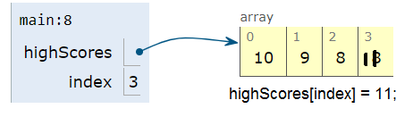
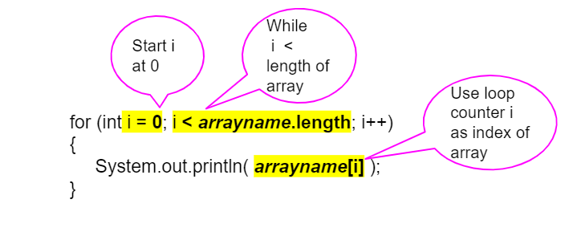

.. include:: ../common.rst

.. qnum::
   :prefix: 6-2-
   :start: 1

|Time90|

Traversing Arrays with For Loops
==========================================

Index Variables
-----------------------

In the last lesson, we mentioned that you can use a variable for the index of an array. You can even do math with that index and have an arithmetic expression inside the [], like below.

.. code-block:: java

  // highScores array declaration
  int[] highScores = { 10, 9, 8, 8};
  // use a variable for the index
  int index = 3;
  // modify array value at index
  highScores[index] = 11;
  // print array value at index
  System.out.println(  highScores[index] );
  System.out.println(  highScores[index - 1] );

.. |visualizer| raw:: html

   <a href="http://www.pythontutor.com/visualize.html#code=public%20class%20ArrayWithIndexVar%20%7B%0A%20%20%20%20public%20static%20void%20main%28String%5B%5D%20args%29%20%7B%0A%20%20%20%20%20%20//%20highScores%20array%20declaration%0A%20%20%20%20%20%20int%5B%5D%20highScores%20%3D%20%7B%2010,%209,%208,%208%7D%3B%0A%20%20%20%20%20%20//%20use%20a%20variable%20for%20the%20index%0A%20%20%20%20%20%20int%20index%20%3D%203%3B%0A%20%20%20%20%20%20//%20modify%20array%20value%20at%20index%0A%20%20%20%20%20%20highScores%5Bindex%5D%20%3D%2011%3B%0A%20%20%20%20%20%20//%20print%20array%20value%20at%20index%0A%20%20%20%20%20%20System.out.println%28%20%20highScores%5Bindex%5D%20%29%3B%0A%20%20%20%20%20%20System.out.println%28%20%20highScores%5Bindex%20-%201%5D%20%29%3B%0A%20%20%20%20%7D%0A%7D&cumulative=false&curInstr=0&heapPrimitives=nevernest&mode=display&origin=opt-frontend.js&py=java&rawInputLstJSON=%5B%5D&textReferences=false" target="_blank"  style="text-decoration:underline">visualizer</a>

What does the code above print out? You can follow the code in this |visualizer| and look at the image depicting the array below.

    Figure 1: Array with index variable

.. |visualizer2| raw:: html

   <a href="http://www.pythontutor.com/visualize.html#code=%20public%20class%20Test1%0A%20%20%20%7B%0A%20%20%20%20%20%20public%20static%20void%20main%28String%5B%5D%20args%29%0A%20%20%20%20%20%20%7B%0A%20%20%20%20%20%20%20%20String%5B%20%5D%20names%20%3D%20%7B%22Jamal%22,%20%22Emily%22,%20%22Destiny%22,%20%22Mateo%22,%20%22Sofia%22%7D%3B%20%0A%20%20%20%20%20%20%20%20%0A%20%20%20%20%20%20%20%20int%20index%20%3D%201%3B%0A%20%20%20%20%20%20%20%20System.out.println%28names%5Bindex%20-%201%5D%29%3B%0A%20%20%20%20%20%20%20%20index%2B%2B%3B%0A%20%20%20%20%20%20%20%20System.out.println%28names%5Bindex%5D%29%3B%0A%20%20%20%20%20%20%20%20System.out.println%28names%5Bindex/2%5D%29%3B%0A%20%20%20%20%20%20%20%20names%5Bindex%5D%20%3D%20%22Rafi%22%3B%0A%20%20%20%20%20%20%20%20index--%3B%0A%20%20%20%20%20%20%20%20System.out.println%28names%5Bindex%2B1%5D%29%3B%0A%20%20%20%20%20%20%7D%0A%20%20%20%7D%0A%20%20%20&cumulative=false&curInstr=0&heapPrimitives=nevernest&mode=display&origin=opt-frontend.js&py=java&rawInputLstJSON=%5B%5D&textReferences=false" target="_blank"  style="text-decoration:underline">visualizer</a>

|CodingEx| **Coding Exercise**

.. activecode:: arraytrace1
   :language: java
   :autograde: unittest

   What do you think the following code will print out? First trace through it on paper keeping track of the array and the index variable. Then, run it to see if you were right. You can also follow it in the |visualizer2| by clicking on the Show Code Lens button.
   ~~~~
   public class Test1
   {
       public static void main(String[] args)
       {
           String[] names = {"Jamal", "Emily", "Destiny", "Mateo", "Sofia"};

           int index = 1;
           System.out.println(names[index - 1]);
           index++;
           System.out.println(names[index]);
           System.out.println(names[index / 2]);
           names[index] = "Rafi";
           index--;
           System.out.println(names[index + 1]);
       }
   }

   ====
   // Test for Lesson 6.2

   import static org.junit.Assert.*;

   import org.junit.*;

   import java.io.*;

   public class RunestoneTests extends CodeTestHelper
   {
       public RunestoneTests()
       {
           super("Test1");
       }

       @Test
       public void test1() throws IOException
       {
           String output = getMethodOutput("main");
           String expect = "Jamal\nDestiny\nEmily\nRafi";

           boolean passed = getResults(expect, output, "Did you run the code?", true);
           assertTrue(passed);
       }
   }

For Loop to Traverse Arrays
---------------------------

.. index::
    single: for loop
    pair: loop; from front to back

We can use iteration with a **for loop** to visit each element of an array.  This is called **traversing** the array. Just start the index at **0** and loop while the index is less than the **length** of the array. Note that the variable **i** (short for index) is often used in loops as the loop counter variable and is used here to access each element of an array with its index.

    Figure 2: For Loop Traversing Array

For example, here is a loop traversing the ``highScores`` array to print every score. Follow the code below in the |visualizer3|.

.. |visualizer3| raw:: html

   <a href="http://www.pythontutor.com/visualize.html#code=public%20class%20ArrayLoop%0A%7B%0A%20%20%20%20public%20static%20void%20main%28String%5B%5D%20args%29%20%0A%20%20%20%20%7B%0A%0A%20%20%20%20%20%20%20%20int%5B%5D%20highScores%20%3D%20%7B%2010,%209,%208,%208%7D%3B%0A%20%20%20%20%20%20%20%20for%20%28int%20i%20%3D%200%3B%20i%20%3C%20highScores.length%3B%20i%2B%2B%29%0A%20%20%20%20%20%20%20%20%7B%0A%20%20%20%20%20%20%20%20%20%20%20%20System.out.println%28%20%20highScores%5Bi%5D%20%29%3B%0A%20%20%20%20%20%20%20%20%7D%20%0A%20%20%20%20%7D%0A%7D&cumulative=false&curInstr=0&heapPrimitives=nevernest&mode=display&origin=opt-frontend.js&py=java&rawInputLstJSON=%5B%5D&textReferences=false" target="_blank"  style="text-decoration:underline">visualizer</a>

.. code-block:: java

  int[] highScores = { 10, 9, 8, 11};
  for (int i = 0; i < highScores.length; i++)
  {
      System.out.println(  highScores[i] );
  }

.. note::

    Using a variable as the index is a powerful **data abstraction** feature because it allows us to use loops with arrays where the loop counter variable is the index of the array! This allows our code to generalize to work for the whole array.

|CodingEx| **Coding Exercise**

.. activecode:: arraytrace2
   :language: java
   :autograde: unittest

   What do you think the following code will print out? First trace through it on paper keeping track of the array and the index variable. Then, run it to see if you were right. Try the Code Lens button. Then, try adding your name and a friend's name to the array names and run the code again. Did the code work without changing the loop?
   ~~~~
   public class Test2
   {
       public static void main(String[] args)
       {
           String[] names = {"Jamal", "Emily", "Destiny", "Mateo", "Sofia"};

           for (int i = 0; i < names.length; i++)
           {
               System.out.println(names[i]);
           }
       }
   }

   ====
   // Test for Lesson 6.2

   import static org.junit.Assert.*;

   import org.junit.*;

   import java.io.*;

   public class RunestoneTests extends CodeTestHelper
   {
       public RunestoneTests()
       {
           super("Test2");
       }

       @Test
       public void test1()
       {
           String output = getMethodOutput("main");
           String expect = "Jamal\nEmily\nDestiny\nMateo\nSofia";

           boolean passed = output.contains(expect);
           passed = getResults(expect, output, "Did you run the code?", passed);
           assertTrue(passed);
       }

       @Test
       public void test2()
       {
           String output = getMethodOutput("main");
           String expect = "Jamal\nEmily\nDestiny\nMateo\nSofia\nYour name\nFriend's name";

           int len = output.split("\n").length;

           boolean passed = len >= 6;

           passed = getResults(expect, output, "Did you add two more names?", passed);
           assertTrue(passed);
       }
   }

The following code demonstrates a loop that changes the values in an array. In this code, the array is passed as an argument to the static methods in the class.  Arrays in Java are objects. The array variables are references to an address in memory. Since arrays can be very large, we do not want to copy them when we pass them into methods. When an array is passed as an argument to a method, the name of the array refers to its address in memory. Therefore, any changes to the array in the method will affect the original array. You can also try the code in the |Java visualizer|.

.. |Java visualizer| raw:: html

   <a href="http://www.pythontutor.com/visualize.html#code=public%20class%20ArrayLoop%0A%20%20%20%7B%0A%0A%20%20%20%20%20//%20What%20does%20this%20method%20do%3F%0A%20%20%20%20%20%20public%20static%20void%20multAll%28int%5B%5D%20values,%20int%20amt%29%0A%20%20%20%20%20%20%7B%0A%20%20%20%20%20%20%20%20for%20%28int%20i%20%3D%200%3B%20i%20%3C%20values.length%3B%20i%2B%2B%29%0A%20%20%20%20%20%20%20%20%7B%0A%20%20%20%20%20%20%20%20%20%20values%5Bi%5D%20%3D%20values%5Bi%5D%20*%20amt%3B%0A%20%20%20%20%20%20%20%20%7D%20%0A%20%20%20%20%20%20%7D%20%0A%20%20%20%20%20%20%0A%20%20%20%20%20%20//%20What%20does%20this%20method%20do%3F%0A%20%20%20%20%20%20public%20static%20void%20printValues%28int%5B%5D%20values%29%0A%20%20%20%20%20%20%7B%0A%20%20%20%20%20%20%20%20for%20%28int%20i%20%3D%200%3B%20i%20%3C%20values.length%3B%20i%2B%2B%29%0A%20%20%20%20%20%20%20%20%7B%0A%20%20%20%20%20%20%20%20%20%20%20System.out.println%28%20%20values%5Bi%5D%20%29%3B%0A%20%20%20%20%20%20%20%20%7D%20%20%20%20%20%20%20%20%20%0A%20%20%20%20%20%20%7D%0A%20%20%20%20%20%20%0A%20%20%20%20%20%20public%20static%20void%20main%28String%5B%5D%20args%29%0A%20%20%20%20%20%20%7B%0A%20%20%20%20%20%20%20%20int%5B%5D%20numArray%20%3D%20%20%7B2,%206,%207,%2012,%205%7D%3B%0A%20%20%20%20%20%20%20%20multAll%28numArray,%202%29%3B%0A%20%20%20%20%20%20%20%20printValues%28numArray%29%3B%0A%20%20%20%20%20%20%7D%0A%20%20%20%7D%0A%20%20%20%20%20%20&cumulative=false&curInstr=0&heapPrimitives=nevernest&mode=display&origin=opt-frontend.js&py=java&rawInputLstJSON=%5B%5D&textReferences=false" target="_blank"  style="text-decoration:underline">Java visualizer</a>

|CodingEx| **Coding Exercise**

.. activecode:: lcal1
   :language: java
   :autograde: unittest

   What does the following code print out? Trace through it keeping track of the array values and the output. Then run it to see if you're right. Notice that in this code, the array is passed as an argument to the methods. You can also try the code in the |Java visualizer| with the Code Lens button.
   ~~~~
   public class ArrayLoop
   {

       // What does this method do?
       public static void multAll(int[] values, int amt)
       {
           for (int i = 0; i < values.length; i++)
           {
               values[i] = values[i] * amt;
           }
       }

       // What does this method do?
       public static void printValues(int[] values)
       {
           for (int i = 0; i < values.length; i++)
           {
               System.out.println(values[i]);
           }
       }

       public static void main(String[] args)
       {
           int[] numArray = {2, 6, 7, 12, 5};
           multAll(numArray, 2);
           printValues(numArray);
       }
   }

   ====
   // Test for Lesson 6.2

   import static org.junit.Assert.*;

   import org.junit.*;

   import java.io.*;

   public class RunestoneTests extends CodeTestHelper
   {
       public RunestoneTests()
       {
           super("ArrayLoop");
       }

       @Test
       public void test1() throws IOException
       {
           String output = getMethodOutput("main");
           String expect = "4 12 14 24 10";

           boolean passed = getResults(expect, output, "Did you run the code?", true);
           assertTrue(passed);
       }
   }

.. note::

   Arrays in Java are objects. When arrays are passed in as arguments to methods, any changes to the array in the method will affect the original array, since the array name is a reference value refering to the address of the array in memory.

|Exercise| **Check Your Understanding**

.. parsonsprob:: pab_1r
   :numbered: left
   :practice: T
   :adaptive:
   :noindent:

   The following method has the correct code to subtract amt from all the values in the array values, but the code is mixed up.  Drag the blocks from the left into the correct order on the right. You will be told if any of the blocks are in the wrong order.
   -----
   public void subAll(int[] values, int amt)
   {
   =====
        for (int i = 0;
   =====
           i < values.length;
   =====
           i++)
   =====
        {
   =====
           values[i] = values[i] - amt;
   =====
        } // end for loop
   =====
   } // end method

Looping From Back to Front
--------------------------
.. index::
   pair: loop; from back to front

You don't have to loop through an array from the front to the back.  You can loop by starting at the back of the array and move toward the front during each time through the loop.  In the example below,  the method ``getIndexOfLastElementSmallerThanTarget`` returns the index of the last element in the array that is smaller than the given argument.  The **return** statement inside the loop stops the execution of the loop and the method and returns the index that is found immediately back to the main method. It returns -1 if there is no number in the array that is smaller than the given number.

.. |visualizerBF| raw:: html

   <a href="http://www.pythontutor.com/java.html#code=%20%20%20public%20class%20ArrayFindSmallest%0A%20%20%20%7B%0A%0A%20%20%20%20%20%20/**%20%40return%20index%20of%20the%20last%20number%20smaller%20than%20target%20*/%20%20%20%20%20%0A%20%20%20%20%20%20public%20static%20int%20getIndexOfLastElementSmallerThanTarget%28int%5B%20%5D%20values,%20int%20target%29%0A%20%20%20%20%20%20%7B%0A%20%20%20%20%20%20%20%20%20for%20%28int%20index%20%3D%20values.length%20-%201%3B%20index%20%3E%3D%200%3B%20index--%29%0A%20%20%20%20%20%20%20%20%20%7B%0A%20%20%20%20%20%20%20%20%20%20%20%20if%20%28values%5Bindex%5D%20%3C%20target%29%0A%20%20%20%20%20%20%20%20%20%20%20%20%20%20%20%20return%20index%3B%0A%20%20%20%20%20%20%20%20%20%7D%0A%20%20%20%20%20%20%20%20%20return%20-1%3B%0A%20%20%20%20%20%20%7D%0A%20%20%20%0A%20%20%20%20%20%20public%20static%20void%20main%20%28String%5B%5D%20args%29%0A%20%20%20%20%20%20%7B%0A%20%20%20%20%20%20%20%20%20int%5B%5D%20theArray%20%3D%20%7B-30,%20-5,%208,%2023,%2046%7D%3B%0A%20%20%20%20%20%20%20%20%20System.out.println%28%22Last%20index%20of%20element%20smaller%20than%2050%3A%20%22%20%2B%20getIndexOfLastElementSmallerThanTarget%28theArray,%2050%29%29%3B%0A%20%20%20%20%20%20%20%20%20System.out.println%28%22Last%20index%20of%20element%20smaller%20than%2030%3A%20%22%20%2B%20getIndexOfLastElementSmallerThanTarget%28theArray,%2030%29%29%3B%0A%20%20%20%20%20%20%20%20%20System.out.println%28%22Last%20index%20of%20element%20smaller%20than%2010%3A%20%22%20%2B%20getIndexOfLastElementSmallerThanTarget%28theArray,%2010%29%29%3B%0A%20%20%20%20%20%20%20%20%20System.out.println%28%22Last%20index%20of%20element%20smaller%20than%200%3A%20%22%20%2BgetIndexOfLastElementSmallerThanTarget%28theArray,0%29%29%3B%0A%20%20%20%20%20%20%20%20%20System.out.println%28%22Last%20index%20of%20element%20smaller%20than%20-20%3A%20%22%20%2BgetIndexOfLastElementSmallerThanTarget%28theArray,-20%29%29%3B%0A%20%20%20%20%20%20%20%20%20System.out.println%28%22Last%20index%20of%20element%20smaller%20than%20-30%3A%20%22%20%2BgetIndexOfLastElementSmallerThanTarget%28theArray,-30%29%29%3B%0A%20%20%20%20%20%20%7D%0A%20%20%20%7D%0A%20%20%20&cumulative=false&curInstr=0&heapPrimitives=nevernest&mode=display&origin=opt-frontend.js&py=java&rawInputLstJSON=%5B%5D&textReferences=false" target="_blank"  style="text-decoration:underline">Java visualizer</a>

|CodingEx| **Coding Exercise**

.. activecode:: lcbf1
   :language: java
   :autograde: unittest
   :practice: T

   What does the following code print out? Notice that the array and the target are passed in as arguments to the getIndexOfLastElementSmallerThanTarget method. Trace through it keeping track of the array values and the output. Then run it to see if you're right.  You can also try the code in the |visualizerBF| with the Code Lens button. Can you add another method that finds the index of the last element greater than the target instead of smaller than the target and have main print out a test of it? Call this method getIndexOfLastElementGreaterThanTarget and give it 2 arguments and a return value like the method below.
   ~~~~
   public class ArrayFindSmallest
   {

       /**
        * @return index of the last number smaller than target
        */
       public static int getIndexOfLastElementSmallerThanTarget(int[] values, int target)
       {
           for (int index = values.length - 1; index >= 0; index--)
           {
               if (values[index] < target)
               {
                  return index;
               }
           }
           return -1;
       }

       /**
        * Add a method called getIndexOfLastElementGreaterThanTarget
        *
        * @param int array
        * @param int target
        * @return index of the last number greater than target
        */
       public static void main(String[] args)
       {
           int[] theArray = {-30, -5, 8, 23, 46};
           System.out.println(
                   "Last index of element smaller than 50: "
                           + getIndexOfLastElementSmallerThanTarget(theArray, 50));
           System.out.println(
                   "Last index of element smaller than 30: "
                           + getIndexOfLastElementSmallerThanTarget(theArray, 30));
           System.out.println(
                   "Last index of element smaller than 10: "
                           + getIndexOfLastElementSmallerThanTarget(theArray, 10));
           System.out.println(
                   "Last index of element smaller than 0: "
                           + getIndexOfLastElementSmallerThanTarget(theArray, 0));
           System.out.println(
                   "Last index of element smaller than -20: "
                           + getIndexOfLastElementSmallerThanTarget(theArray, -20));
           System.out.println(
                   "Last index of element smaller than -30: "
                           + getIndexOfLastElementSmallerThanTarget(theArray, -30));
       }
   }

   ====
   // Test for Lesson 6.2.3 - ArrayFindSmallest

   import static org.junit.Assert.*;

   import org.junit.*;

   import java.io.*;

   public class RunestoneTests extends CodeTestHelper
   {
       public RunestoneTests()
       {
           super("ArrayFindSmallest");
       }

       @Test
       public void test1()
       {
           String output = getMethodOutput("main");
           String expect = "Last index of element smaller than ";

           boolean passed = output.contains(expect);
           output = output.substring(0, output.indexOf("\n"));
           passed =
                   getResults(
                           "Last index of element smaller than 50: 4",
                           output,
                           "Ran getIndexOfLastElementSmallerThanTarget",
                           passed);
           assertTrue(passed);
       }

       @Test
       public void test2()
       {
           int[] nums = {10, 50, 20, 30, 40, 20};
           Object[] args = {nums, 30};

           String output = getMethodOutput("getIndexOfLastElementGreaterThanTarget", args);
           String expect = "4";

           boolean passed =
                   getResults(
                           expect,
                           output,
                           "getIndexOfLastElementGreaterThanTarget({10, 50, 20, 30, 40, 20}, 30)");
           assertTrue(passed);
       }

       @Test
       public void test3()
       {
           int[] nums = {10, 50, 20, 30, 40, 20};
           Object[] args = {nums, 100};

           String output = getMethodOutput("getIndexOfLastElementGreaterThanTarget", args);
           String expect = "-1";

           boolean passed =
                   getResults(
                           expect,
                           output,
                           "getIndexOfLastElementGreaterThanTarget({10, 50, 20, 30, 40, 20}, 100)");
           assertTrue(passed);
       }
   }

|Exercise| **Check Your Understanding**

.. mchoice:: qab_6
   :practice: T
   :answer_a: -1
   :answer_b: -15
   :answer_c: 1
   :answer_d: You will get an out of bounds error.
   :correct: c
   :feedback_a: The method will only return -1 if no value in the array is less than the passed value.
   :feedback_b: The method returns the index of the first item in the array that is less than the value, not the value.
   :feedback_c: Since the method loops from the back towards the front -15 is the last value in the array that is less than -13 and it is at index 1.
   :feedback_d: No, the method correctly starts the index at values.length - 1 and continues as long as i is greater than or equal to 0.

   Given the following code segment (which is identical to the method above) what will be returned when you execute: ``getIndexOfLastElementSmallerThanTarget(values,-13)``;

   .. code-block:: java

      private int[ ] values = {-20, -15, 2, 8, 16, 33};

      public static int getIndexOfLastElementSmallerThanTarget(int[ ] values, int compare)
      {
         for (int i = values.length - 1; i >=0; i--)
         {
            if (values[i] < compare)
               return i;
         }
         return -1; // to show none found
      }

.. mchoice:: qab_7
   :practice: T
   :answer_a: -1
   :answer_b: 1
   :answer_c: 2
   :answer_d: You will get an out of bounds error.
   :correct: d
   :feedback_a: The method will only return -1 if no value in the array is less than the passed value.
   :feedback_b: Check the starting index.   Is it correct?
   :feedback_c: Check the starting index.   Is it correct?
   :feedback_d: You can not start the index at the length of the array.  You must start at the length of the array minus one.  This is a common mistake.

   Given the following code segment (which is not quite identical to the method above) what will be returned when you execute: ``getIndexOfLastElementSmallerThanTarget(values, 7)``;

   .. code-block:: java

      int[ ] values = {-20, -15, 2, 8, 16, 33};

      public static int getIndexOfLastElementSmallerThanTarget(int[] values, int compare)
      {
         for (int i = values.length; i >=0; i--)
         {
            if (values[i] < compare)
               return i;
         }
         return -1; // to show none found
      }

Looping through Part of an Array
--------------------------------

.. index::
   pair: loop; range

You don't have to loop through all of the elements of an array.  You can loop through just some of the elements of an array using a for loop.  The following code doubles the first five elements in an array.  Notice that it uses a complex conditional (``&&``) on line 14 to make sure that the loop doesn't go beyond the length of the array, because if you had an array that had less than 5 elements, you wouldn't want the code to try to double the 5th element which doesn't exist! Notice that in this code, the array is a private instance variable of the class ArrayWorker. It is created in the constructor and changed or accessed by the methods.

.. activecode:: lclp1
   :language: java
   :autograde: unittest
   :practice: T

   What will the following code print out? Can you write a similar method called tripleFirstFour() that triples the first 4 elements of the array? Make sure you test it in main.
   ~~~~
   public class ArrayWorker
   {
       private int[] values;

       public ArrayWorker(int[] theValues)
       {
           values = theValues;
       }

       /** Doubles the first 5 elements of the array */
       public void doubleFirstFive()
       {
           // Notice: && i < 5
           for (int i = 0; i < values.length && i < 5; i++)
           {
               values[i] = values[i] * 2;
           }
       }

       /**
        * Write a method called tripleFirstFour() that triples the first 4 elements of
        * the array *
        */
       public void printArray()
       {
           for (int i = 0; i < values.length; i++)
           {
               System.out.println(values[i]);
           }
       }

       public static void main(String[] args)
       {
           int[] numArray = {3, 8, -3, 2, 20, 5, 33, 1};
           ArrayWorker worker = new ArrayWorker(numArray);
           worker.doubleFirstFive();
           worker.printArray();
       }
   }

   ====
   // Test for Lesson 6.2.4 - ArrayWorker

   import static org.junit.Assert.*;

   import org.junit.*;

   import java.io.*;

   public class RunestoneTests extends CodeTestHelper
   {
       public RunestoneTests()
       {
           super("ArrayWorker");

           int[] numArray = {0, 1, 2, 3, 4, 5};
           setDefaultValues(new Object[] {numArray});
       }

       @Test
       public void test1()
       {
           String output = getMethodOutput("main");
           String expect = "6 16 -6 4 40 5 33 1".replaceAll(" ", "\n");

           boolean passed = output.contains(expect);

           passed = getResults(expect, output, "Did you run the doubleFirstFiveMethod?", passed);
           assertTrue(passed);
       }

       @Test
       public void test2()
       {
           String output = getMethodOutput("tripleFirstFour");
           output = getMethodOutput("printArray");
           String expect = "0 3 6 9 4 5".replaceAll(" ", "\n");

           boolean passed = output.contains(expect);

           passed =
                   getResults(
                           expect,
                           output,
                           "Testing tripleFirstFour() method on array [0, 1, 2, 3, 4, 5]",
                           passed);
           assertTrue(passed);
       }
   }

|CodingEx| **Coding Exercise**

You can even start in the middle and loop through the rest of the array.

.. activecode:: lclp2
   :language: java
   :autograde: unittest

   Does this work for arrays that have an even number of elements?  Does it work for arrays that have an odd number of elements?  Modify the main code below to test with both arrays with an even number of items and an odd number.
   ~~~~
   public class ArrayWorker
   {
       private int[] values;

       public ArrayWorker(int[] theValues)
       {
           values = theValues;
       }

       public void doubleLastHalf()
       {
           for (int i = values.length / 2; i < values.length; i++)
           {
               values[i] = values[i] * 2;
           }
       }

       public void printArray()
       {
           for (int i = 0; i < values.length; i++)
           {
               System.out.println(values[i]);
           }
       }

       public static void main(String[] args)
       {
           int[] numArray = {3, 8, -3, 2};
           ArrayWorker worker = new ArrayWorker(numArray);
           worker.doubleLastHalf();
           worker.printArray();
       }
   }

   ====
   // Test for Lesson 6.2.4 - ArrayWorker
   import static org.junit.Assert.*;

   import org.junit.*;

   import java.io.*;

   public class RunestoneTests extends CodeTestHelper
   {
       public RunestoneTests()
       {
           super("ArrayWorker");
       }

       @Test
       public void test1()
       {
           String output = getMethodOutput("main");
           String expect = "3\n8\n-6\n4".replaceAll(" ", "\n");

           boolean passed = getResults(expect, output, "Testing main()", true);
           assertTrue(passed);
       }

       @Test
       public void test2()
       {
           String orig =
                   "public class ArrayWorker\n"
                       + "{\n"
                       + "   private int[ ] values;\n\n"
                       + "   public ArrayWorker(int[] theValues)\n"
                       + "   {\n"
                       + "      values = theValues;\n"
                       + "   }\n\n"
                       + "   public void doubleLastHalf()\n"
                       + "   {\n"
                       + "     for (int i = values.length / 2; i < values.length; i++)\n"
                       + "     {\n"
                       + "       values[i] = values[i] * 2;\n"
                       + "     }\n"
                       + "   }\n\n"
                       + "   public void printArray()\n"
                       + "   {\n"
                       + "      for (int i = 0; i < values.length; i++)\n"
                       + "      {\n"
                       + "        System.out.println(  values[i] );\n"
                       + "      }\n"
                       + "   }\n\n"
                       + "   public static void main(String[] args)\n"
                       + "   {\n"
                       + "     int[] numArray = {3,8,-3, 2};\n"
                       + "     ArrayWorker worker = new ArrayWorker(numArray);\n"
                       + "     worker.doubleLastHalf();\n"
                       + "     worker.printArray();\n"
                       + "   }\n"
                       + "}\n";

           boolean passed = codeChanged(orig);
           assertTrue(passed);
       }
   }

|Exercise| **Check Your Understanding**

.. mchoice:: qab_8
   :practice: T
   :answer_a: {-40, -30, 4, 16, 32, 66}
   :answer_b: {-40, -30, 4, 8, 16, 32}
   :answer_c: {-20, -15, 2, 16, 32, 66}
   :answer_d: {-20, -15, 2, 8, 16, 33}
   :correct: c
   :feedback_a: This would true if it looped through the whole array.  Does it?
   :feedback_b: This would be true if it looped from the beginning to the middle.  Does it?
   :feedback_c: It loops from the middle to the end doubling each value. Since there are 6 elements it will start at index 3.
   :feedback_d: This would be true if array elements didn't change, but they do.

   Given the following values of a and the method doubleLast what will the values of a be after you execute: doubleLast()?

   .. code-block:: java

      private int[ ] a = {-20, -15, 2, 8, 16, 33};

      public void doubleLast()
      {

         for (int i = a.length / 2; i < a.length; i++)
         {
            a[i] = a[i] * 2;
         }
      }

.. mchoice:: qab_9
   :practice: T
   :answer_a: {-40, -30, 4, 16, 32, 66}
   :answer_b: {-40, -30, 4, 8, 16, 33}
   :answer_c: {-20, -15, 2, 16, 32, 66}
   :answer_d: {-40, -15, 4, 8, 16, 33}
   :answer_e: {-40, -15, 4, 8, 32, 33}
   :correct: d
   :feedback_a: This would true if it looped through the whole array and doubled each.  Does it?
   :feedback_b: This would be true if it looped from the beginning to the middle and doubled each.  Does it?
   :feedback_c: This would be true if it looped from the middle to the end and doubled each.  Does it?
   :feedback_d: This loops from the beginning to the middle and doubles every other element (i+=2 is the same as i = i + 2).
   :feedback_e: This would be true if it looped through the whole array and doubled every other element.  Does it?

   Given the following values of a and the method mystery what will the values of a be after you execute: mystery()?

   .. code-block:: java

      private int[ ] a = {-20, -15, 2, 8, 16, 33};

      public void mystery()
      {

         for (int i = 0; i < a.length/2; i+=2)
         {
            a[i] = a[i] * 2;
         }
      }

.. parsonsprob:: pab_3
   :numbered: left
   :practice: T
   :adaptive:
   :noindent:

   The following program has the correct code to reverse the elements in an array, a,  but the code is mixed up.  Drag the blocks from the left into the correct order on the right. You will be told if any of the blocks are in the wrong order.
   -----
   public static void reverse(int[] a)
   {
   =====
     int temp = 0;
     int half = a.length / 2;
     int max = a.length - 1;
   =====
     for (int i = 0; i < half; i++)
     {
   =====
        temp = a[i];
   =====
        a[i] = a[max - i];
   =====
        a[max - i] = temp;
   =====
     } // end for
   =====
   } // end method

.. parsonsprob:: pab_4
   :numbered: left
   :practice: T
   :adaptive:

   The following program has the correct code to return the average of the first 3 items in the array a, but the code is mixed up.  Drag the blocks from the left into the correct order on the right. You will be told if any of the blocks are in the wrong order or are indented incorrectly.
   -----
   public static double avg3(int[] a)
   {
   =====
     double total = 0;
   =====
     for (int i = 0; i < a.length && i < 3; i++)
     {
   =====
       total = total + a[i];
   =====
     } // end for
     return total / 3;
   =====
   } // end method

Common Errors When Looping Through an Array
-------------------------------------------------

When processing all array elements, be careful to start at the first index which is ``0`` and end at the last index. Usually loops are written so that the index starts at 0 and continues while the index is less than ``arrayName.length`` since (``arrayName.length - 1``) is the index for the last element in the array. Make sure you do not use ``<=`` instead of ``<``! If the index is less than 0 or greater than (``arrayName.length - 1``), an **ArrayIndexOutOfBoundsException** will be  thrown.  **Off by one** errors, where you go off the array by 1 element, are easy to make when traversing an array which result in an **ArrayIndexOutOfBoundsException** being thrown.

|Exercise| **Check Your Understanding**

.. mchoice:: qIndexOutOfBounds
   :practice: T

   Which of the following loop headers will cause an ArrayIndexOutOfBounds error while traversing the array scores?

   - for (int i = 0; i < scores.length; i++)

     - This loop will traverse the complete array.

   - for (int i = 1; i < scores.length; i++)

     - This loop will not cause an error even though it will not visit the element at index 0.

   - for (int i = 0; i <= scores.length; i++)

     + The index cannot be equal to scores.length, since (scores.length - 1) is the index of the last element.

   - for (int i = 0; scores.length > i; i++)

     - Although the ending condition looks strange, (scores.length > i) is equivalent to (i < scores.length).

   - for (int i = scores.length - 1; i >= 0; i++)

     + This will cause an error because i++ will continue to increment the index past the end of the array. It should be replaced with i-- to avoid this error.

|CodingEx| **Coding Exercise**

.. activecode:: offbyone
   :language: java
   :autograde: unittest
   :practice: T

   The following code has an ArrayIndexOutOfBoundsException. It has 2 common off-by-one errors in the loop. Can you fix it and make the loop print out all the scores?
   ~~~~
   public class OffByone
   {
       public static void main(String[] args)
       {
           int[] scores = {10, 9, 8, 7};
           // Make this loop print out all the scores!
           for (int i = 1; i <= scores.length; i++)
           {
               System.out.println(scores[i]);
           }
       }
   }

    ====
    // Test for Lesson 6.2 OffByOne
    import static org.junit.Assert.*;

    import org.junit.*;

    import java.io.*;

    public class RunestoneTests extends CodeTestHelper
    {
        public RunestoneTests()
        {
            super("OffByone");
        }

        @Test
        public void test1()
        {
            String output = getMethodOutput("main");
            String expect = "9\n8\n7".replaceAll(" ", "\n");

            boolean passed = output.contains(expect);
            getResults(expect, output, "Testing right off-by-one error", passed);
            assertTrue(passed);
        }

        @Test
        public void test2()
        {
            String output = getMethodOutput("main");
            String expect = "10\n9\n8".replaceAll(" ", "\n");

            boolean passed = output.contains(expect);
            getResults(expect, output, "Testing left off-by-one error", passed);
            assertTrue(passed);
        }

        @Test
        public void checkCodeContains1()
        {
            boolean passed = checkCodeContains("fixes to for loop", "for (int i = 0; i <");
            assertTrue(passed);
        }
    }

Be careful not to jump out of loop too early when you are looking for a value in an array.  The method below uses **return** statements to stop the execution of the method and return a value to the method that called this method.  However, you must be careful not to stop the loop too soon.

|CodingEx| **Coding Exercise**

.. activecode:: lcap1
   :language: java
   :autograde: unittest

   What is wrong with the code below?  The first time through the loop it will start with the element at index 0 and check if the item at the array index equals the passed target string.  If they have the same characters in the same order it will return 0, otherwise it will return -1.  But, it has only processed one element of the array.  How would you fix the code to work correctly (process all array elements before returning)?
   ~~~~
   public class StringWorker
   {
       private String[] arr = {"Hello", "Hey", "Good morning!"};

       public int findString(String target)
       {
           String word = null;
           for (int index = 0; index < arr.length; index++)
           {
               word = arr[index];

               if (word.equals(target))
               {
                   return index;
               }
               else
               {
                   return -1;
               }
           }
           return -1;
       }

       public static void main(String[] args)
       {
           StringWorker sWorker = new StringWorker();
           System.out.println(sWorker.findString("Hey"));
       }
   }

   ====
   // Test for Lesson 6.2.4 - ArrayWorker

   import static org.junit.Assert.*;

   import org.junit.*;

   import java.io.*;

   public class RunestoneTests extends CodeTestHelper
   {
       public RunestoneTests()
       {
           super("StringWorker");
       }

       @Test
       public void test1()
       {
           String output = getMethodOutput("main");
           String expect = "1".replaceAll(" ", "\n");

           boolean passed = (output.equals(expect));
           getResults(expect, output, "Testing main() output", passed);
           assertTrue(passed);
       }

       @Test
       public void test2()
       {
           StringWorker sWorker = new StringWorker();
           String output = "" + sWorker.findString("Good morning!");
           String expect = "2";

           boolean passed = getResults(expect, output, "Testing findString(\"Good morning!\")");
           assertTrue(passed);
       }

       @Test
       public void test3()
       {
           StringWorker sWorker = new StringWorker();
           String output = "" + sWorker.findString("Hello!");
           String expect = "-1";

           boolean passed = getResults(expect, output, "Testing findString(\"Hello!\")");
           assertTrue(passed);
       }
   }

.. mchoice:: qab_5
   :practice: T
   :answer_a: The values don't matter this will always cause an infinite loop.
   :answer_b: Whenever <i>a</i> includes a value that is less than or equal to zero.
   :answer_c: Whenever <i>a</i> has values larger then <i>temp</i>.
   :answer_d: When all values in <i>a</i> are larger than <i>temp</i>.
   :answer_e: Whenever <i>a</i> includes a value equal to <i>temp</i>.
   :correct: b
   :feedback_a: An infinite loop will not always occur in this code segment.
   :feedback_b: When <i>a</i> contains a value that is less than or equal to zero then multiplying that value by 2 will never make the result larger than the <i>temp</i> value (which was set to some value > 0), so an infinite loop will occur.
   :feedback_c: Values larger then <i>temp</i> will not cause an infinite loop.
   :feedback_d: Values larger then <i>temp</i> will not cause an infinite loop.
   :feedback_e: Values equal to <i>temp</i> will not cause the infinite loop.

   Given the following code segment, which of the following will cause an infinite loop?  Assume that ``temp`` is an int variable initialized to be greater than zero and that ``a`` is an array of integers.

   .. code-block:: java

      for ( int k = 0; k < a.length; k++ )
      {
         while ( a[ k ] < temp )
         {
            a[ k ] *= 2;
         }
      }

|Groupwork| Programming Challenge : SpellChecker
--------------------------------------------------

.. |startsWith()| raw:: html

   <a href= "https://www.w3schools.com/java/ref_string_startswith.asp" target="_blank">startsWith()</a>

.. |replit| raw:: html

   <a href= "https://firewalledreplit.com/@BerylHoffman/SpellChecker1" target="_blank">replit</a>

.. |input files| raw:: html

   <a href="https://runestone.academy/ns/books/published/csawesome/Unit7-ArrayList/topic-input-files.html" target="_blank">input files</a>

In this challenge, you will use an array of English words from a dictionary file to see if a given word is spelled correctly. We encourage you to work in pairs for this challenge. Make sure you have done the last coding exercise above which will help you with this challenge.

This challenge includes a dictionary file of 10,000 English words which is read into the array dictionary for you. You could use this |replit| code instead that has an even bigger dictionary of English words and lets you do input with your spell checker. If you use repl, copy in the link for your repl in the Active Code window below to turn it in. If you are interested in how to read in files using Java, there is an optional |input files| lesson at the end of Unit 7.

1. Write a ``print10`` method that prints out the first 10 words of the dictionary array. Do not print out the whole array of 10,000 words!
2. Write a ``spellcheck`` method that takes a word as a parameter and returns true if it is in the dictionary array. It should return false if it is not found (When can you tell that you have not found a word in the dictionary?). Test your code below by changing the word sent to the spellcheck() method in main. This algorithm is called a **linear search** where we step through the array one element at a time (here the dictionary one word at a time) looking for a certain element.
3. Optional Challenge: Write a method ``printStartsWith(String)`` that prints out the words that start with a ``String`` of letters in the ``dictionary`` array. Your method should take a parameter for the ``firstLetters`` as a ``String``. You could use the Java String |startsWith()| method here if you'd like to, or use ``indexOf`` to see if the ``firstLetters`` is at index 0 of the string. This is not autograded.

.. datafile:: dictionary.txt
   :fromfile: ../../_static/dictionary10K.txt
   :hide:

.. activecode:: challenge-6-2-spellchecker
   :language: java
   :datafile: dictionary.txt
   :autograde: unittest

   Write print10 and spellcheck methods using for loops. Spellchek should take a word as a parameter and return true if it is in the dictionary array. Return false if it is not found.
   ~~~~
   import java.io.*;
   import java.nio.file.*;
   import java.util.*;

   public class SpellChecker
   {
       // This dictionary has 10,000 English words read in from a dictionary file in
       // the constructor
       private String[] dictionary = new String[10000];

       /* 1. Write a print10() method that prints out the first
        * 10 words of the dictionary array. Do not print out the whole array!
        */

       /* 2. Write a spellcheck() method that takes a word as a
        * parameter and returns true if it is in the dictionary array.
        * Return false if it is not found.
        */

       // Do not change "throws IOException" which is needed for reading in the input
       // file
       public static void main(String[] args) throws IOException
       {
           SpellChecker checker = new SpellChecker();
           // Uncomment to test Part 1
           // checker.print10();

           /* // Uncomment to test Part 2
           String word = "catz";

           if (checker.spellcheck(word) == true)
           {
               System.out.println(word + " is spelled correctly!");
           }
           else
           {
               System.out.println(word + " is misspelled!");
           }

           word = "cat";
           System.out.println(word + " is spelled correctly? " + checker.spellcheck(word));
           */

           // 3. optional and not autograded
           // checker.printStartsWith("b");
       }

       // The constructor reads in the dictionary from a file
       public SpellChecker() throws IOException
       {
           // Let's use java.nio method readAllLines and convert to an array!
           List<String> lines = Files.readAllLines(Paths.get("dictionary.txt"));
           dictionary = lines.toArray(dictionary);

           /* The old java.io.* Scan/File method of reading in files, replaced by java.nio above
           // create File object
           File dictionaryFile = new File("dictionary.txt");

           //Create Scanner object to read File
           Scanner scan = new Scanner(dictionaryFile);

           // Reading each line of the file
           // and saving it in the array
           int i = 0;
           while(scan.hasNextLine())
           {
               String line = scan.nextLine();
               dictionary[i] = line;
               i++;
           }
           scan.close();
           */
       }
   }

   ====
   // Test for Lesson 6.2.5 - challenge-6-2-spell-checker
   import static org.junit.Assert.*;

   import org.junit.*;

   import java.io.*;

   public class RunestoneTests extends CodeTestHelper
   {
       public RunestoneTests()
       {
           super("SpellChecker");
       }

       @Test
       public void testMain()
       {
           boolean passed =
                   checkCodeContains(
                           "checker.print10() - Did you uncomment the main method?",
                           "checker.print10();");
           assertTrue(passed);
       }

       @Test
       public void test2()
       {
           String output = getMethodOutput("print10");
           String expect =
                   "a aa aaa aaron ab abandoned abc aberdeen abilities ability".replaceAll(" ", "\n");
           boolean passed = getResults(expect, output, "print10()");
           assertTrue(passed);
       }

       @Test
       public void test3()
       {
           Object[] args = {"dogz"};
           String output = getMethodOutput("spellcheck", args);
           String expect = "false";

           boolean passed = getResults(expect, output, "spellcheck(\"dogz\")");
           assertTrue(passed);
       }

       @Test
       public void test4()
       {
           Object[] args = {"dog"};
           String output = getMethodOutput("spellcheck", args);
           String expect = "true";

           boolean passed =
                   getResults(
                           expect,
                           output,
                           "spellcheck(\"dog\") (If false, spellcheck may be returning false too"
                               + " soon!)");
           assertTrue(passed);
       }

       @Test
       public void testEquals()
       {
           boolean passed = checkCodeContains("use of equals method", ".equals(");
           assertTrue(passed);
       }
   }

|Groupwork| Design an Array of Objects for your Community
----------------------------------------------------------

.. |last lesson 6.1| raw:: html

   <a href="https://runestone.academy/ns/books/published/csawesome/Unit6-Arrays/topic-6-1-array-basics.html#groupwork-design-an-array-of-objects-for-your-community" target="_blank">last lesson 6.1</a>

In Unit 5, you came up with a class of your own choice relevant to you or your
community.  In the |last lesson 6.1|, you created an array to hold objects of your class.
Copy your array of objects code from the |last lesson 6.1|. In this challenge, add a loop to
traverse your array to print out each object.

.. activecode:: community-challenge-6-2
  :language: java
  :autograde: unittest

  Copy your class from the |last lesson 6.1| below.
  It should create an array of 3 objects of your class and initialize
  them to new objects. Instead of calling their print() methods individually, write a loop that
  traverses your array to print out each object using the index i.
  ~~~~
  public class          // Add your class name here!
  {
      // Copy your class from lesson 6.1 below.

      public static void main(String[] args)
      {
         // Create an array of 3 objects of your class.

         // Initialize array elements 0-2 to new objects of your class.

         // Write a for loop that traverses the array and calls
         // the print method of each object in the array using the array index i.

      }
  }
  ====
  import static org.junit.Assert.*;

  import org.junit.*;

  import java.io.*;

  public class RunestoneTests extends CodeTestHelper
  {
      @Test
      public void testArrayDeclaration() throws IOException
      {
          boolean passed = checkCodeContains("an array declaration of size 3", "[3]");
          assertTrue(passed);
      }

      @Test
      public void testLoop()
      {
          // String target = "for(int * = *; * ? *; *~)";
          // boolean passed = checkCodeContainsRegex("for loop", target);
          String target = "for";
          boolean passed = checkCodeContains("for loop", target);
          assertTrue(passed);
      }

      @Test
      public void testprint()
      {
          boolean passed =
                  checkCodeContains("call to print() using index [i] in the loop", "[i].print();");
          assertTrue(passed);
      }

      @Test
      public void testMain() throws IOException
      {
          String output = getMethodOutput("main"); // .split("\n");
          String expect = "3+ line(s) of text";
          String actual = " line(s) of text";
          int len = output.split("\n").length;

          if (output.length() > 0)
          {
              actual = len + actual;
          }
          else
          {
              actual = output.length() + actual;
          }
          boolean passed = len >= 3;

          getResults(expect, actual, "Checking output", passed);
          assertTrue(passed);
      }
  }

Summary
-------

- Iteration (loops) can be used to access all the elements in an array, **traversing the array**.

- Traversing an array with an indexed for loop or while loop requires elements to be accessed using their indices.

- Since the index for an array starts at 0 and end at the number of elements − 1, "off by one" errors are easy to make when traversing an array, resulting in an **ArrayIndexOutOfBoundsException** being thrown.

Arrays Game
-------------

.. |game| raw:: html

   <a href="https://csa-games.netlify.app/" target="_blank">game</a>

Try the game below to practice loops with arrays. Click on **Arrays** and then check on **Loops** and click on the elements of the * array that would be printed out by the given code. If you're stuck, check on Labels to see the indices. We encourage you to work in pairs and see how high a score you can get.

.. raw:: html

    <iframe height="700px" width="100%" style="margin-left:10%;max-width:80%" src="https://csa-games.netlify.app/"></iframe>
    
