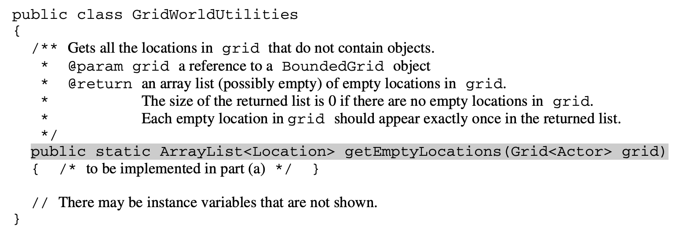
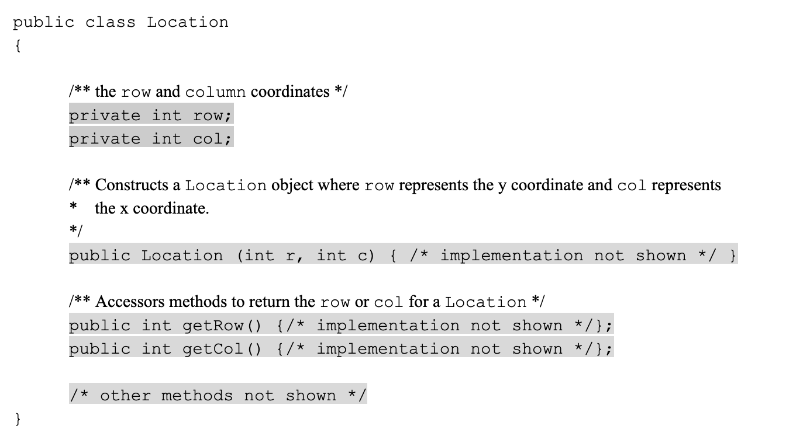
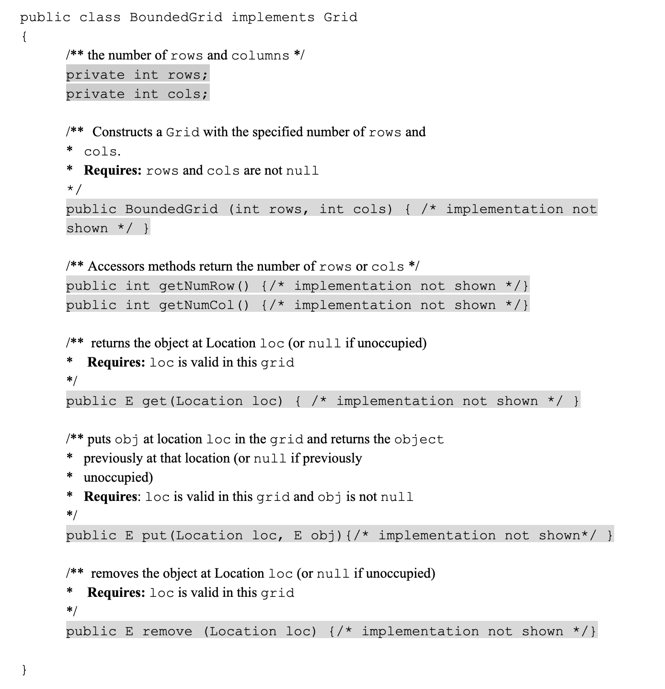

.. qnum::
   :prefix:  7-4-11-
   :start: 1

Free Response - Grid World A
--------------------------------------------------------

.. index::
   single: Grid World
   single: free response

The following is a free response question from 2013. It was question 3 part A on the exam. You can see all the free response questions from past exams at https://apstudents.collegeboard.org/courses/ap-computer-science-a/free-response-questions-by-year.

This question involves reasoning about the GridWorld case study that was formerly required knowledge for the APCSA exam. It is no longer expected that you know this information and it will be provided to you in this question.
Because there is a lot of extra material that you need to read and understand, this question may seem more challenging and will require more time than a typical FRQ you would expect on your AP exam. It is still good practice nonetheless.
In part (a) you will write a method to return an ``Arraylist`` of all empty ``Location`` objects in a given grid. The ``GridWorldUtilities`` class contains ``static`` methods. A partial declaration of the ``GridWorldUtilities`` class is shown below.

In this question, you will write the ``GridWorldUtilities`` method ``getEmptyLocations``. If there are no empty locations
in grid, the method returns an empty ``Arraylist``. Otherwise, it returns an ``Arraylist`` of all empty locations in
grid. Each empty location should appear exactly once in the ``Arraylist``.

Necessary Preliminary Information
================================================
The GridWorld case study provided a graphical environment where visual objects inhabited and interacted in a two-dimensional grid (similar to GreenFoot).
In this case study, students designed and created ``Actor`` objects, added them to ``Grid`` objects, and determined whether the ``Actor`` objects behaved according to their specifications.
Since this case study is no longer in the AP Java curriculum, all the necessary documentation is provided below.

The first necessary class is the ``Location`` class. Every ``actor`` that appears in the ``Grid`` has a ``Location``. The ``Location`` class encapsulates the coordinates for an ``Actor`` object’s position in a ``Grid``.

The next important part is the ``Grid Interface``. You may be unfamiliar with interfaces so don’t worry too much about how they work. What you need to know is that the interface ``Grid<E>`` specifies the methods for any ``grid`` that contains objects of the type ``E`` which you choose at its initialization.
For part A we will be working with the class ``BoundedGrid<E>`` which implements the ``Grid Interface``. For this question, "E" will be a "Location"

Check your understanding of the question
================================================

The problems in this section are to help you check your understanding and guide you towards a solution.
You can skip these if you think you know what to do already.  Click the buttons to reveal the problems if you want to do them.

.. reveal:: grid_wrld_cu_r1
   :showtitle: Reveal Keyword Exercise
   :hidetitle: Hide Keyword Problem

   .. clickablearea:: grid_find_parts
       :question: The question statement is listed below. Click on the part of the sentences below with the data type of the object passed to  getEmptyLocations and the datatype of the returned object.
       :iscode:
       :feedback: The method header for getEmptyLocations is "public static ? getEmptyLocations (?)". What information should replace the "?" and what does that tell you about the method?

       Write the :click-incorrect:GridWorldUtilities:endclick: method :click-incorrect:getEmptyLocations.:endclick: 
       If there are no empty :click-incorrect:locations:endclick: in :click-correct:Grid,:endclick: the :click-incorrect:method:endclick: returns an empty :click-correct:Arraylist.:endclick:
       Otherwise, it returns an Arraylist of all :click-incorrect:empty:endclick: :click-incorrect:locations in Grid:endclick:. 
       Each :click-incorrect:empty location:endclick: should appear exactly once in the Arraylist.

.. reveal:: grid_wrld_cu_r2
   :showtitle: Reveal Data Type Problem
   :hidetitle: Hide Data Type Problem

   .. mchoice:: grid_wrld_cu_mc_1
      :answer_a: GridWorldUtilities
      :answer_b: getEmptyLocations
      :answer_c: BoundedGrid
      :answer_d: Actor
      :correct: a
      :feedback_a: getEmptyLocations is a method inside of GridWorldUtilities.
      :feedback_b: getEmptyLocations exists in a class, whereas getEmptyLocations is only a method.
      :feedback_c: BoundedGrid is not the correct class.
      :feedback_d: Actor is no the correct class.

      In which class is the method ``getEmptyLocations`` written?

.. reveal:: grid_wrld_cu_r3
   :showtitle: Reveal Parameter Problem
   :hidetitle: Hide Parameter Problem

   .. mchoice:: grid_wrld_cu_mc_2
      :answer_a: Grid
      :answer_b: String
      :answer_c: Location
      :answer_d: Actor
      :correct: c
      :feedback_a: Grid is the type of the parameter.
      :feedback_b: There are no strings in this problem.
      :feedback_c: Correct, the ArrayList returned contains Location objects.
      :feedback_d: This is no the type of object the ArrayList holds.

      When this method returns an ``ArrayList``, what is the datatype of the objects in the ``ArrayList``?

.. reveal:: grid_wrld_cu_r4
   :showtitle: Reveal Height Bounds Problem
   :hidetitle: Hide Height Bounds Problem

   .. mchoice:: grid_wrld_cu_mc_3
      :answer_a: .length
      :answer_b: .getSize()
      :answer_c: .getHeight()
      :answer_d: .getNumRows()
      :correct: d
      :feedback_a: This call works for strings, but we aren't working with strings.
      :feedback_b: This is not an applicable method for grid
      :feedback_c: This does not exist.
      :feedback_d: Correct, this will return the height of the grid.

      How can one find the height of the ``grid`` that is passed to this method?

.. reveal:: grid_wrld_cu_r5
    :showtitle: Reveal Width Bounds Problem
    :hidetitle: Hide Width Bounds Problem

    .. mchoice:: grid_wrld_cu_mc_4
       :answer_a: .getNumCols()
       :answer_b: .getNumRows()
       :answer_c: .getWidth()
       :answer_d: .length
       :correct: a
       :feedback_a: Correct, this will find the width of the grid.
       :feedback_b: This will find the height of the grid, but we're looking for the width.
       :feedback_c: This does not exist.
       :feedback_d: This call works for strings, but we aren't working with strings.

       How can one find the width of the ``grid`` that is passed to this method?

How to Solve Part A
=====================

Here is the question again.

Write the ``GridWorldUtilities`` method ``getEmptyLocations``. If there are no empty locations
in grid, the method returns an empty ``Arraylist``. Otherwise, it returns an ``Arraylist`` of all empty locations in
grid. Each empty location should appear exactly once in the ``Arraylist``.

.. shortanswer:: grid_algorithm

   Explain in plain English what your code will have to do to answer this question.  Use the variable names given above.

This section contains a plain English explanation of one way to solve this problem as well as problems that test your understanding of how to write the code to do those things.  Click on the buttons to reveal the questions.

.. reveal:: grdwrld_algorithm
   :showtitle: Reveal Algorithm Structure Hint
   :hidetitle: Hide Algorithm Structure Hint

   The method ``getEmptyLocations`` needs to return an ``ArrayList`` of ``Location`` objects containing all the places in the grid that are empty.

   This implies that the code needs to create an empty ``ArrayList`` of type ``Location``.  Let's call it ``locs``. We need to have our program loop through the squares in ``grid`` from the start to the end (without going out of bounds). If the current square is empty, we need to add that position to the end of ``locs``.
   Finally our method should end by returning ``locs``.

.. reveal:: grdwrld_mcalg_hint_1
   :showtitle: Reveal ArrayList Declaration Problem
   :hidetitle: Hide ArrayList Declaration problem

   .. mchoice:: grdwrld_mcalg_answr_1
      :answer_a: locs = new ArrayList&lt;Location&gt;();
      :answer_b: ArrayList&lt;Location&gt; locs = new ArrayList&lt;Location&gt;;
      :answer_c: ArrayList&lt;Location&gt; locs = new List&lt;Location&gt;();
      :answer_d: ArrayList&lt;Location&gt; locs = new ArrayList&lt;Location&gt;();
      :correct: d
      :feedback_a: You must declare the type for locs
      :feedback_b: You must include the () when creating a new object
      :feedback_c: You must create an ArrayList using a concrete subclass like ArrayList
      :feedback_d: Correct!

      Which Java expression correctly creates an empty ``ArrayList`` of type ``Location`` called locs?

.. reveal:: grdwrld_mcalg_hint_2
   :showtitle: Reveal Loop Problem
   :hidetitle: Hide Loop Problem

   .. mchoice:: grdwrld_mcalg_answr_2
      :answer_a: nested for loop
      :answer_b: for
      :answer_c: for-each
      :answer_d: while
      :correct: a
      :feedback_a: Correct! This method will be the easiest to read and simplest to debug.
      :feedback_b: you cannot use a single for loop because you need to traverse 2 dimensions
      :feedback_c: you could use a nested for-each loop but it would make your code longer and less efficient, as well as harder to read.
      :feedback_d: you cannot use a single while loop because you need to traverse 2 dimensions

      Which loop would be best for this situation?

.. reveal:: grdwrld_mcalg_hint_3
   :showtitle: Reveal Initialization Problem
   :hidetitle: Hide Initialization problem

   .. mchoice:: grdwrld_mcalg_answr_3
      :answer_a: locToCheck = new Location (r,c);
      :answer_b: location locToCheck = location (r,c);
      :answer_c: Location locToCheck = new Location (r,c);
      :answer_d: location locToCheck = new location (r,c);
      :correct: c
      :feedback_a: You need to assign a datatype to locToCheck on the left side of the initialization.
      :feedback_b: You need to state that you a creating a new object with the keyword, "new".
      :feedback_c: Correct!
      :feedback_d: Watch your capitalization! the Location class needs to be capitalized.

       Assuming we have our nested for loop that uses r and c to iterate through the ``grid``, how do we initialize a ``Location`` object (called locToCheck) to add our ``ArrayList`` locs?

.. reveal:: grdwrld_mcalg_hint_4
   :showtitle: Reveal Empty Check Problem
   :hidetitle: Hide Empty Check problem

   .. mchoice:: grdwrld_mcalg_answr_4
      :answer_a: if (locToCheck == null)
      :answer_b: if (grid.get(locToCheck) == null)
      :answer_c: if (locs.get(locToCheck) == 0)
      :answer_d: if (grid.get(locToCheck) == 0)
      :correct: b
      :feedback_a: locToCheck currently only contains the location in the grid, not what object is actually located there
      :feedback_b: Correct!
      :feedback_c: We want locs to contain all the empty locations so it wouldn't make sense to call locs.get(locToCheck).
      :feedback_d: The grid could contain an integer object equal to 0 so that would mean the grid isn't empty at that spot.

      How can you check if the current location, "locToCheck" is empty?

Write the Code
==================

In this question, you will write the ``GridWorldUtilities`` method ``getEmptyLocations``. If there are no empty locations
in grid, the method returns an empty ``Arraylist``. Otherwise, it returns an ``Arraylist`` of all empty locations in
grid. Each empty location should appear exactly once in the ``Arraylist``.

Write the method ``getEmptyLocations`` in the code below.

.. activecode:: frq2013Q3A-grid
   :language: java
   :datafile: GridWorld.jar

   Complete the getEmptyLocations() method below.
   ~~~~
   import java.util.*;

   public class GridWorldUtilities
   {

       /**
        * Gets all the locations in grid that do not contain objects.
        *
        * @param grid is a reference to a bounded object
        * @param an array list (possibly contains nothing) of empty locations in grid.
        *     The size of the returned list is 0 if there are no empty locations in
        *     grid. Each empty location in grid should appear exactly and only once in
        *     the returned list.
        */
       public static ArrayList<Location> getEmptyLocations(Grid<Location> grid)
       {
           /* TO BE IMPLEMENTED IN PART A*/
       }

       public static void main(String[] args)
       {
           System.out.println("Running Test 1");
           BoundedGrid<Location> example = new BoundedGrid<Location>(2, 2);
           Location loc1 = new Location(0, 0);
           Location loc2 = new Location(1, 0);
           Location loc3 = new Location(0, 1);
           Location loc4 = new Location(1, 1);
           example.put(loc1, loc1);
           example.put(loc2, loc2);
           example.put(loc3, loc3);

           ArrayList<Location> locsCorrect = new ArrayList<Location>();
           locsCorrect.add(loc4);

           ArrayList<Location> studentAnswer = new ArrayList<Location>();
           studentAnswer = getEmptyLocations(example);

           System.out.println(
                   "This is the correct output for test 1, compare the result with"
                       + " your output");
           for (int i = 0; i < locsCorrect.size(); i++)
           {
               System.out.println(locsCorrect.get(i));
           }

           System.out.println("Student output:");
           for (int j = 0; j < studentAnswer.size(); j++)
           {
               System.out.println(studentAnswer.get(j));
           }

           System.out.println(
                   "Running Test 2: returns empty ArrayList if no empty locations");
           example.put(loc4, loc4);
           locsCorrect.clear();
           studentAnswer = getEmptyLocations(example);

           System.out.println(
                   "This is the correct output for test 2 (empty), compare the result"
                       + " with your output");
           for (int i = 0; i < locsCorrect.size(); i++)
           {
               System.out.println(locsCorrect.get(i));
           }

           System.out.println("Student output:");
           for (int j = 0; j < studentAnswer.size(); j++)
           {
               System.out.println(studentAnswer.get(j));
           }
       }
   }

   /* GridWorld files
    */
   /**
    * Grid provides an interface for a two-dimensional, grid-like environment
    * containing arbitrary objects.
    */
   interface Grid<E>
   {
       /**
        * Returns the number of rows in this grid.
        *
        * @return the number of rows, or -1 if this grid is unbounded
        */
       int getNumRows();

       /**
        * Returns the number of columns in this grid.
        *
        * @return the number of columns, or -1 if this grid is unbounded
        */
       int getNumCols();

       /**
        * Checks whether a location is valid in this grid. Precondition: loc is not
        * null
        *
        * @param loc the location to check
        * @return true if loc is valid in this grid, false otherwise
        */
       boolean isValid(Location loc);

       /**
        * Puts an object at a given location in this grid. Precondition: (1) loc is
        * valid in this grid (2) obj is not null
        *
        * @param loc the location at which to put the object
        * @param obj the new object to be added
        * @return the object previously at loc (or null if the location was previously
        *     unoccupied)
        */
       E put(Location loc, E obj);

       /**
        * Removes the object at a given location from this grid. Precondition: loc is
        * valid in this grid
        *
        * @param loc the location of the object that is to be removed
        * @return the object that was removed (or null if the location is unoccupied)
        */
       E remove(Location loc);

       /**
        * Returns the object at a given location in this grid. Precondition: loc is
        * valid in this grid
        *
        * @param loc a location in this grid
        * @return the object at location loc (or null if the location is unoccupied)
        */
       E get(Location loc);

       /**
        * Gets the locations in this grid that contain objects.
        *
        * @return an array list of all occupied locations in this grid
        */
       ArrayList<Location> getOccupiedLocations();

       /**
        * Gets the valid locations adjacent to a given location in all eight compass
        * directions (north, northeast, east, southeast, south, southwest, west, and
        * northwest). Precondition: loc is valid in this grid
        *
        * @param loc a location in this grid
        * @return an array list of the valid locations adjacent to loc in this grid
        */
       ArrayList<Location> getValidAdjacentLocations(Location loc);

       /**
        * Gets the valid empty locations adjacent to a given location in all eight
        * compass directions (north, northeast, east, southeast, south, southwest,
        * west, and northwest). Precondition: loc is valid in this grid
        *
        * @param loc a location in this grid
        * @return an array list of the valid empty locations adjacent to loc in this
        *     grid
        */
       ArrayList<Location> getEmptyAdjacentLocations(Location loc);

       /**
        * Gets the valid occupied locations adjacent to a given location in all eight
        * compass directions (north, northeast, east, southeast, south, southwest,
        * west, and northwest). Precondition: loc is valid in this grid
        *
        * @param loc a location in this grid
        * @return an array list of the valid occupied locations adjacent to loc in
        *     this grid
        */
       ArrayList<Location> getOccupiedAdjacentLocations(Location loc);

       /**
        * Gets the neighboring occupants in all eight compass directions (north,
        * northeast, east, southeast, south, southwest, west, and northwest).
        *
        * 
Precondition: loc is valid in this grid
        *
        * @param loc a location in this grid
        * @return returns an array list of the objects in the occupied locations
        *     adjacent to loc in this grid
        */
       ArrayList<E> getNeighbors(Location loc);
   }

   // End of Class Grid

   // Location Class

   /**
    * A Location object represents the row and column of a location in a
    * two-dimensional grid. The API of this class is testable on the AP CSA and AB
    * exams.
    */
   class Location implements Comparable
   {
       private int row; // row location in grid
       private int col; // column location in grid

       /** The turn angle for turning 90 degrees to the left. */
       public static final int LEFT = -90;

       /** The turn angle for turning 90 degrees to the right. */
       public static final int RIGHT = 90;

       /** The turn angle for turning 45 degrees to the left. */
       public static final int HALF_LEFT = -45;

       /** The turn angle for turning 45 degrees to the right. */
       public static final int HALF_RIGHT = 45;

       /** The turn angle for turning a full circle. */
       public static final int FULL_CIRCLE = 360;

       /** The turn angle for turning a half circle. */
       public static final int HALF_CIRCLE = 180;

       /** The turn angle for making no turn. */
       public static final int AHEAD = 0;

       /** The compass direction for north. */
       public static final int NORTH = 0;

       /** The compass direction for northeast. */
       public static final int NORTHEAST = 45;

       /** The compass direction for east. */
       public static final int EAST = 90;

       /** The compass direction for southeast. */
       public static final int SOUTHEAST = 135;

       /** The compass direction for south. */
       public static final int SOUTH = 180;

       /** The compass direction for southwest. */
       public static final int SOUTHWEST = 225;

       /** The compass direction for west. */
       public static final int WEST = 270;

       /** The compass direction for northwest. */
       public static final int NORTHWEST = 315;

       /**
        * Constructs a location with given row and column coordinates.
        *
        * @param r the row
        * @param c the column
        */
       public Location(int r, int c)
       {
           row = r;
           col = c;
       }

       /**
        * Gets the row coordinate.
        *
        * @return the row of this location
        */
       public int getRow()
       {
           return row;
       }

       /**
        * Gets the column coordinate.
        *
        * @return the column of this location
        */
       public int getCol()
       {
           return col;
       }

       /**
        * Gets the adjacent location in any one of the eight compass directions.
        *
        * @param direction the direction in which to find a neighbor location
        * @return the adjacent location in the direction that is closest to
        *     <tt>direction</tt>
        */
       public Location getAdjacentLocation(int direction)
       {
           // reduce mod 360 and round to closest multiple of 45
           int adjustedDirection = (direction + HALF_RIGHT / 2) % FULL_CIRCLE;
           if (adjustedDirection < 0)
           {
                adjustedDirection += FULL_CIRCLE;
           }
           adjustedDirection = (adjustedDirection / HALF_RIGHT) * HALF_RIGHT;
           int dc = 0;
           int dr = 0;
           if (adjustedDirection == EAST)
           {
                dc = 1;
           }
           else if (adjustedDirection == SOUTHEAST)
           {
               dc = 1;
               dr = 1;
           } 
           else if (adjustedDirection == SOUTH)
           {
               dr = 1;
           }
           else if (adjustedDirection == SOUTHWEST)
           {
               dc = -1;
               dr = 1;
           } 
           else if (adjustedDirection == WEST)
           {
               dc = -1;
           }
           else if (adjustedDirection == NORTHWEST)
           {
               dc = -1;
               dr = -1;
           }
           else if (adjustedDirection == NORTH)
           {
               dr = -1;
           }
           else if (adjustedDirection == NORTHEAST)
           {
               dc = 1;
               dr = -1;
           }
           return new Location(getRow() + dr, getCol() + dc);
       }

       /**
        * Returns the direction from this location toward another location. The
        * direction is rounded to the nearest compass direction.
        *
        * @param target a location that is different from this location
        * @return the closest compass direction from this location toward target
        */
       public int getDirectionToward(Location target)
       {
           int dx = target.getCol() - getCol();
           int dy = target.getRow() - getRow();
           // y axis points opposite to mathematical orientation
           int angle = (int) Math.toDegrees(Math.atan2(-dy, dx));

           // mathematical angle is counterclockwise from x-axis,
           // compass angle is clockwise from y-axis
           int compassAngle = RIGHT - angle;
           // prepare for truncating division by 45 degrees
           compassAngle += HALF_RIGHT / 2;
           // wrap negative angles
           if (compassAngle < 0)
           {
                compassAngle += FULL_CIRCLE;
           }

           // round to nearest multiple of 45
           return (compassAngle / HALF_RIGHT) * HALF_RIGHT;
       }

       /**
        * Indicates whether some other Location object is "equal to" this one.
        *
        * @param other the other location to test
        * @return true if other is a Location with the same row and column as this
        *     location; false otherwise
        */
       public boolean equals(Object other)
       {
           if (!(other instanceof Location))
           {
                return false;
           }

           Location otherLoc = (Location) other;
           return getRow() == otherLoc.getRow() && getCol() == otherLoc.getCol();
       }

       /**
        * Generates a hash code.
        *
        * @return a hash code for this location
        */
       public int hashCode()
       {
           return getRow() * 3737 + getCol();
       }

       /**
        * Compares this location to other for ordering. Returns a negative integer,
        * zero, or a positive integer as this location is less than, equal to, or
        * greater than other. Locations are ordered in row-major order. (Precondition:
        * other is a Location object.)
        *
        * @param other the other location to test
        * @return a negative integer if this location is less than other, zero if the
        *     two locations are equal, or a positive integer if this location is
        *     greater than other
        */
       public int compareTo(Object other)
       {
           Location otherLoc = (Location) other;
           if (getRow() < otherLoc.getRow()) return -1;
           if (getRow() > otherLoc.getRow()) return 1;
           if (getCol() < otherLoc.getCol()) return -1;
           if (getCol() > otherLoc.getCol()) return 1;
           return 0;
       }

       /**
        * Creates a string that describes this location.
        *
        * @return a string with the row and column of this location, in the format
        *     (row, col)
        */
       public String toString()
       {
           return "(" + getRow() + ", " + getCol() + ")";
       }
   }

   // End of Class

   // BoundedGrid Class

   /**
    * A BoundedGrid is a rectangular grid with a finite number of rows and columns.
    * The implementation of this class is testable on the AP CS AB exam.
    */
   class BoundedGrid<E> extends AbstractGrid<E>
   {
       private Object[][] occupantArray; // the array storing the grid elements

       /**
        * Constructs an empty bounded grid with the given dimensions. (Precondition:
        * rows > 0 and cols > 0.)
        *
        * @param rows number of rows in BoundedGrid
        * @param cols number of columns in BoundedGrid
        */
       public BoundedGrid(int rows, int cols)
       {
           if (rows <= 0) throw new IllegalArgumentException("rows <= 0");
           if (cols <= 0) throw new IllegalArgumentException("cols <= 0");
           occupantArray = new Object[rows][cols];
       }

       public int getNumRows()
       {
           return occupantArray.length;
       }

       public int getNumCols()
       {
           // Note: according to the constructor precondition, numRows() > 0, so
           // theGrid[0] is non-null.
           return occupantArray[0].length;
       }

       public boolean isValid(Location loc)
       {
           return 0 <= loc.getRow()
                   && loc.getRow() < getNumRows()
                   && 0 <= loc.getCol()
                   && loc.getCol() < getNumCols();
       }

       public ArrayList<Location> getOccupiedLocations()
       {
           ArrayList<Location> theLocations = new ArrayList<Location>();

           // Look at all grid locations.
           for (int r = 0; r < getNumRows(); r++)
           {
               for (int c = 0; c < getNumCols(); c++)
               {
                   // If there's an object at this location, put it in the array.
                   Location loc = new Location(r, c);
                   if (get(loc) != null) 
                       theLocations.add(loc);
               }
           }

           return theLocations;
       }

       @SuppressWarnings("unchecked")
       public E get(Location loc)
       {
           if (!isValid(loc))
               throw new IllegalArgumentException(
                       "Location " + loc + " is not valid");
           return (E)
                   occupantArray[loc.getRow()][loc.getCol()]; // unavoidable warning
       }

       public E put(Location loc, E obj)
       {
           if (!isValid(loc))
               throw new IllegalArgumentException(
                       "Location " + loc + " is not valid");
           if (obj == null) throw new NullPointerException("obj == null");

           // Add the object to the grid.
           E oldOccupant = get(loc);
           occupantArray[loc.getRow()][loc.getCol()] = obj;
           return oldOccupant;
       }

       public E remove(Location loc)
       {
           if (!isValid(loc))
               throw new IllegalArgumentException(
                       "Location " + loc + " is not valid");

           // Remove the object from the grid.
           E r = get(loc);
           occupantArray[loc.getRow()][loc.getCol()] = null;
           return r;
       }
   }

   // End of Class

   // Class AbstractGrid

   /**
    * AbstractGrid contains the methods that are common to grid implementations. The
    * implementation of this class is testable on the AP CS AB exam.
    */
   abstract class AbstractGrid<E> implements Grid<E>
   {
       public ArrayList<E> getNeighbors(Location loc)
       {
           ArrayList<E> neighbors = new ArrayList<E>();
           for (Location neighborLoc : getOccupiedAdjacentLocations(loc))
               neighbors.add(get(neighborLoc));
           return neighbors;
       }

       public ArrayList<Location> getValidAdjacentLocations(Location loc)
       {
           ArrayList<Location> locs = new ArrayList<Location>();

           int d = Location.NORTH;
           for (int i = 0; i < Location.FULL_CIRCLE / Location.HALF_RIGHT; i++)
           {
               Location neighborLoc = loc.getAdjacentLocation(d);
               if (isValid(neighborLoc)) 
                   locs.add(neighborLoc);
               d = d + Location.HALF_RIGHT;
           }
           return locs;
       }

       public ArrayList<Location> getEmptyAdjacentLocations(Location loc)
       {
           ArrayList<Location> locs = new ArrayList<Location>();
           for (Location neighborLoc : getValidAdjacentLocations(loc))
           {
               if (get(neighborLoc) == null) 
                   locs.add(neighborLoc);
           }
           return locs;
       }

       public ArrayList<Location> getOccupiedAdjacentLocations(Location loc)
       {
           ArrayList<Location> locs = new ArrayList<Location>();
           for (Location neighborLoc : getValidAdjacentLocations(loc))
           {
               if (get(neighborLoc) != null) 
                   locs.add(neighborLoc);
           }
           return locs;
       }

       /**
        * Creates a string that describes this grid.
        *
        * @return a string with descriptions of all objects in this grid (not
        *     necessarily in any particular order), in the format {loc=obj, loc=obj,
        *     ...}
        */
       public String toString()
       {
           String s = "{";
           for (Location loc : getOccupiedLocations())
           {
               if (s.length() > 1) 
                   s += ", ";
               s += loc + "=" + get(loc);
           }
           return s + "}";
       }
   }

   ====
   import static org.junit.Assert.*;

   import org.junit.*;

   import java.io.*;
   import java.util.*;

   public class RunestoneTests extends CodeTestHelper
   {
       public RunestoneTests()
       {
           super("GridWorldUtilities");
       }

       @Test
       public void testMain() throws IOException
       {
           String output = getMethodOutput("main");
           String expect = "Student output:\n(1, 1)\n";

           boolean passed = getResults(expect, output, "Expected output from main");
           assertTrue(passed);
       }

       @Test
       public void test1()
       {
           BoundedGrid<Location> example = new BoundedGrid<Location>(2, 2);
           Location loc1 = new Location(0, 0);
           Location loc2 = new Location(1, 0);
           Location loc3 = new Location(0, 1);
           Location loc4 = new Location(1, 1);
           example.put(loc1, loc1);
           example.put(loc2, loc2);
           example.put(loc3, loc3);

           ArrayList<Location> locsCorrect = new ArrayList<Location>();
           locsCorrect.add(loc4);
           ArrayList<Location> studentAnswer = new ArrayList<Location>();
           studentAnswer = GridWorldUtilities.getEmptyLocations(example);

           String output = studentAnswer.get(0).toString();
           String expect = "(1, 1)";

           boolean passed = getResults(expect, output, "Test 1 call to getEmptyLocations()");
           assertTrue(passed);
       }
   }

.. datafile:: GridWorld.jar
        :hide:

        import java.util.ArrayList;

        /**
         * Grid provides an interface for a two-dimensional, grid-like
         * environment containing arbitrary objects.
         */
        public interface Grid<E>
        {
            /**
             * Returns the number of rows in this grid.
             * @return the number of rows, or -1 if this grid is unbounded
             */
            int getNumRows();

            /**
             * Returns the number of columns in this grid.
             * @return the number of columns, or -1 if this grid is unbounded
             */
            int getNumCols();

            /**
             * Checks whether a location is valid in this grid.
             * Precondition: loc is not null
             * @param loc the location to check
             * @return true if loc is valid in this grid,
             * false otherwise
             */
            boolean isValid(Location loc);

            /**
             * Puts an object at a given location in this grid.
             * Precondition: (1) loc is valid in this grid (2)
             * obj is not null
             * @param loc the location at which to put the object
             * @param obj the new object to be added
             * @return the object previously at loc (or null
             * if the location was previously unoccupied)
             */
            E put(Location loc, E obj);

            /**
             * Removes the object at a given location from this grid.
             * Precondition: loc is valid in this grid
             * @param loc the location of the object that is to be removed
             * @return the object that was removed (or null if the location
             *  is unoccupied)
             */
            E remove(Location loc);

            /**
             * Returns the object at a given location in this grid.
             * Precondition: loc is valid in this grid
             * @param loc a location in this grid
             * @return the object at location loc (or null
             *  if the location is unoccupied)
             */
            E get(Location loc);

            /**
             * Gets the locations in this grid that contain objects.
             * @return an array list of all occupied locations in this grid
             */
            ArrayList<Location> getOccupiedLocations();

            /**
             * Gets the valid locations adjacent to a given location in all eight
             * compass directions (north, northeast, east, southeast, south, southwest,
             * west, and northwest).
             * Precondition: loc is valid in this grid
             * @param loc a location in this grid
             * @return an array list of the valid locations adjacent to loc
             * in this grid
             */
            ArrayList<Location> getValidAdjacentLocations(Location loc);

            /**
             * Gets the valid empty locations adjacent to a given location in all eight
             * compass directions (north, northeast, east, southeast, south, southwest,
             * west, and northwest).
             * Precondition: loc is valid in this grid
             * @param loc a location in this grid
             * @return an array list of the valid empty locations adjacent to
             * loc in this grid
             */
            ArrayList<Location> getEmptyAdjacentLocations(Location loc);

            /**
             * Gets the valid occupied locations adjacent to a given location in all
             * eight compass directions (north, northeast, east, southeast, south,
             * southwest, west, and northwest).
             * Precondition: loc is valid in this grid
             * @param loc a location in this grid
             * @return an array list of the valid occupied locations adjacent to
             * loc in this grid
             */
            ArrayList<Location> getOccupiedAdjacentLocations(Location loc);

            /**
             * Gets the neighboring occupants in all eight compass directions (north,
             * northeast, east, southeast, south, southwest, west, and northwest).
             *
             * Precondition: loc is valid in this grid
             * @param loc a location in this grid
             * @return returns an array list of the objects in the occupied locations
             * adjacent to loc in this grid
             */
            ArrayList<E> getNeighbors(Location loc);
        }
         // End of Class Grid

        // Location Class

        /**
         * A Location object represents the row and column of a location
         * in a two-dimensional grid.
         * The API of this class is testable on the AP CSA and AB exams.
         */
        public class Location implements Comparable
        {
            private int row; // row location in grid
            private int col; // column location in grid

            /**
             * The turn angle for turning 90 degrees to the left.
             */
            public static final int LEFT = -90;
            /**
             * The turn angle for turning 90 degrees to the right.
             */
            public static final int RIGHT = 90;
            /**
             * The turn angle for turning 45 degrees to the left.
             */
            public static final int HALF_LEFT = -45;
            /**
             * The turn angle for turning 45 degrees to the right.
             */
            public static final int HALF_RIGHT = 45;
            /**
             * The turn angle for turning a full circle.
             */
            public static final int FULL_CIRCLE = 360;
            /**
             * The turn angle for turning a half circle.
             */
            public static final int HALF_CIRCLE = 180;
            /**
             * The turn angle for making no turn.
             */
            public static final int AHEAD = 0;

            /**
             * The compass direction for north.
             */
            public static final int NORTH = 0;
            /**
             * The compass direction for northeast.
             */
            public static final int NORTHEAST = 45;
            /**
             * The compass direction for east.
             */
            public static final int EAST = 90;
            /**
             * The compass direction for southeast.
             */
            public static final int SOUTHEAST = 135;
            /**
             * The compass direction for south.
             */
            public static final int SOUTH = 180;
            /**
             * The compass direction for southwest.
             */
            public static final int SOUTHWEST = 225;
            /**
             * The compass direction for west.
             */
            public static final int WEST = 270;
            /**
             * The compass direction for northwest.
             */
            public static final int NORTHWEST = 315;

            /**
             * Constructs a location with given row and column coordinates.
             * @param r the row
             * @param c the column
             */
            public Location(int r, int c)
            {
                row = r;
                col = c;
            }

            /**
             * Gets the row coordinate.
             * @return the row of this location
             */
            public int getRow()
            {
                return row;
            }

            /**
             * Gets the column coordinate.
             * @return the column of this location
             */
            public int getCol()
            {
                return col;
            }

            /**
             * Gets the adjacent location in any one of the eight compass directions.
             * @param direction the direction in which to find a neighbor location
             * @return the adjacent location in the direction that is closest to
             * <tt>direction</tt>
             */
            public Location getAdjacentLocation(int direction)
            {
                // reduce mod 360 and round to closest multiple of 45
                int adjustedDirection = (direction + HALF_RIGHT / 2) % FULL_CIRCLE;
                if (adjustedDirection < 0)
                    adjustedDirection += FULL_CIRCLE;

                adjustedDirection = (adjustedDirection / HALF_RIGHT) * HALF_RIGHT;
                int dc = 0;
                int dr = 0;
                if (adjustedDirection == EAST)
                    dc = 1;
                else if (adjustedDirection == SOUTHEAST)
                {
                    dc = 1;
                    dr = 1;
                }
                else if (adjustedDirection == SOUTH)
                    dr = 1;
                else if (adjustedDirection == SOUTHWEST)
                {
                    dc = -1;
                    dr = 1;
                }
                else if (adjustedDirection == WEST)
                    dc = -1;
                else if (adjustedDirection == NORTHWEST)
                {
                    dc = -1;
                    dr = -1;
                }
                else if (adjustedDirection == NORTH)
                    dr = -1;
                else if (adjustedDirection == NORTHEAST)
                {
                    dc = 1;
                    dr = -1;
                }
                return new Location(getRow() + dr, getCol() + dc);
            }

            /**
             * Returns the direction from this location toward another location. The
             * direction is rounded to the nearest compass direction.
             * @param target a location that is different from this location
             * @return the closest compass direction from this location toward
             * target
             */
            public int getDirectionToward(Location target)
            {
                int dx = target.getCol() - getCol();
                int dy = target.getRow() - getRow();
                // y axis points opposite to mathematical orientation
                int angle = (int) Math.toDegrees(Math.atan2(-dy, dx));

                // mathematical angle is counterclockwise from x-axis,
                // compass angle is clockwise from y-axis
                int compassAngle = RIGHT - angle;
                // prepare for truncating division by 45 degrees
                compassAngle += HALF_RIGHT / 2;
                // wrap negative angles
                if (compassAngle < 0)
                    compassAngle += FULL_CIRCLE;
                // round to nearest multiple of 45
                return (compassAngle / HALF_RIGHT) * HALF_RIGHT;
            }

            /**
             * Indicates whether some other Location object is "equal to"
             * this one.
             * @param other the other location to test
             * @return true if other is a
             * Location with the same row and column as this location;
             * false otherwise
             */
            public boolean equals(Object other)
            {
                if (!(other instanceof Location))
                    return false;

                Location otherLoc = (Location) other;
                return getRow() == otherLoc.getRow() && getCol() == otherLoc.getCol();
            }

            /**
             * Generates a hash code.
             * @return a hash code for this location
             */
            public int hashCode()
            {
                return getRow() * 3737 + getCol();
            }

            /**
             * Compares this location to other for ordering. Returns a
             * negative integer, zero, or a positive integer as this location is less
             * than, equal to, or greater than other. Locations are
             * ordered in row-major order.
             * (Precondition: other is a Location object.)
             * @param other the other location to test
             * @return a negative integer if this location is less than
             * other, zero if the two locations are equal, or a positive
             * integer if this location is greater than other
             */
            public int compareTo(Object other)
            {
                Location otherLoc = (Location) other;
                if (getRow() < otherLoc.getRow())
                    return -1;
                if (getRow() > otherLoc.getRow())
                    return 1;
                if (getCol() < otherLoc.getCol())
                    return -1;
                if (getCol() > otherLoc.getCol())
                    return 1;
                return 0;
            }

            /**
             * Creates a string that describes this location.
             * @return a string with the row and column of this location, in the format
             * (row, col)
             */
            public String toString()
            {
                return "(" + getRow() + ", " + getCol() + ")";
            }
        }

        // End of Class

        // BoundedGrid Class

        import java.util.ArrayList;

        /**
         * A BoundedGrid is a rectangular grid with a finite number of
         * rows and columns.
         * The implementation of this class is testable on the AP CS AB exam.
         */
        public class BoundedGrid<E> extends AbstractGrid<E>
        {
            private Object[][] occupantArray; // the array storing the grid elements

            /**
             * Constructs an empty bounded grid with the given dimensions.
             * (Precondition: rows > 0 and cols > 0.)
             * @param rows number of rows in BoundedGrid
             * @param cols number of columns in BoundedGrid
             */
            public BoundedGrid(int rows, int cols)
            {
                if (rows <= 0)
                    throw new IllegalArgumentException("rows <= 0");
                if (cols <= 0)
                    throw new IllegalArgumentException("cols <= 0");
                occupantArray = new Object[rows][cols];
            }

            public int getNumRows()
            {
                return occupantArray.length;
            }

            public int getNumCols()
            {
                // Note: according to the constructor precondition, numRows() > 0, so
                // theGrid[0] is non-null.
                return occupantArray[0].length;
            }

            public boolean isValid(Location loc)
            {
                return 0 <= loc.getRow() && loc.getRow() < getNumRows()
                        && 0 <= loc.getCol() && loc.getCol() < getNumCols();
            }

            public ArrayList<Location> getOccupiedLocations()
            {
                ArrayList<Location> theLocations = new ArrayList<Location>();

                // Look at all grid locations.
                for (int r = 0; r < getNumRows(); r++)
                {
                    for (int c = 0; c < getNumCols(); c++)
                    {
                        // If there's an object at this location, put it in the array.
                        Location loc = new Location(r, c);
                        if (get(loc) != null)
                            theLocations.add(loc);
                    }
                }

                return theLocations;
            }

            @SuppressWarnings("unchecked")
            public E get(Location loc)
            {
                if (!isValid(loc))
                    throw new IllegalArgumentException("Location " + loc
                            + " is not valid");
                return (E) occupantArray[loc.getRow()][loc.getCol()]; // unavoidable warning
            }

            public E put(Location loc, E obj)
            {
                if (!isValid(loc))
                    throw new IllegalArgumentException("Location " + loc
                            + " is not valid");
                if (obj == null)
                    throw new NullPointerException("obj == null");

                // Add the object to the grid.
                E oldOccupant = get(loc);
                occupantArray[loc.getRow()][loc.getCol()] = obj;
                return oldOccupant;
            }

            public E remove(Location loc)
            {
                if (!isValid(loc))
                    throw new IllegalArgumentException("Location " + loc
                            + " is not valid");

                // Remove the object from the grid.
                E r = get(loc);
                occupantArray[loc.getRow()][loc.getCol()] = null;
                return r;
            }
        }

        // End of Class

        // Class AbstractGrid

        import java.util.ArrayList;

        /**
         * AbstractGrid contains the methods that are common to grid
         * implementations.
         * The implementation of this class is testable on the AP CS AB exam.
         */
        public abstract class AbstractGrid<E> implements Grid<E>
        {
            public ArrayList<E> getNeighbors(Location loc)
            {
                ArrayList<E> neighbors = new ArrayList<E>();
                for (Location neighborLoc : getOccupiedAdjacentLocations(loc))
                    neighbors.add(get(neighborLoc));
                return neighbors;
            }

            public ArrayList<Location> getValidAdjacentLocations(Location loc)
            {
                ArrayList<Location> locs = new ArrayList<Location>();

                int d = Location.NORTH;
                for (int i = 0; i < Location.FULL_CIRCLE / Location.HALF_RIGHT; i++)
                {
                    Location neighborLoc = loc.getAdjacentLocation(d);
                    if (isValid(neighborLoc))
                        locs.add(neighborLoc);
                    d = d + Location.HALF_RIGHT;
                }
                return locs;
            }

            public ArrayList<Location> getEmptyAdjacentLocations(Location loc)
            {
                ArrayList<Location> locs = new ArrayList<Location>();
                for (Location neighborLoc : getValidAdjacentLocations(loc))
                {
                    if (get(neighborLoc) == null)
                        locs.add(neighborLoc);
                }
                return locs;
            }

            public ArrayList<Location> getOccupiedAdjacentLocations(Location loc)
            {
                ArrayList<Location> locs = new ArrayList<Location>();
                for (Location neighborLoc : getValidAdjacentLocations(loc))
                {
                    if (get(neighborLoc) != null)
                        locs.add(neighborLoc);
                }
                return locs;
            }

            /**
             * Creates a string that describes this grid.
             * @return a string with descriptions of all objects in this grid (not
             * necessarily in any particular order), in the format {loc=obj, loc=obj,
             * ...}
             */
                public String toString()
                {
                    String s = "{";
                    for (Location loc : getOccupiedLocations())
                    {
                        if (s.length() > 1)
                            s += ", ";
                        s += loc + "=" + get(loc);
                    }
                    return s + "}";
                }
        }
