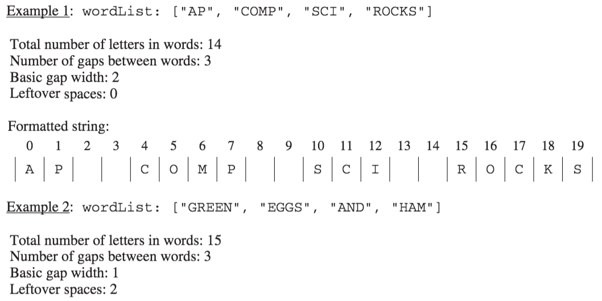

.. qnum::
   :prefix:  7-4-7-
   :start: 1

Free Response - StringFormatter A
-----------------------------------

.. index::
    single: trio
    single: free response

The following is a free response question from 2016. It was question 4 part A on the exam. You can see all the free response questions from past exams at https://apstudents.collegeboard.org/courses/ap-computer-science-a/free-response-questions-by-year.

This question involves the process of taking a list of words, called ``wordList``, and producing a formatted string of a specified length.
The list ``wordList`` contains at least two words, consisting of letters only.
When the formatted string is constructed, spaces are placed in the gaps between words so that as many spaces as possible are evenly distributed to each gap.
The equal number of spaces inserted into each gap is referred to as the basic gap width.
Any leftover spaces are inserted one at a time into the gaps from left to right until there are no more leftover spaces.

The following three examples illustrate these concepts. In each example, the list of words is to be placed into a formatted string of length 20.

The leftover spaces are inserted one at a time between the words from left to right until there are no more leftover spaces.
In this example, the first two gaps get an extra space.

.. figure:: Figures/2016FRQ4A2.png
    :width: 700px
    :align: center
    :figclass: align-center

You will implement three static methods in a class named ``StringFormatter`` that is not shown.

Part A
========

(a) Write the ``StringFormatter`` method ``totalLetters``, which returns the total number of letters in the words in its parameter ``wordList``.
For example, if the ``variableList<String> words`` is ["A", "frog", "is"],then the call ``StringFormatter.totalLetters(words)`` returns 7.
You may assume that all words in ``wordList`` consist of one or more letters.

Complete method ``totalLetters`` below.

.. code-block:: java

   /** Returns the total number of letters in wordList.
   *  Precondition: wordList contains at least two words, consisting of letters only.
   */
   public static int totalLetters(List<String> wordList)

How to Solve Part A
=====================

Click to reveal the algorithm and multiple choice problems that may help you write your solution.

.. reveal:: algorithm_stringFormatterA
   :showtitle: Reveal Algorithm
   :hidetitle: Hide Algorithm
   :optional:

   We need to return the total number of letters for all of the strings in ``wordList``.  We will need to create an
   integer variable to keep track of the number of letters and initialize it to 0.  Then we will loop through all of the strings in ``wordList`` and
   add the length of the current string to the number of letters.  When the loop is finished we will return the number of letters.

.. reveal:: fr_formatter_r1
   :showtitle: Reveal Problems
   :hidetitle: Hide Problems
   :optional:

   .. mchoice:: fr_formatter_1
        :answer_a: while
        :answer_b: for
        :answer_c: for-each
        :correct: c
        :feedback_a: A while loop is the best choice when you don't know the number of times you need to loop.
        :feedback_b: You could use a for loop, but there is a more concise option since you are not changing any values of wordList.
        :feedback_c: Correct! A for-each loop is the most concise way to access every string in wordList to keep track of numLetters

        Which loop would be best for this problem?

   .. mchoice:: fr_formatter_2
        :answer_a: str.size()
        :answer_b: str.length()
        :answer_c: str.length
        :correct: b
        :feedback_a: .size() is not the correct method call to find the length of a string. .size() is used with ArrayLists. Try again!
        :feedback_b: Correct! str.length() will return the length of String str.
        :feedback_c: Almost! length() is a method call, so parentheses are required.

        What is the correct way to access the length of a String str?

Put the Code in Order
======================

.. reveal:: stringFormatterA_parsons
    :showtitle: Reveal Mixed Up Code
    :hidetitle: Hide Mixed Up Code

    .. parsonsprob:: stringFormatterA
      :numbered: left
      :adaptive:

      The following has the correct code to solve this problem, but also contains extra code that isn't needed in a correct solution.  Drag the needed blocks from the left into the correct order on the right and indent them as well. Check your solution by clicking on the Check button.  You will be told if any of the blocks are in the wrong or are in the wrong order.  You will also be told if the indention is wrong.
      -----
      public static int totalLetters(List<String> wordList)
      {
      =====
         int numLetters = 0;
      =====
         for (String s : wordList)
      =====
         for (String s in wordList) #paired
      =====
            numLetters = numLetters + s.length();
      =====
            numLetters = numLetters + wordList.length(); #paired
      =====
         return numLetters;
      =====
         return numletters; #paired
      =====
      } //end method

Write the Code
==================

.. activecode:: lcfrsTotalLetters
   :language: java
   :autograde: unittest

   Finish writing the ``totalLetters`` method below so that it returns the number of letters for all the strings in ``wordList``.  The ``main`` method below will test your code to check that you solved it correctly.
   ~~~~
   import java.util.*;

   public class StringFormatter
   {
       /**
        * Returns the total number of letters in wordList. Precondition: wordList
        * contains at least two words, consisting of letters only.
        */
       public static int totalLetters(List<String> wordList) {}

       public static void main(String[] args)
       {
           List<String> myWords = new ArrayList<String>();
           myWords.add("A");
           myWords.add("frog");
           myWords.add("is");
           System.out.println("Should print 7 and prints: " + totalLetters(myWords));

           List<String> words2 = new ArrayList<String>();
           words2.add("Hi");
           words2.add("Bye");
           System.out.println("Should print 5 and prints: " + totalLetters(words2));
       }
   }

   ====
   import static org.junit.Assert.*;

   import org.junit.*;

   import java.io.*;
   import java.util.*;

   public class RunestoneTests extends CodeTestHelper
   {
       public RunestoneTests()
       {
           super("StringFormatter");
       }

       @Test
       public void testMain() throws IOException
       {
           String output = getMethodOutput("main");
           String expect = "Should print 7 and prints: 7\n" + "Should print 5 and prints: 5\n";

           boolean passed = getResults(expect, output, "Expected output from main");
           assertTrue(passed);
       }

       @Test
       public void test1()
       {
           List<String> myWords = new ArrayList<String>();
           myWords.add("A");
           myWords.add("dog");
           myWords.add("is");

           String output = String.valueOf(StringFormatter.totalLetters(myWords));
           String expect = "6";

           boolean passed = getResults(expect, output, "totalLetters method test on A, dog, is");
           assertTrue(passed);
       }
   }

