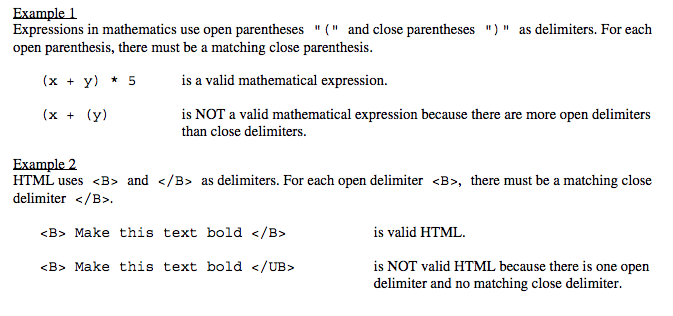
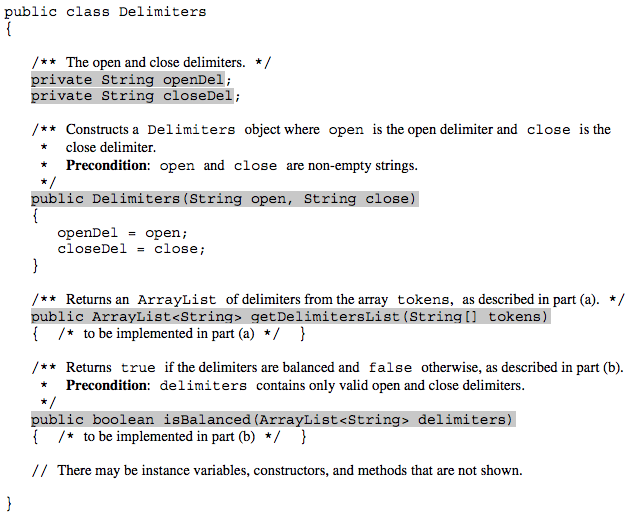
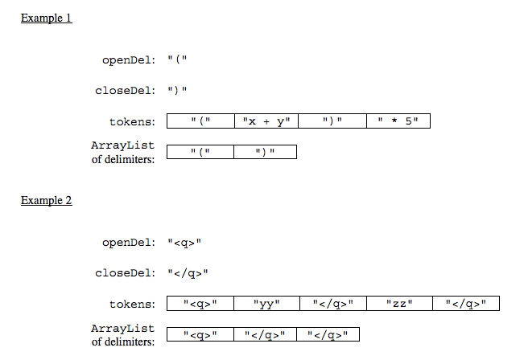
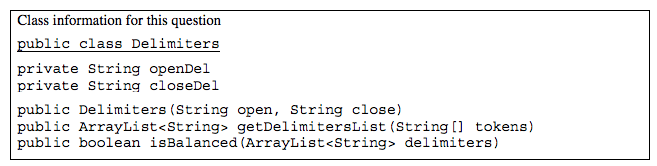

.. qnum::
   :prefix:  7-4-9-
   :start: 1

Free Response - Delimiters A
------------------------------

.. index::
    single: delimiters
    single: free response

The following is a free response question from 2019. It was question 3 part A on the exam. You can see all the free response questions from past exams at https://apstudents.collegeboard.org/courses/ap-computer-science-a/free-response-questions-by-year.

3.   Many encoded strings contain *delimiters*. A delimiter is a non-empty string that acts as a boundary between
different parts of a larger string. The delimiters involved in this question occur in pairs that must be *balanced*,
with each pair having an open delimiter and a close delimiter. There will be only one type of delimiter for each
string. The following are examples of delimiters.

In this question, you will write two methods in the following ``Delimiters`` class.

Part A
========

(a) A string containing text and possibly delimiters has been split into *tokens* and stored in
``String[] tokens``. Each token is either an open delimiter, a close delimiter, or a substring that is not a
delimiter. You will write the method ``getDelimitersList``, which returns an ``ArrayList``
containing all the open and close delimiters found in ``tokens`` in their original order.

The following examples show the contents of an ``ArrayList`` returned by ``getDelimitersList`` for
different open and close delimiters and different ``tokens`` arrays.

Check your understanding of the question
=========================================

There are problems in this section that can help you check your understanding of the question.  You can skip these if you think you know what to do already.  Click the buttons to reveal the problems if you want to do them.

.. reveal:: delim_cu_r1
   :showtitle: Reveal Problem
   :hidetitle: Hide Problem
   :optional:

   .. clickablearea:: delim_find_parts_ca
       :question: Click on the part of the sentences below with the type of thing passed to the method <code>getDelimitersList</code> and the type it returns.
       :iscode:
       :feedback: Variable declarations start with a type and then a name.
       :optional:

       :click-incorrect:A string:endclick: :click-incorrect:containing text and possibly delimiters has been split into *tokens* and 
       stored in Test2:endclick: :click-correct:String[] tokens:endclick:. 
       :click-incorrect:Each token is either an open delimiter, a close delimiter, or a substring 
       that is not a delimiter:endclick:. 
       :click-incorrect:You will write the method :endclick::click-incorrect:getDelimitersList:endclick:, :click-incorrect: which returns an:endclick: :click-correct:ArrayList:endclick::click-incorrect:
       containing all the open and close delimiters found in tokens in their original order.:endclick:

.. reveal:: delim_cu_r2
   :showtitle: Reveal Problem
   :hidetitle: Hide Problem
   :optional:

   .. mchoice:: delim_cu_mc_1
      :answer_a: array
      :answer_b: List
      :answer_c: String
      :answer_d: ArrayList
      :correct: a
      :feedback_a: tokens is an array of Strings
      :feedback_b: Check again
      :feedback_c: Check again
      :feedback_d: Check again
      :optional:

      What type is tokens?

.. reveal:: delim_cu_r3
   :showtitle: Reveal Problem
   :hidetitle: Hide Problem
   :optional:

   .. mchoice:: delim_cu_mc_2
      :answer_a: int
      :answer_b: String
      :answer_c: List
      :answer_d: double
      :correct: b
      :feedback_a: Check again.
      :feedback_b: Yes, tokens is an array of strings.
      :feedback_c: Check again.
      :feedback_d: Check again.
      :optional:

      What type of thing is in tokens?

.. reveal:: delim_cu_r4
   :showtitle: Reveal Problem
   :hidetitle: Hide Problem
   :optional:

   .. mchoice:: delim_cu_mc_3
      :answer_a: int
      :answer_b: String
      :answer_c: ArrayList
      :answer_d: double
      :correct: c
      :feedback_a: Check again.
      :feedback_b: Check again.
      :feedback_c: It returns a list of strings, which is actually an ArrayList.
      :feedback_d: Check again.
      :optional:

      What type of thing does getDelimitersList return?

How to Solve Part A
=====================

Here is the question again.

A string containing text and possibly delimiters has been split into *tokens* and stored in
``String[] tokens``. Each token is either an open delimiter, a close delimiter, or a substring that is not a
delimiter. You will write the method ``getDelimitersList``, which returns an ``ArrayList``
containing all the open and close delimiters found in ``tokens`` in their original order.

.. shortanswer:: delim_algorithm

   Explain in plain English what your code will have to do to answer this question.  Use the variable names given above.

This section contains a plain English explanation of one way to solve this problem as well as problems that test your understanding of how to write the code to do those things.  Click on a button to reveal the algorithm or problem.

.. reveal:: delim_algorithm_r1
   :showtitle: Reveal Algorithm
   :hidetitle: Hide Algorithm
   :optional:

   The method ``getDelimtersList`` needs to return an ``ArrayList`` of ``Strings`` containing all the open and close delimiters found in the ``tokens`` array in their original order.

   This implies that the code needs to create an empty ``ArrayList`` of type ``String``.  Let's call it ``delList``.  The code will loop through the strings in the array ``tokens`` from the start to the end and if the current string is equal to either the ``openDel`` or ``closeDel`` it adds that string to the end of delList.  Finally it should return delList.

.. reveal:: delim_rev_solve_mc_1
   :showtitle: Reveal Problem
   :hidetitle: Hide problem
   :optional:

   .. mchoice:: delim_solve_mc_1
      :answer_a: delList = new ArrayList&lt;String&gt;();
      :answer_b: ArrayList&lt;String&gt; delList = new ArrayList&lt;String&gt;;
      :answer_c: ArrayList&lt;String&gt; delList = new List&lt;String&gt;();
      :answer_d: ArrayList&lt;String&gt; delList = new ArrayList&lt;String&gt;();
      :correct: d
      :feedback_a: You must declare the type for delList
      :feedback_b: You must include the () when creating a new object
      :feedback_c: You must create an ArrayList using a concrete subclass like ArrayList
      :feedback_d: The declared type must be the same or a parent class of the actual type.
      :optional:

      Which Java expression correctly creates an empty ArrayList of type String called delList?

.. reveal:: delim_rev_solve_mc_2
   :showtitle: Reveal Problem
   :hidetitle: Hide problem
   :optional:

   .. mchoice:: delim_solve_mc_2
      :answer_a: while
      :answer_b: for
      :answer_c: for-each
      :answer_d: nested for loop
      :correct: c
      :feedback_a: You can use a while loop, but it would make your code more error prone than another type of loop
      :feedback_b: You can use a for loop, but it would make your code more error prone than another type of loop
      :feedback_c: Since you need to loop through all the strings in the array tokens in order, a for-each loop would be best
      :feedback_d: There is no need for a nested loop in this situation
      :optional:

      Which loop would be best for this situation?

.. reveal:: delim_rev_solve_mc_3
   :showtitle: Reveal Problem
   :hidetitle: Hide problem
   :optional:

   .. mchoice:: delim_solve_mc_3
      :answer_a: delList.set(0,item);
      :answer_b: delList.add(0,item);
      :answer_c: delList.remove(item);
      :answer_d: delList.add(item);
      :correct: d
      :feedback_a: This would change the value at index 0 to item.
      :feedback_b: This would add item at index 0 and move right any other items in the list
      :feedback_c: This would remove item from the list
      :feedback_d: This adds item to the end of the list
      :optional:

      Which code adds item to the end of the list called delList?

.. reveal:: delim_rev_solve_mc_4
   :showtitle: Reveal Problem
   :hidetitle: Hide problem
   :optional:

   .. mchoice:: delim_solve_mc_4
      :answer_a: if (token == openDel && token == closeDel)
      :answer_b: if (token == openDel || token == closeDel)
      :answer_c: if (token.equals(openDel) && token.equals(closeDel))
      :answer_d: if (token.equals(openDel) || token.equals(closeDel))
      :correct: d
      :feedback_a: You should use .equals with strings and || for or
      :feedback_b: You should use .equals with strings
      :feedback_c: You should use || for or not &&
      :feedback_d: This returns true when openDel or closeDel have the same characters as token
      :optional:

      Which code correctly checks if token is equal to (has the same characters as) openDel or closeDel?

Write the Code
==================

A string containing text and possibly delimiters has been split into *tokens* and stored in
``String[] tokens``. Each token is either an open delimiter, a close delimiter, or a substring that is not a
delimiter. You will write the method ``getDelimitersList``, which returns an ``ArrayList``
containing all the open and close delimiters found in ``tokens`` in their original order.

.. activecode:: frq2019Q3A-delim
   :language: java
   :autograde: unittest

   Write the method getDelimitersList in the code below. The main method contains code to test your solution.
   ~~~~
   import java.util.*;

   public class Delimiters
   {

       /** The open and close delimiters * */
       private String openDel;

       private String closeDel;

       /**
        * Constructs a Delimiters object were open is the open delimiter and close is
        * the close delimiter. Precondition: open and close are non-empty strings
        */
       public Delimiters(String open, String close)
       {
           openDel = open;
           closeDel = close;
       }

       /**
        * Returns an ArrayList of delimiters from the array tokens, as described in
        * part (a).
        */
       public ArrayList<String> getDelimitersList(String[] tokens)
       {
           /* to be implemented in part a */
       }

       public static void main(String[] args)
       {
           Delimiters d1 = new Delimiters("(", ")");
           String[] tokens = {"(", "x + y", ")", " * 5"};
           ArrayList<String> res1 = d1.getDelimitersList(tokens);
           System.out.println("It should print [(, )] and it prints" + res1);

           Delimiters d2 = new Delimiters("<q>", "</q>");
           String[] tokens2 = {"<q>", "yy", "</q>", "zz", "</q>"};
           ArrayList<String> res2 = d2.getDelimitersList(tokens2);
           System.out.println(
                   "It should print [<q>, </q>, </q>] and it prints " + res2);
       }
   }

   ====
   import static org.junit.Assert.*;

   import org.junit.*;

   import java.io.*;
   import java.util.*;

   public class RunestoneTests extends CodeTestHelper
   {
       @Test
       public void testRunGetDelimitersList()
       {
           Delimiters d1 = new Delimiters("[", "]");
           String[] tokens = {"[", "[", "x", "]", "]", "+ 5"};
           ArrayList<String> res1 = d1.getDelimitersList(tokens);
           String[] answer = {"[", "[", "]", "]"};
           List<String> answerList = Arrays.asList(answer);
           boolean passed = res1.equals(answerList);
           getResults("true", passed + "", "getDelimitersList(\"{[[x]]+5})", passed);
           assertTrue(passed);
       }

       @Test
       public void testMain() throws IOException
       {
           String output = getMethodOutput("main");
           String expect =
                   "It should print [(, )] and it prints[(, )]\n"
                       + "It should print [<q>, </q>, </q>] and it prints [<q>, </q>, </q>]\n";
           boolean passed = getResults(expect, output, "Expected output from main");
           assertTrue(passed);
       }

       @Test
       public void checkCodeContains1()
       {
           // check accessor method getDelimitersList()
           boolean passed =
                   checkCodeContains(
                           "correct getDelimitersList method header",
                           "ArrayList<String> getDelimitersList(String[]");
           assertTrue(passed);
       }

       @Test
       public void checkCodeContains2()
       {
           // check accessor method getDelimitersList() creates a new ArrayList<String>
           boolean passed =
                   checkCodeContains(
                           "new ArrayList<String> declared in method", "= new ArrayList<String>()");
           assertTrue(passed);
       }

       @Test
       public void checkCodeContains3()
       {
           // check accessor method getDelimtersList() checks for open delimiters in generating
           // returned delimitaor ArrayList
           boolean passed = checkCodeContains("checks for open delimiters", ".equals(openDel)");
           assertTrue(passed);
       }

       @Test
       public void checkCodeContains4()
       {
           // check accessor method getDelimtersList() checks for close delimiters in generating
           // returned delimitaor ArrayList
           boolean passed = checkCodeContains("checks for closed delimiters", ".equals(closeDel)");
           assertTrue(passed);
       }
   }

