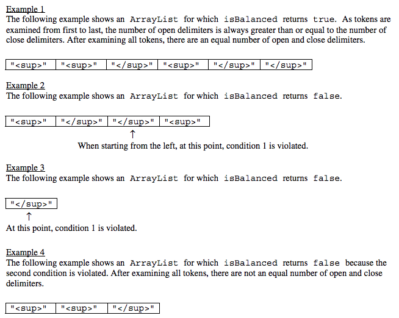

.. qnum::
   :prefix:  7-4-10-
   :start: 1

Free Response - Delimiters B
------------------------------

Part B
========

(b) Write the method ``isBalanced``, which returns ``true`` when the delimiters are balanced and returns ``false`` otherwise.  The delimiters are balanced when both
of the following conditions are satisfied; otherwise they are not balanced.

#. When traversing the ``ArrayList`` from the first element to the last element, there is no point at which there are more close delimiters than open delimiters at or before that point.

#. the total number of open delimiters is equal to the total number of close delimiters.

Consider a ``Delimiters`` object for which `openDel`` is ``""`` and ``closeDel`` is ``""``.  The examples below show different ``ArrayList`` objects that could
be returned by calls to ``getDelimitersList`` and the value that would be returned by a call to ``isBalanced``.

Check your understanding of the Question
=========================================

The problems in this section can help you check your understanding of part B.  You can skip these if you think you know what to do already.  Click on a button to reveal a question.

.. reveal:: delim_cub_r1
   :showtitle: Reveal Problem
   :hidetitle: Hide Problem
   :optional:

   .. mchoice:: delim_cub_mc_1
      :answer_a: String
      :answer_b: boolean
      :answer_c: int
      :answer_d: ArrayList
      :correct: b
      :feedback_a: What type are false and true?
      :feedback_b: The values false and true are of type boolean.
      :feedback_c: In some languages false and true are represented by integers, but not in Java.
      :feedback_d: What type are false and true?
      :optional:

      What type does isBalanced return?

.. reveal:: delim_cub_r2
   :showtitle: Reveal Problem
   :hidetitle: Hide Problem
   :optional:

   .. mchoice:: delim_cub_mc_2
      :answer_a: openDel
      :answer_b: closeDel
      :answer_c: Delimiters
      :answer_d: delimiters
      :correct: d
      :feedback_a: openDel holds the open delimiter
      :feedback_b: closeDel holds the close delimiter
      :feedback_c: Delimiters is the class name
      :feedback_d: delimiters is the variable which is passed to the isBalanced method
      :optional:

      What is the name of the variable the code will be looping through?

How to Solve Part B
=====================

Here is the question again.

Write the method ``isBalanced``, which returns ``true`` when the delimiters are balanced and returns ``false`` otherwise.  The delimiters are balanced when both
of the following conditions are satisfied; otherwise they are not balanced.

#. When traversing the ``ArrayList<String> delimiters`` from the first element to the last element, there is no point at which there are more close delimiters than open delimiters at or before that point.

#. the total number of open delimiters is equal to the total number of close delimiters.

.. shortanswer:: delim_algorithm_partb

   Explain in plain English what your code will have to do to answer this question.  Use the names given above.

This section contains a plain English explanation of one way to solve this problem as well as problems that test your understanding of how to write the code to do those things.  Click on a button to reveal the algorithm or problem.

.. reveal:: delim_alg_partb_r1
   :showtitle: Reveal Algorithm
   :hidetitle: Hide Algorithm
   :optional:

   The method ``isBalanced`` will loop through ``delimiters`` and keep track of the number of open and close delimiters we have found so far.  To do that we can create two integer variables: ``totalOpen`` and ``totalClose`` and set them to 0
   initially. Each time through the loop we will check if the current string which we will call currString is equal to ``openDel`` and if so increment ``totalOpen``, otherwise if it is equal to ``closeDel`` increment ``totalClose``.   Next if ``totalClose`` > ``totalOpen`` the method should return false.  A
   After the loop return ``totalOpen`` == ``totalClose``.  This will return true if they are equal and false otherwise.

.. reveal:: delim_rev_solveb_mc_1
   :showtitle: Reveal Problem
   :hidetitle: Hide problem
   :optional:

   .. mchoice:: delim_solveb_mc_1
      :answer_a: while
      :answer_b: for
      :answer_c: for-each
      :answer_d: nested for loop
      :correct: c
      :feedback_a: You can use a while loop, but it would make your code more error prone than another type of loop
      :feedback_b: You can use a for loop, but it would make your code more error prone than another type of loop
      :feedback_c: Since you need to loop through all the strings in the ArrayList in order, a for-each loop would be best
      :feedback_d: There is no need for a nested loop in this situation
      :optional:

      Which loop would be best for this situation?

.. reveal:: delim_rev_solveb_mc_2
   :showtitle: Reveal Problem
   :hidetitle: Hide problem
   :optional:

   .. mchoice:: delim_solveb_mc_2
      :answer_a: if (currString = openDel)
      :answer_b: if (currString == openDel)
      :answer_c: if (currString.equals(openDel))
      :answer_d: if (currString.equal(openDel))
      :correct: c
      :feedback_a: You must declare the type for delList
      :feedback_b: You must include the () when creating a new object
      :feedback_c: You must create an ArrayList using a concrete subclass like ArrayList
      :feedback_d: The declared type must be the same or a parent class of the actual type.
      :optional:

      Which Java expression correctly tests if currString is equal to openDel?

Write the Code
==================

Write the method ``isBalanced``, which returns ``true`` when the delimiters are balanced and returns ``false`` otherwise.  The delimiters are balanced when both
of the following conditions are satisfied; otherwise they are not balanced.

#. When traversing the ``ArrayList`` from the first element to the last element, there is no point at which there are more close delimiters than open delimiters at or before that point.

#. the total number of open delimiters is equal to the total number of close delimiters.

.. activecode:: frq2019Q3B-delim
   :language: java
   :autograde: unittest

   Write the method ``isBalanced`` in the code below. The ``main`` method contains code to test your solution.
   ~~~~
   import java.util.*;

   public class Delimiters
   {

       /** The open and close delimiters * */
       private String openDel;

       private String closeDel;

       /**
        * Constructs a Delimiters object were open is the open delimiter and close is
        * the close delimiter. Precondition: open and close are non-empty strings
        */
       public Delimiters(String open, String close)
       {
           openDel = open;
           closeDel = close;
       }

       /**
        * Returns an ArrayList of delimiters from the array tokens, as described in
        * part (a).
        */
       public ArrayList<String> getDelimitersList(String[] tokens)
       {
           ArrayList<String> delList = new ArrayList<String>();

           for (String currString : tokens)
           {
               if (currString.equals(openDel) || currString.equals(closeDel))
               {
                   delList.add(currString);
               }
           }
           return delList;
       }

       /**
        * Returns true if the delimiters are balanced and false otherwise, as
        * described in part (b). Precondition: delimiters contains only valid open and
        * close delimiters.
        */
       public boolean isBalanced(ArrayList<String> delimiters)
       {
           /* to be implemented in part (b) */
       }

       public static void main(String[] args)
       {
           Delimiters d1 = new Delimiters("", "");
           String[] tokens =
           {
               "", "", "", "", "", ""
           };
           ArrayList<String> delList1 = d1.getDelimitersList(tokens);
           boolean res1 = d1.isBalanced(delList1);
           System.out.println("It should print true and it prints " + res1);

           String[] tokens2 = {"", "", "", ""};
           ArrayList<String> delList2 = d1.getDelimitersList(tokens2);
           boolean res2 = d1.isBalanced(delList2);
           System.out.println("It should print false and it prints " + res2);

           String[] tokens3 = {""};
           ArrayList<String> delList3 = d1.getDelimitersList(tokens3);
           boolean res3 = d1.isBalanced(delList2);
           System.out.println("It should print false and it prints " + res3);

           String[] tokens4 = {"", "", ""};
           ArrayList<String> delList4 = d1.getDelimitersList(tokens4);
           boolean res4 = d1.isBalanced(delList2);
           System.out.println("It should print false and it prints " + res4);
       }
   }

   ====
   import static org.junit.Assert.*;

   import org.junit.*;

   import java.io.*;
   import java.util.*;

   public class RunestoneTests extends CodeTestHelper
   {
       public RunestoneTests()
       {
           super("Delimiters");
       }

       @Test
       public void test0()
       {
           String output = getMethodOutput("main");
           String expect =
                   "It should print true and it prints true\n"
                       + "It should print false and it prints false\n"
                       + "It should print false and it prints false\n"
                       + "It should print false and it prints false\n";

           boolean passed =
                   getResults(
                           expect,
                           output,
                           "Expected output from main: testing isBalanced on 4 sets of delimiters.");
           assertTrue(passed);
       }

       @Test
       public void test1()
       {
           Delimiters d1 = new Delimiters("{", "}");

           String[] tokens = {"{", "{", "}", "{", "}", "}"};
           ArrayList<String> delList1 = d1.getDelimitersList(tokens);
           boolean res1 = d1.isBalanced(delList1);

           boolean passed =
                   getResults(
                           "true",
                           "" + res1,
                           "isBalanced works on a balanced set of delimiters "
                                   + Arrays.toString(tokens));

           assertTrue(passed);
       }

       @Test
       public void test2()
       {
           Delimiters d1 = new Delimiters("{", "}");

           String[] tokens2 = {"{", "}", "}", "{"};
           ArrayList<String> delList2 = d1.getDelimitersList(tokens2);

           boolean res2 = d1.isBalanced(delList2);

           boolean passed =
                   getResults(
                           "false",
                           "" + res2,
                           "isBalanced on a non-balanced set of delimiters "
                                   + Arrays.toString(tokens2));

           assertTrue(passed);
       }

       @Test
       public void test3()
       {
           Delimiters d1 = new Delimiters("{", "}");

           String[] tokens3 = {"}"};
           ArrayList<String> delList3 = d1.getDelimitersList(tokens3);

           boolean res3 = d1.isBalanced(delList3);

           boolean passed =
                   getResults(
                           "false",
                           "" + res3,
                           "isBalanced on a non-balanced set of delimiters "
                                   + Arrays.toString(tokens3));

           assertTrue(passed);
       }

       @Test
       public void test4()
       {
           Delimiters d1 = new Delimiters("{", "}");

           String[] tokens4 = {"{", "}", "}"};
           ArrayList<String> delList4 = d1.getDelimitersList(tokens4);

           boolean res4 = d1.isBalanced(delList4);

           boolean passed =
                   getResults(
                           "false",
                           "" + res4,
                           "isBalanced on a non-balanced set of delimiters "
                                   + Arrays.toString(tokens4));

           assertTrue(passed);
       }
   }

