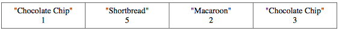
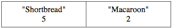

.. qnum::
   :prefix:  7-4-6-
   :start: 1

Free Response - CookieOrder B
=============================

.. index::
    single: cookieorder
    single: free response

The following is a free response question from 2010.  It was question 1 on the exam.  You can see all the free response questions from past exams at https://apstudents.collegeboard.org/courses/ap-computer-science-a/free-response-questions-by-year.

**Question 1.**  An organization raises money by selling boxes of cookies. A cookie order specifies the variety of cookie and the number of boxes ordered. The declaration of the ``CookieOrder`` class is shown below.

.. code-block:: java

   public class CookieOrder
   {
       /** Constructs a new CookieOrder object */
       public CookieOrder(String variety, int numBoxes)
       {
           /* implementation not shown */
       }

       /**
        * @return the variety of cookie being ordered
        */
       public String getVariety()
       {
           /* implementation not shown */
       }

       /**
        * @return the number of boxes being ordered
        */
       public int getNumBoxes()
       {
           /* implementation not shown */
       }

       // There may be instance variables, constructors, and methods that are not
       // shown.
   }

The ``MasterOrder`` class maintains a list of the cookies to be purchased. The declaration of the ``MasterOrder`` class is shown below.

.. code-block:: java

   public class MasterOrder
   {
       /** The list of all cookie orders */
       private List<CookieOrder> orders;

       /** Constructs a new MasterOrder object */
       public MasterOrder()
       {
           orders = new ArrayList<CookieOrder>();
       }

       /**
        * Adds theOrder to the master order.
        *
        * @param theOrder the cookie order to add to the master order
        */
       public void addOrder(CookieOrder theOrder)
       {
           orders.add(theOrder);
       }

       /**
        * @return the sum of the number of boxes of all of the cookie orders
        */
       public int getTotalBoxes()
       {
           /* to be implemented in part (a) */
       }

       // There may be instance variables, constructors, and methods that are not
       // shown.
   }

**Part b.**
The ``removeVariety`` method updates the master order by removing all of the cookie orders in which the variety of cookie matches the parameter ``cookieVar``.
The master order may contain zero or more cookie orders with the same variety as ``cookieVar``.
The method returns the total number of boxes removed from the master order.

For example, consider the following code segment.

.. code-block:: java

  MasterOrder goodies = new MasterOrder();
  goodies.addOrder(new CookieOrder("Chocolate Chip", 1));
  goodies.addOrder(new CookieOrder("Shortbread", 5));
  goodies.addOrder(new CookieOrder("Macaroon", 2));
  goodies.addOrder(new CookieOrder("Chocolate Chip", 3));

After the code segment has executed, the contents of the master order are as shown in the following table.

The method call ``goodies.removeVariety("Chocolate Chip")`` returns 4 because there were two Chocolate Chip cookie orders totaling 4 boxes. The master order is modified as shown below.

The method call ``goodies.removeVariety("Brownie")`` returns `0` and does not change the master order.

How to Solve This
--------------------

Click to reveal multiple choice questions that may help you write your solution.

.. reveal:: fr_cookieB_r1
   :showtitle: Reveal Problems
   :hidetitle: Hide Problems
   :optional:

   .. mchoice:: fr_cookieB_1
        :answer_a: while
        :answer_b: for
        :answer_c: for-each
        :correct: b
        :feedback_a: While loops are better for problems where you are looping until a condition is true or false.
        :feedback_b: Correct! A for loop will allow you to access every CookieOrder and change its contents.
        :feedback_c: This will not work because you will be changing values by removing boxes.

        What type of loop is best to check the variety of each cookie order in the list of orders?

   .. mchoice:: fr_cookieB_2
        :answer_a: remove(list[2]);
        :answer_b: list.remove(list[2]);
        :answer_c: list.remove(2);
        :correct: c
        :feedback_a: The remove method in the ArrayList class requires the object to call its function with a dot operator.
        :feedback_b: The remove method in the ArrayList class requires an integer as its argument, not a String.
        :feedback_c: Correct! Use the dot operator with list and the index you want to remove as the argument.

        How would you remove the third item from an ArrayList<String> list of size 6?

   .. mchoice:: fr_cookieB_3
        :answer_a: if (str1 == str2)
        :answer_b: if (str1.equals(str2))
        :answer_c: if (str1 = str2)
        :correct: b
        :feedback_a: Strings cannot be compared with a double equals sign.
        :feedback_b: Correct! the equals() method in the String class will compare two strings.
        :feedback_c: A single = should only be used for assigning values!

        How would you compare the values of two Strings str1 and str2?

Mixed Up Code
-------------------

Click to reveal the Mixed Up Code for the solution to this problem.

.. reveal:: cookieOrderB_parsons
    :showtitle: Reveal Mixed Up Code
    :hidetitle: Hide Mixed Up Code

    .. parsonsprob:: cookieOrderB
      :numbered: left
      :adaptive:

      The method ``removeVariety`` below contains the correct code for one solution to this problem, but it is mixed up.  Drag the needed code from the left to the right and put them in order with the correct indention so that the code would work correctly.  There may be extra blocks that are not needed in a correct solution.
      -----
      private int removeVariety(String cookieVar) 
      {
         int numBoxesRemoved = 0;
      =====
         for (int i = this.orders.size() - 1; i >= 0; i--) 
         {
      =====
         for (CookieOrder co : this.orders) 
         { #distractor
      =====
            CookieOrder thisOrder = this.orders.get(i);
      =====
            if(cookieVar.equals(thisOrder.getVariety())) 
            {
      =====
            if(cookieVar == thisOrder.getVariety()) 
            { #paired
      =====
               numBoxesRemoved += thisOrder.getNumBoxes();
               this.orders.remove(i);
      =====
            } // end if
      =====
         } // end for
      =====
         return numBoxesRemoved;
      =====
      } // end method

Solve Part B
------------

.. activecode:: FRQCookieOrderB
   :language: java
   :autograde: unittest

   FRQ Cookie Order B: Complete the method ``removeVariety`` below.
   ~~~~
   import java.util.ArrayList;
   import java.util.List;

   class CookieOrder
   {
       private int numBoxes;
       private String variety;

       /** Constructs a new CookieOrder object */
       public CookieOrder(String variety, int numBoxes)
       {
           this.variety = variety;
           this.numBoxes = numBoxes;
       }

       /**
        * @return the variety of cookie being ordered
        */
       public String getVariety()
       {
           return this.variety;
       }

       /**
        * @return the number of boxes being ordered
        */
       public int getNumBoxes()
       {
           return this.numBoxes;
       }

       // There may be instance variables, constructors, and methods that are not
       // shown.
   }

   public class MasterOrder
   {
       /** The list of all cookie orders */
       private List<CookieOrder> orders;

       /** Constructs a new MasterOrder object */
       public MasterOrder()
       {
           orders = new ArrayList<CookieOrder>();
       }

       /**
        * Adds theOrder to the master order.
        *
        * @param theOrder the cookie order to add to the master order
        */
       public void addOrder(CookieOrder theOrder)
       {
           orders.add(theOrder);
       }

       /**
        * @return the sum of the number of boxes of all of the cookie orders
        */
       public int getTotalBoxes()
       {
           int sum = 0;
           for (CookieOrder co : this.orders)
           {
               sum += co.getNumBoxes();
           }
           return sum;
       }

       public int removeVariety(String cookieVar)
       {
           // Complete this method
       }

       public static void main(String[] args)
       {
           boolean test1 = false;
           boolean test2 = false;

           MasterOrder order = new MasterOrder();
           order.addOrder(new CookieOrder("Raisin", 3));
           order.addOrder(new CookieOrder("Oatmeal", 8));
           order.addOrder(new CookieOrder("Sugar", 2));

           if (order.removeVariety("Raisin") == 3
                   && order.removeVariety("Sugar") == 2) 
           {
                test1 = true;
           }
           else
           {           
               System.out.println(
                       "Oops! Looks like your code doesn't return the correct value"
                           + " for cookie order varieties that exist.\n");
           }

           if (order.removeVariety("Chocolate Chip") == 0) 
           {
                test2 = true;
           }           
           else
           {           
               System.out.println(
                       "Oops! Looks like your code doesn't return the correct value"
                           + " for cookie orders that don't exist in the master"
                           + " order.\n");
           }

           if (test1 && test2) 
           {
               System.out.println("Looks like your code works well!");
           }
           else
           {            
               System.out.println("Make some changes to your code, please.");
           }
       }
   }

    ====
    import static org.junit.Assert.*;

    import org.junit.*;

    import java.io.*;

    public class RunestoneTests extends CodeTestHelper
    {
        public RunestoneTests()
        {
            super("MasterOrder");
        }

        @Test
        public void test0()
        {
            String output = getMethodOutput("main");
            String expected = "Looks like your code works well!";

            boolean passed = getResults(expected, output, "Running main() to check expected output");
            assertTrue(passed);
        }

        @Test
        public void test1()
        {
            MasterOrder order = new MasterOrder();
            order.addOrder(new CookieOrder("Raisin", 3));
            order.addOrder(new CookieOrder("Oatmeal", 8));
            order.addOrder(new CookieOrder("Raisin", 4));
            order.addOrder(new CookieOrder("Oatmeal", 8));

            int total = order.removeVariety("Raisin");

            boolean passed =
                    getResults(
                            "7",
                            "" + total,
                            "Remove Raisin from order: [[Raisin, 3], [Oatmeal, 8], [Raisin, 4],"
                                + " [Oatmeal,8]]");
            assertTrue(passed);
        }

        @Test
        public void test2()
        {
            MasterOrder order = new MasterOrder();
            order.addOrder(new CookieOrder("Raisin", 6));
            order.addOrder(new CookieOrder("Oatmeal", 2));
            order.addOrder(new CookieOrder("Raisin", 5));
            order.addOrder(new CookieOrder("Oatmeal", 9));

            int total = order.removeVariety("Chocolate Chip");

            boolean passed =
                    getResults(
                            "0",
                            "" + total,
                            "Remove Chocolate Chip from order: [[Raisin, 6], [Oatmeal, 2], [Raisin, 5],"
                                + " [Oatmeal, 9]]");
            assertTrue(passed);
        }

        @Test
        public void test3()
        {
            MasterOrder order = new MasterOrder();

            order.addOrder(new CookieOrder("Oatmeal", 3));
            order.addOrder(new CookieOrder("Raisin", 8));
            order.addOrder(new CookieOrder("Raisin", 4));
            order.addOrder(new CookieOrder("Oatmeal", 8));

            int total = order.removeVariety("Raisin");

            boolean passed =
                    getResults(
                            "12",
                            "" + total,
                            "Remove Raisin from order: [[Oatmeal, 3], [Raisin, 8], [Raisin, 4],"
                                + " [Oatmeal,8]] (Did you make sure to remove the adjacent matches?)");
            assertTrue(passed);
        }
    }

