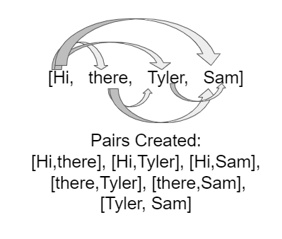

.. include:: ../common.rst

.. qnum::
   :prefix: 7-3-
   :start: 1

|Time90|

Traversing ``ArrayList``\ s with Loops
================================

``ArrayList``\ s can be traversed with ``while`` loops and both regular and
enhanced ``for`` loops much the same way we use those constructs to loop over an
array.

Enhanced For Each Loop
----------------------

.. index::
   pair: list; for-each loop

You can use a enhanced ``for`` loop to traverse all of the items in an
``ArrayList``, just like you do with an array when you only care about the
values in the list and not their indices. An example is shown in the ``main``
method below.

Note however that you can’t use the enhanced ``for`` loop if you want to add or
remove elements while traversing an ``ArrayList``. If an ``ArrayList`` is
modified, such as by calling the ``add`` or ``remove`` methods, while it is
being looped over, it will cause the loop to throw a
``ConcurrentModificationException``. If you need to modify an ``ArrayList``
while looping over it, you’ll need to use a regular ``while`` or ``for`` loop.

|CodingEx| **Coding Exercise**

.. activecode:: listForEachLoop
   :language: java
   :autograde: unittest
   :practice: T

   What does the following code do? Guess before you run it. Then, add another enhanced for each loop that computes the product of all the elements in myList by multiplying them. Print out the product after the new loop.
   ~~~~
   import java.util.*; // import all classes in this package.

   public class Test1
   {
       public static void main(String[] args)
       {
           ArrayList<Integer> myList = new ArrayList<Integer>();
           myList.add(50);
           myList.add(30);
           myList.add(20);
           int total = 0;
           for (Integer value : myList)
           {
               total += value;
           }
           System.out.println("Sum of all elements: " + total);

           // Write a for-each loop that computes the product
           // of all the elements in myList and print out the product.

       }
   }

   ====
   import static org.junit.Assert.*;

   import org.junit.*;

   import java.io.*;

   public class RunestoneTests extends CodeTestHelper
   {
       @Test
       public void testExpected() throws IOException
       {
           String output = getMethodOutput("main");
           String expect = "100";
           boolean passed = output.contains(expect);
           getResults(expect, output, "Prints out sum", passed);
           assertTrue(passed);
       }

       @Test
       public void testProduct() throws IOException
       {
           String output = getMethodOutput("main");
           String expect = "30000";
           boolean passed = output.contains(expect);
           getResults(expect, output, "Prints out product", passed);
           assertTrue(passed);
       }

       @Test
       public void countForLoops()
       {
           String code = removeSpaces(getCode());
           int count = countOccurences(code, "for(Integer");
           boolean passed = count >= 2;
           getResults("2", count + "", "Number of for each loops", passed);
           assertTrue(passed);
       }
   }

For Loop
----------------------

You can also use a ``while`` loop or a regular ``for`` loop to process list
elements accessed using an index. ``ArrayList`` indices starts at 0 just like
array indices, but instead of using the index operator ``[]`` to access
elements, you use the ``get(index)`` method to get the value at the index and
``set(index,value)`` to set the element at an index to a new value.

If you try to use an index that is outside of the range of 0 to the number of
elements − 1 in an ArrayList, your code will throw an
``IndexOutOfBoundsException``, similar to the ``ArrayIndexOutOfBoundsException``
thrown if you use the index operator on an array with an index out of bounds for
that array.

|CodingEx| **Coding Exercise**

.. activecode:: listForLoop
   :language: java
   :autograde: unittest
   :practice: T

   The following code will throw an ``IndexOutOfBoundsException``. Can you fix
   it?

   ~~~~
   import java.util.*;

   public class TestForLoop
   {
       public static void main(String[] args)
       {
           ArrayList<Integer> myList = new ArrayList<Integer>();
           myList.add(50);
           myList.add(30);
           myList.add(20);
           int total = 0;
           for (int i = 0; i <= myList.size(); i++)
           {
               total = total + myList.get(i);
           }
           System.out.println(total);
       }
   }

   ====
   import static org.junit.Assert.*;

   import org.junit.*;

   import java.io.*;

   public class RunestoneTests extends CodeTestHelper
   {
       @Test
       public void testMain() throws IOException
       {
           String output = getMethodOutput("main");
           String expect = "100";
           boolean passed = getResults(expect, output, "Expected output from main");
           assertTrue(passed);
       }

       @Test
       public void fixedCode()
       {
           boolean passed = checkCodeContains("fixed test in loop", "i < myList.size()");
           assertTrue(passed);
       }
   }

While Loop
----------------------

The example below demonstrates a ``while`` loop and an object-oriented approach
where the list is a field of the current object and you use an instance method
rather than a class (static) method to loop through the list.

|CodingEx| **Coding Exercise**

.. activecode:: listForEachLoopObj
   :language: java
   :autograde: unittest
   :practice: T

   The following code removes a name from a list. Set the found variable to the appropriate true or false values at line 13 and line 20 to make the code work.
   ~~~~
   import java.util.*;
   public class ListWorker
   {
      private ArrayList<String> nameList;

      public ListWorker(ArrayList<String> nameList)
      {
          this.nameList = nameList;
      }

      public boolean removeName(String name)
      {
          boolean found =   // true or false?
          int index = 0;
          while (index < nameList.size())
          {
              if (name.equals(nameList.get(index)))
              {
                  nameList.remove(index);
                  found =    // true or false?
              }
              else
              {
                  index++;
              }
          }
          return found;
       }

       public static void main(String[] args)
       {
           ArrayList<String> myList = new ArrayList<String>();
           myList.add("Amun");
           myList.add("Ethan");
           myList.add("Donnie");
           myList.add("Ethan");
           ListWorker listWorker = new ListWorker(myList);
           System.out.println(listWorker.nameList);
           listWorker.removeName("Ethan");
           System.out.println("After removing Ethan: "
                     + listWorker.nameList);
       }
   }
   ====
   import static org.junit.Assert.*;

   import org.junit.*;

   import java.io.*;

   public class RunestoneTests extends CodeTestHelper
   {
       @Test
       public void testMain() throws IOException
       {
           String output = getMethodOutput("main");
           String expect = "[Amun, Ethan, Donnie, Ethan]\nAfter removing Ethan: [Amun, Donnie]";
           boolean passed = getResults(expect, output, "Expected output from main");
           assertTrue(passed);
       }
   }

Be careful when you remove items from a list as you loop through it. Notice how
the method above only increments the index if an item was not removed from the
list. This is because removing an item from a list will shift the remaining
items to the left and if you increment the index in all cases you will skip the
elements immediately after each element you remove. To see why, consider that
those elements will be shifted into the position of the just removed element and
if you increment the index, it will move to the next position, skipping the
element that used to be at that position. Leaving the index unchanged after a
remove allows the shifted-down element to be processed on the next time through
the loop.

|Exercise| **Check your understanding**

.. mchoice:: qloopList_1
   :answer_a: [0, 4, 2, 5, 3]
   :answer_b: [3, 5, 2, 4, 0, 0, 0, 0]
   :answer_c: [0, 0, 0, 0, 4, 2, 5, 3]
   :answer_d: [4, 2, 5, 3]
   :correct: a
   :feedback_a: Incrementing the index each time through the loop will miss when there are two zeros in a row.
   :feedback_b: This would be true if the code moved the zeros to the end, but that is not what it does.
   :feedback_c: This would be true if the code moved the zeros to the font, but that is not what it does.
   :feedback_d: This would be correct if k was only incremented when an item was not removed from the list.

   Assume that ``nums`` has been created as an ``ArrayList`` object and it initially contains the following ``Integer`` values [0, 0, 4, 2, 5, 0, 3, 0]. What will ``nums`` contain as a result of executing ``numQuest``?

   .. code-block:: java

      ArrayList<Integer> list1 = new ArrayList<Integer>();
      private ArrayList<Integer> nums;

      // precondition: nums.size() > 0;
      // nums contains Integer objects
      public void numQuest()
      {
         int k = 0;
         Integer zero = new Integer(0);
         while (k < nums.size())
         {
            if (nums.get(k).equals(zero))
               nums.remove(k);
            k++;
         }
      }

You can step through the code above by clicking on the following `Example <http://cscircles.cemc.uwaterloo.ca/java_visualize/#code=import+java.util.*%3B%0A%0A%0Apublic+class+ListWorker+%7B%0A%0A+++private+List%3CInteger%3E+nums%3B%0A+++%0A+++public+ListWorker(List%3CInteger%3E+theNums)%0A+++%7B%0A++++++nums+%3D+theNums%3B%0A+++%7D%0A%0A+++//+precondition%3A+nums.size()+%3E+0%3B%0A+++//+nums+contains+Integer+objects%0A+++public+void+numQuest()%0A+++%7B%0A++++++int+k+%3D+0%3B%0A++++++Integer+zero+%3D+new+Integer(0)%3B%0A++++++while+(k+%3C+nums.size())%0A++++++%7B%0A+++++++++if+(nums.get(k).equals(zero))%0A++++++++++++nums.remove(k)%3B%0A+++++++++k%2B%2B%3B%0A++++++%7D%0A+++%7D%0A+++%0A+++public+static+void+main(String%5B%5D+args)+%7B%0A++++++List%3CInteger%3E+numList+%3D+new+ArrayList%3CInteger%3E()%3B%0A++++++numList.add(0)%3B%0A++++++numList.add(0)%3B%0A++++++numList.add(4)%3B%0A++++++numList.add(2)%3B%0A++++++numList.add(5)%3B%0A++++++numList.add(0)%3B%0A++++++numList.add(3)%3B%0A++++++numList.add(0)%3B%0A++++++System.out.println(numList)%3B%0A++++++ListWorker+listW+%3D+new+ListWorker(numList)%3B%0A++++++listW.numQuest()%3B%0A++++++System.out.println(numList)%3B%0A+++++%0A+++%7D%0A%7D&mode=display&curInstr=11>`_.

.. parsonsprob:: list_1
   :numbered: left
   :adaptive:

   The following has the correct code for the method getScore plus at least one extra unneeded code statement.  This method will calculate and return the score for a word game.  The code should loop through all of the elements in wordList and if the length of the current word is 3 it should add one to the score, if the length of the word is 4 it should add 2 to the score, and if the length is greater than 4 it should add 3 to the score.  The method should return the score.  Drag the needed blocks from the left into the correct order on the right. Check your solution by clicking on the Check button.  You will be told if any of the blocks are in the wrong order or if you need to remove one or more blocks.  There is one extra block that is not needed in a correct solution.
   -----
   public static int getScore(List<String> wordList)
   {
   =====
     int score = 0;

     for (String word : wordList)
     {
   =====
       if (word.length() == 3)
   =====
       {
         score++;
       }
   =====
       else if (word.length() == 4)
       {
         score = score + 2;
       }
   =====
       else if (word.length() > 4)
       {
         score = score + 3;
       }
   =====
     } // end for
   =====
     return score;

   } // end method
   =====
   if (word.length == 3) #distractor

.. parsonsprob:: list_2
   :numbered: left
   :adaptive:

   The following has the correct code for a method called insertInOrder plus at least one extra unneeded code statement. This method should add the passed name in alphabetic order to a private list field called nameList.  Drag the needed blocks from the left into the correct order on the right. Check your solution by clicking on the Check button.  You will be told if any of the blocks are in the wrong order or if you need to remove one or more blocks.  There is one extra block that is not needed in a correct solution.
   -----
   public void insertInOrder(String name)
   {
   =====
     int index = 0;
   =====
     while (index < nameList.size() &&
            nameList.get(index).compareTo(name) < 0)
     {
   =====
       index++;
   =====
     } // end while
   =====
     nameList.add(index,name);
   =====
   } // end method
   =====
   nameList.add(name); #distractor

ArrayList of Student Objects
----------------------------

|CodingEx| **Coding Exercise**

You can put any kind of objects into an ``ArrayList``. For example, here is an
``ArrayList`` of ``Student``\ s. Although the print statement works here, you
may want a nicer printout.

.. activecode:: StudentList
  :language: java
  :autograde: unittest
  :practice: T

  Add a for each loop that prints out each student and then a new line.
  ~~~~
  import java.util.*;

  public class StudentList
  {
      // main method for testing
      public static void main(String[] args)
      {
          ArrayList<Student> roster = new ArrayList<Student>();
          roster.add(new Student("Skyler", "skyler@sky.com", 123456));
          roster.add(new Student("Ayanna", "ayanna@gmail.com", 789012));
          // Replace this with a for each loop that prints out each student on a
          // separate line
          System.out.println(roster);
      }
  }

  class Student
  {
      private String name;
      private String email;
      private int id;

      public Student(String name, String email, int id)
      {
          this.name = name;
          this.email = email;
          this.id = id;
      }

      // toString() method
      public String toString()
      {
          return id + ": " + name + ", " + email;
      }
  }

  ====
  import static org.junit.Assert.*;

  import org.junit.*;

  import java.io.*;

  public class RunestoneTests extends CodeTestHelper
  {
      @Test
      public void testMain() throws IOException
      {
          String output = getMethodOutput("main");
          String expect = "123456: Skyler, skyler@sky.com\n789012: Ayanna, ayanna@gmail.com";
          boolean passed = getResults(expect, output, "Expected output from main");
          assertTrue(passed);
      }

      @Test
      public void loopCode()
      {
          boolean passed = checkCodeContains("for loop", "for");
          assertTrue(passed);
      }
  }

|Groupwork| Programming Challenge : FRQ Word Pairs
---------------------------------------------------

.. |2018 Free Response Question #2 WordPair| raw:: html

   <a href="https://secure-media.collegeboard.org/ap/pdf/ap18-frq-computer-science-a.pdf#page=7" target="_blank" style="text-decoration:underline">2018 Free Response Question #2 WordPair</a>

This challenge is based on the |2018 Free Response Question #2 WordPair|. We
encourage you to work in pairs on this challenge.

You are given a class called ``WordPair`` that can store pairs of words.

.. code-block:: java

    class WordPair
    {
        private String word1;
        private String word2;

        public WordPair(String word1, String word2)
        {
            this.word1 = word1;
            this.word2 = word2;
        }

        public String getFirst()
        {
            return word1;
        }

        public String getSecond()
        {
            return word2;
        }

        public String toString()
        {
            return "(" + word1 + ", " + word2 + ")";
        }
    }

First, see if you can create an ``ArrayList`` of ``WordPair`` objects below.
Look at the ``StudentList`` example above for help.

.. activecode:: ArrayListWordPair1
   :language: java
   :autograde: unittest

   Create an Arraylist of WordPair objects.
   ~~~~
   import java.util.*;

   public class WordPairTest
   {
       public static void main(String[] args)
       {
           // Create an ArrayList of WordPair objects called pairs

           pairs.add(new WordPair("hi", "there"));
           pairs.add(new WordPair("hi", "bye"));
           System.out.println(pairs);
       }
   }

   class WordPair
   {
       private String word1;
       private String word2;

       public WordPair(String word1, String word2)
       {
           this.word1 = word1;
           this.word2 = word2;
       }

       public String getFirst()
       {
           return word1;
       }

       public String getSecond()
       {
           return word2;
       }

       public String toString()
       {
           return "(" + word1 + ", " + word2 + ")";
       }
   }

    ====
    import static org.junit.Assert.*;

    import org.junit.*;

    import java.io.*;

    public class RunestoneTests extends CodeTestHelper
    {
        public RunestoneTests()
        {
            super("WordPairTest");
        }

        @Test
        public void testMain() throws IOException
        {
            String output = getMethodOutput("main");
            String expect = "[(hi, there), (hi, bye)]";
            boolean passed = getResults(expect, output, "Expected output from main");
            assertTrue(passed);
        }

        @Test
        public void hasArrayList()
        {
            boolean passed = checkCodeContains("ArrayList declaration", "ArrayList<WordPair>");
            assertTrue(passed);
        }
    }

In this FRQ, you are given an array of words and you will create pairs of them
by taking the first word and pairing it with all the other words, then taking
the second word and pairing it with all but the first one, and so on. For
example, if the word array is ["Hi", "there", "Tyler", "Sam"], this figure shows
how the word pairs are formed.

In the class ``WordPairsList`` below, you will write the constructor which takes
the array of words and pairs them up as shown in the figure. You will need
nested loops to pair each element with the rest of the elements in the list.

Here is the pseudocode for the constructor method.

- Initialize the ``allPairs`` list to an empty ``ArrayList`` of ``WordPair`` objects.

- Loop through the ``words`` array for the first word in the word pair (for loop from index ``i = 0`` to ``length-1``)

  - Loop through the rest of the word array starting from index ``i + 1`` for the second word in the word pair (for loop from index ``j = i + 1`` to ``length``)

    - Add the new ``WordPair`` formed from the ``i``\ th word and the ``j``\ th word to the ``allPairs`` ``ArrayList``.

.. activecode:: challenge-7-3-WordPairs
   :language: java
   :autograde: unittest

   FRQ WordPairs Challenge: Complete the constructor for ``WordPairsList`` below
   which will add pairs of words from a given array to the ``ArrayList``. Then,
   complete the method ``numMatches()`` as described below this exercise.

   ~~~~
   import java.util.*;

   public class WordPairsList
   {
       private ArrayList<WordPair> allPairs;

       public WordPairsList(String[] words)
       {
           // WRITE YOUR CODE HERE
           // initialize allPairs to an empty ArrayList of WordPair objects

           // nested loops through the words array to add each pair to allPairs

       }

       public int numMatches()
       {
           // Write the code for the second part described below
           return 0;
       }

       public String toString()
       {
           return allPairs.toString();
       }

       public static void main(String[] args)
       {
           String[] words = {"Hi", "there", "Tyler", "Sam"};
           WordPairsList list = new WordPairsList(words);
           System.out.println(list);
           // For second part below, uncomment this test:
           // System.out.println("The number of matched pairs is: " +
           // list.numMatches());
       }
   }

   class WordPair
   {
       private String word1;
       private String word2;

       public WordPair(String word1, String word2)
       {
           this.word1 = word1;
           this.word2 = word2;
       }

       public String getFirst()
       {
           return word1;
       }

       public String getSecond()
       {
           return word2;
       }

       public String toString()
       {
           return "(" + word1 + ", " + word2 + ")";
       }
   }

    ====
    import static org.junit.Assert.*;

    import org.junit.*;

    import java.io.*;

    public class RunestoneTests extends CodeTestHelper
    {
        public RunestoneTests()
        {
            super("WordPairsList");
        }

        @Test
        public void test1()
        {
            String output = getMethodOutput("main");
            String expect =
                    "[(Hi, there), (Hi, Tyler), (Hi, Sam), (there, Tyler), (there, Sam), (Tyler, Sam)]";

            boolean passed = output.contains(expect);

            String[] lines = output.split("\n");
            if (lines.length > 1) output = lines[0];

            getResults(expect, output, "Part 1 - Add all word pairs from main()", passed);
            assertTrue(passed);
        }

        @Test
        public void test2()
        {
            String output = getMethodOutput("main");
            String expect = "The number of matched pairs is: 0";

            boolean passed = output.contains(expect);
            String[] lines = output.split("\n");
            if (lines.length > 1) output = lines[1];

            getResults(expect, output, "Part 2 - call to numMatches from main()", passed);
            assertTrue(passed);
        }

        @Test
        public void test3()
        {
            String[] words = {"Hi", "Hi", "Test", "Test"};
            WordPairsList list = new WordPairsList(words);
            String output = list.toString();
            String expect = "[(Hi, Hi), (Hi, Test), (Hi, Test), (Hi, Test), (Hi, Test), (Test, Test)]";

            boolean passed =
                    getResults(
                            expect,
                            output,
                            "Part 1 - Add all word pairs with {\"Hi\", \"Hi\", \"Test\", \"Test\"}");
            assertTrue(passed);
        }

        @Test
        public void test4()
        {
            String[] words = {"Hi", "Hi", "Test", "Test"};
            WordPairsList list = new WordPairsList(words);
            String output = "The number of matched pairs is: " + list.numMatches();
            String expect = "The number of matched pairs is: 2";

            boolean passed =
                    getResults(
                            expect,
                            output,
                            "Part 2 - numMatches() with {\"Hi\", \"Hi\", \"Test\", \"Test\"}");
            assertTrue(passed);
        }
    }

In the next part of the FRQ challenge, you are asked to write a method called
``numMatches`` that counts and returns the number of pairs where the first word
is the same as the second word. For example, if the word array is
``["hi","bye","hi"]``, the pairs generated would be ``["hi","bye"]``,
``["hi","hi"]``, and ``["bye","hi"]``. In the second pair ``["hi","hi"]``, the
first word is the same as the second word, so ``numMatches`` would return 1.

For this method, you will need a loop that goes through the ``ArrayList``
``allPairs`` and for each ``WordPair`` in ``allPairs``, it checks to see if its
first word (using the ``getFirst`` method) equals the second word (using the
``getSecond`` method). If there is a match, it increments a counter which it
returns at the end of the method. To test this method, add another "there" into
the words array and then uncomment the call to ``numMatches``.

Summary
-----------

- ``ArrayList``\ s can be traversed with an enhanced ``for`` loop, a ``while``
  loop, or a regular ``for`` loop using an index.

- Deleting elements during a traversal of an ``ArrayList`` requires using
  special techniques to avoid skipping elements, since ``remove`` moves all the
  elements above the removed index down.

- Since the indices for an ``ArrayList`` start at 0 and end at the number of
  elements − 1, accessing an index value outside of this range will result in an
  ``IndexOutOfBoundsException`` being thrown.

- Changing the size of an ``ArrayList`` while traversing it using an enhanced
  ``for`` loop can result in a ``ConcurrentModificationException`` being thrown.
  Therefore, when using an enhanced ``for`` loop to traverse an ``ArrayList``,
  you should not ``add`` or ``remove`` elements.
