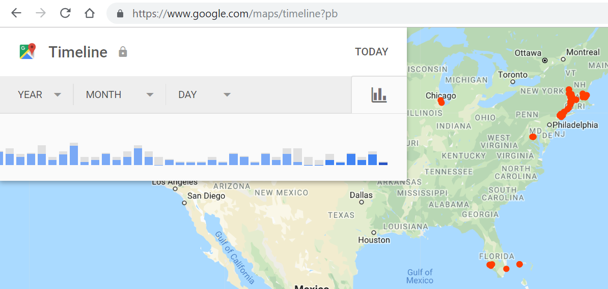

.. include:: ../common.rst

.. qnum::
   :prefix: 7-7-
   :start: 1

|Time45|

Ethics of Data Collection and Data Privacy
==========================================

.. |video1| raw:: html

   <a href="https://www.youtube.com/watch?v=bqWuioPHhz0" target="_blank" style="text-decoration:underline">video</a>

Watch the following |video1| about the massive amounts of data our smart phones and computers collect about us.

.. youtube:: bqWuioPHhz0
    :height: 315
    :width: 560
    :align: left

.. |https://www.google.com/maps/timeline| raw:: html

   <a href="https://www.google.com/maps/timeline" target="_blank" style="text-decoration:underline" > https://www.google.com/maps/timeline</a>

|CodingEx| **Activity**

Try the following activity. If you use GPS location on an Android smartphone for driving directions or games, Google keeps track of your location history and you can see it at https://www.google.com/maps/timeline. You can also turn off location tracking, but it is useful when you want directions and it's free. Do the benefits of apps that provide driving directions outweigh the lack of privacy for you? In what situations would it be beneficial or harmful for the app to track your location?

As users, we often don't realize how much personal data we are giving away. As computer programmers, we must be aware of the risks to data privacy when our code collects and stores personal data on computer systems. Legally and ethically, we must ask the users for permission to access and store their data. And if there are data breaches where the data is stolen, we must inform the affected users. The laws are slowly catching up to our technology, and many places, like Europe and California, are passing laws to protect data privacy.

Computer use and programs have beneficial and/or harmful impacts on personal security. Software apps for maps and driving directions are very useful, but they have impacts on personal security and privacy if they keep track of your location. This information could be beneficial, for example if you are lost and need to be found, but could be harmful and unsafe if someone unauthorized gains access to your location.

Here are some interesting video resources about data collection and data privacy:

.. raw:: html

    <ul>
    <li>A short <a href="https://www.cnbc.com/video/2018/03/23/everything-you-need-to-know-about-the-cambridge-analytica-scandal.html" style="text-decoration:underline" target="_blank">1 minute video</a> about the Facebook Cambridge Analytica incident and a longer <a href="https://www.pbs.org/wgbh/frontline/film/facebook-dilemma/#video-2" style="text-decoration:underline" target="_blank">1 hour PBS special</a> on Facebook.</li>
    <li><a href="https://www.youtube.com/watch?v=gXiEBcb0Vs8" style="text-decoration:underline" target="_blank">What is Geo-fencing (2 mins)</a></li>
    <li><a href="https://www.youtube.com/watch?v=j6wwBqfSk-o" style="text-decoration:underline" target="_blank">The European General Data Protection Regulation (GDPR) (3 mins)</a></li></ul>

|Groupwork| POGIL Groupwork: Data Privacy
----------------------------------------------

In POGIL groups, explore a popular app or web site and its data collecting practices. Explain the risks to privacy
from collecting and storing personal data on computer
systems.  Discuss the ethical and legal problems that may arise and how programmers can try to avoid them. Design a poster describing the data privacy issues for your chosen app or web site  for your class.

Summary
--------

- When using the computer, personal privacy is at risk. There are risks to privacy from collecting and storing personal data on computer systems. Programmers need to safeguard personal privacy.

- Computer use and the creation of programs have an impact on personal security and data privacy. These impacts can be beneficial and/or harmful.
