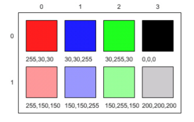

.. include:: ../common.rst

.. |Picture lab| raw:: html

   <a href= "https://secure-media.collegeboard.org/digitalServices/pdf/ap/picture-lab-studentguide.pdf" style="text-decoration:underline" target="_blank" >Picture Lab</a>

|Time45|

Picture Lab A1 - A3
========================================================

The |Picture Lab| is a fun lab where you learn how to modify digital pictures pixel by pixel using a 2D array.

.. index::
    single: binary
    single: bit
    single: byte
    single: picture lab

A1 Introduction to Digital Pictures and Color
----------------------------------------------

If you look at an advertisement for a digital camera, it will tell you how many megapixels the camera can record. What is a megapixel? A digital camera has sensors that record color at millions of points
arranged in rows and columns (Figure 1). Each point is a **pixel** or picture (abbreviated pix) element.

A **megapixel** is one million pixels. A 16.2 megapixel camera can store the color at over 16 million pixels. That’s a lot of pixels! Do you really need all of them? If you are sending a small version of your picture to a friend's phone, then just a few megapixels will be plenty. But, if you are printing a huge poster from
a picture or you want to zoom in on part of the picture, then more pixels will give you more detail.

How is the color of a pixel recorded? It can be represented using the RGB (Red, Green, Blue) color model, which stores values for red, green, and blue, each ranging from 0 to 255. You can make yellow
by combining red and green. That probably sounds strange, but combining pixels isn’t the same as
mixing paint to make a color. The computer uses light to display color, not paint. Tilt the bottom of a
CD or DVD in white light and you will see lots of colors. The CD acts as a prism and lets you see all the colors in
white light. The RGB color model sometimes also stores an alpha value as well as the red, green, and blue
values. The alpha value indicates how transparent or opaque the color is. A color that is transparent will
let you see some of the color beneath it.

    Figure 1: RGB values and the resulting colors displayed in rows and columns

How does the computer represent the values from 0 to 255? A decimal number uses the digits 0 to 9 and
powers of 10 to represent values. The decimal number 325 means 5 ones (10\ :sup:`0`) plus 2 tens (10\ :sup:`1`) plus 3 hundreds (10\ :sup:`2`) for a total of three hundred and twenty-five. Computers use **binary numbers**, which use the digits 0 and 1 and powers of 2 to represent values using groups of bits. A **bit** is a binary digit, which
can be either 0 or 1. A group of 8 bits is called a **byte**. The binary number 110 means 0 ones (2\ :sup:`0`) plus 1 two (2\ :sup:`1`) plus 1 four (2\ :sup:`2`), for a total of 6.

Questions:

.. mchoice:: picture-lab-A1-1
   :answer_a: 2
   :answer_b: 4
   :answer_c: 8
   :answer_d: 16
   :correct: c
   :feedback_a: You can only represent 4 numbers, decimal 0-3, with 2 bits: 00, 01, 10, 11.
   :feedback_b: You can only represent decimal 0-15 with 4 bits: 0000-1111.
   :feedback_c: Yes, you can represent decimal 0-255 with 8 bits: 00000000-11111111.
   :feedback_d: You could use 16 bits, but you could use much less to represent 0-255.

   How many bits does it take to represent the values from 0 to 255? See https://mobile-csp.org/webapps/numbers/binaryConverter.html for help.

.. mchoice:: picture-lab-A1-2
   :answer_a: 1
   :answer_b: 2
   :answer_c: 3
   :answer_d: 4
   :correct: c
   :feedback_a: A byte is 8 bits which can store 1 color value 0-255, but we want 3 color values for red, green, and blue.
   :feedback_b: 2 bytes would store 2 color values.
   :feedback_c: Yes, you can store 3 color values 0-255 for R, G, B in 3 bytes.
   :feedback_d: 4 bytes could store 4 color values.

   How many bytes does it take to represent a color in the RGB color model?

.. mchoice:: picture-lab-A1-3
   :answer_a: 640 pixels
   :answer_b: 480 pixels
   :answer_c: 640 + 480 = 1120 pixels
   :answer_d: 640 x 480 = 307,200 pixels
   :correct: d
   :feedback_a: That would only be enough pixels for the first row.
   :feedback_b: That would only be enough pixels for the first column.
   :feedback_c: That would only be enough pixels for the first row and first column.
   :feedback_d: Yes, the pixels are in a 640x480 grid.

   How many pixels are in a picture that is 640 pixels wide and 480 pixels high?

A2: Picking a Color
--------------------

Try the following Color Chooser by moving the sliders to see the RGB values for each color:

.. raw:: html

    <iframe height="700px" width="100%" style="margin-left:10%;max-width:80%" src="https://www.cssscript.com/demo/rgb-color-picker-slider/"></iframe>

In Java, there is a ColorChooser that you can use in code, see https://firewalledreplit.com/@BerylHoffman/ColorChooser and click on the RGB tab. Java represents color using the java.awt.Color class described here https://docs.oracle.com/javase/7/docs/api/java/awt/Color.html. This is the full name for the Color class,  which includes the package name of java.awt followed by a period and then the class name Color. Java groups related classes into packages. The awt stands for Abstract Windowing Toolkit, which is the package that contains the original Graphical User Interface (GUI) classes developed for Java. You can use just the short name for a class, like Color, as long as you include an import statement at the beginning of a class source file, as shown below. The Picture class contains the following import statement ``import java.awt.Color;``.

Questions:

.. shortanswer:: pictureLabA2Qs

     Use the color chooser above to answer the following questions.

     1. How can you make pink? What is the RGB values you used?
     2. How can you make yellow? What are the RGB values that you used?
     3. How can you make purple? What are the RGB values that you used?
     4. How can you make white? What are the RGB values that you used?
     5. How can you make dark gray? What are the RGB values that you used?

A3: Exploring a Picture
------------------------------------

Try the following PictureExplorer Java program and click on pixels in the image to see their RGB values and their row and column indices in the 2D array for the image. You can use the
explorer tool to explore the pixels in a picture. Click any location (pixel) in the picture and it will display
the row index, column index, and red, green, and blue values for that location. The location will be
highlighted with yellow crosshairs. You can click on the arrow keys or even type in values and hit the
enter button to update the display. You can also use the menu to change the zoom level.

.. raw:: html

    <iframe height="500px" width="100%" style="max-width:90%; margin-left:5%"  src="https://firewalledreplit.com/@BerylHoffman/PictureExplorer?lite=true" scrolling="no" frameborder="no" allowtransparency="true" allowfullscreen="true" sandbox="allow-forms allow-pointer-lock allow-popups allow-same-origin allow-scripts allow-modals"></iframe>

If you fork to make a copy of this program https://firewalledreplit.com/@BerylHoffman/PictureExplorer, you can upload your own images, or try this site https://imagecolorpicker.com/ where you can upload your own images and explore their RGB values.
Images are often stored as jpg or jpeg files. A JPEG file is one that follows an international standard for
storing picture data using lossy compression. Lossy compression means that the amount of data that is
stored is much smaller than the available data, but the part that is not stored is data we won't miss.

.. mchoice:: picture-day3-0a
   :answer_a: 0
   :answer_b: 180
   :answer_c: 240
   :answer_d: 90
   :correct: a
   :feedback_a: Correct
   :feedback_b: Try running some more tests.
   :feedback_c: Try running some more tests.
   :feedback_d: Try running some more tests.

   What is the row index for the top left corner of the 640x480 beach picture?

.. mchoice:: picture-day3-1a
   :answer_a: 0
   :answer_b: 180
   :answer_c: 240
   :answer_d: 90
   :correct: a
   :feedback_a: Correct
   :feedback_b: Try running some more tests.
   :feedback_c: Try running some more tests.
   :feedback_d: Try running some more tests.

   What is the column index for the top left corner of the 640x480 beach picture?

.. mchoice:: picture-day3-2a
   :answer_a: 100
   :answer_b: 639
   :answer_c: 479
   :answer_d: 700
   :correct: b
   :feedback_a: Try running some more tests.
   :feedback_b: Correct
   :feedback_c: Try running some more tests.
   :feedback_d: Try running some more tests.

   What is the right most column index of the 640x480 beach picture? You can click on the Maximize button on the top right to see the scroll bars or use the right arrows.

.. mchoice:: picture-day3-3a
   :answer_a: 180
   :answer_b: 500
   :answer_c: 639
   :answer_d: 479
   :correct: d
   :feedback_a: Try running some more tests.
   :feedback_b: Try running some more tests.
   :feedback_c: Try running some more tests.
   :feedback_d: Correct

   What is the bottom most row index of the 640x480 beach picture? You can click on the Maximize button on the top right to see the scroll bars or use the right arrows.

.. mchoice:: picture-day3-4a
   :answer_a: The row increases starting at the left and ending at the right.
   :answer_b: The row increases starting at the right and ending at the left.
   :answer_c: The row increases starting at the top and ending at the bottom.
   :answer_d: The row increases starting at the bottom and ending at the top.
   :correct: c
   :feedback_a: Try running some more tests.
   :feedback_b: Try running some more tests.
   :feedback_c: Correct.
   :feedback_d: Try running some more tests.

   Does the row index increase from left to right or top to bottom?

.. mchoice:: picture-day3-5a
   :answer_a: The column increases starting at the left and ending at the right.
   :answer_b: The column increases starting at the right and ending at the left.
   :answer_c: The column increases starting at the top and ending at the bottom.
   :answer_d: The column increases starting at the bottom and ending at the top.
   :correct: a
   :feedback_a: Correct
   :feedback_b: Try running some more tests.
   :feedback_c: Try running some more tests.
   :feedback_d: Try running some more tests.

   Does the column index increase from left to right or top to bottom?

.. mchoice:: picture-day3-6a
   :answer_a: This is when data is lost in the resizing of an image.
   :answer_b: The intentional decreasing of resolution by merging adjacent pixels.
   :answer_c: When an image is magnified to the point where you can see the pixels as small squares.
   :answer_d: The modification of individual pixels.
   :correct: c
   :feedback_a: try again.
   :feedback_b: try again.
   :feedback_c: Correct
   :feedback_d: try again.

   Use the Zoom menu to set the zoom to 500%. Can you see squares of color? This is called pixelation. What is pixelation?

Through your exploration, you have discovered that the top left corner coordinate for an image is (0,0) and the bottom left is (width, height) for the width and height of an image. In the next lessons, we will modify Java code to manipulate the color values of each pixel in 2D arrays.
