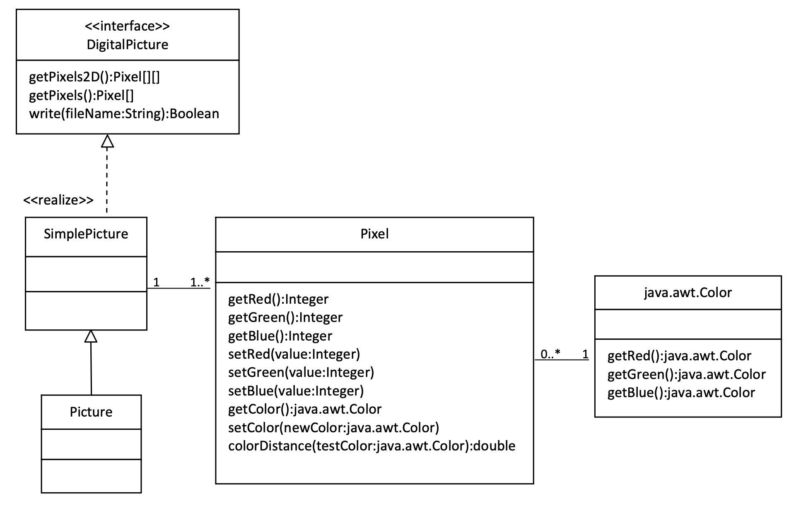
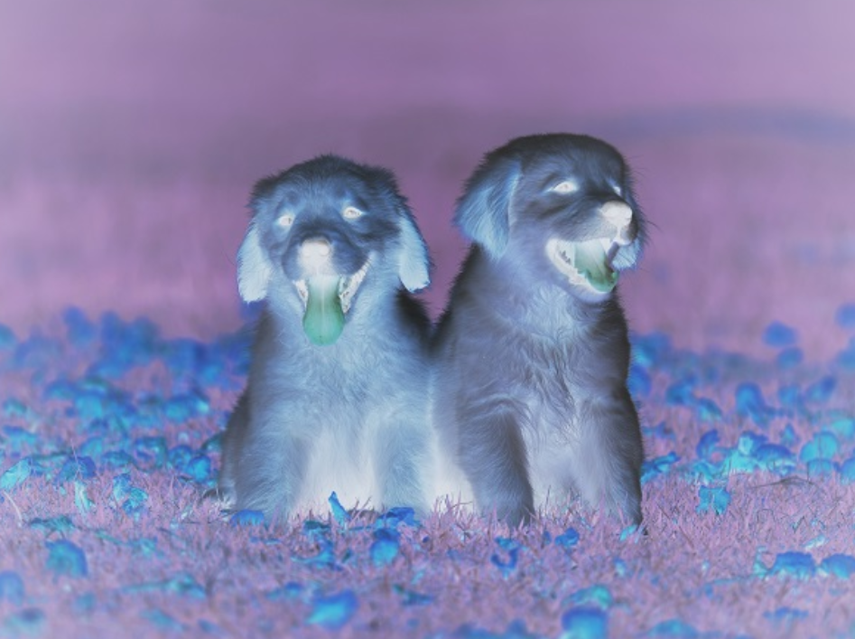
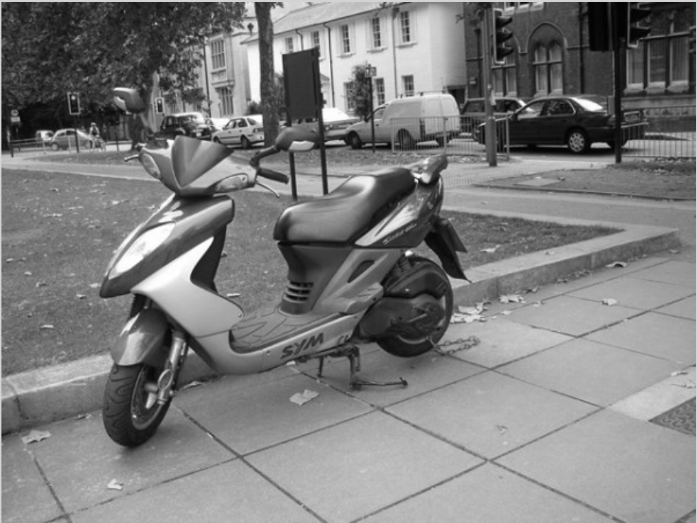
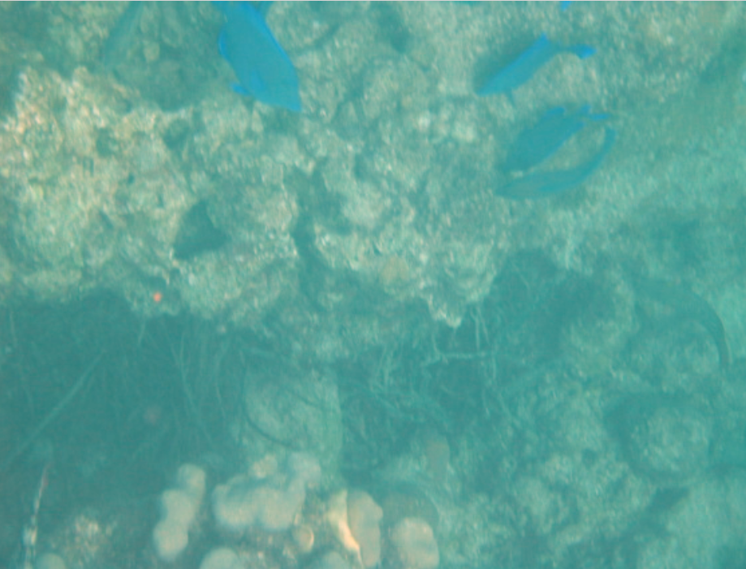
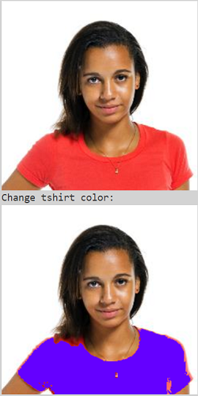

.. include:: ../common.rst

|Time90|

Picture Lab A5: Modifying a Picture
=====================================================

Even though digital pictures have millions of pixels, modern computers are so fast that they can process
all of them quickly. You will write methods in the ``Picture`` class that modify digital pictures.

Picture Classes: UML and Inheritance
-------------------------------------

The ``Picture`` class inherits attributes and methods from the ``SimplePicture`` class and the ``SimplePicture`` class implements the ``DigitalPicture`` interface as shown in the **Unified Modeling Language (UML)** class diagram in the figure below.

    Figure 1: A UML Class diagram

A UML class diagram shows classes and the relationships between the classes. Each class is shown in a box with the class name at the top.
The middle area shows attributes (instance or class variables) and the bottom area shows methods. The open triangle points to the class that the connected class inherits from.
The straight line links show associations between classes. Association is also called a “has-a” relationship. The numbers at the end of the association links give the number of objects associated with an object at the other end.

For example, it shows that one ``Pixel`` object has one ``Color`` object associated with it and that a ``Color`` object can have zero to many ``Pixel`` objects associated with it.
You may notice that the UML class diagram doesn't look exactly like Java code. UML isn't language specific.

The following questions require some knowledge about inheritance which is covered in the next unit, Unit 9. You may want to come back to do these questions after Unit 9.

.. |Picture Lab project| raw:: html

   <a href= "https://firewalledreplit.com/@BerylHoffman/Picture-Lab" style="text-decoration:underline" target="_blank" >Picture Lab project link</a>

.. reveal:: plhide1
     :showtitle: Reveal Inheritance Questions
     :hidetitle: Hide Questions
     :optional:

     Click on this |Picture Lab project| and click on Show files to answer the following questions.

     .. mchoice:: picture-day5-0a
        :answer_a: Yes
        :answer_b: No, but it is inherited
        :correct: b
        :feedback_a: The Picture.java class does not have the getPixels2D() method defined in it but it inherits it from the class SimplePicture.
        :feedback_b: Correct, this class inherits that method from the class SimplePicture.
        :optional:

        Click on the |Picture Lab project| and click on Show files. Open ``Picture.java`` and look for the method ``getPixels2D``. Is it there?

     .. mchoice:: picture-day5-1
        :answer_a: Yes
        :answer_b: No
        :correct: a
        :feedback_a: Yes, the SimplePicture class contains the method getPixels2D.
        :feedback_b: The SimplePicture class contains the method getPixels2D.
        :optional:

        Open ``SimplePicture.java`` and look for the method ``getPixels2D``. Is it there?

     .. mchoice:: picture-day5-1a
        :answer_a: yes
        :answer_b: no
        :correct: b
        :feedback_a: We cannot create an object from an interface because it is abstract.
        :feedback_b: Correct! We cannot create an object from an interface because it is abstract.
        :optional:

        This question is about interfaces which are not covered in the AP exam. Interfaces are like abstract templates of a class that specify the method headers but not the definitions. Does the following code compile? Try it in the main method if you do not know.
          DigitalPicture p = new DigitalPicture();

     .. mchoice:: picture-day5-2a
        :answer_a: yes
        :answer_b: no
        :correct: a
        :feedback_a: Yes. The SimplePicture class implements the interface DigitalPicture which means it is a type of Digital Picture.
        :feedback_b: The SimplePicture class implements the interface DigitalPicture which means it is a type of Digital Picture.
        :optional:

        This question is about interfaces which are not covered in the AP exam. Assuming that a no-argument constructor exists for SimplePicture, would the following code compile?
          DigitalPicture p = new SimplePicture();

     .. mchoice:: picture-day5-3a
        :answer_a: yes
        :answer_b: no
        :correct: a
        :feedback_a: Yes, because Picture extends SimplePicture which implements the interface DigitalPicture.
        :feedback_b: Picture extends SimplePicture which implements the interface DigitalPicture.
        :optional:

        This question is about interfaces which are not covered in the AP exam. Assuming that a no-argument constructor exists for Picture, would the following code compile?
          DigitalPicture p = new Picture();

     .. mchoice:: picture-day5-4a
        :answer_a: yes
        :answer_b: no
        :correct: a
        :feedback_a: Yes, because Picture extends SimplePicture which implements the interface DigitalPicture.
        :feedback_b: Picture extends SimplePicture which implements the interface DigitalPicture.
        :optional:

        Assuming that a no-argument constructor exists for Picture, does the following code compile?
         SimplePicture p = new Picture();

     .. mchoice:: picture-day5-5a
        :answer_a: yes
        :answer_b: no
        :correct: b
        :feedback_a: Picture inherits from SimplePicture, but not the other way around.
        :feedback_b: Picture inherits from SimplePicture, but not the other way around.
        :optional:

        Assuming that a no-argument constructor exists for SimplePicture, does the following code compile?
          Picture p = new SimplePicture();

Because DigitalPicture declares a getPixels2D method that returns a two-dimensional
array of Pixel objects, SimplePicture implements that interface, and Picture inherits
from SimplePicture, you can use the getPixels2D method on a Picture object. You can
loop through all the Pixel objects in the two-dimensional array to modify the picture. You can get
and set the red, green, and/or blue value for a Pixel object. You can also get and/or set the Color
value for a Pixel object. For example,

.. code-block:: java

      Picture pict = new Picture("beach.jpg");
      Pixel[][] pixels = pict.getPixels2D();
      Pixel p = pixels[0][0]; // get the first pixel
      int blue = p.getBlue(); // get its blue value
      System.out.println("Pixel (0,0) has a blue value of " + blue );
      p.setBlue(255);  // set its blue value to 255
      pict.show();

Image Modification Exercises
---------------------------------------------------

.. image:: Figures/beach.jpg
    :width: 250
    :align: left

What do you think you will see if you modify the beach picture to set all the blue
values to zero? Do you think you will still see a beach? Run the main method in the Picture class in the Active Code below.
The body of the main method will create a Picture object named beach from the
“beach.jpg” file and call the method that sets
the blue values at all pixels to zero.
The following code is the main method from the Picture class.

.. code-block:: java

 public static void main(String[] args)
 {
   Picture pict = new Picture("beach.jpg");
   pict.show(); // show the before picture
   pict.zeroBlue();
   pict.show(); // show the after picture
 }

The method ``zeroBlue`` in the ``Picture`` class gets a two-dimensional array of
``Pixel`` objects from the current picture (the picture the method was called
on). It then declares a variable that will refer to a ``Pixel`` object named
``pixelObj``. It uses a nested for-each loop to loop through all the pixels in
the picture. Inside the body of the nested for-each loop it sets the blue value
for the current pixel to zero. Note that you cannot change the elements of an
array when you use a for-each loop. If, however, the array elements are
references to objects that have methods that allow changes, as they are here,
you can change the internal state of objects referenced in the array.

The following code is the ``zeroBlue`` method in the ``Picture`` class.

.. code-block:: java

 public void zeroBlue()
 {
      Pixel[][] pixels = this.getPixels2D();
      for (Pixel[] rowArray : pixels)
      {
           for (Pixel p : rowArray)
           {
              p.setBlue(0);
           }
      }
 }

Another option is to use for loops with indices to visit each pixel in the picture:

.. code-block:: java

 public void zeroBlue()
 {
      Pixel[][] pixels = this.getPixels2D();
      for (int row = 0; row < pixels.length; row++)
      {
           for (int col = 0 ; col < pixels[0].length; col++)
           {
              Pixel p = pixels[row][col];
              p.setBlue(0);
           }
      }
 }

|CodingEx| **Coding Exercises**

.. image:: Figures/keepOnlyBlue.png
    :width: 250
    :align: left

1. You may have done this exercise in the programming challenge in lesson 8.2. Using the ``zeroBlue`` method as a starting point, write the method ``keepOnlyBlue`` that will keep only the blue values, that is, it will set the red and green values to zero. Be sure to call the new test method in the ``main`` method.

.. |repl.it project| raw:: html

   <a href= "https://firewalledreplit.com/@BerylHoffman/Picture-Lab" style="text-decoration:underline" target="_blank" >Repl.it Swing project</a>

.. |repl 2| raw:: html

   <a href= "https://firewalledreplit.com/@jds7184/PictureLab" style="text-decoration:underline" target="_blank" >alternative Repl.it project</a>

You can use beach.jpg or one of the other images seen at the bottom of this lesson in the active codes below which are autograded. To use your own images, you can fork this |repl.it project| or this |repl 2| (click output.jpg to see the result) or download the project files form replit to your own IDE.

.. activecode:: picture-lab-A5-keepOnlyBlue
    :language: java
    :autograde: unittest
    :datafile: pictureClasses1.jar, beach.jpg, metalLion.jpg, water.jpg, kitten.jpg, puppies.jpg, blueMotorcycle.jpg, student.jpg

    Picture Lab keepOnlyBlue: Using zeroBlue() as a guide, write a method called keepOnlyBlue() that keeps only the blue values by setting the red and green values to zero. Change the method call in main from zeroBlue to keepOnlyBlue to test it. Try one of the other images below like metalLion.jpg, water.jpg, kitten.jpg, puppies.jpg, blueMotorcycle.jpg, or student.jpg.
    ~~~~
    import java.awt.*;
    import java.awt.font.*;
    import java.awt.geom.*;
    import java.awt.image.BufferedImage;
    import java.text.*;
    import java.util.*;

    /**
     * A class that represents a picture. This class inherits from SimplePicture and
     * allows the student to add functionality to the Picture class.
     *
     * @author Barbara Ericson ericson@cc.gatech.edu
     */
    public class Picture extends SimplePicture
    {
        ///////////////////// constructors //////////////////////////////////

        /** Constructor that takes no arguments */
        public Picture()
        {
            /* not needed but use it to show students the implicit call to super()
             * child constructors always call a parent constructor
             */
            super();
        }

        /**
         * Constructor that takes a file name and creates the picture
         *
         * @param fileName the name of the file to create the picture from
         */
        public Picture(String fileName)
        {
            // let the parent class handle this fileName
            super(fileName);
        }

        /**
         * Constructor that takes the height and width
         *
         * @param height the height of the desired picture
         * @param width the width of the desired picture
         */
        public Picture(int height, int width)
        {
            // let the parent class handle this width and height
            super(width, height);
        }

        /**
         * Constructor that takes a picture and creates a copy of that picture
         *
         * @param copyPicture the picture to copy
         */
        public Picture(Picture copyPicture)
        {
            // let the parent class do the copy
            super(copyPicture);
        }

        /**
         * Constructor that takes a buffered image
         *
         * @param image the buffered image to use
         */
        public Picture(BufferedImage image)
        {
            super(image);
        }

        ////////////////////// methods ///////////////////////////////////////

        /**
         * Method to return a string with information about this picture.
         *
         * @return a string with information about the picture such as fileName, height
         *     and width.
         */
        public String toString()
        {
            String output =
                    "Picture, filename "
                            + getFileName()
                            + " height "
                            + getHeight()
                            + " width "
                            + getWidth();
            return output;
        }

        /** zeroBlue() method sets the blue values at all pixels to zero */
        public void zeroBlue()
        {
            Pixel[][] pixels = this.getPixels2D();

            for (Pixel[] rowArray : pixels)
            {
                for (Pixel p : rowArray)
                {
                    p.setBlue(0);
                }
            }
        }

        /*
           keepOnlyBlue() method sets the red and green values at all pixels to zero.

           Add new method here and call it from main.
        */

        /* Main method for testing
         */
        public static void main(String[] args)
        {
            Picture pict = new Picture("beach.jpg");
            pict.show();
            pict.zeroBlue(); // Change this to call keepOnlyBlue()
            pict.show();
        }
    }

    ====
    import static org.junit.Assert.*;

    import org.junit.*;

    import java.io.*;

    public class RunestoneTests extends CodeTestHelper
    {
        @Test
        public void test1()
        {
            String target = "public void keepOnlyBlue()";
            boolean passed = checkCodeContains("keepOnlyBlue() method", target);
            assertTrue(passed);
        }

        @Test
        public void test1b()
        {
            String target = ".keepOnlyBlue()";
            boolean passed = checkCodeContains("Call to keepOnlyBlue() in main", target);
            assertTrue(passed);
        }

        @Test
        public void test2()
        {
            String target = ".setGreen(0);";
            boolean passed =
                    checkCodeContains("keepOnlyBlue() setting green pixels to the number 0", target);
            assertTrue(passed);
        }

        @Test
        public void test2b()
        {
            String target = ".setRed(0);";
            boolean passed =
                    checkCodeContains("keepOnlyBlue() setting red pixels to the number 0", target);
            assertTrue(passed);
        }

        @Test
        public void test3()
        {
            String target = "for";
            String code = getCode();
            int index = code.indexOf("public void keepOnlyBlue()");
            boolean passed = false;
            if (index > 0)
            {
                code = code.substring(index);
                int num = countOccurences(code, target);
                passed = num >= 2;
            }
            getResults(
                    "true", "" + passed, "Checking that keepOnlyBlue() contains 2 for loops", passed);
            assertTrue(passed);
        }
    }

2. Write the negate method to negate all the pixels in a picture. To negate a picture, set the red
value to 255 minus the current red value (use the pixel's ``getRed`` method), the green value to 255 minus the current green value
and the blue value to 255 minus the current blue value.  Be sure to call the new test method in the main
method.

.. activecode:: picture-lab-A5-negate
    :language: java
    :autograde: unittest
    :datafile: pictureClasses1.jar, beach.jpg, metalLion.jpg, water.jpg, kitten.jpg, puppies.jpg, blueMotorcycle.jpg, student.jpg

    Picture Lab negate: Write a method called negate() that negates all the pixels in a picture by setting the red value to 255 minus the current red value (use the pixel's getRed() method), the green value to 255 minus the current green value and the blue value to 255 minus the current blue value.  Try one of the other images below like beach.jpg, metalLion.jpg, water.jpg, kitten.jpg, puppies.jpg, blueMotorcycle.jpg, or student.jpg.
    ~~~~
    import java.awt.*;
    import java.awt.font.*;
    import java.awt.geom.*;
    import java.awt.image.BufferedImage;
    import java.text.*;
    import java.util.*;

    /**
     * A class that represents a picture. This class inherits from SimplePicture and
     * allows the student to add functionality to the Picture class.
     *
     * @author Barbara Ericson ericson@cc.gatech.edu
     */
    public class Picture extends SimplePicture
    {
        ///////////////////// constructors //////////////////////////////////

        /** Constructor that takes no arguments */
        public Picture()
        {
            /* not needed but use it to show students the implicit call to super()
             * child constructors always call a parent constructor
             */
            super();
        }

        /**
         * Constructor that takes a file name and creates the picture
         *
         * @param fileName the name of the file to create the picture from
         */
        public Picture(String fileName)
        {
            // let the parent class handle this fileName
            super(fileName);
        }

        /**
         * Constructor that takes the height and width
         *
         * @param height the height of the desired picture
         * @param width the width of the desired picture
         */
        public Picture(int height, int width)
        {
            // let the parent class handle this width and height
            super(width, height);
        }

        /**
         * Constructor that takes a picture and creates a copy of that picture
         *
         * @param copyPicture the picture to copy
         */
        public Picture(Picture copyPicture)
        {
            // let the parent class do the copy
            super(copyPicture);
        }

        /**
         * Constructor that takes a buffered image
         *
         * @param image the buffered image to use
         */
        public Picture(BufferedImage image)
        {
            super(image);
        }

        ////////////////////// methods ///////////////////////////////////////

        /**
         * Method to return a string with information about this picture.
         *
         * @return a string with information about the picture such as fileName, height
         *     and width.
         */
        public String toString()
        {
            String output =
                    "Picture, filename "
                            + getFileName()
                            + " height "
                            + getHeight()
                            + " width "
                            + getWidth();
            return output;
        }

        /*
           negate() method negates all the pixels in a picture by setting the red value to 255 minus the current red value (use the pixel's getRed() method), the green value to 255 minus the current green value and the blue value to 255 minus the current blue value.

           Add new method here.
        */

        /* Main method for testing
         */
        public static void main(String[] args)
        {
            Picture pict = new Picture("puppies.jpg");
            pict.show();
            System.out.println("Negate: ");
            pict.negate();
            pict.show();
        }
    }

    ====
    import static org.junit.Assert.*;

    import org.junit.*;

    import java.io.*;

    public class RunestoneTests extends CodeTestHelper
    {
        @Test
        public void test1()
        {
            String target = "public void negate()";
            boolean passed = checkCodeContains("negate() method", target);
            assertTrue(passed);
        }

        @Test
        public void test2()
        {
            String target = "255";
            boolean passed = checkCodeContains("negate() subtracts from 255", target);
            assertTrue(passed);
        }

        @Test
        public void test2b()
        {
            String target = ".getRed()";
            boolean passed = checkCodeContains("negate() uses get methods", target);
            assertTrue(passed);
        }

        @Test
        public void test3()
        {
            String target = "for";
            String code = getCode();
            int index = code.indexOf("public void negate()");
            boolean passed = false;
            if (index > 0)
            {
                code = code.substring(index);
                int num = countOccurences(code, target);
                passed = num >= 2;
            }
            getResults("true", "" + passed, "Checking that negate() contains 2 for loops", passed);
            assertTrue(passed);
        }
    }

3. Write the grayscale method to turn the picture into shades of gray. Set the red, green, and
blue values to the average of the current red, green, and blue values (add all three values and
divide by 3).  Be sure to call the new test method in the main method.

.. activecode:: picture-lab-A5-gray-scale
    :language: java
    :autograde: unittest
    :datafile: pictureClasses1.jar, beach.jpg, metalLion.jpg, water.jpg, kitten.jpg, puppies.jpg, blueMotorcycle.jpg, student.jpg

    Picture Lab Grayscale: Write a method called grayscale to turn the picture into shades of gray. Set the red, green, and blue values to the average of the current red, green, and blue values (add all three values and divide by 3). Try another image file from beach.jpg, metalLion.jpg, water.jpg, kitten.jpg, puppies.jpg, blueMotorcycle.jpg, student.jpg.
    ~~~~
    import java.awt.*;
    import java.awt.font.*;
    import java.awt.geom.*;
    import java.awt.image.BufferedImage;
    import java.text.*;
    import java.util.*;

    /**
     * A class that represents a picture. This class inherits from SimplePicture and
     * allows the student to add functionality to the Picture class.
     *
     * @author Barbara Ericson ericson@cc.gatech.edu
     */
    public class Picture extends SimplePicture
    {
        ///////////////////// constructors //////////////////////////////////

        /** Constructor that takes no arguments */
        public Picture()
        {
            /* not needed but use it to show students the implicit call to super()
             * child constructors always call a parent constructor
             */
            super();
        }

        /**
         * Constructor that takes a file name and creates the picture
         *
         * @param fileName the name of the file to create the picture from
         */
        public Picture(String fileName)
        {
            // let the parent class handle this fileName
            super(fileName);
        }

        /**
         * Constructor that takes the height and width
         *
         * @param height the height of the desired picture
         * @param width the width of the desired picture
         */
        public Picture(int height, int width)
        {
            // let the parent class handle this width and height
            super(width, height);
        }

        /**
         * Constructor that takes a picture and creates a copy of that picture
         *
         * @param copyPicture the picture to copy
         */
        public Picture(Picture copyPicture)
        {
            // let the parent class do the copy
            super(copyPicture);
        }

        /**
         * Constructor that takes a buffered image
         *
         * @param image the buffered image to use
         */
        public Picture(BufferedImage image)
        {
            super(image);
        }

        ////////////////////// methods ///////////////////////////////////////

        /**
         * Method to return a string with information about this picture.
         *
         * @return a string with information about the picture such as fileName, height
         *     and width.
         */
        public String toString()
        {
            String output =
                    "Picture, filename "
                            + getFileName()
                            + " height "
                            + getHeight()
                            + " width "
                            + getWidth();
            return output;
        }

        /*
           grayscale() method sets the red, green, andblue values to the average of the current red, green, and blue values (add all three values and divide by 3).

           Add new method here.
        */

        /* Main method for testing
         */
        public static void main(String[] args)
        {
            Picture pict = new Picture("blueMotorcycle.jpg");
            pict.show();
            System.out.println("Gray Scale: ");
            pict.grayscale();
            pict.show();
        }
    }

    ====
    import static org.junit.Assert.*;

    import org.junit.*;

    import java.io.*;

    public class RunestoneTests extends CodeTestHelper
    {
        @Test
        public void test1()
        {
            String target = "public void grayscale()";
            boolean passed = checkCodeContains("grayscale() method", target);
            assertTrue(passed);
        }

        @Test
        public void test2()
        {
            String target = ".getRed()";
            boolean passed = checkCodeContains("grayscale() uses get methods", target);
            assertTrue(passed);
        }

        @Test
        public void test2b()
        {
            String target = "/3";
            boolean passed =
                    checkCodeContains("grayscale() divides by 3 to average the values", target);
            assertTrue(passed);
        }

        @Test
        public void test3()
        {
            String target = "for";
            String code = getCode();
            int index = code.indexOf("public void grayscale()");
            boolean passed = false;
            if (index > 0)
            {
                code = code.substring(index);
                int num = countOccurences(code, target);
                passed = num >= 2;
            }
            getResults("true", "" + passed, "Checking that grayscale() contains 2 for loops", passed);
            assertTrue(passed);
        }
    }

.. image:: Figures/water.jpg
    :width: 200
    :align: left

4. Challenge — Explore the water.jpg picture. Write a method
fixUnderwater() to modify the pixel colors to make the fish easier to see. There are many ways to do this, but you could try increasing one of the colors by a certain factor. Here are some more complex algorithms for increasing the brightness and contrast of images https://ie.nitk.ac.in/blog/2020/01/19/algorithms-for-adjusting-brightness-and-contrast-of-an-image/.

.. activecode:: picture-lab-A5-fix-underwater
    :language: java
    :autograde: unittest
    :datafile: pictureClasses1.jar, beach.jpg, metalLion.jpg, water.jpg, kitten.jpg, puppies.jpg, blueMotorcycle.jpg, student.jpg

    Picture Lab fix-underwater: Write a method called fixUnderwater() to modify the pixel colors to make the fish easier to see. Try increasing one of the colors by a certain factor.
    ~~~~
    import java.awt.*;
    import java.awt.font.*;
    import java.awt.geom.*;
    import java.awt.image.BufferedImage;
    import java.text.*;
    import java.util.*;

    /**
     * A class that represents a picture. This class inherits from SimplePicture and
     * allows the student to add functionality to the Picture class.
     *
     * @author Barbara Ericson ericson@cc.gatech.edu
     */
    public class Picture extends SimplePicture
    {
        ///////////////////// constructors //////////////////////////////////

        /** Constructor that takes no arguments */
        public Picture()
        {
            /* not needed but use it to show students the implicit call to super()
             * child constructors always call a parent constructor
             */
            super();
        }

        /**
         * Constructor that takes a file name and creates the picture
         *
         * @param fileName the name of the file to create the picture from
         */
        public Picture(String fileName)
        {
            // let the parent class handle this fileName
            super(fileName);
        }

        /**
         * Constructor that takes the height and width
         *
         * @param height the height of the desired picture
         * @param width the width of the desired picture
         */
        public Picture(int height, int width)
        {
            // let the parent class handle this width and height
            super(width, height);
        }

        /**
         * Constructor that takes a picture and creates a copy of that picture
         *
         * @param copyPicture the picture to copy
         */
        public Picture(Picture copyPicture)
        {
            // let the parent class do the copy
            super(copyPicture);
        }

        /**
         * Constructor that takes a buffered image
         *
         * @param image the buffered image to use
         */
        public Picture(BufferedImage image)
        {
            super(image);
        }

        ////////////////////// methods ///////////////////////////////////////

        /**
         * Method to return a string with information about this picture.
         *
         * @return a string with information about the picture such as fileName, height
         *     and width.
         */
        public String toString()
        {
            String output =
                    "Picture, filename "
                            + getFileName()
                            + " height "
                            + getHeight()
                            + " width "
                            + getWidth();
            return output;
        }

        /*
           fixUnderwater() modifies the pixel colors to make the fish easier to see.

           Add new method here.
        */

        /* Main method for testing
         */
        public static void main(String[] args)
        {
            Picture pict = new Picture("water.jpg");
            pict.show();
            System.out.println("Fix Underwater: ");
            pict.fixUnderwater();
            pict.show();
        }
    }

    ====
    import static org.junit.Assert.*;

    import org.junit.*;

    import java.io.*;

    public class RunestoneTests extends CodeTestHelper
    {
        @Test
        public void test1()
        {
            String target = "public void fixUnderwater()";
            boolean passed = checkCodeContains("fixUnderwater() method", target);
            assertTrue(passed);
        }

        @Test
        public void test2()
        {
            String target = ".setRed(";
            boolean passed =
                    checkCodeContains(
                            "fixUnderwater() uses the setRed() method to increase red values", target);
            assertTrue(passed);
        }

        @Test
        public void test3()
        {
            String target = "for";
            String code = getCode();
            int index = code.indexOf("public void fixUnderwater()");
            boolean passed = false;
            if (index > 0)
            {
                code = code.substring(index);
                int num = countOccurences(code, target);
                passed = num >= 2;
            }
            getResults(
                    "true", "" + passed, "Checking that fixUnderwater() contains 2 for loops", passed);
            assertTrue(passed);
        }
    }

5. Extra Challenge — This exercise is not in the original picture lab. Can you change just the t-shirt color in student.jpg? You will need to use an if statement inside the loops to look for the red t-shirt color and then change it. The red pixels probably have a high red value (for example greater than 200) and low green and blue values (for example less than 100). After changing the t-shirt color, try changing the background color or the hair color.

.. activecode:: picture-lab-A5-tshirt-color
    :language: java
    :autograde: unittest
    :datafile: pictureClasses1.jar, beach.jpg, metalLion.jpg, water.jpg, kitten.jpg, puppies.jpg, blueMotorcycle.jpg, student.jpg

    Can you change just the t-shirt color in student.jpg? You will need to use an if statement inside the loops to look for the red t-shirt color and then change it. The red pixels probably have a high red value (for example greater than 200) and low green and blue values (for example less than 100). After changing the t-shirt color, try changing the background color or the hair color.
    ~~~~
    import java.awt.*;
    import java.awt.font.*;
    import java.awt.geom.*;
    import java.awt.image.BufferedImage;
    import java.text.*;
    import java.util.*;

    /**
     * A class that represents a picture. This class inherits from SimplePicture and
     * allows the student to add functionality to the Picture class.
     *
     * @author Barbara Ericson ericson@cc.gatech.edu
     */
    public class Picture extends SimplePicture
    {
        ///////////////////// constructors //////////////////////////////////

        /** Constructor that takes no arguments */
        public Picture()
        {
            /* not needed but use it to show students the implicit call to super()
             * child constructors always call a parent constructor
             */
            super();
        }

        /**
         * Constructor that takes a file name and creates the picture
         *
         * @param fileName the name of the file to create the picture from
         */
        public Picture(String fileName)
        {
            // let the parent class handle this fileName
            super(fileName);
        }

        /**
         * Constructor that takes the height and width
         *
         * @param height the height of the desired picture
         * @param width the width of the desired picture
         */
        public Picture(int height, int width)
        {
            // let the parent class handle this width and height
            super(width, height);
        }

        /**
         * Constructor that takes a picture and creates a copy of that picture
         *
         * @param copyPicture the picture to copy
         */
        public Picture(Picture copyPicture)
        {
            // let the parent class do the copy
            super(copyPicture);
        }

        /**
         * Constructor that takes a buffered image
         *
         * @param image the buffered image to use
         */
        public Picture(BufferedImage image)
        {
            super(image);
        }

        ////////////////////// methods ///////////////////////////////////////

        /**
         * Method to return a string with information about this picture.
         *
         * @return a string with information about the picture such as fileName, height
         *     and width.
         */
        public String toString()
        {
            String output =
                    "Picture, filename "
                            + getFileName()
                            + " height "
                            + getHeight()
                            + " width "
                            + getWidth();
            return output;
        }

        /** zeroBlue() method sets the blue values at all pixels to zero */
        public void zeroBlue()
        {
            Pixel[][] pixels = this.getPixels2D();

            for (Pixel[] rowArray : pixels)
            {
                for (Pixel p : rowArray)
                {
                    p.setBlue(0);
                }
            }
        }

        /*
          changeTshirt(): Can you change just the t-shirt color in student.jpg? You will need to use an if statement inside the loops to look for the red t-shirt color and then change it. The red pixels probably have a high red value (for example greater than 200) and low green and blue values (for example less than 100).

           Add new method here.
        */

        /* Main method for testing
         */
        public static void main(String[] args)
        {
            Picture pict = new Picture("student.jpg");
            pict.show();
            System.out.println("Change tshirt color: ");
            pict.changeTshirt();
            pict.show();
        }
    }

    ====
    import static org.junit.Assert.*;

    import org.junit.*;

    import java.io.*;

    public class RunestoneTests extends CodeTestHelper
    {
        @Test
        public void test1()
        {
            String target = "public void changeTshirt()";
            boolean passed = checkCodeContains("changeTshirt() method", target);
            assertTrue(passed);
        }

        @Test
        public void test2()
        {
            String target = "if";
            boolean passed = checkCodeContains("changeTshirt uses if statement", target);
            assertTrue(passed);
        }

        @Test
        public void test2b()
        {
            String target = ".getRed() >";
            boolean passed =
                    checkCodeContains("changeTshirt() chacks if getRed() greater than a value", target);
            assertTrue(passed);
        }

        @Test
        public void test2c()
        {
            String target = ".setRed(0)";
            boolean passed = checkCodeContains("changeTshirt() uses setRed(0)", target);
            assertTrue(passed);
        }

        @Test
        public void test3()
        {
            String target = "for";
            String code = getCode();
            int index = code.indexOf("public void changeTshirt()");
            boolean passed = false;
            if (index > 0)
            {
                code = code.substring(index);
                int num = countOccurences(code, target);
                passed = num >= 2;
            }
            getResults(
                    "true", "" + passed, "Checking that changeTshirt() contains 2 for loops", passed);
            assertTrue(passed);
        }
    }

Choose from these images:

.. datafile:: beach.jpg
   :image:
   :fromfile: Figures/beach.jpg

.. datafile:: kitten.jpg
   :image:
   :fromfile: Figures/kitten.jpg

.. datafile:: puppies.jpg
   :image:
   :fromfile: Figures/puppies.jpg

.. datafile:: water.jpg
   :image:
   :fromfile: Figures/water.jpg

.. datafile:: blueMotorcycle.jpg
   :image:
   :fromfile: Figures/blueMotorcycle.jpg

.. datafile:: student.jpg
   :image:
   :fromfile: Figures/student.jpg

.. datafile:: metalLion.jpg
   :image:
   :fromfile: ../../_static/metalLion.jpg

.. datafile:: pictureClasses1.jar
        :hide:

        import java.awt.Image;
        import java.awt.image.BufferedImage;

        /**
         * Interface to describe a digital picture.  A digital picture can have an
         * associated file name.  It can have a title.  It has pixels
         * associated with it and you can get and set the pixels.  You
         * can get an Image from a picture or a BufferedImage.  You can load
         * it from a file name or image.  You can show a picture.  You can
         * explore a picture.  You can create a new image for it.
         *
         * @author Barb Ericson ericson@cc.gatech.edu
         */
        public interface DigitalPicture
        {
          public String getFileName(); // get the file name that the picture came from
          public String getTitle(); // get the title of the picture
          public void setTitle(String title); // set the title of the picture
          public int getWidth(); // get the width of the picture in pixels
          public int getHeight(); // get the height of the picture in pixels
          public Image getImage(); // get the image from the picture
          public BufferedImage getBufferedImage(); // get the buffered image
          public int getBasicPixel(int x, int y); // get the pixel information as an int
          public void setBasicPixel(int x, int y, int rgb); // set the pixel information
          public Pixel getPixel(int x, int y); // get the pixel information as an object
          public Pixel[] getPixels(); // get all pixels in row-major order
          public Pixel[][] getPixels2D(); // get 2-D array of pixels in row-major order
          public void load(Image image); // load the image into the picture
          public boolean load(String fileName); // load the picture from a file
          public void show(); // show the picture
          public boolean write(String fileName); // write out a file
        }

        import java.awt.Color;

        /**
         * Class that references a pixel in a picture. Pixel
         * stands for picture element where picture is
         * abbreviated pix.  A pixel has a column (x) and
         * row (y) location in a picture.  A pixel knows how
         * to get and set the red, green, blue, and alpha
         * values in the picture.  A pixel also knows how to get
         * and set the color using a Color object.
         *
         * @author Barb Ericson ericson@cc.gatech.edu
         */
        public class Pixel
        {

          ////////////////////////// fields ///////////////////////////////////

          /** the digital picture this pixel belongs to */
          private DigitalPicture picture;

          /** the x (column) location of this pixel in the picture; (0,0) is top left */
          private int x;

          /** the y (row) location of this pixel in the picture; (0,0) is top left */
          private int y;

          ////////////////////// constructors /////////////////////////////////

          /**
           * A constructor that takes the x and y location for the pixel and
           * the picture the pixel is coming from
           * @param picture the picture that the pixel is in
           * @param x the x location of the pixel in the picture
           * @param y the y location of the pixel in the picture
           */
          public Pixel(DigitalPicture picture, int x, int y)
          {
            // set the picture
            this.picture = picture;

            // set the x location
            this.x = x;

            // set the y location
            this.y = y;

          }

          ///////////////////////// methods //////////////////////////////

          /**
           * Method to get the x location of this pixel.
           * @return the x location of the pixel in the picture
           */
          public int getX() { return x; }

          /**
           * Method to get the y location of this pixel.
           * @return the y location of the pixel in the picture
           */
          public int getY() { return y; }

          /**
           * Method to get the row (y value)
           * @return the row (y value) of the pixel in the picture
           */
          public int getRow() { return y; }

          /**
           * Method to get the column (x value)
           * @return the column (x value) of the pixel
           */
          public int getCol() { return x; }

          /**
           * Method to get the amount of alpha (transparency) at this pixel.
           * It will be from 0-255.
           * @return the amount of alpha (transparency)
           */
          public int getAlpha() {

            /* get the value at the location from the picture as a 32 bit int
             * with alpha, red, green, blue each taking 8 bits from left to right
             */
            int value = picture.getBasicPixel(x,y);

            // get the alpha value (starts at 25 so shift right 24)
            // then and it with all 1's for the first 8 bits to keep
            // end up with from 0 to 255
            int alpha = (value >> 24) & 0xff;

            return alpha;
          }

          /**
           * Method to get the amount of red at this pixel.  It will be
           * from 0-255 with 0 being no red and 255 being as much red as
           * you can have.
           * @return the amount of red from 0 for none to 255 for max
           */
          public int getRed() {

            /* get the value at the location from the picture as a 32 bit int
             * with alpha, red, green, blue each taking 8 bits from left to right
             */
            int value = picture.getBasicPixel(x,y);

            // get the red value (starts at 17 so shift right 16)
            // then AND it with all 1's for the first 8 bits to
            // end up with a resulting value from 0 to 255
            int red = (value >> 16) & 0xff;

            return red;
          }

          /**
           * Method to get the red value from a pixel represented as an int
           * @param value the color value as an int
           * @return the amount of red
           */
          public static int getRed(int value)
          {
            int red = (value >> 16) & 0xff;
            return red;
          }

          /**
           * Method to get the amount of green at this pixel.  It will be
           * from 0-255 with 0 being no green and 255 being as much green as
           * you can have.
           * @return the amount of green from 0 for none to 255 for max
           */
          public int getGreen() {

            /* get the value at the location from the picture as a 32 bit int
             * with alpha, red, green, blue each taking 8 bits from left to right
             */
            int value = picture.getBasicPixel(x,y);

            // get the green value (starts at 9 so shift right 8)
            int green = (value >>  8) & 0xff;

            return green;
          }

          /**
           * Method to get the green value from a pixel represented as an int
           * @param value the color value as an int
           * @return the amount of green
           */
          public static int getGreen(int value)
          {
            int green = (value >> 8) & 0xff;
            return green;
          }

          /**
           * Method to get the amount of blue at this pixel.  It will be
           * from 0-255 with 0 being no blue and 255 being as much blue as
           * you can have.
           * @return the amount of blue from 0 for none to 255 for max
           */
          public int getBlue() {

            /* get the value at the location from the picture as a 32 bit int
             * with alpha, red, green, blue each taking 8 bits from left to right
             */
            int value = picture.getBasicPixel(x,y);

            // get the blue value (starts at 0 so no shift required)
            int blue = value & 0xff;

            return blue;
          }

          /**
           * Method to get the blue value from a pixel represented as an int
           * @param value the color value as an int
           * @return the amount of blue
           */
          public static int getBlue(int value)
          {
            int blue = value & 0xff;
            return blue;
          }

          /**
           * Method to get a color object that represents the color at this pixel.
           * @return a color object that represents the pixel color
           */
          public Color getColor()
          {
             /* get the value at the location from the picture as a 32 bit int
             * with alpha, red, green, blue each taking 8 bits from left to right
             */
            int value = picture.getBasicPixel(x,y);

            // get the red value (starts at 17 so shift right 16)
            // then AND it with all 1's for the first 8 bits to
            // end up with a resulting value from 0 to 255
            int red = (value >> 16) & 0xff;

            // get the green value (starts at 9 so shift right 8)
            int green = (value >>  8) & 0xff;

            // get the blue value (starts at 0 so no shift required)
            int blue = value & 0xff;

            return new Color(red,green,blue);
          }

          /**
           * Method to set the pixel color to the passed in color object.
           * @param newColor the new color to use
           */
          public void setColor(Color newColor)
          {
            // set the red, green, and blue values
            int red = newColor.getRed();
            int green = newColor.getGreen();
            int blue = newColor.getBlue();

            // update the associated picture
            updatePicture(this.getAlpha(),red,green,blue);
          }

          /**
           * Method to update the picture based on the passed color
           * values for this pixel
           * @param alpha the alpha (transparency) at this pixel
           * @param red the red value for the color at this pixel
           * @param green the green value for the color at this pixel
           * @param blue the blue value for the color at this pixel
           */
          public void updatePicture(int alpha, int red, int green, int blue)
          {
            // create a 32 bit int with alpha, red, green blue from left to right
            int value = (alpha << 24) + (red << 16) + (green << 8) + blue;

            // update the picture with the int value
            picture.setBasicPixel(x,y,value);
          }

          /**
           * Method to correct a color value to be within 0 to 255
           * @param the value to use
           * @return a value within 0 to 255
           */
          private static int correctValue(int value)
          {
            if (value < 0)
              value = 0;
            if (value > 255)
              value = 255;
            return value;
          }

          /**
           * Method to set the red to a new red value
           * @param value the new value to use
           */
          public void setRed(int value)
          {
            // set the red value to the corrected value
            int red = correctValue(value);

            // update the pixel value in the picture
            updatePicture(getAlpha(), red, getGreen(), getBlue());
          }

          /**
           * Method to set the green to a new green value
           * @param value the value to use
           */
          public void setGreen(int value)
          {
            // set the green value to the corrected value
            int green = correctValue(value);

            // update the pixel value in the picture
            updatePicture(getAlpha(), getRed(), green, getBlue());
          }

          /**
           * Method to set the blue to a new blue value
           * @param value the new value to use
           */
          public void setBlue(int value)
          {
            // set the blue value to the corrected value
            int blue = correctValue(value);

            // update the pixel value in the picture
            updatePicture(getAlpha(), getRed(), getGreen(), blue);
          }

           /**
           * Method to set the alpha (transparency) to a new alpha value
           * @param value the new value to use
           */
          public void setAlpha(int value)
          {
            // make sure that the alpha is from 0 to 255
            int alpha = correctValue(value);

            // update the associated picture
            updatePicture(alpha, getRed(), getGreen(), getBlue());
          }

          /**
          * Method to get the distance between this pixel's color and the passed color
          * @param testColor the color to compare to
          * @return the distance between this pixel's color and the passed color
          */
         public double colorDistance(Color testColor)
         {
           double redDistance = this.getRed() - testColor.getRed();
           double greenDistance = this.getGreen() - testColor.getGreen();
           double blueDistance = this.getBlue() - testColor.getBlue();
           double distance = Math.sqrt(redDistance * redDistance +
                                       greenDistance * greenDistance +
                                       blueDistance * blueDistance);
           return distance;
         }

         /**
          * Method to compute the color distances between two color objects
          * @param color1 a color object
          * @param color2 a color object
          * @return the distance between the two colors
          */
         public static double colorDistance(Color color1,Color color2)
         {
           double redDistance = color1.getRed() - color2.getRed();
           double greenDistance = color1.getGreen() - color2.getGreen();
           double blueDistance = color1.getBlue() - color2.getBlue();
           double distance = Math.sqrt(redDistance * redDistance +
                                       greenDistance * greenDistance +
                                       blueDistance * blueDistance);
           return distance;
         }

         /**
          * Method to get the average of the colors of this pixel
          * @return the average of the red, green, and blue values
          */
         public double getAverage()
         {
           double average = (getRed() + getGreen() + getBlue()) / 3.0;
           return average;
         }

          /**
           * Method to return a string with information about this pixel
           * @return a string with information about this pixel
           */
          public String toString()
          {
            return "Pixel row=" + getRow() +
              " col=" + getCol() +
              " red=" + getRed() +
              " green=" + getGreen() +
              " blue=" + getBlue();
          }

        }

        import javax.imageio.ImageIO;
        import java.awt.image.BufferedImage;
        import javax.swing.ImageIcon;
        import java.awt.*;
        import java.io.*;
        import java.awt.geom.*;

        import java.io.ByteArrayOutputStream;
        //import javax.xml.bind.DatatypeConverter;
        import java.util.Base64;

        import java.util.Scanner;

        /**
         * A class that represents a simple picture.  A simple picture may have
         * an associated file name and a title.  A simple picture has pixels,
         * width, and height.  A simple picture uses a BufferedImage to
         * hold the pixels. You can also explore a simple picture.
         *
         * @author Barb Ericson ericson@cc.gatech.edu
         */
        public class SimplePicture implements DigitalPicture
        {

          /////////////////////// Fields /////////////////////////

          /**
           * the file name associated with the simple picture
           */
          private String fileName;

          /**
           * the path name for the file
           */
          private String pathName;

          /**
           * the title of the simple picture
           */
          private String title;

          /**
           * buffered image to hold pixels for the simple picture
           */
          private BufferedImage bufferedImage;

          /**
           * extension for this file (jpg or bmp)
           */
          private String extension;

         /////////////////////// Constructors /////////////////////////

         /**
          * A Constructor that takes no arguments.  It creates a picture with
          * a width of 200 and a height of 100 that is all white.
          * A no-argument constructor must be given in order for a class to
          * be able to be subclassed.  By default all subclasses will implicitly
          * call this in their parent's no-argument constructor unless a
          * different call to super() is explicitly made as the first line
          * of code in a constructor.
          */
         public SimplePicture()
         {this(200,100);}

         /**
          * A Constructor that takes a file name and uses the file to create
          * a picture
          * @param fileName the file name to use in creating the picture
          */
         public SimplePicture(String fileName)
         {

           // load the picture into the buffered image
           load(fileName);

         }

         /**
          * A constructor that takes the width and height desired for a picture and
          * creates a buffered image of that size.  This constructor doesn't
          * show the picture.  The pixels will all be white.
          * @param width the desired width
          * @param height the desired height
          */
         public  SimplePicture(int width, int height)
         {
           bufferedImage = new BufferedImage(width, height, BufferedImage.TYPE_INT_RGB);
           title = "None";
           fileName = "None";
           extension = "jpg";
           setAllPixelsToAColor(Color.white);
         }

         /**
          * A constructor that takes the width and height desired for a picture and
          * creates a buffered image of that size.  It also takes the
          * color to use for the background of the picture.
          * @param width the desired width
          * @param height the desired height
          * @param theColor the background color for the picture
          */
         public  SimplePicture(int width, int height, Color theColor)
         {
           this(width,height);
           setAllPixelsToAColor(theColor);
         }

         /**
          * A Constructor that takes a picture to copy information from
          * @param copyPicture the picture to copy from
          */
         public SimplePicture(SimplePicture copyPicture)
         {
           if (copyPicture.fileName != null)
           {
              this.fileName = new String(copyPicture.fileName);
              this.extension = copyPicture.extension;
           }
           if (copyPicture.title != null)
              this.title = new String(copyPicture.title);
           if (copyPicture.bufferedImage != null)
           {
             this.bufferedImage = new BufferedImage(copyPicture.getWidth(),  copyPicture.getHeight(), BufferedImage.TYPE_INT_RGB);
             this.copyPicture(copyPicture);
           }
         }

         /**
          * A constructor that takes a buffered image
          * @param image the buffered image
          */
         public SimplePicture(BufferedImage image)
         {
           this.bufferedImage = image;
           title = "None";
           fileName = "None";
           extension = "jpg";
         }

         ////////////////////////// Methods //////////////////////////////////

         /**
          * Method to get the extension for this picture
          * @return the extension (jpg, bmp, giff, etc)
          */
         public String getExtension() { return extension; }

         /**
          * Method that will copy all of the passed source picture into
          * the current picture object
          * @param sourcePicture  the picture object to copy
          */
         public void copyPicture(SimplePicture sourcePicture)
         {
           Pixel sourcePixel = null;
           Pixel targetPixel = null;

           // loop through the columns
           for (int sourceX = 0, targetX = 0;
                sourceX < sourcePicture.getWidth() &&
                targetX < this.getWidth();
                sourceX++, targetX++)
           {
             // loop through the rows
             for (int sourceY = 0, targetY = 0;
                  sourceY < sourcePicture.getHeight() &&
                  targetY < this.getHeight();
                  sourceY++, targetY++)
             {
               sourcePixel = sourcePicture.getPixel(sourceX,sourceY);
               targetPixel = this.getPixel(targetX,targetY);
               targetPixel.setColor(sourcePixel.getColor());
             }
           }

         }

         /**
          * Method to set the color in the picture to the passed color
          * @param color the color to set to
          */
         public void setAllPixelsToAColor(Color color)
         {
           // loop through all x
           for (int x = 0; x < this.getWidth(); x++)
           {
             // loop through all y
             for (int y = 0; y < this.getHeight(); y++)
             {
               getPixel(x,y).setColor(color);
             }
           }
         }

         /**
          * Method to get the buffered image
          * @return the buffered image
          */
         public BufferedImage getBufferedImage()
         {
            return bufferedImage;
         }

         /**
          * Method to get a graphics object for this picture to use to draw on
          * @return a graphics object to use for drawing
          */
         public Graphics getGraphics()
         {
           return bufferedImage.getGraphics();
         }

         /**
          * Method to get a Graphics2D object for this picture which can
          * be used to do 2D drawing on the picture
          */
         public Graphics2D createGraphics()
         {
           return bufferedImage.createGraphics();
         }

         /**
          * Method to get the file name associated with the picture
          * @return  the file name associated with the picture
          */
         public String getFileName() { return fileName; }

         /**
          * Method to set the file name
          * @param name the full pathname of the file
          */
         public void setFileName(String name)
         {
           fileName = name;
         }

         /**
          * Method to get the title of the picture
          * @return the title of the picture
          */
         public String getTitle()
         { return title; }

         /**
          * Method to set the title for the picture
          * @param title the title to use for the picture
          */
         public void setTitle(String title)
         {
           this.title = title;
         }

         /**
          * Method to get the width of the picture in pixels
          * @return the width of the picture in pixels
          */
         public int getWidth() { return bufferedImage.getWidth(); }

         /**
          * Method to get the height of the picture in pixels
          * @return  the height of the picture in pixels
          */
         public int getHeight() { return bufferedImage.getHeight(); }

         /**
          * Method to get an image from the picture
          * @return  the buffered image since it is an image
          */
         public Image getImage()
         {
           return bufferedImage;
         }

         /**
          * Method to return the pixel value as an int for the given x and y location
          * @param x the x coordinate of the pixel
          * @param y the y coordinate of the pixel
          * @return the pixel value as an integer (alpha, red, green, blue)
          */
         public int getBasicPixel(int x, int y)
         {
            return bufferedImage.getRGB(x,y);
         }

         /**
          * Method to set the value of a pixel in the picture from an int
          * @param x the x coordinate of the pixel
          * @param y the y coordinate of the pixel
          * @param rgb the new rgb value of the pixel (alpha, red, green, blue)
          */
         public void setBasicPixel(int x, int y, int rgb)
         {
           bufferedImage.setRGB(x,y,rgb);
         }

         /**
          * Method to get a pixel object for the given x and y location
          * @param x  the x location of the pixel in the picture
          * @param y  the y location of the pixel in the picture
          * @return a Pixel object for this location
          */
         public Pixel getPixel(int x, int y)
         {
           // create the pixel object for this picture and the given x and y location
           Pixel pixel = new Pixel(this,x,y);
           return pixel;
         }

         /**
          * Method to get a one-dimensional array of Pixels for this simple picture
          * @return a one-dimensional array of Pixel objects starting with y=0
          * to y=height-1 and x=0 to x=width-1.
          */
         public Pixel[] getPixels()
         {
           int width = getWidth();
           int height = getHeight();
           Pixel[] pixelArray = new Pixel[width * height];

           // loop through height rows from top to bottom
           for (int row = 0; row < height; row++)
             for (int col = 0; col < width; col++)
               pixelArray[row * width + col] = new Pixel(this,col,row);

           return pixelArray;
         }

         /**
          * Method to get a two-dimensional array of Pixels for this simple picture
          * @return a two-dimensional array of Pixel objects in row-major order.
          */
         public Pixel[][] getPixels2D()
         {
           int width = getWidth();
           int height = getHeight();
           Pixel[][] pixelArray = new Pixel[height][width];

           // loop through height rows from top to bottom
           for (int row = 0; row < height; row++)
             for (int col = 0; col < width; col++)
               pixelArray[row][col] = new Pixel(this,col,row);

           return pixelArray;
         }

         /**
          * Method to load the buffered image with the passed image
          * @param image  the image to use
          */
         public void load(Image image)
         {
           // get a graphics context to use to draw on the buffered image
           Graphics2D graphics2d = bufferedImage.createGraphics();

           // draw the image on the buffered image starting at 0,0
           graphics2d.drawImage(image,0,0,null);

           // show the new image
           show();
         }

         /**
          * Method to show the picture in a picture frame
          */
         public void show()
         {
             try {
                 ByteArrayOutputStream output = new ByteArrayOutputStream();
                 ImageIO.write(this.bufferedImage, "png", output);
                 String result = Base64.getEncoder().encodeToString(output.toByteArray());
                 //BH: using Base64 instead of DatatypeConverter.printBase64Binary(output.toByteArray());
                 System.out.println("&lt;img src=\'data:image/" + this.extension + ";base64," + result + "\'/>");
             } catch (IOException e) {
                 System.out.println("Errors occured in image conversion");
             }
         }

         /**
          * Method to open a picture explorer on a copy (in memory) of this
          * simple picture
          */
         /*
         public void explore()
         {
           // create a copy of the current picture and explore it
           new PictureExplorer(new SimplePicture(this));
         }
         */

         /**
          * Method to load the picture from the passed file name
          * @param fileName the file name to use to load the picture from
          * @throws IOException if the picture isn't found
          */
         public void loadOrFail(String fileName) throws IOException
         {
            // set the current picture's file name
           this.fileName = fileName;

           // set the extension
           int posDot = fileName.lastIndexOf('.');
           if (posDot >= 0)
             this.extension = fileName.substring(posDot + 1);

            // get file location
            String[] paths = fileName.split("/");
            this.pathName = "";
            if(paths.length != 1) {
                for(int i = 0; i < paths.length - 1; i++) {
                    this.pathName = this.pathName + paths[i] + "/";
                }
            }
           // if the current title is null use the file name
           if (title == null)
             title = fileName;

           File file = new File(this.fileName);

           if (!file.canRead())
           {
             throw new IOException(this.fileName +
                                 " could not be opened. Check that you specified the path");
           }
           this.bufferedImage = ImageIO.read(file);

         }

         /**
          * Method to read the contents of the picture from a filename
          * without throwing errors
          * @param fileName the name of the file to write the picture to
          * @return true if success else false
          */
         public boolean load(String fileName)
         {
             try {
                 this.loadOrFail(fileName);
                 return true;

             } catch (Exception ex) {
                 System.out.println("There was an error trying to open " + fileName);
                 bufferedImage = new BufferedImage(600,200,
                                                   BufferedImage.TYPE_INT_RGB);
                 addMessage("Couldn't load " + fileName,5,100);
                 return false;
             }

         }

         /**
          * Method to load the picture from the passed file name
          * this just calls load(fileName) and is for name compatibility
          * @param fileName the file name to use to load the picture from
          * @return true if success else false
          */
         public boolean loadImage(String fileName)
         {
             return load(fileName);
         }

         /**
          * Method to draw a message as a string on the buffered image
          * @param message the message to draw on the buffered image
          * @param xPos  the x coordinate of the leftmost point of the string
          * @param yPos  the y coordinate of the bottom of the string
          */
         public void addMessage(String message, int xPos, int yPos)
         {
           // get a graphics context to use to draw on the buffered image
           Graphics2D graphics2d = bufferedImage.createGraphics();

           // set the color to white
           graphics2d.setPaint(Color.white);

           // set the font to Helvetica bold style and size 16
           graphics2d.setFont(new Font("Helvetica",Font.BOLD,16));

           // draw the message
           graphics2d.drawString(message,xPos,yPos);

         }

         /**
          * Method to draw a string at the given location on the picture
          * @param text the text to draw
          * @param xPos the left x for the text
          * @param yPos the top y for the text
          */
         public void drawString(String text, int xPos, int yPos)
         {
           addMessage(text,xPos,yPos);
         }

         /**
           * Method to create a new picture by scaling the current
           * picture by the given x and y factors
           * @param xFactor the amount to scale in x
           * @param yFactor the amount to scale in y
           * @return the resulting picture
           */
          public Picture scale(double xFactor, double yFactor)
          {
            // set up the scale transform
            AffineTransform scaleTransform = new AffineTransform();
            scaleTransform.scale(xFactor,yFactor);

            // create a new picture object that is the right size
            Picture result = new Picture((int) (getHeight() * yFactor),
                                         (int) (getWidth() * xFactor));

            // get the graphics 2d object to draw on the result
            Graphics graphics = result.getGraphics();
            Graphics2D g2 = (Graphics2D) graphics;

            // draw the current image onto the result image scaled
            g2.drawImage(this.getImage(),scaleTransform,null);

            return result;
          }

          /**
           * Method to create a new picture of the passed width.
           * The aspect ratio of the width and height will stay
           * the same.
           * @param width the desired width
           * @return the resulting picture
           */
          public Picture getPictureWithWidth(int width)
          {
            // set up the scale transform
            double xFactor = (double) width / this.getWidth();
            Picture result = scale(xFactor,xFactor);
            return result;
          }

          /**
           * Method to create a new picture of the passed height.
           * The aspect ratio of the width and height will stay
           * the same.
           * @param height the desired height
           * @return the resulting picture
           */
          public Picture getPictureWithHeight(int height)
          {
            // set up the scale transform
            double yFactor = (double) height / this.getHeight();
            Picture result = scale(yFactor,yFactor);
            return result;
          }

         /**
          * Method to load a picture from a file name and show it in a picture frame
          * @param fileName the file name to load the picture from
          * @return true if success else false
          */
         public boolean loadPictureAndShowIt(String fileName)
         {
           boolean result = true;  // the default is that it worked

           // try to load the picture into the buffered image from the file name
           result = load(fileName);

           // show the picture in a picture frame
           show();

           return result;
         }

         /**
          * Method to write the contents of the picture to a file with
          * the passed name
          * @param fileName the name of the file to write the picture to
          */
         public void writeOrFail(String fileName) throws IOException
         {
           String extension = this.extension; // the default is current

           // create the file object
           File file = new File(this.pathName + fileName);
           //File fileLoc = file.getParentFile(); // directory name

           // if there is no parent directory use the current media dir
           //if (fileLoc == null)
           //{
             //fileName = FileChooser.getMediaPath(fileName);
             //file = new File(fileName);
             //fileLoc = file.getParentFile();
           //}

           // check that you can write to the directory
           //if (!fileLoc.canWrite()) {
            //    throw new IOException(fileName +
            //    " could not be opened. Check to see if you can write to the directory.");
           //}

           // get the extension
           int posDot = fileName.indexOf('.');
           if (posDot >= 0)
               extension = fileName.substring(posDot + 1);

           // write the contents of the buffered image to the file
           ImageIO.write(bufferedImage, extension, file);

         }

         /**
          * Method to write the contents of the picture to a file with
          * the passed name without throwing errors
          * @param fileName the name of the file to write the picture to
          * @return true if success else false
          */
         public boolean write(String fileName)
         {
             try {
                 this.writeOrFail(fileName);
                 return true;
             } catch (Exception ex) {
                 System.out.println("There was an error trying to write " + fileName);
                 ex.printStackTrace();
                 return false;
             }

         }

          /**
           * Method to get the coordinates of the enclosing rectangle after this
           * transformation is applied to the current picture
           * @return the enclosing rectangle
           */
          public Rectangle2D getTransformEnclosingRect(AffineTransform trans)
          {
            int width = getWidth();
            int height = getHeight();
            double maxX = width - 1;
            double maxY = height - 1;
            double minX, minY;
            Point2D.Double p1 = new Point2D.Double(0,0);
            Point2D.Double p2 = new Point2D.Double(maxX,0);
            Point2D.Double p3 = new Point2D.Double(maxX,maxY);
            Point2D.Double p4 = new Point2D.Double(0,maxY);
            Point2D.Double result = new Point2D.Double(0,0);
            Rectangle2D.Double rect = null;

            // get the new points and min x and y and max x and y
            trans.deltaTransform(p1,result);
            minX = result.getX();
            maxX = result.getX();
            minY = result.getY();
            maxY = result.getY();
            trans.deltaTransform(p2,result);
            minX = Math.min(minX,result.getX());
            maxX = Math.max(maxX,result.getX());
            minY = Math.min(minY,result.getY());
            maxY = Math.max(maxY,result.getY());
            trans.deltaTransform(p3,result);
            minX = Math.min(minX,result.getX());
            maxX = Math.max(maxX,result.getX());
            minY = Math.min(minY,result.getY());
            maxY = Math.max(maxY,result.getY());
            trans.deltaTransform(p4,result);
            minX = Math.min(minX,result.getX());
            maxX = Math.max(maxX,result.getX());
            minY = Math.min(minY,result.getY());
            maxY = Math.max(maxY,result.getY());

            // create the bounding rectangle to return
            rect = new Rectangle2D.Double(minX,minY,maxX - minX + 1, maxY - minY + 1);
            return rect;
          }

          /**
           * Method to get the coordinates of the enclosing rectangle after this
           * transformation is applied to the current picture
           * @return the enclosing rectangle
           */
          public Rectangle2D getTranslationEnclosingRect(AffineTransform trans)
          {
            return getTransformEnclosingRect(trans);
          }

         /**
          * Method to return a string with information about this picture
          * @return a string with information about the picture
          */
         public String toString()
         {
           String output = "Simple Picture, filename " + fileName +
             " height " + getHeight() + " width " + getWidth();
           return output;
         }

        } // end of SimplePicture class
