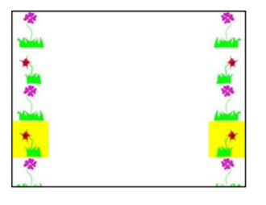
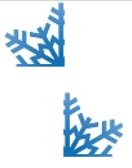

.. include:: ../common.rst

|Time90|

Picture Lab A8: Creating a Collage
=====================================================

You can copy one picture to another by copying the color from the pixels in one
picture to the pixels in the other picture. To do this you will need to keep
track of the row and column information for both the picture you are copying
from and the picture you are copying to, as shown in the following copy method.
The easiest way to do this is to declare and initialize both a ``fromRow`` and
``toRow`` in the outer for loop and increment them both at the end of the loop.
A for loop can have more than one variable declaration and initialization and/or
modification. Just separate the items with commas. The inner loop in this code
uses that to create two loop variables, ``fromCol`` and a ``toCol`` which are
both declared, initialized, and incremented.

.. code-block:: java

 public void copy(Picture fromPic,int startRow, int startCol)
 {
      Pixel fromPixel = null;
      Pixel toPixel = null;
      Pixel[][] toPixels = this.getPixels2D();
      Pixel[][] fromPixels = fromPic.getPixels2D();
      for (int fromRow = 0, toRow = startRow;
          fromRow < fromPixels.length &&
          toRow < toPixels.length;
          fromRow++, toRow++)
      {
           for (int fromCol = 0, toCol = startCol;
               fromCol < fromPixels[0].length &&
               toCol < toPixels[0].length;
               fromCol++, toCol++)
           {
                fromPixel = fromPixels[fromRow][fromCol];
                toPixel = toPixels[toRow][toCol];
                toPixel.setColor(fromPixel.getColor());
           }
     }
 }

You can create a collage by copying several small pictures onto a larger picture. You can do some picture
manipulations like zero blue before you copy the picture as well. You can even mirror the result to get a
nice artistic effect (Figure 1).

    Figure 1: Collage with vertical mirror

The following method shows how to create a simple collage using the copy method.

.. code-block:: java

 public void createCollage()
 {
      Picture flower1 = new Picture("flower1.jpg");
      Picture flower2 = new Picture("flower2.jpg");
      this.copy(flower1,0,0);
      this.copy(flower2,100,0);
      this.copy(flower1,200,0);
      Picture flowerNoBlue = new Picture(flower2);
      flowerNoBlue.zeroBlue();
      this.copy(flowerNoBlue,300,0);
      this.copy(flower1,400,0);
      this.copy(flower2,500,0);
      this.mirrorVertical();
      this.show();
 }

You can test this with the ``createCollage`` method below.

.. activecode:: picture-lab-A8-createCollage
    :language: java
    :autograde: unittest
    :datafile: pictureClasses.jar, flower1.jpg, flower2.jpg, snowflake.jpg, butterfly.jpg

    Picture Lab A8: Run to see createCollage() working.
    ~~~~
    import java.awt.*;
    import java.awt.font.*;
    import java.awt.geom.*;
    import java.awt.image.BufferedImage;
    import java.text.*;
    import java.util.*;

    /**
     * A class that represents a picture. This class inherits from SimplePicture and
     * allows the student to add functionality to the Picture class.
     *
     * @author Barbara Ericson ericson@cc.gatech.edu
     */
    public class Picture extends SimplePicture
    {
        ///////////////////// constructors //////////////////////////////////

        /** Constructor that takes no arguments */
        public Picture()
        {
            /* not needed but use it to show students the implicit call to super()
             * child constructors always call a parent constructor
             */
            super();
        }

        /**
         * Constructor that takes a file name and creates the picture
         *
         * @param fileName the name of the file to create the picture from
         */
        public Picture(String fileName)
        {
            // let the parent class handle this fileName
            super(fileName);
        }

        /**
         * Constructor that takes the height and width
         *
         * @param height the height of the desired picture
         * @param width the width of the desired picture
         */
        public Picture(int width, int height)
        {
            // let the parent class handle this width and height
            super(width, height);
        }

        /**
         * Constructor that takes a picture and creates a copy of that picture
         *
         * @param copyPicture the picture to copy
         */
        public Picture(Picture copyPicture)
        {
            // let the parent class do the copy
            super(copyPicture);
        }

        /**
         * Constructor that takes a buffered image
         *
         * @param image the buffered image to use
         */
        public Picture(BufferedImage image)
        {
            super(image);
        }

        ////////////////////// methods ///////////////////////////////////////

        /**
         * Method to return a string with information about this picture.
         *
         * @return a string with information about the picture such as fileName, height
         *     and width.
         */
        public String toString()
        {
            String output =
                    "Picture, filename "
                            + getFileName()
                            + " height "
                            + getHeight()
                            + " width "
                            + getWidth();
            return output;
        }

        /** zeroBlue() method sets the blue values at all pixels to zero */
        public void zeroBlue()
        {
            Pixel[][] pixels = this.getPixels2D();

            for (Pixel[] rowArray : pixels)
            {
                for (Pixel p : rowArray)
                {
                    p.setBlue(0);
                }
            }
        }

        /* mirrorVertical() */
        public void mirrorVertical()
        {
            Pixel[][] pixels = this.getPixels2D();
            Pixel leftPixel = null;
            Pixel rightPixel = null;
            int width = pixels[0].length;
            for (int row = 0; row < pixels.length; row++)
            {
                for (int col = 0; col < width / 2; col++)
                {
                    leftPixel = pixels[row][col];
                    rightPixel = pixels[row][width - 1 - col];
                    rightPixel.setColor(leftPixel.getColor());
                }
            }
        }

        /**
         * copy from the passed fromPic to the specified startRow and startCol in the
         * current picture
         *
         * @param fromPic the picture to copy from
         * @param startRow the start row to copy to
         * @param startCol the start col to copy to
         */
        public void copy(Picture fromPic, int startRow, int startCol)
        {
            Pixel fromPixel = null;
            Pixel toPixel = null;
            Pixel[][] toPixels = this.getPixels2D();
            Pixel[][] fromPixels = fromPic.getPixels2D();
            for (int fromRow = 0, toRow = startRow;
                    fromRow < fromPixels.length && toRow < toPixels.length;
                    fromRow++, toRow++)
                    {
                for (int fromCol = 0, toCol = startCol;
                        fromCol < fromPixels[0].length && toCol < toPixels[0].length;
                        fromCol++, toCol++)
                        {
                    fromPixel = fromPixels[fromRow][fromCol];
                    toPixel = toPixels[toRow][toCol];
                    toPixel.setColor(fromPixel.getColor());
                }
            }
        }

        public void createCollage()
        {
            // You can also try butterfly.jpg and snowflake.jpg
            Picture flower1 = new Picture("flower1.jpg");
            Picture flower2 = new Picture("flower2.jpg");
            this.copy(flower1, 0, 0);
            this.copy(flower2, 100, 0);
            this.copy(flower1, 200, 0);
            Picture flowerNoBlue = new Picture(flower2);
            flowerNoBlue.zeroBlue();
            this.copy(flowerNoBlue, 300, 0);
            this.copy(flower1, 400, 0);
            this.copy(flower2, 500, 0);
            this.mirrorVertical();
            this.show();
        }

        /* Main method for testing
         */
        public static void main(String[] args)
        {
            Picture p = new Picture(500, 500);
            p.createCollage();
        }
    }

    ====
    import static org.junit.Assert.*;

    import org.junit.*;

    import java.io.*;

    public class RunestoneTests extends CodeTestHelper
    {
        @Test
        public void test1()
        {
            String target = "public void createCollage()";
            boolean passed = checkCodeContains("createCollage() method", target);
            assertTrue(passed);
        }
    }

|CodingEx| **Coding Exercises**

1. Create a second copy method called ``copyPartial`` that adds parameters to allow you to copy just part of the
``fromPic``. You will need to add parameters that specify the start row, end row, start column,
and end column to copy from.

.. activecode:: picture-lab-A8-createCollage-copyPartial
    :language: java
    :autograde: unittest
    :datafile: pictureClasses.jar, flower1.jpg, flower2.jpg, snowflake.jpg, butterfly.jpg

    Picture Lab A8: Create a second copy method called copyPartial that adds parameters to allow you to copy just part of the fromPic. You will need to add parameters that specify the start row, end row, start column, and end column to copy from. Use it in your collage.
    ~~~~
    import java.awt.*;
    import java.awt.font.*;
    import java.awt.geom.*;
    import java.awt.image.BufferedImage;
    import java.text.*;
    import java.util.*;

    /**
     * A class that represents a picture. This class inherits from SimplePicture and
     * allows the student to add functionality to the Picture class.
     *
     * @author Barbara Ericson ericson@cc.gatech.edu
     */
    public class Picture extends SimplePicture
    {
        ///////////////////// constructors //////////////////////////////////

        /** Constructor that takes no arguments */
        public Picture()
        {
            /* not needed but use it to show students the implicit call to super()
             * child constructors always call a parent constructor
             */
            super();
        }

        /**
         * Constructor that takes a file name and creates the picture
         *
         * @param fileName the name of the file to create the picture from
         */
        public Picture(String fileName)
        {
            // let the parent class handle this fileName
            super(fileName);
        }

        /**
         * Constructor that takes the height and width
         *
         * @param height the height of the desired picture
         * @param width the width of the desired picture
         */
        public Picture(int width, int height)
        {
            // let the parent class handle this width and height
            super(width, height);
        }

        /**
         * Constructor that takes a picture and creates a copy of that picture
         *
         * @param copyPicture the picture to copy
         */
        public Picture(Picture copyPicture)
        {
            // let the parent class do the copy
            super(copyPicture);
        }

        /**
         * Constructor that takes a buffered image
         *
         * @param image the buffered image to use
         */
        public Picture(BufferedImage image)
        {
            super(image);
        }

        ////////////////////// methods ///////////////////////////////////////

        /**
         * Method to return a string with information about this picture.
         *
         * @return a string with information about the picture such as fileName, height
         *     and width.
         */
        public String toString()
        {
            String output =
                    "Picture, filename "
                            + getFileName()
                            + " height "
                            + getHeight()
                            + " width "
                            + getWidth();
            return output;
        }

        /** zeroBlue() method sets the blue values at all pixels to zero */
        public void zeroBlue()
        {
            Pixel[][] pixels = this.getPixels2D();

            for (Pixel[] rowArray : pixels)
            {
                for (Pixel p : rowArray)
                {
                    p.setBlue(0);
                }
            }
        }

        /* mirrorVertical() */
        public void mirrorVertical()
        {
            Pixel[][] pixels = this.getPixels2D();
            Pixel leftPixel = null;
            Pixel rightPixel = null;
            int width = pixels[0].length;
            for (int row = 0; row < pixels.length; row++)
            {
                for (int col = 0; col < width / 2; col++)
                {
                    leftPixel = pixels[row][col];
                    rightPixel = pixels[row][width - 1 - col];
                    rightPixel.setColor(leftPixel.getColor());
                }
            }
        }

        /**
         * copy from the passed fromPic to the specified startRow and startCol in the
         * current picture
         *
         * @param fromPic the picture to copy from
         * @param startRow the start row to copy to
         * @param startCol the start col to copy to
         */
        public void copy(Picture fromPic, int startRow, int startCol)
        {
            Pixel fromPixel = null;
            Pixel toPixel = null;
            Pixel[][] toPixels = this.getPixels2D();
            Pixel[][] fromPixels = fromPic.getPixels2D();
            for (int fromRow = 0, toRow = startRow;
                    fromRow < fromPixels.length && toRow < toPixels.length;
                    fromRow++, toRow++)
                    {
                for (int fromCol = 0, toCol = startCol;
                        fromCol < fromPixels[0].length && toCol < toPixels[0].length;
                        fromCol++, toCol++)
                        {
                    fromPixel = fromPixels[fromRow][fromCol];
                    toPixel = toPixels[toRow][toCol];
                    toPixel.setColor(fromPixel.getColor());
                }
            }
        }

        /**
         * Create a second copy method called copyPartial that adds parameters to allow
         * you to copy just part of fromPic. You will need to add parameters that
         * specify the start row, start column, end row, end column to copy from as
         * well as the start row and start column to copy to like the method above.
         *
         * 
Write your method here and use it in createCollage below
         */
        public void createCollage()
        {
            Picture snowflake = new Picture("snowflake.jpg");

            // copy just the (0,0) to (50,50) portion of the snowflake to (0,0)
            this.copyPartial(snowflake, 0, 0, 50, 50, 0, 0);
            // copy just the (0,50) to (50,100) portion of the snowflake to (0,0)
            this.copyPartial(snowflake, 0, 45, 50, 90, 70, 50);

            this.mirrorVertical();
            this.show();
        }

        /* Main method for testing
         */
        public static void main(String[] args)
        {
            Picture p = new Picture(500, 500);
            p.createCollage();
        }
    }

    ====
    import static org.junit.Assert.*;

    import org.junit.*;

    import java.io.*;

    public class RunestoneTests extends CodeTestHelper
    {
        @Test
        public void test1()
        {
            String target = "public void copyPartial(";
            boolean passed = checkCodeContains("copyPartial method", target);
            assertTrue(passed);
        }

        @Test
        public void test2()
        {
            String target = "int";
            String code = getCode();
            int index = code.indexOf("public void copyPartial(");
            boolean passed = false;
            if (index > 0)
            {
                code = code.substring(index);
                int num = countOccurences(code, target);
                passed = num >= 6;
            }
            getResults(
                    "true", "" + passed, "Checking that copyPartial contains 6 int parameters", passed);
            assertTrue(passed);
        }

        @Test
        public void test3()
        {
            String target = "for";
            String code = getCode();
            int index = code.indexOf("public void copyPartial(");
            boolean passed = false;
            if (index > 0)
            {
                code = code.substring(index);
                int num = countOccurences(code, target);
                passed = num >= 2;
            }
            getResults("true", "" + passed, "Checking that copyPartial() contains 2 for loops", passed);
            assertTrue(passed);
        }
    }

2. Create a ``myCollage`` method that has at least three pictures (can be the same picture) copied
three times with three different picture manipulations and at least one mirroring. You can use the pictures flower1.jpg, flower2.jpg, snowflake.jpg, butterfly.jpg in this lesson. To use your own images, you can fork this |repl.it project| or this |repl 2| (click output.jpg to see the result) or download the project files form replit to your own IDE.

.. |repl.it project| raw:: html

   <a href= "https://firewalledreplit.com/@BerylHoffman/Picture-Lab" style="text-decoration:underline" target="_blank" >Repl.it Swing project</a>

.. |repl 2| raw:: html

   <a href= "https://firewalledreplit.com/@jds7184/PictureLab" style="text-decoration:underline" target="_blank" >alternative Repl.it project</a>

.. activecode:: picture-lab-A8-myCollage
    :language: java
    :autograde: unittest
    :datafile: pictureClasses.jar, flower1.jpg, flower2.jpg, snowflake.jpg, butterfly.jpg

    Picture Lab A8: Create a myCollage method that has at least three pictures (can be the same picture) copied three times with three different picture manipulations and at least one mirroring.
    ~~~~
    import java.awt.*;
    import java.awt.font.*;
    import java.awt.geom.*;
    import java.awt.image.BufferedImage;
    import java.text.*;
    import java.util.*;

    /**
     * A class that represents a picture. This class inherits from SimplePicture and
     * allows the student to add functionality to the Picture class.
     *
     * @author Barbara Ericson ericson@cc.gatech.edu
     */
    public class Picture extends SimplePicture
    {
        ///////////////////// constructors //////////////////////////////////

        /** Constructor that takes no arguments */
        public Picture()
        {
            /* not needed but use it to show students the implicit call to super()
             * child constructors always call a parent constructor
             */
            super();
        }

        /**
         * Constructor that takes a file name and creates the picture
         *
         * @param fileName the name of the file to create the picture from
         */
        public Picture(String fileName)
        {
            // let the parent class handle this fileName
            super(fileName);
        }

        /**
         * Constructor that takes the height and width
         *
         * @param height the height of the desired picture
         * @param width the width of the desired picture
         */
        public Picture(int width, int height)
        {
            // let the parent class handle this width and height
            super(width, height);
        }

        /**
         * Constructor that takes a picture and creates a copy of that picture
         *
         * @param copyPicture the picture to copy
         */
        public Picture(Picture copyPicture)
        {
            // let the parent class do the copy
            super(copyPicture);
        }

        /**
         * Constructor that takes a buffered image
         *
         * @param image the buffered image to use
         */
        public Picture(BufferedImage image)
        {
            super(image);
        }

        ////////////////////// methods ///////////////////////////////////////

        /**
         * Method to return a string with information about this picture.
         *
         * @return a string with information about the picture such as fileName, height
         *     and width.
         */
        public String toString()
        {
            String output =
                    "Picture, filename "
                            + getFileName()
                            + " height "
                            + getHeight()
                            + " width "
                            + getWidth();
            return output;
        }

        /** zeroBlue() method sets the blue values at all pixels to zero */
        public void zeroBlue()
        {
            Pixel[][] pixels = this.getPixels2D();

            for (Pixel[] rowArray : pixels)
            {
                for (Pixel p : rowArray)
                {
                    p.setBlue(0);
                }
            }
        }

        /* mirrorVertical() */
        public void mirrorVertical()
        {
            Pixel[][] pixels = this.getPixels2D();
            Pixel leftPixel = null;
            Pixel rightPixel = null;
            int width = pixels[0].length;
            for (int row = 0; row < pixels.length; row++)
            {
                for (int col = 0; col < width / 2; col++)
                {
                    leftPixel = pixels[row][col];
                    rightPixel = pixels[row][width - 1 - col];
                    rightPixel.setColor(leftPixel.getColor());
                }
            }
        }

        /**
         * copy from the passed fromPic to the specified startRow and startCol in the
         * current picture
         *
         * @param fromPic the picture to copy from
         * @param startRow the start row to copy to
         * @param startCol the start col to copy to
         */
        public void copy(Picture fromPic, int startRow, int startCol)
        {
            Pixel fromPixel = null;
            Pixel toPixel = null;
            Pixel[][] toPixels = this.getPixels2D();
            Pixel[][] fromPixels = fromPic.getPixels2D();
            for (int fromRow = 0, toRow = startRow;
                    fromRow < fromPixels.length && toRow < toPixels.length;
                    fromRow++, toRow++)
                    {
                for (int fromCol = 0, toCol = startCol;
                        fromCol < fromPixels[0].length && toCol < toPixels[0].length;
                        fromCol++, toCol++)
                        {
                    fromPixel = fromPixels[fromRow][fromCol];
                    toPixel = toPixels[toRow][toCol];
                    toPixel.setColor(fromPixel.getColor());
                }
            }
        }

        public void createCollage()
        {
            // You can also try butterfly.jpg and snowflake.jpg
            Picture flower1 = new Picture("flower1.jpg");
            Picture flower2 = new Picture("flower2.jpg");

            this.copy(flower1, 0, 0);
            this.copy(flower2, 100, 0);
            this.copy(flower1, 200, 0);
            Picture flowerNoBlue = new Picture(flower2);
            flowerNoBlue.zeroBlue();
            this.copy(flowerNoBlue, 300, 0);
            this.copy(flower1, 400, 0);
            this.copy(flower2, 500, 0);
            this.mirrorVertical();
            this.show();
        }

        /**
         * Create a myCollage() method that has at least three pictures (can be the
         * same picture) copied three times with three different picture manipulations
         * and at least one mirroring.
         *
         * 
Write your method here.
         */

        /* Main method for testing
         */
        public static void main(String[] args)
        {
            Picture p = new Picture(500, 500);
            p.myCollage();
        }
    }

    ====
    import static org.junit.Assert.*;

    import org.junit.*;

    import java.io.*;

    public class RunestoneTests extends CodeTestHelper
    {
        @Test
        public void test1()
        {
            String target = "public void myCollage(";
            boolean passed = checkCodeContains("myCollage method", target);
            assertTrue(passed);
        }

        @Test
        public void test2()
        {
            String target = "copy";
            String code = getCode();
            int index = code.indexOf("public void myCollage(");
            boolean passed = false;
            int num = 0;
            if (index > 0)
            {
                code = code.substring(index);
                num = countOccurences(code, target);
                passed = num >= 3;
            }
            getResults("3", "" + num, "Checking that myCollage contains 3 copy calls", passed);
            assertTrue(passed);
        }

        @Test
        public void test3()
        {
            String target = "mirror";
            String code = getCode();
            int index = code.indexOf("public void myCollage(");
            boolean passed = false;
            if (index > 0)
            {
                code = code.substring(index);
                int num = countOccurences(code, target);
                passed = num >= 1;
            }
            getResults("true", "" + passed, "Checking that myCollage() calls a mirror method", passed);
            assertTrue(passed);
        }
    }

You can use these images in this lesson:

.. datafile:: flower1.jpg
   :image:
   :fromfile: Figures/flower1.jpg

.. datafile:: flower2.jpg
   :image:
   :fromfile: Figures/flower2.jpg

.. datafile:: snowflake.jpg
   :image:
   :fromfile: Figures/snowflake.jpg

.. datafile:: butterfly.jpg
   :image:
   :fromfile: Figures/butterfly.jpg
