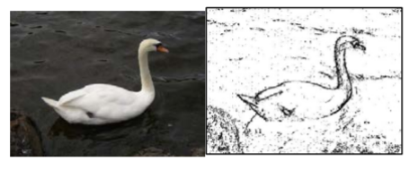

.. image:: ../../_static/time90.png
    :width: 250
    :align: right
    
Picture Lab A9: Simple Edge Detection
=====================================================

Edge Detection
---------------

Detecting edges is a common image processing problem. For example, digital cameras often feature face
detection. Some robotic competitions require the robots to find a ball using a digital camera, so the robot
needs to be able to “see” a ball.
One way to look for an edge in a picture is to compare the color at the current pixel with the pixel in the
next column to the right. If the colors differ by more than some specified amount, this indicates that an
edge has been detected and the current pixel color should be set to black. Otherwise, the current pixel is
not part of an edge and its color should be set to white (Figure 12). How do you calculate the difference
between two colors? The formula for the difference between two points (x1,y1) and (x2,y2) is the square
root of ((x2 - x1)2 + (y2 - y1)2 ). The difference between two colors (red1,green1,blue1) and (red2,green2,blue2)
is the square root of ((red2 - red1)2 +(green2 - green1)2 +(blue2 - blue1)2
). The colorDistance
method in the Pixel class uses this calculation to return the difference between the current pixel
color and a passed color.

    
    Figure 1: Original picture and after edge detection
 
The following method implements this simple algorithm. Notice that the nested for loop stops earlier
than when it reaches the number of columns. That is because in the nested loop the current color is
compared to the color at the pixel in the next column. If the loop continued to the last column this
would cause an out-of-bounds error.

.. code-block:: java

 public void edgeDetection(int edgeDist)
 {
      Pixel leftPixel = null;
      Pixel rightPixel = null;
      Pixel[][] pixels = this.getPixels2D();
      Color rightColor = null;
      for (int row = 0; row < pixels.length; row++)
      {
           for (int col = 0; col < pixels[0].length-1; col++)
           {
                leftPixel = pixels[row][col];
                rightPixel = pixels[row][col+1];
                rightColor = rightPixel.getColor();
                if (leftPixel.colorDistance(rightColor) >
                edgeDist)
                leftPixel.setColor(Color.BLACK);
                else
                leftPixel.setColor(Color.WHITE);
           }
      }
 }
 
You can test this with the testEdgeDetection method in PictureTester.

.. |CodingEx| image:: ../../_static/codingExercise.png
    :width: 30px
    :align: middle
    :alt: coding exercise
    
|CodingEx| **Coding Exercises**

1. Notice that the current edge detection method works best when there are big color changes from
left to right but not when the changes are from top to bottom. Add another loop that compares
the current pixel with the one below and sets the current pixel color to black as well when the
color distance is greater than the specified edge distance.

2. Work in groups to come up with another algorithm for edge detection.

How image processing is related to new scientific breakthroughs
-----------------------------------------------------------------

Many of today’s important scientific breakthroughs are being made by large, interdisciplinary
collaborations of scientists working in geographically widely distributed locations, producing, collecting,
and analyzing vast and complex datasets.

One of the computer scientists who works on a large interdisciplinary
scientific team is Dr. Cecilia Aragon. She is an associate professor in the
Department of Human Centered Design & Engineering and the eScience
Institute at the University of Washington, where she directs the Scientific
Collaboration and Creativity Lab. Previously, she was a computer scientist in
the Computational Research Division at Lawrence Berkeley National
Laboratory for six years, after earning her Ph.D. in Computer Science from
UC Berkeley in 2004. She earned her B.S. in mathematics from the California
Institute of Technology.

Her current research focuses on human-computer interaction (HCI) and computer-supported
cooperative work (CSCW) in scientific collaborations, distributed creativity, information visualization,
and the visual understanding of very large data sets. She is interested in how social media and new
methods of computer-mediated communication are changing scientific practice. She has developed
novel visual interfaces for collaborative exploration of very large scientific data sets, and has authored
or co-authored many papers in the areas of computer-supported cooperative work, human-computer
interaction, visualization, visual analytics, image processing, machine learning, cyberinfrastructure,
and astrophysics.

In 2008, she received the Presidential Early Career Award for Scientists and Engineers (PECASE) for her
work in collaborative data-intensive science. Her research has been recognized with four Best Paper
awards since 2004, and she was named one of the Top 25 Women of 2009 by Hispanic Business
Magazine. She was the architect of the Sunfall data visualization and workflow management system for
the Nearby Supernova Factory, which helped advance the study of supernovae in order to reduce the
statistical uncertainties on key cosmological parameters that categorize dark energy, one of the grand
challenges in physics today.

Cecilia Aragon is also one of the most skilled aerobatic pilots flying today.
A two-time member of the U.S. Aerobatic Team, she was a medalist at the
1993 U.S. National Championships and the 1994 World Aerobatic
Championships, and was the California State Aerobatic Champion. 

Steganography Lab
------------------

.. |Steganography lab| raw:: html

   <a href= "https://apcentral.collegeboard.org/pdf/ap-computer-science-a-steganography-lab-student-guide.pdf" style="text-decoration:underline" target="_blank" >Steganography Lab</a>
   
If you enjoyed this lab and have time, continue on with the |Steganography lab| that explores hiding messages in images.