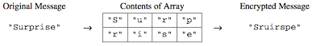

.. qnum::
   :prefix:  9-12-
   :start: 1

Free Response - Route Cipher A
==============================

.. index::
    single: routeciphera
    single: free response

The following is a free response question from 2011.  It was question 4 on the exam.  You can see all the free response questions from past exams at https://apstudents.collegeboard.org/courses/ap-computer-science-a/free-response-questions-by-year.

**Question 4.**  In this question you will write two methods for a class ``RouteCipher`` that encrypts (puts into a coded form) a message by changing the order of the characters in the message. The route cipher fills a two-dimensional array with single-character substrings of the original message in row-major order, encrypting the message by retrieving the single-character substrings in column-major order.

For example, the word "Surprise" can be encrypted using a 2-row, 4-column array as follows.

An incomplete implementation of the ``RouteCipher`` class is shown below.

.. code-block:: java

   public class RouteCipher
   {
       /**
        * A two-dimensional array of single-character strings, instantiated in the
        * constructor
        */
       private String[][] letterBlock;

       /** The number of rows of letterBlock, set by the constructor */
       private int numRows;

       /** The number of columns of letterBlock, set by the constructor */
       private int numCols;

       /**
        * Places a string into letterBlock in row-major order.
        *
        * @param str the string to be processed Postcondition: if str.length() <
        *     numRows * numCols, "A" in each unfilled cell if str.length() > numRows *
        *     numCols, trailing characters are ignored
        */
       public void fillBlock(String str)
       {
           /* to be implemented in part (a) */
       }

       /**
        * Extracts encrypted string from letterBlock in column-major order.
        * Precondition: letterBlock has been filled
        *
        * @return the encrypted string from letterBlock
        */
       private String encryptBlock()
       {
           /* implementation not shown */
       }

       /**
        * Encrypts a message.
        *
        * @param message the string to be encrypted
        * @return the encrypted message; if message is the empty string, returns the
        *     empty string
        */
       public String encryptMessage(String message)
       {
           /* to be implemented in part (b) */
       }

       // There may be instance variables, constructors, and methods that are not
       // shown
   }

**Part a.**
Write the method ``fillBlock`` that fills the two-dimensional array ``letterBlock`` with one-character strings from the string passed as parameter ``str``.

The array must be filled in row-major order—the first row is filled from left to right, then the second row is filled from left to right, and so on, until all rows are filled.

If the length of the parameter ``str`` is smaller than the number of elements of the array, the string "A" is placed in each of the unfilled cells. If the length of ``str`` is larger than the number of elements in the array, the trailing characters are ignored.

For example, if ``letterBlock`` has 3 rows and 5 columns and ``str`` is the string "Meet at noon", the resulting contents of ``letterBlock`` would be as shown in the following table.

.. figure:: Figures/routeCipherTable.png
  :width: 158px
  :align: center
  :figclass: align-center

If ``letterBlock`` has 3 rows and 5 columns and ``str`` is the string "Meet at midnight", the resulting contents of ``letterBlock`` would be as shown in the following table.

.. figure:: Figures/routeCipherTable2.png
  :width: 158px
  :align: center
  :figclass: align-center

The following expression may be used to obtain a single-character string at position ``k`` of the string ``str``.

.. code-block:: java

   str.substring(k, k + 1)

How to Solve This
--------------------
.. shortanswer:: routeciphera_short

   Explain in plain English what your code will have to do to answer this question.  Use the variable names given above.

This section contains a plain English explanation of one way to solve this problem as well as problems that test your understanding of how to write the code to do those things.
Click on the buttons to reveal the questions.

.. reveal:: routeciphera_1
   :showtitle: Reveal Loop Hint
   :hidetitle: Hide Loop Hint

   You will need to access each element in the ``letterBlock`` array. What type of loop will you use?

   .. reveal:: routeciphera_1.5
      :showtitle: Reveal Loop Type Problem
      :hidetitle: Hide Loop Type Problem

      .. mchoice:: routeciphera_1.5MC
        :answer_a: for each
        :answer_b: if
        :answer_c: for
        :answer_d: while
        :answer_e: switch statement
        :correct: c
        :feedback_a: We need to utilize elements by indexing them so a for each loop will not work
        :feedback_b: This is not a type of loop
        :feedback_c: Correct!
        :feedback_d: Although this could would, we would need some kind of tracker variable to allow use to count indexes which would be more easily accomplished by a different loop.
        :feedback_e: This would not work in this situation.

        What type of loop should you use?

   The ``letterBlock`` array has two dimensions. How many loops will you use?

   .. reveal:: routeciphera_1.75
      :showtitle: Reveal Loop Amount Problem
      :hidetitle: Hide Loop Amount Problem

      .. mchoice:: routeciphera_1.75MC
        :answer_a: 1
        :answer_b: 2, nested
        :answer_c: 2, un-nested
        :answer_d: 3, un-nested
        :correct: b
        :feedback_a: This would not correctly iterate through the 2D array
        :feedback_b: Correct!
        :feedback_c: This would not correctly iterate through the 2D array
        :feedback_d: This would not correctly iterate through the 2D array

        How many Loops should you use?

.. reveal:: routeciphera_2
   :showtitle: Reveal Outer Bounds Problem
   :hidetitle: Hide Outer Bounds Problem

   .. mchoice:: routeciphera_2MC
     :answer_a: numRows
     :answer_b: numCols
     :answer_c: str.length()
     :answer_d: str[0].length()
     :correct: a
     :feedback_a: Correct!
     :feedback_b: No, numCols finds the width and we are iterating through this in row-major order.
     :feedback_c: This finds us the length of the string but the array is not based on the string length.
     :feedback_d: Strings aren't defined under the '[]' operator and str is not a 2D array so this would return an error.

     What can you use to set the outer bound while you iterate through your 2D array?

.. reveal:: routeciphera_3
   :showtitle: Reveal Inner Bounds Problem
   :hidetitle: Hide Inner Bounds Problem

   .. mchoice:: routeciphera_3MC
     :answer_a: numRows
     :answer_b: numCols
     :answer_c: str.length()
     :answer_d: str[0].length()
     :correct: b
     :feedback_a: No, numRows finds the width and should not be used as the inner bound because we are iterating through the array in row-major order.
     :feedback_b: Correct!
     :feedback_c: This finds us the length of the string but the array is not based on the string length.
     :feedback_d: Strings aren't defined under the '[]' operator and str is not a 2D array so this would return an error.

     What can you use to set the inner bound while you iterate through your 2D array?

.. reveal:: routeciphera_4
   :showtitle: Reveal String Method Problem
   :hidetitle: Hide String Method Problem

   .. mchoice:: routeciphera_4MC
     :answer_a: str.length()
     :answer_b: str(lowerbound, upperbound)
     :answer_c: str.subsection(lowerbound, upperbound)
     :answer_d: str.substring(lowerbound, upperbound)
     :correct: d
     :feedback_a: This does not return a string
     :feedback_b: This is not a valid string method
     :feedback_c: This is not a valid string method
     :feedback_d: Correct!

     Which ``String`` method can you use to access partial or full strings within another string?

The Algorithm
-------------------
.. reveal:: routeciphera_5
   :showtitle: Reveal Access Formula Problem
   :hidetitle: Hide Access Formula Problem

   .. mchoice:: routeciphera_5MC
     :answer_a:  str.substring(k, k)
     :answer_b: str.substring(k + 1, k + 1)
     :answer_c: str.substring(k, k + 1)
     :answer_d: str.substring(k + 1, k)
     :correct: c
     :feedback_a: This will not return the correct char correctly
     :feedback_b: This will not return the correct char correctly
     :feedback_c: Correct!
     :feedback_d: This will not return the correct char correctly

     What is the formula for obtaining a single-character string at position ``k`` of the string ``str``?

.. reveal:: routeciphera_5.5
   :showtitle: Reveal Formula Variable Problem
   :hidetitle: Hide Formula Variable Problem

   .. mchoice:: routeciphera_5.5MC
     :answer_a: str.substring(c + r * this.numCols, 1 + c + r * this.numCols)
     :answer_b: str.substring(c - r * this.numCols, 1 + c - r * this.numCols)
     :answer_c: str.substring(c + r, 1 + c + r)
     :answer_d: str.substring(c - r, 1 + c - r)
     :correct: a
     :feedback_a: Correct!
     :feedback_b: Try using this formula to find a given character of one of the example strings. Does it work? Try coming up with some of your own examples to figure out the forumla for k.
     :feedback_c: Try using this formula to find a given character of one of the example strings. Does it work? Try coming up with some of your own examples to figure out the forumla for k.
     :feedback_d: Try using this formula to find a given character of one of the example strings. Does it work? Try coming up with some of your own examples to figure out the forumla for k.

     How can one find the aforementioned ``k``? (this is hard to visualize, try drawing out some examples)

.. reveal:: routeciphera_6
   :showtitle: Reveal Conditional Problem
   :hidetitle: Hide Conditional Problem

   .. mchoice:: routeciphera_6MC
     :answer_a: if (str.length() < (c + (r * this.numCols)))
     :answer_b: if (str.length() > (c + (r * this.numCols)))
     :answer_c: if (str.length() > numRows * numCols)
     :answer_d: if (str.length() < numRows * numCols)
     :correct: b
     :feedback_a: This will not return the correct boolean
     :feedback_b: Correct!
     :feedback_c: We need to determine whether or not to ignore trialing character at each step, not just check for it once at the beginning.
     :feedback_d: We need to determine whether or not to ignore trialing character at each step, not just check for it once at the beginning.

     What conditional can you write to make sure trailing characters are ignored?

The exercises above have been guiding you towards just one of many possible solutions. To read through a different solution, click on the Reveal
button below and complete the problem.

.. reveal:: routecipherA_pars_sol
   :showtitle: Reveal Possible Solution Exercise
   :hidetitle: Hide Possible Solution Problem

    .. parsonsprob:: RouteCipherA
      :adaptive:

      The method fillBlock below contains the correct code for one solution to this problem,
      but it is mixed up.  Drag the needed code from the left to the right and put them in order with the
      correct indention so that the code would work correctly.
      -----
      public void fillBlock(String str)
      {
        int pos = 0;
      =====
        for (int r = 0; r < this.numRows; r++ )
        {
      =====
            for (int c = 0; c < this.numCols; c++ )
            {
      =====
                if (pos < str.length())
                {
      =====
                    String subStr = str.substring(pos, pos+1);
                    this.letterBlock[r][c] = subStr;
                    pos++;
      =====
                } else 
                {
                    this.letterBlock[r][c] = "A";
                } // end else block
      =====
            } // end inner for
        } // end outer for
      } // end method

Try And Solve It
--------------------

.. activecode:: FRQRouteCipherA
   :language: java
   :autograde: unittest

   Complete the method ``fillBlock`` below.
   ~~~~
   public class RouteCipher
   {
       /**
        * A two-dimensional array of single-character strings, instantiated in the
        * constructor
        */
       public String[][] letterBlock;

       /** The number of rows of letterBlock, set by the constructor */
       private int numRows;

       /** The number of columns of letterBlock, set by the constructor */
       private int numCols;

       public RouteCipher(int r, int c)
       {
           this.letterBlock = new String[r][c];
           this.numRows = r;
           this.numCols = c;
       }

       /**
        * Places a string into letterBlock in row-major order.
        *
        * @param str the string to be processed Postcondition: if str.length() <
        *     numRows * numCols, "A" in each unfilled cell if str.length() > numRows *
        *     numCols, trailing characters are ignored
        */
       public void fillBlock(String str)
       {
           // Complete this method

       }

       /**
        * Extracts encrypted string from letterBlock in column-major order.
        * Precondition: letterBlock has been filled
        *
        * @return the encrypted string from letterBlock
        */
       private String encryptBlock()
       {
           return "";
       }

       /**
        * Encrypts a message.
        *
        * @param message the string to be encrypted
        * @return the encrypted message; if message is the empty string, returns the
        *     empty string
        */
       public String encryptMessage(String message)
       {
           return "";
       }

       public static void main(String[] args)
       {

           boolean test1 = false;
           RouteCipher ciph = new RouteCipher(3, 3);

           ciph.fillBlock("There's 1");

           if ((ciph.letterBlock[0][2]).equals("e")
                   && (ciph.letterBlock[2][1]).equals(" ")) 
               test1 = true;
           else
               System.out.println(
                       "Oops! Looks like your code doesn't properly insert the given"
                           + " String.\n");

           if (test1) 
               System.out.println("Looks like your code works well!");
           else 
               System.out.println("Make a few changes, please.");
       }
   }

   ====
   import static org.junit.Assert.*;

   import org.junit.*;

   import java.io.*;

   public class RunestoneTests extends CodeTestHelper
   {

       @Test
       public void testMain() throws IOException
       {
           String output = getMethodOutput("main");
           String expect = "Looks like your code works well!\n";

           boolean passed = getResults(expect, output, "Expected output from main");
           assertTrue(passed);
       }

       @Test
       public void test1()
       {
           RouteCipher ciph = new RouteCipher(3, 4);

           ciph.fillBlock("Lady Bugs");

           String result =
                   String.valueOf(
                           (ciph.letterBlock[0][2]).equals("d")
                                   && (ciph.letterBlock[2][2]).equals("A"));
           boolean passed = getResults("true", result, "method fillBlock works");
           assertTrue(passed);
       }
   }

