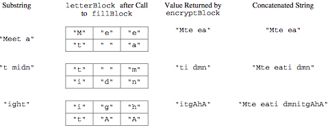

.. qnum::
   :prefix:  9-13-
   :start: 1

Free Response - Route Cipher B
==============================

.. index::
    single: routecipherb
    single: free response

The following is a free response question from 2011.  It was question 4 on the exam.  You can see all the free response questions from past exams at https://apstudents.collegeboard.org/courses/ap-computer-science-a/free-response-questions-by-year.

**Question 4.**  In this question you will write two methods for a class ``RouteCipher`` that encrypts (puts into a coded form) a message by changing the order of the characters in the message. The route cipher fills a two-dimensional array with single-character substrings of the original message in row-major order, encrypting the message by retrieving the single-character substrings in column-major order.

For example, the word "Surprise" can be encrypted using a 2-row, 4-column array as follows.

.. figure:: Figures/routeCipherFig.png
    :width: 544px
    :align: center
    :figclass: align-center

An incomplete implementation of the ``RouteCipher`` class is shown below.

.. code-block:: java

   public class RouteCipher
   {
       /**
        * A two-dimensional array of single-character strings, instantiated in the
        * constructor
        */
       private String[][] letterBlock;

       /** The number of rows of letterBlock, set by the constructor */
       private int numRows;

       /** The number of columns of letterBlock, set by the constructor */
       private int numCols;

       /**
        * Places a string into letterBlock in row-major order.
        *
        * @param str the string to be processed Postcondition: if str.length() <
        *     numRows * numCols, "A" in each unfilled cell if str.length() > numRows *
        *     numCols, trailing characters are ignored
        */
       private void fillBlock(String str)
       {
           /* to be implemented in part (a) */
       }

       /**
        * Extracts encrypted string from letterBlock in column-major order.
        * Precondition: letterBlock has been filled
        *
        * @return the encrypted string from letterBlock
        */
       private String encryptBlock()
       {
           /* implementation not shown */
       }

       /**
        * Encrypts a message.
        *
        * @param message the string to be encrypted
        * @return the encrypted message; if message is the empty string, returns the
        *     empty string
        */
       public String encryptMessage(String message)
       {
           /* to be implemented in part (b) */
       }

       // There may be instance variables, constructors, and methods that are not
       // shown
   }

**Part b.**
Write the method ``encryptMessage`` that encrypts its string parameter message. The method builds an encrypted version of message by repeatedly calling ``fillBlock`` with consecutive, non-overlapping substrings of ``message`` and concatenating the results returned by a call to ``encryptBlock`` after each call to ``fillBlock``. When all of ``message`` has been processed, the concatenated string is returned. Note that if ``message`` is the empty string, ``encryptMessage`` returns an empty string.

The following example shows the process carried out if ``letterBlock`` has 2 rows and 3 columns and ``encryptMessage("Meet at midnight")`` is executed.

In this example, the method returns the string "Mte eati dmnitgAhA".

Assume that ``fillBlock`` and ``encryptBlock`` methods work as specified. Solutions that reimplement the functionality of one or both of these methods will not receive full credit.

How to Solve This
--------------------
.. shortanswer:: routecipherb_short

   Explain in plain English what your code will have to do to answer this question.  Use the variable names given above.

This section contains a plain English explanation of one way to solve this problem as well as problems that test your understanding of how to write the code to do those things.
Click on the buttons to reveal the questions.

To solve this problem, you have a message that you need to process and concatenate. Do you need to use a loop for this?

.. reveal:: FRQRouteCipherB_1.5
      :showtitle: Reveal Loop Type Problem
      :hidetitle: Hide Loop Type Problem

      .. mchoice:: FRQRouteCipherB_1.5MC
        :answer_a: while
        :answer_b: if
        :answer_c: for
        :answer_d: switch statement
        :correct: a
        :feedback_a: Correct!
        :feedback_b: You would need a loop.
        :feedback_c: For this problem, a while loop would be easier to use.
        :feedback_d: You would need a loop.

        What type of loop could you use to solve this problem?

.. reveal:: routecipherB_reg
   :showtitle: Reveal conditional for loop
   :hidetitle: Hide conditional for loop

   .. mchoice:: FRQRouteCipherBnorm_1
     :answer_a: while (message.substring(k, k + 1) < 0)
     :answer_b: while (message.substring(k, k + 1) > 0)
     :answer_c: while (message.length() < 0)
     :answer_d: while (message.length() > 0)
     :correct: d
     :feedback_a: You do not need to apply that formula here.
     :feedback_b: You do not need to apply that formula here.
     :feedback_c: The inequality is backwards.
     :feedback_d: Correct!

     What should your while statement conditional be?

   .. mchoice:: FRQRouteCipherBnorm_2
     :answer_a: int chunkSize = this.numRows * this.numCols;
     :answer_b: int chunkSize = this.numRows + this.numCols;
     :answer_c: int chunkSize = this.numRows - this.numCols;
     :answer_d: int chunkSize = this.numRows / this.numCols;
     :correct: a
     :feedback_a: Correct!
     :feedback_b: This does not give you the correct result.
     :feedback_c: This does not give you the correct result.
     :feedback_d: This does not give you the correct result.

     How can you determine how large the "chunk size" should be?

   .. mchoice:: FRQRouteCipherBnorm_3
     :answer_a: chunkSize = message.substring(chunkSize);
     :answer_b: chunkSize = += encryptBlock();
     :answer_c: chunkSize = message.length();
     :answer_d: chunkSize = fillBlock(message);
     :correct: c
     :feedback_a: This does not give you the correct result.
     :feedback_b: This does not give you the correct result.
     :feedback_c: Correct!
     :feedback_d: This does not give you the correct result.

     If chunkSize is greater that message.length(), what should you set chunkSize to?

   .. mchoice:: FRQRouteCipherBnorm_4
     :answer_a: encryptMessage(message);
     :answer_b: fillBlock(message);
     :answer_c: RouteCipher(message);
     :answer_d: encryptBlock(message);
     :correct: b
     :feedback_a: This is the method we are trying to write!
     :feedback_b: Correct!
     :feedback_c: RouteCipher is the class of the method we are currently writing.
     :feedback_d: We need to call a different method before we call encryptBlock()

     What method needs to be called on message before you can call "encryptBlock()"?

Below is a mixed up version of the correct solution hinted at by the previous questions.

.. reveal:: routecipherB_pars_sol
       :showtitle: Reveal Possible Solution Exercise
       :hidetitle: Hide Possible Solution Problem

       .. parsonsprob:: RouteCipherB
         :numbered: left
         :adaptive:

         The method encryptMessage below contains the correct code for one solution to this problem, but it is mixed up and contains extra blocks that are not needed.  Drag the needed code from the left to the right and put them in order with the correct indention so that the code would work correctly.
         -----
         public String encryptMessage(String message) 
         {
           String encryptedMessage = "";
           int chunkSize = this.numRows * this.numCols;
         =====
           while (message.length() > 0)
           {
         =====
             if (chunkSize > message.length()) 
             {
               chunkSize = message.length();
         =====
             } // end if
         =====
             fillBlock(message);
             encryptedMessage += encryptBlock();
             message = message.substring(chunkSize);
         =====
           } // end while
         =====
           return encryptedMessage;
         =====
         } // end method

Solve Part B
------------
Complete method ``encryptMessage`` below.

.. activecode:: FRQRouteCipherB
   :language: java
   :autograde: unittest

   public class RouteCipher
   {
       /**
        * A two-dimensional array of single-character strings, instantiated in the
        * constructor
        */
       private String[][] letterBlock;

       /** The number of rows of letterBlock, set by the constructor */
       private int numRows;

       /** The number of columns of letterBlock, set by the constructor */
       private int numCols;

       private int counter = 0;

       public RouteCipher(int r, int c)
       {
           letterBlock = new String[r][c];
           this.fillBlock("Meet at midnight");
           this.numRows = r;
           this.numCols = c;
       }

       /**
        * Places a string into letterBlock in row-major order.
        *
        * @param str the string to be processed Postcondition: if str.length() <
        *     numRows * numCols, "A" in each unfilled cell if str.length() > numRows *
        *     numCols, trailing characters are ignored
        */
       private void fillBlock(String str)
       {
           int pos = 0;
           for (int r = 0; r < this.numRows; r++)
           {
               for (int c = 0; c < this.numCols; c++)
               {
                   if (pos < str.length())
                   {
                       this.letterBlock[r][c] = str.substring(pos, pos + 1);
                       pos++;
                   }
                   else
                   {
                       this.letterBlock[r][c] = "A";
                   } // end else block
               } // end inner for
           } // end outer for
       }

       /**
        * Extracts encrypted string from letterBlock in column-major order.
        * Precondition: letterBlock has been filled
        *
        * @return the encrypted string from letterBlock
        */
       private String encryptBlock()
       {
           return "Mte ea";
       }

       /**
        * Encrypts a message.
        *
        * @param message the string to be encrypted
        * @return the encrypted message; if message is the empty string, returns the
        *     empty string
        */
       public String encryptMessage(String message)
       {
           // Complete this method
       }

       public static void main(String[] args)
       {

           RouteCipher ciph = new RouteCipher(2, 3);
           if (ciph.encryptMessage("Meet at midnight")
                   .substring(0, 6)
                   .equals("Mte ea"))
               System.out.println("Looks like your code works well!");
           else System.out.println("Oops! Make a few changes to your code, please.");
       }
   }

   ====
   import static org.junit.Assert.*;

   import org.junit.*;

   import java.io.*;

   public class RunestoneTests extends CodeTestHelper
   {

       @Test
       public void testMain() throws IOException
       {
           String output = getMethodOutput("main");
           String expect = "Looks like your code works well!\n";

           boolean passed = getResults(expect, output, "Expected output from main");
           assertTrue(passed);
       }

       @Test
       public void test1()
       {
           RouteCipher ciph = new RouteCipher(2, 3);

           String result =
                   String.valueOf(
                           ciph.encryptMessage("Meet at midnight").substring(0, 6).equals("Mte ea"));

           boolean passed = getResults("true", result, "method encryptMessage works");
           assertTrue(passed);
       }
   }

Alternate Recursive Solution
-----------------------------

Instead of using loops, this problem can be solved using recursion. If you are unfamiliar with recursion do not worry if the recursive solution does not make immediate sense.
It is not necessary that you understand recursion at this point however, once you have completed unit 10 which covers the basics of recursion, feel free to return to this
question to practice working through the recursive solution.

.. reveal:: routecipherB_recursive
   :showtitle: Reveal Recursion Exercises
   :hidetitle: Hide Recursion Exercises

   .. mchoice:: FRQRouteCipherBrecur_1
     :answer_a: if (message.length() == 0) { return ""; }
     :answer_b: if (message.length() <= this.numRows * this.numCols) { return encryptBlock(); }
     :answer_c: return "";
     :answer_d: return encryptBlock();
     :correct: a
     :feedback_a: Correct!
     :feedback_b: This would not work in this situation.
     :feedback_c: This would not work in this situation.
     :feedback_d: This would not work in this situation.

     What is your base case?

   .. mchoice:: FRQRouteCipherBrecur_2
     :answer_a: Head
     :answer_b: Tail
     :answer_c: Tree
     :answer_d: Body
     :correct: b
     :feedback_a: The recursive call is not the first statement in the method hence it is not head recursive.
     :feedback_b: Correct!
     :feedback_c: We do not make multiple recursive calls so the method is not tree recursive.
     :feedback_d: This is not a term that describes recursion.

     What kind of recursion will you use?

   .. mchoice:: FRQRouteCipherBrecur_3
     :answer_a: return "";
     :answer_b: return (encryptMessage(message.substring(this.numRows * this.numCols)));
     :answer_c: return (encryptBlock());
     :answer_d:  return (encryptBlock() + encryptMessage(message.substring(this.numRows * this.numCols)));
     :correct: d
     :feedback_a: This is the return statement of the base case.
     :feedback_b: This does not return the correct results
     :feedback_c: This is the return statement of one of the conditional base cases.
     :feedback_d: Correct!

     What is your tail recursive call?

If you still feel unsure of the recursive solution, it is recommended that you return to the recursion unit to do some more practice as this problem is quite challenging to solve recursively.

.. reveal:: routecipherB_rec??
      :showtitle: Reveal Recursion Solution Exercise
      :hidetitle: Hide Recursion Solution Exercise

      .. parsonsprob:: RouteCipherB_recurpar
        :numbered: left
        :adaptive:

        The method encryptMessage below contains the correct code for one solution to this problem, but it is mixed up and contains extra blocks that are not needed.  Drag the needed code from the left to the right and put them in order with the correct indention so that the code would work correctly.
        -----
        public String encryptMessage(String message)
        {
        =====
          if (message.length() == 0)
          { 
              return ""; 
          }
        =====
          fillBlock(message);
        =====
          if (message.length() <= this.numRows * this.numCols) 
          { 
              return encryptBlock(); 
          }
        =====
          return (encryptBlock() + 
                 encryptMessage(message.substring(
                    this.numRows * this.numCols)));
        =====
        } // end method
