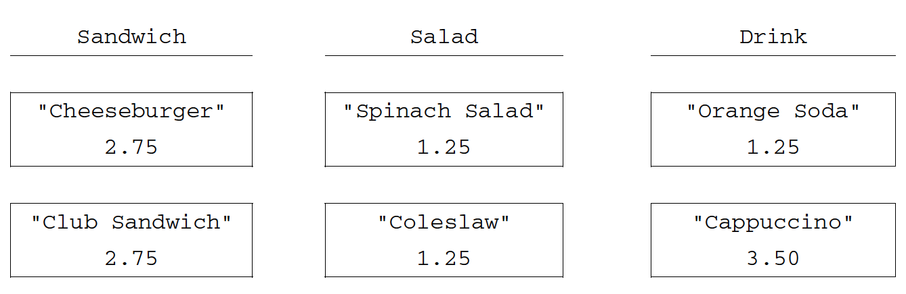

.. qnum::
   :prefix:  9-9-
   :start: 1

Free Response - Trio A
-----------------------------------

.. index::
    single: trio
    single: free response

The following is a free response question from 2014.  It was question 4 on the exam.  You can see all the free response questions from past exams at https://apstudents.collegeboard.org/courses/ap-computer-science-a/free-response-questions-by-year.

**Question 4.**  The menu at a lunch counter includes a variety of sandwiches, salads, and drinks. The menu also allows a
customer to create a "trio," which consists of three menu items: a sandwich, a salad, and a drink. The price
of the trio is the sum of the two highest-priced menu items in the trio; one item with the lowest price is free.
Each menu item has a name and a price. The four types of menu items are represented by the four classes
``Sandwich``, ``Salad``, ``Drink``, and ``Trio``. All four classes implement the following ``MenuItem`` interface.

Interfaces are no longer on the AP CSA exam, but you can just treat an interface like a superclass. Just substitute the word class instead of interface below and your TrioClass can extend MenuItem instead of implementing the interface.

.. code-block:: java

   public interface MenuItem
   {
       /**
        * @return the name of the menu item
        */
       String getName();

       /**
        * @return the price of the menu item
        */
       double getPrice();
   }

The following diagram shows the relationship between the ``MenuItem`` interface and the ``Sandwich``, ``Salad``, ``Drink``, and ``Trio`` classes.

.. figure:: Figures/trioUML.png
    :width: 500px
    :align: center
    :figclass: align-center

    Figure 1: UML class diagram showing MenuItem is implemented by Sandwich, Salad, Drink, and Trio.

For example, assume that the menu includes the following items. The objects listed under each heading are instances of the class indicated by the heading.

    Figure 2: Example objects

The menu allows customers to create Trio menu items, each of which includes a sandwich, a salad, and a
drink. The name of the Trio consists of the names of the sandwich, salad, and drink, in that order, each
separated by "/" and followed by a space and then "Trio". The price of the Trio is the sum of the two
highest-priced items in the Trio; one item with the lowest price is free.
A trio consisting of a cheeseburger, spinach salad, and an orange soda would have the name
``"Cheeseburger/Spinach Salad/Orange Soda Trio"``
and a price of $4.00 (the two highest prices
are $2.75 and $1.25). Similarly, a trio consisting of a club sandwich, coleslaw, and a cappuccino would have the
name ``"Club Sandwich/Coleslaw/Cappuccino Trio"``
and a price of $6.25 (the two highest prices
are $2.75 and $3.50).

Try and Solve It
===================

.. activecode:: frqTrio
   :language: java
   :autograde: unittest

   Write the Trio class (near the end of the code below) that implements the MenuItem interface (which is like extending a class). Your implementation must include a constructor that takes three parameters representing a sandwich, salad, and drink.  The main method has code to test the result.
   ~~~~
   import java.text.*;

   interface MenuItem
   {
       /**
        * @return the name of the menu item
        */
       String getName();

       /**
        * @return the price of the menu item
        */
       double getPrice();
   }

   class SimpleLunchItem implements MenuItem
   {
       private String name;
       private double price;

       public SimpleLunchItem(String aName, double aPrice)
       {
           name = aName;
           price = aPrice;
       }

       public String getName()
       {
           return name;
       }

       public double getPrice()
       {
           return price;
       }

       public String toString()
       {
           DecimalFormat money = new DecimalFormat("0.00");
           return getName() + " " + money.format(getPrice());
       }
   }

   class Drink extends SimpleLunchItem
   {
       public Drink(String name, double price)
       {
           super(name, price);
       }
   }

   class Salad extends SimpleLunchItem
   {
       public Salad(String name, double price)
       {
           super(name, price);
       }
   }

   class Sandwich extends SimpleLunchItem
   {
       public Sandwich(String name, double price)
       {
           super(name, price);
       }
   }

   // Declare the Trio class.  It must implement the MenuItem interface.
   public class Trio implements MenuItem
   {
       // declare the instance variables that you need for a trio object

       // write a constructor that takes a Sandwich, Salad, and a Drink, in that order

       // write the getName method it should return
       // sandwich name/salad name/drink name Trio

       // write the getPrice method
       // it should return the price of the two highest price items in the trio.

       public static void main(String[] args)
       {
           Sandwich burger = new Sandwich("Cheeseburger", 2.75);
           Sandwich club = new Sandwich("Club Sandwich", 2.75);
           Salad spinachSalad = new Salad("Spinach Salad", 1.25);
           Salad coleslaw = new Salad("Coleslaw", 1.25);
           Drink orange = new Drink("Orange Soda", 1.25);
           Drink cap = new Drink("Cappuccino", 3.50);
           Trio trio1 = new Trio(burger, spinachSalad, orange);
           System.out.println(
                   "It should print Cheeseburger/Spinach Salad/Orange Soda Trio and"
                       + " it prints: "
                           + trio1.getName());
           System.out.println(
                   "It should print 4.0 and it prints: " + trio1.getPrice());
           Trio trio2 = new Trio(club, coleslaw, cap);
           System.out.println(
                   "It should print Club Sandwich/Coleslaw/Capuccino Trio and it"
                       + " prints: "
                           + trio2.getName());
           System.out.println(
                   "It should print 6.25 and it prints: " + trio2.getPrice());
       }
   }

   ====
   import static org.junit.Assert.*;

   import org.junit.*;

   import java.io.*;

   public class RunestoneTests extends CodeTestHelper
   {
       public RunestoneTests()
       {
           super("Trio");
       }

       @Test
       public void test1()
       {
           String output = getMethodOutput("main");
           String expect =
                   "It should print Cheeseburger/Spinach Salad/Orange Soda Trio and it prints:"
                       + " Cheeseburger/Spinach Salad/Orange Soda Trio\n"
                       + "It should print 4.0 and it prints: 4.0\n"
                       + "It should print Club Sandwich/Coleslaw/Capuccino Trio and it prints: Club"
                       + " Sandwi\n"
                       + "ch/Coleslaw/Cappuccino Trio\n"
                       + "It should print 6.25 and it prints: 6.25";

           boolean passed = removeSpaces(expect).equals(removeSpaces(output));

           getResults(expect, output, "Running main", passed);
           assertTrue(passed);
       }

       @Test
       public void test2()
       {
           String target = "implements MenuItem";

           boolean passed = checkCodeContains(target);
           assertTrue(passed);
       }

       @Test
       public void test3()
       {
           String output = checkConstructor("Sandwich, Salad, Drink");
           String expect = "pass";

           boolean passed =
                   getResults(
                           expect,
                           output,
                           "Checking Trio constructor with 3 arguments: Sandwich, Salad, Drink");
           assertTrue(passed);
       }

       @Test
       public void test4()
       {
           String target = "public String getName()";

           boolean passed = checkCodeContains("getName()", target);
           assertTrue(passed);
       }

       @Test
       public void test5()
       {
           String target = "public double getPrice()";

           boolean passed = checkCodeContains("getPrice()", target);
           assertTrue(passed);
       }

       @Test
       public void test6()
       {
           Sandwich burger = new Sandwich("Hamburger", 7.50);
           Salad coleslaw = new Salad("Coleslaw", 2);
           Drink orange = new Drink("Orange Soda", 1.25);
           Trio trio1 = new Trio(burger, coleslaw, orange);

           String name = trio1.getName();
           String expect = "Hamburger/Coleslaw/Orange Soda Trio";

           boolean passed = getResults(expect, name, "Checking getName()");
           assertTrue(passed);
       }

       @Test
       public void test7()
       {
           Sandwich burger = new Sandwich("Hamburger", 7.50);
           Salad coleslaw = new Salad("Coleslaw", 2);
           Drink orange = new Drink("Orange Soda", 1.25);
           Trio trio1 = new Trio(burger, coleslaw, orange);

           String name = "" + trio1.getPrice();
           String expect = "9.5";

           boolean passed = getResults(expect, name, "Checking getPrice()");
           assertTrue(passed);
       }
   }

