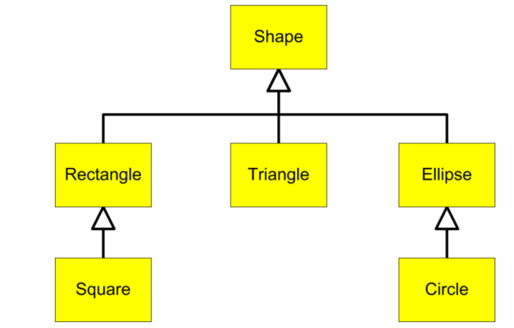

.. include:: ../common.rst

.. qnum::
   :prefix: 9-5-
   :start: 1

|Time45|

Inheritance Hierarchies
===========================

If you have multiple subclasses that inherit from a superclass, you can form an **inheritance hierarchy**. Every subclass is-a or is a kind of the superclass. For example, here is an inheritance hierarchy of Shapes. Square is-a Rectangle and a subclass of Rectangle. Rectangle is-a Shape and a subclass of Shape. In Java, the class **Object** is at the top of hierarchy. Every class in Java inherits from Object and is-an Object.

    Figure 1: An Inheritance Hierarchy of Shapes

One of the main reasons to use an inheritance hierarchy is that all the classes
in the hierarchy can be treated as instances of the top type in the hierarchy.
This is called **polymorphism** and we'll discuss it in more detail in the next
section.

Inheritance can also reduce code duplication since common behaviors can be
defined in methods in a superclass and inherited by all their subclasses. But
you should never use inheritance just to reuse code if there isn't a true “is-a”
relationship between the subclass and the superclass.

.. shortanswer:: hierarchy1
   :optional:

   What variables and methods might be inherited from the superclass Shape in the inheritance hierarchy above?

.. shortanswer:: hierarchy2
   :optional:

   Can you make a 3 level inheritance hierarchy for living things on Earth?

Superclass References
----------------------

A superclass reference variable can hold an object of that superclass or of any of its subclasses. For example, a Shape reference variable can hold a Rectangle or Square object. (This is a type of **polymorphism** which will be defined in the next lesson).

.. code-block:: java

    // The variables declared of type Shape can hold objects of its subclasses
    Shape s1 = new Shape();
    Shape s2 = new Rectangle();
    Shape s3 = new Square();

Notice that the opposite is not true. You cannot declare a variable of the
subclass and put in a superclass object. For example, a Square reference cannot
hold a Shape object because not all Shapes are Squares. The code below will give
an "Incompatible types: Shape cannot be converted to Square" error.

.. code-block:: java

        // A subclass variable cannot hold the superclass object!
        // A Square is-a Shape, but not all Shapes are Squares.
        // Square q = new Shape(); // ERROR!!

Why is using a superclass reference for subclass objects useful? Because now, we can write methods with parameters of type Shape or have arrays of type Shape and use them with any of its subclasses as seen in the next sections.

|Exercise| **Check your understanding**

.. mchoice:: qinherRef
   :practice: T
   :answer_a: Person p = new Person();
   :answer_b: Person p = new Student();
   :answer_c: Student s = new Student();
   :answer_d: Student s = new Person();
   :correct: d
   :feedback_a: This declares and creates an object of the same class Person.
   :feedback_b: This is allowed because a Student is-a Person.
   :feedback_c: This declares and creates an object of the same class Student.
   :feedback_d: This is not allowed because a Person is not always a Student.

   A class Student inherits from the superclass Person. Which of the following assignment statements will give a compiler error?

Superclass Method Parameters
----------------------------------

Another advantage of an inheritance hierarchy is that we can write methods with parameters of the superclass type and pass in subclass objects to them. For example, the print(Shape) method below could be called with many different Shape subclasses and work for Rectangles, Squares, etc.

.. code-block:: java

    // This will work with all Shape subclasses (Squares, Rectangles, etc.) too
    public void print(Shape s)
    {
       ...
    }

|CodingEx| **Coding Exercise**

Notice that in the following code, the print method has a parameter of type ``Person``, but it can be called with ``Student`` or ``Person`` objects in the ``main`` method. Which ``toString`` method is called? It depends on whether a ``Person`` or ``Student`` is passed in at runtime. What would happen if you commented out the ``toString`` method in ``Student``? Which one would be called now?

.. activecode:: superclassMethod
  :language: java
  :autograde: unittest

  Which toString() method is called below? What would happen if you commented out the Student toString() method? Which one would be called now?
  ~~~~
  public class Tester
  {
      // This will implicitly call the toString() method of object p
      public void print(Person p)
      {
          System.out.println(p);
      }

      public static void main(String[] args)
      {
          Person p = new Person("Sila");
          Student s = new Student("Tully", 1001);
          Tester t = new Tester();
          t.print(p); // call print with a Person
          t.print(s); // call print with a Student
      }
  }

  class Person
  {
      private String name;

      public Person(String name)
      {
          this.name = name;
      }

      public String toString()
      {
          return name;
      }
  }

  class Student extends Person
  {
      private int id;

      public Student(String name, int id)
      {
          super(name);
          this.id = id;
      }

      public String toString()
      {
          return super.toString() + " " + id;
      }
  }

    ====
    import static org.junit.Assert.*;

    import org.junit.*;

    import java.io.*;

    public class RunestoneTests extends CodeTestHelper
    {
        public RunestoneTests()
        {
            super("Tester");
        }

        @Test
        public void test1()
        {
            String output = getMethodOutput("main");
            String expect = "Sila\nTully 1001";

            boolean passed = getResults(expect, output, "Running main", true);
            assertTrue(passed);
        }
    }

Superclass Arrays and ArrayLists
---------------------------------

Using inheritance hierarchies, we can create arrays and ``ArrayLists`` using the
superclass type and put in values that are of the subclass types. This can be
very useful! For example, here is some code that creates a ``Shape[]`` array and
an ``ArrayList<Shape>``, both of which can hold any objects of ``Shape`` and any
of its subclasses.

.. code-block:: java

    // This shape array can hold the subclass objects too
    Shape[] shapeArray = { new Rectangle(), new Square(), new Shape() };

    // The shape ArrayList can add subclass objects too
    ArrayList<Shape> shapeList = new ArrayList<Shape>();
    shapeList.add(new Shape());
    shapeList.add(new Rectangle());
    shapeList.add(new Square());

|CodingEx| **Coding Exercise**

The code below has an ``ArrayList<Pet>`` that can hold ``Pet`` or ``Dog``
objects. Notice that the loop works with a variable of type ``Pet`` because a
``Dog`` is a ``Pet`` too!

.. activecode:: superclassArray
  :language: java
  :autograde: unittest

  Scroll down to look at the ``Dog`` class and add a similar ``Cat`` class that
  extends ``Pet``. Don't make the ``Cat`` class public because there can only be
  1 public class in a file. Scroll back to the main method and add some ``Cat``
  objects to the ``ArrayList`` too. Does the ``petList`` work with ``Cats`` too?

  ~~~~
  import java.util.*; // for ArrayList

  public class Pet
  {
      private String name;
      private String type;

      public Pet(String n, String t)
      {
          name = n;
          type = t;
      }

      public String toString()
      {
          return name + " is a " + type;
      }

      public static void main(String[] args)
      {
          ArrayList<Pet> petList = new ArrayList<Pet>();
          petList.add(new Pet("Sammy", "hamster"));
          petList.add(new Dog("Fido"));
          // This loop will work for all subclasses of Pet
          for (Pet p : petList)
          {
              System.out.println(p);
          }
      }
  }

  class Dog extends Pet
  {
      public Dog(String n)
      {
          super(n, "dog");
      }
  }

    ====
    import static org.junit.Assert.*;

    import org.junit.*;

    import java.io.*;

    public class RunestoneTests extends CodeTestHelper
    {
        public RunestoneTests()
        {
            super("Pet");
        }

        @Test
        public void test1()
        {
            String output = getMethodOutput("main");
            String expect = "Sammy is a hamster\nFido is a dog";

            boolean passed = getResults(expect, output, "Running main", true);
            assertTrue(passed);
        }

        @Test
        public void test2()
        {
            String output = getMethodOutput("main");
            String expect = "Sammy is a hamster\nFido is a dog\n... is a cat";

            boolean passed = output.contains("is a cat");

            getResults(expect, output, "Checking that a cat was added to the output", passed);
            assertTrue(passed);
        }

        @Test
        public void test3()
        {
            String target = "class Cat";

            boolean passed = checkCodeContains(target);
            assertTrue(passed);
        }

        @Test
        public void test4()
        {
            String target = "public Cat(String *)";

            boolean passed = checkCodeContains(target);
            assertTrue(passed);
        }

        @Test
        public void test5()
        {
            String target = "petList.add(new Cat(";

            boolean passed = checkCodeContains(target);
            assertTrue(passed);
        }
    }

|Exercise| **Check your understanding**

.. mchoice:: qoo_4
   :practice: T
   :answer_a: V
   :answer_b: IV
   :answer_c: I and II
   :answer_d: I and III
   :answer_e: I only
   :correct: b
   :feedback_a: In fact, all of the reasons listed are valid. Subclasses can reuse object methods written for superclasses without code replication, subclasses can be stored in the same array when the array is declared to be of the parent type, and objects of subclasses can passed as arguments of the superclass type. All of which make writing code more streamlined.
   :feedback_b: All of these are valid reasons to use an inheritance hierarchy.
   :feedback_c: III is also valid. In some cases you might want to store objects of subclasses together in a single array declared to be of the parent type, and inheritance allows for this.
   :feedback_d: II is also valid. In some cases a single method is applicable for a number of subclasses, and inheritance allows you to pass objects of the subclasses to the same method if it takes an argument of the parent type, instead of writing individual methods for each subclass.
   :feedback_e: I and III are also valid, in some cases a single method is applicable for a number of subclasses, and inheritance allows you to pass all the subclasses to the same method instead of writing individual methods for each subclass and you might want to store subclasses together in a single array, and inheritance allows for this.

    Which of the following reasons for using an inheritance hierarchy are valid?
    I.   Object methods from a superclass can be used in a subclass without rewriting or copying code.
    II.  Objects from subclasses can be passed as arguments to a method that takes an argument of the parent type.
    III. Objects from subclasses can be stored in the same array of the parent type.
    IV.  All of the above
    V.   None of the above

|Groupwork| Programming Challenge : Shopping Cart
--------------------------------------------------

.. |repl.it link| raw:: html

   <a href="https://firewalledreplit.com/@BerylHoffman/Shopping-Cart" target="_blank" style="text-decoration:underline">repl.it link</a>

.. image:: Figures/shoppingcart.png
    :width: 100
    :align: left
    :alt: Shopping

The following code contains a class called ShoppingCart that simulates a grocery store or an online store's shopping cart. It has an ArrayList called order that you can use to add Items to the shopping cart. The Item class keeps track of the name and the price of each Item. If you run the code below, you will see that it adds 2 items to the cart and then prints out the total order. It may be easier to follow and change the code in this |repl.it link|. We encourage you to work in pairs.

In this challenge, you will add a new class called ``DiscountedItem`` that extends the ``Item`` class. The ``ArrayList`` of ``Item`` will still work since it can hold the subclasses of ``Item`` too! The ``ShoppingCart`` ``printOrder`` method will work with ``Item`` and ``DiscountedItem`` but note that it has an ``if`` statement that treats ``DiscountedItem`` differently.

In the ``DiscountedItem`` subclass,

1. Add an instance variable for the discount amount.

2. Add constructors that call the super constructor Item.

3. Add get/set methods for discount. The get method is given below but you should modify it.

4. Add a ``toString`` method that returns a string that includes a call to the super ``toString`` method that will print out the price as well as the discount amount using the ``super.valueToString()`` method to format it. You could put the discount in parentheses with a minus sign in front of it like "(- $.50)".

5. Uncomment the code in the main method to test adding DiscountedItems to the cart.

6. If you used repl.it or another IDE to complete this challenge, copy the code for DiscountedItem into the ActiveCode below so that it is saved for the next lesson.

.. activecode:: challenge-9-5-shopping
  :language: java
  :autograde: unittest

  Complete the class DiscountedItem below that inherits from Item and adds an discount instance variable with a constructor, get/set, and a toString method. Uncomment the testing code in main to add discounted items to the cart.
  ~~~~
  import java.util.*;

  /**
   * The ShoppingCart class has an ArrayList of Items. You will write a new class
   * DiscountedItem that extends Item. This code is adapted from
   * https://practiceit.cs.washington.edu/problem/view/bjp4/chapter9/e10-DiscountBill
   */
  public class Tester
  {
      public static void main(String[] args)
      {
          ShoppingCart cart = new ShoppingCart();
          cart.add(new Item("bread", 3.25));
          cart.add(new Item("milk", 2.50));

          // Uncomment these to test
          // cart.add(new DiscountedItem("ice cream", 4.50, 1.50));
          // cart.add(new DiscountedItem("apples", 1.35, 0.25));

          cart.printOrder();
      }
  }

  // DiscountedItem inherits from Item
  class DiscountedItem extends Item
  {
      // add an instance variable for the discount

      // Add constructors that call the super constructor

      // Add get/set methods for discount
      public double getDiscount()
      {
          return 0.0; // return discount here instead of 0
      }

      // Add a toString() method that returns a call to the super toString
      // and then the discount in parentheses using the super.valueToString() method

  }

  class ShoppingCart
  {
      private ArrayList<Item> order;
      private double total;
      private double internalDiscount;

      public ShoppingCart()
      {
          order = new ArrayList<Item>();
          total = 0.0;
          internalDiscount = 0.0;
      }

      public void add(Item i)
      {
          order.add(i);
          total += i.getPrice();
          if (i instanceof DiscountedItem)
              internalDiscount += ((DiscountedItem) i).getDiscount();
      }

      /** printOrder() will call toString() to print */
      public void printOrder()
      {
          System.out.println(this);
      }

      public String toString()
      {
          return discountToString();
      }

      public String discountToString()
      {
          return orderToString()
                  + "\nSub-total: "
                  + valueToString(total)
                  + "\nDiscount: "
                  + valueToString(internalDiscount)
                  + "\nTotal: "
                  + valueToString(total - internalDiscount);
      }

      private String valueToString(double value)
      {
          value = Math.rint(value * 100) / 100.0;
          String result = "" + Math.abs(value);
          if (result.indexOf(".") == result.length() - 2)
          {
              result += "0";
          }
          result = "$" + result;
          return result;
      }

      public String orderToString()
      {
          String build = "\nOrder Items:\n";
          for (int i = 0; i < order.size(); i++)
          {
              build += "   " + order.get(i);
              if (i != order.size() - 1)
              {
                  build += "\n";
              }
          }
          return build;
      }
  }

  class Item
  {
      private String name;
      private double price;

      public Item()
      {
          this.name = "";
          this.price = 0.0;
      }

      public Item(String name, double price)
      {
          this.name = name;
          this.price = price;
      }

      public double getPrice()
      {
          return price;
      }

      public String valueToString(double value)
      {
          String result = "" + Math.abs(value);
          if (result.indexOf(".") == result.length() - 2)
          {
              result += "0";
          }
          result = "$" + result;
          return result;
      }

      public String toString()
      {
          return name + " " + valueToString(price);
      }
  }

       ====
       import static org.junit.Assert.*;

       import org.junit.*;

       import java.io.*;

       public class RunestoneTests extends CodeTestHelper
       {
           public RunestoneTests()
           {
               super("Tester");
           }

           @Test
           public void test1()
           {
               String output = getMethodOutput("main");
               String expect =
                       "Order Items:\n"
                           + "   bread $3.25\n"
                           + "   milk $2.50\n"
                           + "   ice cream $4.50 ($1.50)\n"
                           + "   apples $1.35 ($0.25)\n"
                           + "Sub-total: $11.60\n"
                           + "Discount: $1.75\n"
                           + "Total: $9.85";

               boolean passed = getResults(expect, output, "Running main", true);
               assertTrue(passed);
           }

           @Test
           public void test2()
           {
               String output = getMethodOutput("main");
               String expect =
                       "Order Items:\n"
                           + "   bread $3.25\n"
                           + "   milk $2.50\n"
                           + "   ice cream $4.50 ($1.50)\n"
                           + "   apples $1.35 ($0.25)\n"
                           + "Sub-total: $11.60\n"
                           + "Discount: $1.75\n"
                           + "Total: $9.85";

               boolean passed = output.contains("ice cream") && output.contains("apples");

               getResults(
                       expect,
                       output,
                       "Checking that DiscountedItem objects were added to ArrayList",
                       passed);
               assertTrue(passed);
           }

           @Test
           public void test3()
           {
               String target = "String, double, double";

               boolean passed =
                       getResults(
                               "pass",
                               checkConstructor(target),
                               "Checking constructor with arguments: " + target);
               assertTrue(passed);
           }

           @Test
           public void test4()
           {
               String target = "public double getDiscount()";

               boolean passed = checkCodeContains(target);
               assertTrue(passed);
           }

           @Test
           public void test5()
           {
               String target = "public String toString()";

               boolean passed = checkCodeContains(target);
               assertTrue(passed);
           }

           @Test
           public void test6()
           {
               String target = "super.toString()";

               boolean passed = checkCodeContains(target);
               assertTrue(passed);
           }

           @Test
           public void test7()
           {
               String target = "super.valueToString(*)";

               boolean passed = checkCodeContains(target);
               assertTrue(passed);
           }
       }

Summary
--------

- An **inheritance hierarchy** of subclasses inheriting from superclasses can be formed with Object being the top of the hierarchy.

- When a class S "is-a" class T, T is referred to as a superclass, and S is referred to as a subclass.

- If S is a subclass of T, then a reference of type T can be used to refer to an object of type T or S. This is called polymorphism, defined more in the next lesson.

- Declaring references of type T, when S is a subclass of T, is useful in the declaring formal method parameters of type T, arrays of type T[], and ArrayList<T> of type T so that all the subclasses of T can also be used with these.
