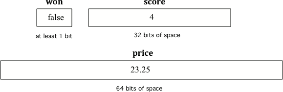

.. qnum::
   :prefix: 3-2-
   :start: 1
   
Declaring Variables in Java
---------------------------

..	index::
	single: bit
	single: binary digit
	single: declare
	pair: variable; declare

Computers store all values using **bits** (binary digits).  A **bit** can represent two values and we usually say that the value of a bit is either 0 or 1.  

To create a variable, you must tell Java its type and name.  Creating a variable is also called **declaring a variable**.  When you create a **primitive variable** Java will set aside enough bits in memory for that primitive type and associate that memory location with the name that you used.  You have to tell Java the type of the variable because Java needs to know how many bits to use and how to represent the value.  The 3 different primitive types
are all represented using **binary numbers** (numbers that use base 2 with digits 0 and 1), but are represented in different ways.  For practice converting between decimal and binary see http://forums.cisco.com/CertCom/game/binary_game_page.htm.  

When you declare a variable, a memory location (sequential number of bits) is set aside for a variable of that type and the name is associated with that location.  An integer gets 32 bits of space, a double gets 64 bits of space and a boolean could be represented by just one bit, but the amount of space isn't specified by the Java standard. 

    
    Figure 1: Examples of variables with names and values.  Notice that the different types get a different amount of space.

To **declare** (create) a variable, you will specify the type, leave at least one space, then the name for the variable and end the line with a semicolon (``;``). Java uses the keyword **int** for integer, **double** for a floating point number (a double precision number), and **boolean** for a Boolean value (true or false).  You can set the value of the variable after you declare it as shown below.

.. figure:: Figures/typeName.png
    :width: 100px
    :figclass: align-center
    
    Figure 2: How to Declare a Variable
    
Here is an example declaration of a variable called score.

.. code-block:: java

  int score;
  
The value of score can be set later as shown below.  Run the following code to see what is printed.
 
.. activecode:: lcdv1
   :language: java
   
   public class Test1
   {
      public static void main(String[] args)
      {
        int score; 
        score = 0;
        System.out.println(score);
        double price;
        price = 2.55;
        System.out.println(price);
        boolean won;
        won = false;
        System.out.println(won);
      }
   }

.. note ::

   Think of the semicolon in Java like a period (``.``) in English.  It is how you show the end of a sentence.  You use a semicolon (``;``) to show the end of a Java statement.  You will not be penalized on the exam if you forget the semicolon.  

You can also optionally specify an initial value for the variable by adding an equals sign ``=`` followed by the value. 

    
    Figure 2: How to Declare and Initialize the Value of a Variable
    
Here is an example declaration of a variable with a setting of its initial value.

.. code-block:: java

  int score = 4;
  
Run the following code to see what is printed.

.. activecode:: lcdv2
   :language: java
   
   public class Test2
   {
      public static void main(String[] args)
      {
        int score = 4; 
        System.out.println(score);
        double price = 23.25;
        System.out.println(price);
        boolean won = false;
        System.out.println(won);
      }
   }

.. note ::

   The equal sign here ``=`` doesn't mean the same as it does in a mathematical equation where it implies that the two sides are equal.  Here it means set the value in the space (box) associated with the name on the left to the value on the right. The first line above sets the value in the box called score to 4. Also note that the variable has to be on the left side of the ``=`` and the value on the right.  Switching the two is called **assignment dyslexia**.  
   
This is an example of *assignment dyslexia*, when the student has put the value on the left and the declaration on the right side.  Try to fix the following code to compile and run.

.. activecode:: lcdv3
   :language: java
   
   public class Test3
   {
      public static void main(String[] args)
      {
        4 = int score; 
        System.out.println(score);
      }
   }
   
